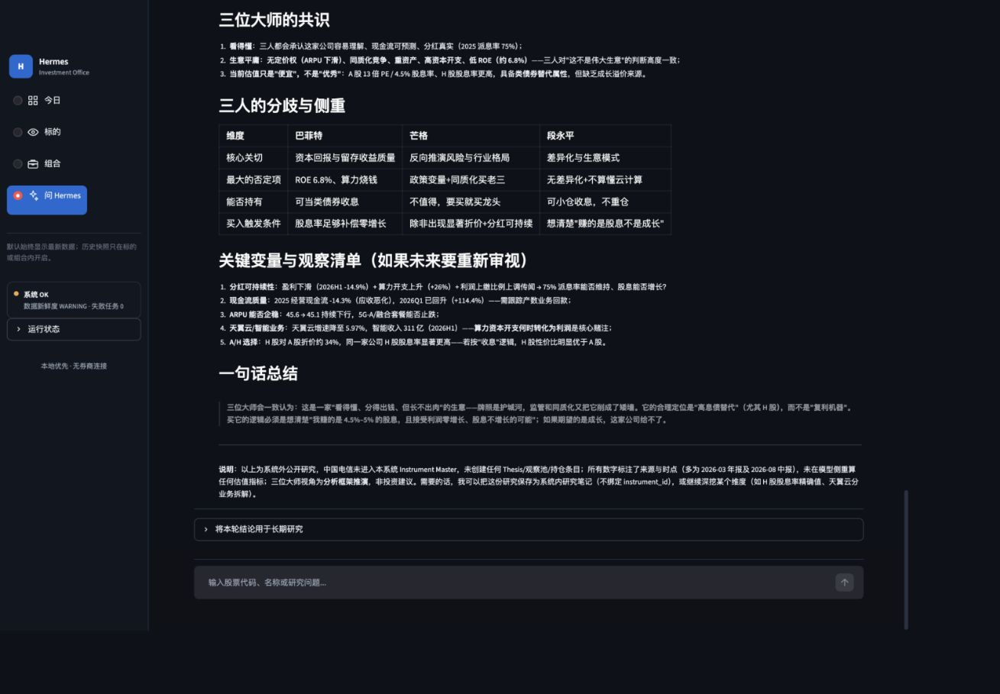
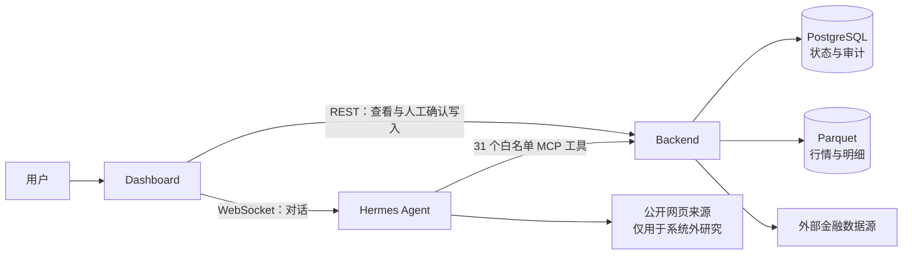

# Hermes Investment Office

一套在 Mac 本机运行、面向长期投资者的个人投资研究与手工组合工作台。

Hermes 负责研究、解释与流程编排；Backend 保存可追溯的金融事实、确定性计算、投资观点和手工账本；Dashboard 把每日检查、标的研究、组合维护和对话集中到一个界面。

> Hermes Investment Office 不连接券商，不读取券商持仓，不自动下单。系统中的 REAL 组合是用户亲自维护的本地账本。



## 为什么做这个项目

普通行情软件擅长展示价格，聊天助手擅长生成解释，但长期投资还需要一条稳定的工作链：数据是否新鲜、观点依据是什么、哪些假设已经失效、组合实际发生了什么、结论能否在几个月后复核。

Hermes Investment Office 把这条链拆成三个明确角色：

| 角色 | 负责什么 | 不负责什么 |
| --- | --- | --- |
| Dashboard | 查看状态、研究标的、管理会话、人工记账 | 不直连数据库，不自行计算投资指标 |
| Hermes Agent | 查询工具、组织研究、解释事实、提出下一步验证 | 不修改 REAL 账本，不批准或执行交易 |
| Backend | PIT 事实、确定性计算、来源追踪、观点版本、不可变流水 | 不自由发挥，不伪造缺失数据 |

核心原则只有一句：**推理可以对话化，事实、计算、持仓与历史必须可复现、可审计。**

## 主要能力

### 今日

- 一眼确认 Backend、调度任务和各数据域的新鲜度。
- 优先展示需要处理的缺口、日报摘要、组合状态与观察池。
- `WARNING`、`STALE`、`FAILED` 原样显示；缺数据时不回填示例数字。

### 标的

- 新增沪深股票或场内 ETF 只需六位代码和名称。
- 自动识别市场、资产类型和 Provider Symbol，并补齐行情、财务或 ETF 资料。
- 展示真实不复权日 K，以及 MA5、MA20、MA30；遵循 A 股红涨绿跌。
- 股票详情包含客观估值、财务事实、研究、事件和来源；ETF 展示净值、溢折价、指数指标与 QDII 状态。
- 每个标的都可以直接带入“问 Hermes”继续研究。

### 组合

- 用户手工迁入现有持仓并录入现金。
- 后续买入、卖出、分红、费用和现金变动都按实际日期登记。
- 流水只追加；更正通过 `REVERSAL` 抵消原记录，不覆盖历史。
- Hermes 可以创建建议，但批准仍不会触发交易；只有用户登记外部实际成交后才更新账本。

### 问 Hermes

- 研究持仓、观察池或尚未录入系统的其他股票和 ETF。
- 系统内标的优先读取 Backend MCP 的行情、财务、观点、事件与 provenance。
- 系统外标的可以使用公开来源，但必须区分外部事实、模型解释与数据缺口。
- 会话自动保存在本机；支持历史列表、继续会话、中文 Markdown 导出和二次确认删除。

## 工作流



日常建议顺序：

1. 在“今日”确认数据新鲜度和失败任务。
2. 处理关注事项，查看观察池与组合变化。
3. 进入“标的”检查 K 线、客观事实、观点和事件。
4. 使用“问 Hermes”补充研究，并决定是否把结论写入长期研究档案。
5. 若在系统外发生真实交易，再到“组合 → 手工记账”登记。

## 快速开始

### 前置条件

- macOS 与 Docker Desktop。
- Python 3.12（仅本地开发和测试需要）。
- 已安装并可运行的 Hermes Agent CLI（用于“问 Hermes”）。
- TuShare Token 和 FRED API Key 为可选 Provider 凭证；缺失时相关数据域会显示真实降级状态。

### 1. 获取代码

```bash
git clone git@github.com:MarstonRaines/hermes-investment-office.git
cd hermes-investment-office
```

仓库当前为私有仓库，需要 GitHub 账号已获授权。

### 2. 配置本机环境

```bash
cp backend/.env.example backend/.env
chmod 600 backend/.env
```

编辑 `backend/.env`：

- 将 `HERMES_POSTGRES_PASSWORD` 和 `HERMES_DB_URL` 中的 `change-me-local-db-password` 替换为同一个随机口令。
- 按需填写 `HERMES_TUSHARE_TOKEN`、`HERMES_FRED_API_KEY`。
- 若需要代理，设置 `HERMES_EXTERNAL_PROXY`（Docker 访问宿主机应使用 `host.docker.internal`）；代理进程由用户自行管理。

真实 `.env` 已被 Git 忽略，禁止提交。

### 3. 启动

```bash
./scripts/hermes start
./scripts/hermes open
```

可用地址：

| 服务 | 地址 |
| --- | --- |
| Dashboard | <http://127.0.0.1:8501> |
| Backend 健康检查 | <http://127.0.0.1:8000/healthz> |
| Backend API 文档 | <http://127.0.0.1:8000/docs> |
| Backend MCP | <http://127.0.0.1:8000/mcp/> |

`start` 会幂等执行数据库迁移、建立默认观察池与本地 REAL 组合，不会覆盖已有账本，也不会写入示例行情。

首次使用或需要立即同步：

```bash
./scripts/hermes refresh
```

完整操作步骤见 [本地使用手册](docs/本地使用手册.md)；文档分层与保留边界见
[文档导航](docs/README.md)。

## 数据来源与可信边界

| 数据域 | 主来源 / 补充来源 | 用途 |
| --- | --- | --- |
| A 股与场内 ETF | TuShare；AkShare 新浪 fallback | OHLCVA、复权、基础行情 |
| 股票财务 | TuShare；AkShare 同花顺 fallback | 标准化财务事实与披露时点 |
| ETF | TuShare；AkShare 东方财富 | NAV、持仓披露、额度状态 |
| 指数与汇率 | TuShare、Yahoo Finance、FRED | 跟踪指数、USD/CNY、宏观交叉验证 |
| 指数估值 | 乐咕乐股 | 指数 PE/PB 历史 |
| 交易日历 | AkShare 新浪，可人工校准 | 沪深/美股交易日与新鲜度判断 |

所有关键返回都保留 `as_of`、quality、freshness 和 provenance。Provider fallback、网络失败、数据过期与缺失不会被静默隐藏。

## 数据保存在哪里

| 内容 | 默认位置 | 说明 |
| --- | --- | --- |
| 业务状态、观点、账本、审计 | Docker volume `pgdata` | PostgreSQL；正式 compose 不向宿主机暴露端口 |
| 行情、NAV、持仓明细 | Docker volume `hermes_data` | Parquet 与原始证据对象 |
| Hermes 对话历史 | `~/.hermes/state.db` | Dashboard 通过 Hermes 本机会话 API 读取，不直连数据库 |
| 备份 | `~/hermes-backups` | 默认保留 30 份每日备份与 12 份周备份 |

手工备份：

```bash
./scripts/hermes backup
```

## 自动任务

- Backend 数据与计算：工作日 `07:30`（`Asia/Shanghai`）。
- Hermes 每日简报：工作日 `09:00`。
- Hermes 周度回顾：周六 `10:00`。
- Hermes 季度回顾：1、4、7、10 月 1 日 `10:00`。
- 本地备份：每天 `03:00`。

数据新鲜度不是 `OK` 时，Hermes 只能报告事实缺口和修复路径，不生成 Buy/Hold/Sell、观点变更或交易建议。

## 常用命令

```bash
./scripts/hermes status
./scripts/hermes logs backend
./scripts/hermes logs dashboard
./scripts/hermes logs chat
./scripts/hermes refresh
./scripts/hermes backup
./scripts/hermes restart
./scripts/hermes stop

hermes gateway status
hermes cron list
hermes mcp test hermes-investment-office
```

## 技术架构

- Backend：Python 3.12、FastAPI、SQLAlchemy、Alembic、Pydantic、APScheduler。
- 数据：PostgreSQL 16、DuckDB、Parquet、PyArrow。
- Agent 协议：MCP Streamable HTTP；Dashboard 对话使用 Hermes 本机 WebSocket JSON-RPC。
- Dashboard：Streamlit、Altair。
- 运行：Docker Compose，所有 Web 服务只绑定 `127.0.0.1`，PostgreSQL 在正式 compose 中无宿主机端口。

```text
backend/                 事实、计算、REST、MCP、任务与迁移
dashboard/               四入口 Dashboard 与 Hermes 会话薄客户端
skills/                  日报、研究、估值、组合和运行纪律
docs/                    架构、ADR、数据契约、验收与本地手册
scripts/hermes           启停、刷新、日志和备份统一入口
PRODUCT.md               产品边界与用户工作流
DESIGN.md                Dashboard 设计系统与交互契约
docker-compose.yml       本地最终运行形态
```

架构裁决优先查看：

- [手工账本与无券商边界](docs/ADR/ADR-009-manual-ledger-product-shape.md)
- [Dashboard 内置 Hermes 对话](docs/ADR/ADR-010-dashboard-hermes-chat.md)
- [四入口用户工作流](docs/ADR/ADR-011-simplified-user-workflow.md)

## 开发与质量门禁

测试使用独立 `hermes_test` 数据库，不要对用户数据库执行 downgrade、drop 或测试清理。

```bash
cd backend
./.venv/bin/pytest -q
./.venv/bin/ruff check app tests ../dashboard
./.venv/bin/python -m compileall -q app tests migrations ../dashboard
./.venv/bin/import-linter lint --config .importlinter
```

验收还包括：OpenAPI GET 参数契约、REST/MCP 真实只读链路、Hermes 会话列表/转录、桌面与窄屏 UI、Docker 网络边界、密钥与 Git 卫生。最新结果见 [完整验收报告](docs/full-acceptance-report.md)。

## 安全与产品边界

- 不连接券商，不导入券商账户，不下单，不划转资金。
- REAL 表示用户手工维护的现实持仓视图，不表示已连接真实账户。
- MCP 不暴露 `ACCOUNT_WRITE`；Hermes、Job、Scheduler 和 Engine 无权改写 REAL 流水。
- 所有持久写入遵循“填写或选择 → 预览 → 独立确认”。
- 交易建议不是订单；批准建议也不会触发执行。
- Provider 凭证、数据库口令和本机数据路径不得进入 Git 或 REST/MCP 输出。
- 系统仅供个人研究与记录，不构成投资建议；历史表现不代表未来结果。

## 项目状态

当前仓库是本地单用户产品形态，优先保证数据可信、研究可追溯和手工账本可审计。公开多用户部署、分钟/Tick 行情、券商连接与自动交易不在当前范围内。
