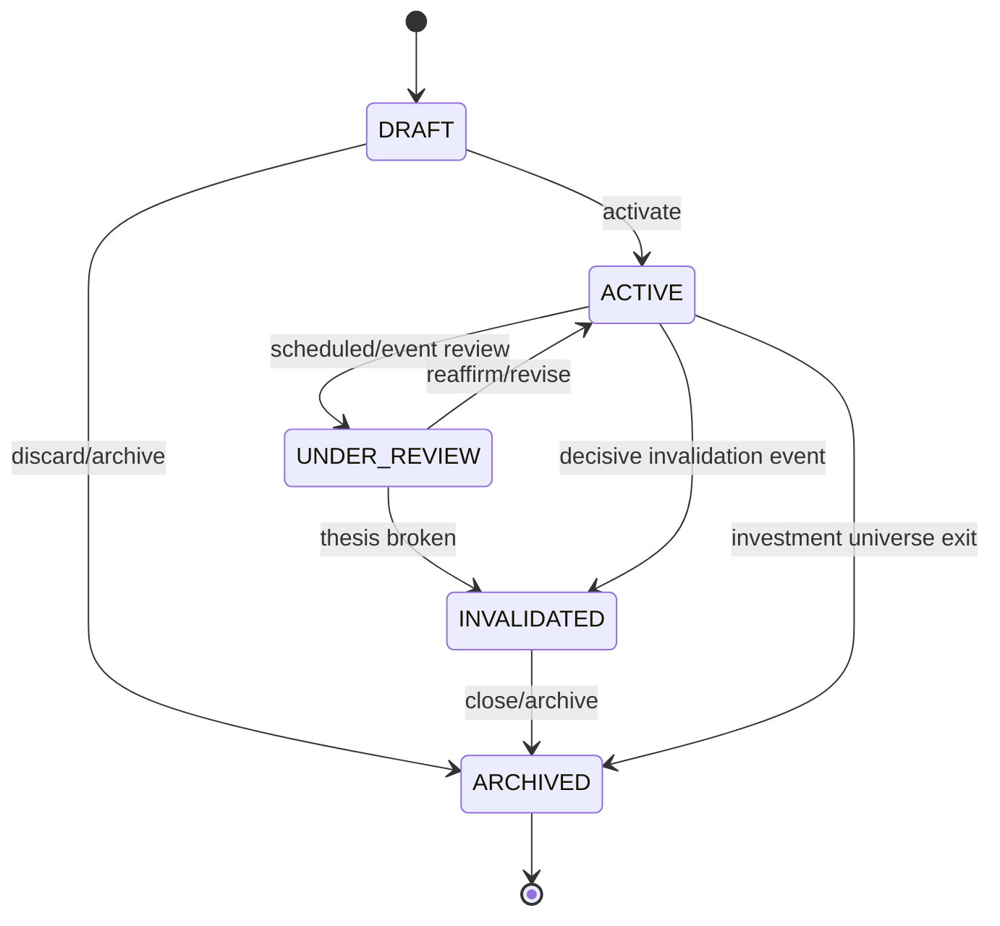
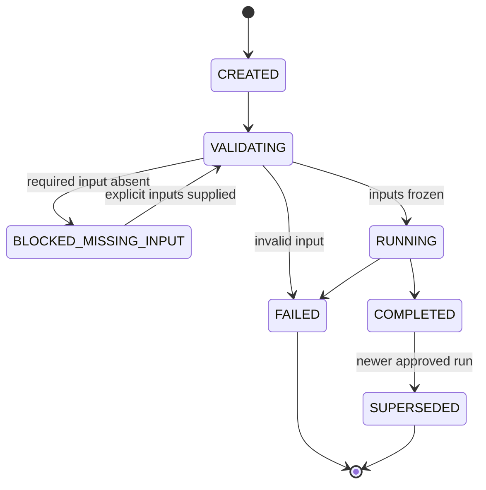
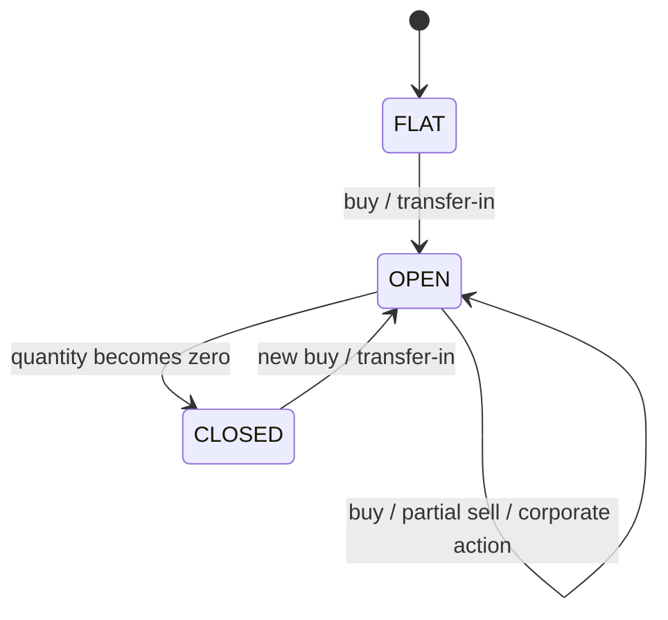
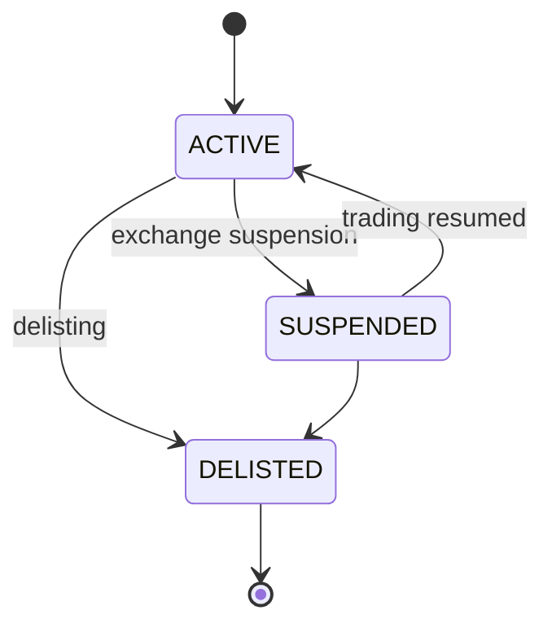
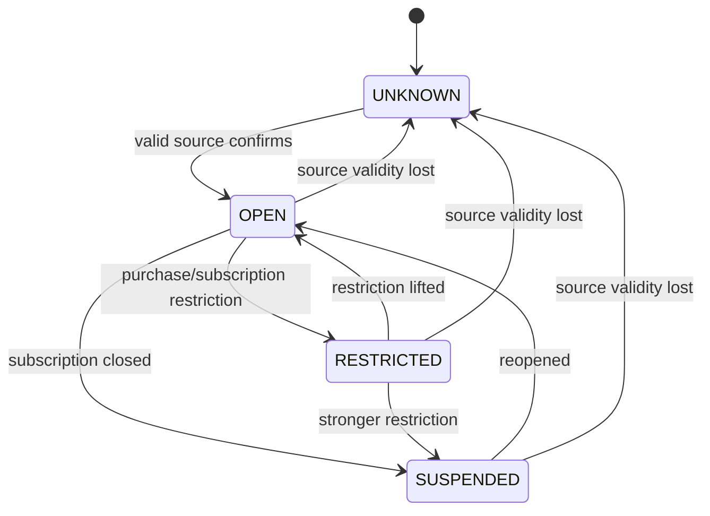
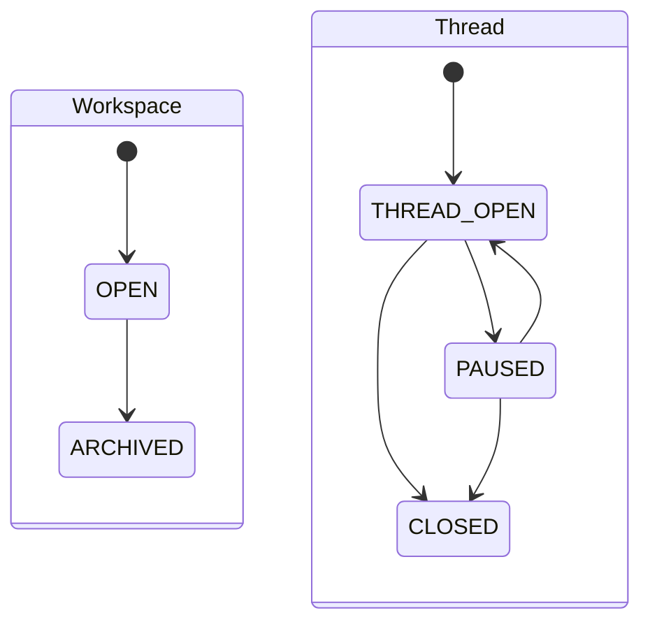
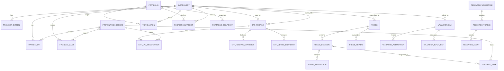

# Hermes Investment Office Technical Specification：Domain Model Specification 研究报告

## 执行摘要

本报告将 **TS-01 Domain Model Specification** 定义为 Hermes Investment Office 从“架构冻结”进入“可施工技术规范”的第一层契约。主要输入是 [《后端架构冻结规范 v1.0 Consolidated》](sandbox:/mnt/data/Hermes_Investment_Office_后端架构冻结规范_v1.0_Consolidated(2).md) 与 [《Architecture Benchmark v1.0 Consolidated》](sandbox:/mnt/data/Hermes_Investment_Office_Architecture_Benchmark_v1.0_Consolidated.md)。开源项目仅用于验证设计范式，不作为 Hermes 领域模型的事实来源：LangAlpha 适合 Research Workspace/Thread/Provenance；AI Berkshire 适合 Thesis 方法论但没有可搬运的 Thesis 数据库；Vibe-Trading 的 quantlib 是 Valuation Contract 最重要的工程参照；FinRobot 适合补充估值方法清单；Anthropic Financial Services 更适合作为 Skill/Artifact 工作流规范参考。citeturn0search0turn0search1turn0search2turn0search3turn1search3

TS-01 最重要的设计结论是：

> **Hermes Investment Office 必须是 thesis-centric、ledger-centric、provenance-first，而不是 chat-centric、position-centric 或 LLM-calculation-centric。**

因此，真正的业务 Source of Truth 应围绕四组不可替代的核心对象建立：

**Instrument / Facts → Thesis / Evidence → ValuationRun → Transaction Ledger / Portfolio**

Research Workspace 只是围绕这些对象工作的研究上下文，不是投资状态本身；Position 是 Transaction Ledger 的派生状态，不允许直接修改；估值结果不是股票属性，而是一项不可变、可复现的 `ValuationRun`；所有外部事实和关键派生结果必须携带 provenance。

QDII 不应成为新的顶层 `instrument_type`。v0.1 中应继续保持 `CN_ETF`，通过 `is_qdii=true` 与 `underlying_index_id` 表示“A 股场内跟踪境外指数的 QDII ETF”。组合总资产统一以 **CNY** 计价；FX 不进入 Portfolio 总资产折算路径，只进入 QDII 的 `premium_discount`、`fx_contribution`、NAV/指数时序归因等分析。这个边界应被视为 TS-01 的冻结前提，而非后续实现选择。[Architecture Freeze v1.0 Consolidated](sandbox:/mnt/data/Hermes_Investment_Office_后端架构冻结规范_v1.0_Consolidated(2).md)

建议 TS-01 冻结以下原则后才进入 ERD/SQLAlchemy：

|原则|TS-01 决议|
|---|---|
|业务核心|Thesis-centric，不以聊天线程为核心|
|持仓来源|Transaction Ledger 是唯一写入源，Position 派生|
|估值|每次估值都是独立、不可变、可复现的 ValuationRun|
|数据可信度|Provenance 是一级领域对象，而不是日志附属字段|
|QDII|CN_ETF 的特征，不新增 US_ETF|
|组合币种|CNY 单币种账本|
|FX|QDII 分析专用，不属于 Portfolio 全局依赖|
|Research Workspace|支持域，不是投资状态 SoT|
|LLM 边界|Hermes 提出假设、组织研究；Backend 验证、计算、持久化、审计|
|历史修改|原则上 append-only / supersede / reverse，不覆盖历史|

## 领域边界

本节对应 **TS-01.1 Domain Boundary**。

Hermes Architecture Freeze 已经给出了最关键的责任划分：Backend 负责 Facts、Calculation、Persistent Business State、Audit；Hermes 负责 Reasoning、Workflow、Skill Orchestration 与交互。TS-01 应把这一架构原则进一步变成“谁能创建什么对象、什么对象能被直接修改”的领域规则。[Architecture Freeze v1.0 Consolidated](sandbox:/mnt/data/Hermes_Investment_Office_后端架构冻结规范_v1.0_Consolidated(2).md)

LangAlpha 的公开仓库定位本身就是 investment research platform，并围绕 workspace/thread 等研究工作流组织能力，因此它适合证明“研究上下文需要持久化”这一点；但 Benchmark 的代码级审计进一步确认，它不是 Portfolio/Thesis/Valuation/Risk 的业务模型模板。Hermes 应采用其 research-support 思路，而不能让 conversation thread 反客为主成为投资系统主键。citeturn0search0

建议正式定义六个领域边界：

|Domain|职责|是否业务 SoT|主要写入者|
|---|---|---:|---|
|Reference & Instrument|资产身份、代码映射、ETF/QDII 静态属性|是|Instrument Master Service|
|Facts & Provenance|行情、财务事实、NAV、持仓、指数、FX 观察值及来源|是|Data Services|
|Investment Thesis & Evidence|投资逻辑、假设、证据、复核、失效历史|是|Thesis Service|
|Valuation & Analytics|可复现估值、ETF 指标、风险计算|是，针对计算结果|Deterministic Engines|
|Portfolio & Ledger|交易、现金、派生持仓、组合快照|是|Portfolio Ledger Service|
|Research Workspace|研究工作区、线程、事件、Hermes 上下文|否，支持域|Hermes / Research Service|

其中最重要的是 **Research Domain 与 Investment Domain 的隔离**：

```text
ResearchWorkspace / Thread
           │
           │ references
           ▼
Evidence ─────► Thesis ─────► ValuationRun
                  │
                  ▼
               Portfolio
```

绝不能设计成：

```text
Conversation Thread
       ↓
某段 LLM 文本
       ↓
直接成为持仓/估值/Thesis 真相
```

AI Berkshire 的官方仓库适合作为这一边界的反向验证：它提供的是投资研究 Skill 与 Thesis discipline，而 Benchmark 的源码核查确认其 thesis tracker 本质是工作流/文档方法论，并不存在可直接迁移的 Hermes 式关系数据库模型。因此 Thesis Domain 必须是 Hermes 自研，而非“迁移 AI Berkshire 数据库”。citeturn0search1 [Architecture Benchmark v1.0 Consolidated](sandbox:/mnt/data/Hermes_Investment_Office_Architecture_Benchmark_v1.0_Consolidated.md)

### 全局身份与 provenance 契约

建议所有一级实体使用不可变 UUID 作为内部主键，不使用证券代码、provider symbol、日期复合键作为业务主键。证券代码变化、Provider 格式变化不能破坏历史引用。

所有外部事实与 decision-sensitive 派生结果至少必须关联一个统一 `ProvenanceRecord`：

|字段|类型|规则|
|---|---|---|
|`provenance_id`|UUID|不可变|
|`source_kind`|enum|`OFFICIAL_FILING / EXCHANGE / PROVIDER / HUMAN / HERMES / DERIVED_ENGINE`|
|`source`|string|来源名称或数据集名称，必填|
|`provider`|string|TuShare/AkShare/Yahoo/internal 等；无外部 provider 时显式填 `internal`|
|`source_uri`|text nullable|网页、公告、文件或 API 来源定位|
|`source_record_id`|string nullable|Provider 原始记录标识|
|`published_at`|timestamp nullable|原始信息发布时点|
|`observed_at`|timestamp|该数值代表的市场/事实时点|
|`retrieved_at`|timestamp|系统取得数据的时间|
|`as_of_date`|date|PIT 语义日期|
|`quality_score`|decimal 0–1|质量评分，必填|
|`quality_status`|enum|`VERIFIED / ACCEPTABLE / STALE / CONFLICT / REJECTED`|
|`quality_flags`|JSON|缺失、异常、fallback、时间错配等|
|`fallback_used`|bool|禁止 silent fallback|
|`raw_hash`|string nullable|原始内容 hash|
|`raw_object_key`|string nullable|Parquet/raw artifact 地址|
|`ingestion_run_id`|UUID nullable|回溯 ingestion job|
|`transform_version`|string|规范化/计算版本|

这里有一个关键设计要求：

> `quality_score` 只能表示数据质量，不能成为“来源权威度”的替代物。

例如，若基金管理人正式公告与第三方聚合接口出现冲突，不能因为第三方记录 `quality_score=0.99` 就覆盖正式公告。冲突解决必须首先看 **source authority**，其次才是质量评分。

**代表性记录：**

```json
{
  "provenance_id": "9e84...a21",
  "source_kind": "PROVIDER",
  "source": "cn_etf_daily_market",
  "provider": "tushare",
  "source_record_id": "513100.SH@2026-08-21",
  "published_at": null,
  "observed_at": "2026-08-21T15:00:00+08:00",
  "retrieved_at": "2026-08-21T15:35:12+08:00",
  "as_of_date": "2026-08-21",
  "quality_score": 0.98,
  "quality_status": "VERIFIED",
  "quality_flags": [],
  "fallback_used": false,
  "transform_version": "market-normalizer/0.1.0"
}
```

**保留与不可变性：** `ProvenanceRecord`、原始事实版本、决策时使用的 Input Snapshot 均 append-only；数据供应商后续纠错时生成新的 observation/supersession，而不是覆盖历史值。Instrument 的“身份”不可变，但名称、上市状态等属性允许通过 versioned update 演进。

**验证规则：** 所有 decision-sensitive 计算若缺少 provenance、存在 `CONFLICT/REJECTED` 输入、或 input timestamp 不满足模型要求，应拒绝产生 `VERIFIED` 结果。Hermes 不能通过 MCP 绕过这一规则。

**验收标准：** 给任意一项 Thesis revision、ValuationRun、ETF premium 或 Portfolio snapshot，Backend 必须能够回答四个问题：**用了什么数据、来自哪里、当时是什么时间点、使用了哪个计算/转换版本。**

## 实体目录

本节对应 **TS-01.2 Entity Catalog**。

Entity Catalog 不应照搬任何 Benchmark 项目的数据库结构。Vibe-Trading 的公开项目为确定性金融计算提供了重要工程参照，而 FinRobot 提供了更广泛的金融分析方法集合；Architecture Benchmark 已据代码审计将前者定位为估值工程范式参考、后者定位为方法清单参考。citeturn0search2turn0search3

建议 v0.1 的一级实体如下。`PG` 表示 PostgreSQL，`PQ` 表示 Parquet/DuckDB 历史事实层；`PG + PQ` 表示结构化元数据/当前视图在 Postgres、完整历史或原始快照在 Parquet。

|实体|目的|关键属性|主键|主要关系|持久化|
|---|---|---|---|---|---|
|`Instrument`|统一资产身份|`instrument_type, name, market, currency, status`|`instrument_id`|1:N ProviderSymbol；1:0..1 ETFProfile|PG|
|`ProviderSymbol`|Provider 代码映射|`provider, symbol, valid_from, valid_to`|`provider_symbol_id`|N:1 Instrument|PG|
|`ProvenanceRecord`|统一数据血缘|source/provider/timestamps/quality/hash/version|`provenance_id`|被所有 facts/runs 引用|PG|
|`MarketBar`|OHLCVA 行情事实|`instrument_id, trading_date, ohlcva, adj_factor`|`market_bar_id` 或 dataset key|N:1 Instrument|PQ + PG index|
|`FinancialFact`|标准化财务事实|`metric_id, period, value, unit, published_at`|`financial_fact_id`|N:1 Instrument|PG + PQ raw|
|`ETFProfile`|ETF 静态/准静态属性|`is_qdii, underlying_index_id, fund_manager`|`instrument_id`|1:1 Instrument；N:1 INDEX|PG|
|`ETFNavObservation`|基金 NAV 事实|`nav, nav_date, publication_date`|`nav_observation_id`|N:1 ETFProfile|PG|
|`ETFHoldingSnapshot`|ETF/基金披露持仓|`report_period, disclosure_date, holdings`|`holding_snapshot_id`|N:1 ETFProfile|PQ + PG header|
|`ETFMetricSnapshot`|ETF 分析结果|`premium_discount, fx_contribution, quota_status, net_value_t1`|`etf_metric_snapshot_id`|N:1 ETFProfile|PG|
|`FXObservation`|QDII FX 分析输入|`pair, rate, as_of`|`fx_observation_id`|Valuation/ETF metric input|PQ/PG|
|`Thesis`|投资 Thesis 稳定身份|`instrument_id, lifecycle_status, health_status, current_revision_id`|`thesis_id`|1:N ThesisRevision|PG|
|`ThesisRevision`|不可变 Thesis 版本|`version, thesis_text, change_reason, authored_by`|`thesis_revision_id`|N:1 Thesis|PG|
|`ThesisAssumption`|结构化核心假设|`statement, category, status, test_condition`|`assumption_id`|N:1 ThesisRevision|PG|
|`ThesisReview`|周期/事件复核|`review_type, conclusion, reviewed_at`|`review_id`|N:1 Thesis|PG|
|`EvidenceItem`|支持/反驳投资判断的证据|`claim, direction, source_ref, observed_at`|`evidence_id`|M:N ThesisRevision/Assumption|PG + raw artifact|
|`ValuationRun`|一次可复现估值|`model_type, status, as_of, engine_version, result`|`valuation_run_id`|N:1 Instrument|PG|
|`ValuationAssumption`|显式估值假设|`name, value, unit, basis, source_tags`|`valuation_assumption_id`|N:1 ValuationRun|PG|
|`ValuationInputRef`|冻结估值输入集合|`input_type, object_id, object_version/hash`|`valuation_input_ref_id`|N:1 ValuationRun|PG|
|`Portfolio`|组合身份|`name, mode, base_currency=CNY`|`portfolio_id`|1:N Transaction|PG|
|`Transaction`|组合账本事件|`instrument_id, side/type, quantity, price_cny, fees_cny`|`transaction_id`|N:1 Portfolio/Instrument|PG|
|`PositionSnapshot`|账本派生持仓|`quantity, cost_basis_cny, market_value_cny`|`position_snapshot_id`|N:1 Portfolio/Instrument|PG|
|`PortfolioSnapshot`|时点组合状态|`as_of, nav_cny, cash_cny, exposures`|`portfolio_snapshot_id`|N:1 Portfolio|PG|
|`ResearchWorkspace`|研究容器|`subject_type/id, status, title`|`workspace_id`|1:N ResearchThread|PG|
|`ResearchThread`|一条研究主题/任务链|`thread_type, status`|`thread_id`|N:1 Workspace|PG|
|`ResearchEvent`|研究过程事件|`event_type, actor, artifact_ref`|`research_event_id`|N:1 Thread|PG|
|`DailyContext`|Backend 给 Hermes 的日常上下文|`market_date, freshness, attention_items, risk_flags`|`daily_context_id`|引用 Portfolio/Thesis/Risk|PG|
|`AuditEvent`|不可删除审计事件|`actor, action, entity_type/id, before/after hash`|`audit_event_id`|多态引用|PG|

### 关键枚举

建议不要把所有状态塞入单一 `status`：

```text
InstrumentType
  CN_EQUITY
  CN_ETF
  INDEX

InstrumentStatus
  ACTIVE
  SUSPENDED
  DELISTED

ThesisLifecycleStatus
  DRAFT
  ACTIVE
  UNDER_REVIEW
  INVALIDATED
  ARCHIVED

ThesisHealthStatus
  UNKNOWN
  HEALTHY
  WARNING
  BROKEN

ValuationRunStatus
  CREATED
  VALIDATING
  BLOCKED_MISSING_INPUT
  RUNNING
  COMPLETED
  FAILED
  SUPERSEDED

QuotaStatus
  NOT_APPLICABLE
  UNKNOWN
  OPEN
  RESTRICTED
  SUSPENDED

DataQualityStatus
  VERIFIED
  ACCEPTABLE
  STALE
  CONFLICT
  REJECTED
```

注意：`UNKNOWN / HEALTHY / WARNING / BROKEN` 在这里是 **Hermes 自己设计的 Thesis health enum**，不是 AI Berkshire 已存在的数据库枚举。必须在规范中明确这一点，以避免再次出现 Benchmark v0.1 曾经发生的“把方法论推导误报为开源数据库事实”。[Architecture Benchmark v1.0 Consolidated](sandbox:/mnt/data/Hermes_Investment_Office_Architecture_Benchmark_v1.0_Consolidated.md)

### QDII 的模型

QDII 不采用继承出第二套 ETF 表，也不采用 `US_ETF`：

```json
{
  "instrument_id": "31d8...ab2",
  "instrument_type": "CN_ETF",
  "name": "示例纳指QDII ETF",
  "market": "SSE",
  "currency": "CNY",
  "status": "ACTIVE",
  "etf_profile": {
    "is_qdii": true,
    "underlying_index_id": "8a54...f11"
  }
}
```

其时点指标独立进入 `ETFMetricSnapshot`：

```json
{
  "instrument_id": "31d8...ab2",
  "as_of": "2026-08-21T15:00:00+08:00",
  "is_qdii": true,
  "underlying_index_id": "8a54...f11",
  "underlying_session_date": "2026-08-20",
  "premium_discount": 0.0634,
  "fx_contribution": 0.0027,
  "quota_status": "RESTRICTED",
  "net_value_t1": 1.2846,
  "nav_date": "2026-08-20",
  "quality_score": 0.94
}
```

这里必须同时保存 `underlying_session_date` 与 `nav_date`。A 股收盘与美股交易日并不同步，所以一个 `as_of` 字段不足以说明 QDII 溢价的实际信息集。[Architecture Freeze v1.0 Consolidated](sandbox:/mnt/data/Hermes_Investment_Office_后端架构冻结规范_v1.0_Consolidated(2).md)

Portfolio 则明确：

```json
{
  "portfolio_id": "7b2c...210",
  "mode": "REAL",
  "base_currency": "CNY"
}
```

即使组合持有 QDII ETF：

```text
Portfolio NAV
=
现金 CNY
+
A 股股票市值 CNY
+
普通 ETF 市值 CNY
+
QDII ETF 场内市值 CNY
```

而不是：

```text
QDII ETF
→ 穿透美元
→ FX 转成人民币
→ 再计组合市值
```

FX 仅用于解释 QDII NAV/折溢价变化：

```text
QDII FX Engine
      ↓
fx_contribution
NAV attribution
premium attribution

NOT
      ↓
Portfolio base currency conversion
```

**所有权：** Instrument/Data Facts 由 Backend Data Services 所有；Thesis 由投资者拥有业务语义、Thesis Service 拥有持久化写权限；ValuationRun 由 Valuation Engine 创建；Transaction 由 Ledger Service 创建；Workspace 由 Research Service/Hermes 管理。

**保留：** Instrument identity、Thesis revisions、Transactions、ValuationRuns、Evidence、Audit 永久保留；事实类数据以 versioned observation 保留；只有 cache 可以 TTL 删除。

**验证：** FK 完整、enum 合法、时间语义完整、单位明确；`is_qdii=true` 时 `underlying_index_id` 必填且指向 `InstrumentType=INDEX`；`is_qdii=false` 时 `quota_status=NOT_APPLICABLE`；组合 `base_currency` 在 v0.1 必须等于 `CNY`。

**验收标准：** 任一用户持有的 A 股股票、普通 A 股 ETF、A 股 QDII ETF 都能够只用这套 Entity Catalog 表达，且无须引入 `US_ETF` 或第二币种 Portfolio。

## 所有权与读写责任

本节对应 **TS-01.3 Entity Ownership Rules**。

“Owner”必须区分三个概念：

**Business Owner** 决定业务含义；**Write Authority** 是唯一允许落库的服务；**Consumers** 可以读和计算，但不能越权修改 SoT。

Hermes 不是数据库管理员。它可以调用 typed command，例如 `create_thesis_revision` 或 `run_valuation`，但最终写入必须由对应 Backend Service 验证并执行。这延续 Architecture Freeze 的 Control Plane / Source-of-Truth 分离。[Architecture Freeze v1.0 Consolidated](sandbox:/mnt/data/Hermes_Investment_Office_后端架构冻结规范_v1.0_Consolidated(2).md)

下表的 SLA 是建议的初始 **data/state SLO**，不是 HTTP 延迟承诺：

|实体|Business / Technical Owner|允许写操作|主要读取者|建议 SLA / 一致性|
|---|---|---|---|---|
|Instrument|Instrument Master|create/version/update status|全部 Engine/Hermes|代码映射变化后 ≤1 个交易日|
|ProviderSymbol|Instrument Master|versioned mapping|Data Services|与 Instrument 同步|
|MarketBar|Market Data Service|append/correct-by-supersede|ETF/Risk/Portfolio/Hermes|最新已完成交易日，不晚于下一业务批次|
|FinancialFact|Fundamental Service|append/supersede|Valuation/Thesis|正式披露取得后目标 ≤24h|
|ETFProfile|ETF Data Service|create/version|ETF Engine|产品变更后目标 ≤1 日|
|ETFNavObservation|ETF Data Service|append|ETF Engine|跟随正式 NAV 发布|
|ETFHoldingSnapshot|ETF Data Service|append|Risk/ETF Engine|披露取得后目标 ≤48h|
|ETFMetricSnapshot|ETF Engine|compute/append|Hermes/Risk|每次行情/NAV/额度变化后重算|
|FXObservation|QDII Data Service|append|ETF Engine only|按 QDII 分析批次更新|
|Thesis|Investor / Thesis Service|create、改变 head/status|Hermes/Valuation|强一致|
|ThesisRevision|Thesis Service|append only|Hermes/Research|创建成功后不可修改|
|ThesisAssumption|Thesis Service|随 Revision append|Hermes/Review|版本内不可修改|
|EvidenceItem|Evidence Service|append/supersede metadata|Thesis/Hermes|获取即写 provenance|
|ValuationRun|Valuation Engine|create/state transition|Hermes/Thesis|输入验证同步；计算任务按 job policy|
|ValuationAssumption|Valuation Engine|run 创建时冻结|Valuation/Hermes|run 启动后不可修改|
|Transaction|Portfolio Ledger|post/reverse|Portfolio/Risk/Hermes|原子提交、强一致|
|PositionSnapshot|Portfolio Engine|derive only|全部消费者|Transaction 成功后刷新|
|PortfolioSnapshot|Portfolio Engine|compute/append|Hermes/Risk|EOD 或显式请求|
|Workspace|Research Service|create/archive|Hermes|交互一致|
|Thread/Event|Research Service|append/status transition|Hermes|交互一致|
|DailyContext|Context Assembler|generate/append|Hermes|按 scheduler policy|
|Provenance/Audit|Provenance/Audit Service|append only|所有审计接口|与业务事务同提交或可靠 outbox|

### 最重要的写权限限制

`PositionSnapshot` **没有** `set_position()`。

正确写路径：

```text
POST Transaction
      │
      ▼
Portfolio Ledger
      │
      ├── validate
      ├── persist immutable transaction
      └── recompute
               │
               ▼
        PositionSnapshot
```

若用户录错交易，禁止：

```text
UPDATE transaction
SET quantity = ...
```

应采用：

```text
original transaction
       ↓
reversal transaction
       ↓
correct transaction
```

同理，Thesis Revision、Evidence、ValuationRun 也不应通过覆盖历史记录“修正过去”。

### Thesis 的所有权尤其需要区分

建议：

```text
Investor
 = business owner

Hermes
 = reasoning/proposal author

ThesisService
 = write authority

Postgres
 = persistent SoT
```

Hermes 可以提出：

```json
{
  "action": "CREATE_THESIS_REVISION",
  "base_revision_id": "rev-17",
  "reason": "2026H1 results changed margin assumption"
}
```

但 Backend 必须验证：

- `base_revision_id` 是否仍为 current；
- evidence 是否存在；
- revision number 是否单调；
- actor 是否有权限；
- 是否发生 optimistic concurrency conflict。

**代表性 provenance：**

```json
{
  "source_kind": "HERMES",
  "source": "thesis-review-skill",
  "provider": "internal",
  "observed_at": "2026-08-23T10:42:00+08:00",
  "retrieved_at": "2026-08-23T10:42:00+08:00",
  "quality_score": 1.0,
  "quality_status": "VERIFIED",
  "actor_id": "hermes",
  "evidence_ids": ["ev-302", "ev-303"]
}
```

此处 `quality_score=1` 只说明“内部事件记录完整”，**不意味着 Thesis 内容有 100% 正确概率**。业务判断质量与数据记录质量不可混淆。

**验收标准：** 任意实体必须存在恰好一个 authoritative writer；禁止 Hermes 直接 SQL 写 business tables；禁止多个 Engine 分别维护同一 Position/Thesis/ETF metric 真相；所有纠错路径必须可以在 AuditEvent 中重建。

## 生命周期与状态机

本节对应 **TS-01.4 Lifecycle Definition**。

生命周期不能只靠 `updated_at` 推断。对 Thesis、ValuationRun、Position、ETF/QDII、Research Workspace/Thread，应显式定义合法迁移，并记录 `actor / reason / timestamp / provenance`。

### Thesis

Thesis 应把 **lifecycle** 与 **health** 分开。

Lifecycle：



Health 是 ACTIVE/UNDER_REVIEW 下的正交属性：

```text
UNKNOWN → HEALTHY → WARNING → BROKEN
              ↑         │
              └─────────┘
             evidence recovery
```

`BROKEN` 不应自动等于 `ARCHIVED`。例如 Thesis 已失效但仍有实际持仓时，Backend 必须继续保留 Thesis 并让 Risk/DailyContext 高亮，而不是把它从系统中隐藏。

Thesis Revision 一旦写入永久 immutable。`Thesis.current_revision_id` 可以改变，但历史版本不可覆盖。

代表性 revision：

```json
{
  "thesis_id": "th-101",
  "revision_id": "rev-018",
  "version": 18,
  "lifecycle_status": "ACTIVE",
  "health_status": "WARNING",
  "change_reason": "经营利润率低于原基础假设",
  "assumptions": [
    {
      "assumption_id": "a-77",
      "statement": "核心业务长期经营利润率维持在设定区间",
      "status": "AT_RISK"
    }
  ],
  "evidence_ids": ["ev-302", "ev-303"],
  "created_at": "2026-08-23T10:42:00+08:00"
}
```

AI Berkshire 对 Thesis discipline 的价值在于“显式投资假设、红线与定期复核”的方法，而不是提供这个状态机本身；上述 lifecycle 是 Hermes 自研领域规范。citeturn0search1

### ValuationRun

Vibe-Trading 的代码级审计在 Benchmark 中确认了一个非常重要的工程范式：估值参数必须显式表达，缺失参数应失败，而不是偷偷采用默认 WACC、增长率或倍数；Assumption 还应携带 basis/source 语义。这与 Hermes “LLM 不执行 decision-sensitive arithmetic”的冻结原则高度一致。citeturn0search2 [Architecture Benchmark v1.0 Consolidated](sandbox:/mnt/data/Hermes_Investment_Office_Architecture_Benchmark_v1.0_Consolidated.md)



`COMPLETED` 后禁止修改：

- assumption；
- input reference；
- engine version；
- result。

需要新假设时创建新 Run：

```text
Run #41
WACC 9.1%
g 3.0%

       ↓ new assumptions

Run #42
WACC 9.4%
g 2.7%
```

绝不能：

```text
UPDATE valuation_run_41 SET wacc=9.4%
```

建议 `ValuationAssumption` 至少包含：

```json
{
  "name": "terminal_growth",
  "value": 0.027,
  "unit": "ratio",
  "basis": "long_run_nominal_growth_assumption",
  "source_tags": ["analyst_assumption", "macro_context"]
}
```

这比：

```json
{"terminal_growth": 0.027}
```

更符合可审计系统。

### Position

Position 本质是 ledger projection，因此生命周期由 Transaction 决定：



`CLOSED` Position 不删除。历史快照永久存在。

组合必须满足：

```text
Position(t)
=
fold(Transaction[<=t])
```

在同一 corporate-action policy 下重新 replay，应得到同一持仓。这是 Portfolio Engine 的核心验收属性。

### ETF 与 QDII

必须把“ETF 上市状态”和“QDII 额度状态”分成两个轴：



QDII 额度：



普通 ETF：

```text
quota_status = NOT_APPLICABLE
```

这里的 `quota_status` 不能根据溢价率推断。例如：

```text
premium_discount = +8%
```

并不自动证明：

```text
quota_status = RESTRICTED
```

额度状态必须有独立来源/公告 provenance。溢价率则是计算结果。

### Research Workspace / Thread

LangAlpha 的 workspace/thread 思路可以 Adapt，但不采用其 chat-centric checkpoint 作为投资状态。官方仓库支持其作为 agent-native investment research platform 的定位。citeturn0search0



Workspace 删除也不能级联删除 Thesis/Evidence/ValuationRun：

```text
Workspace
   references
Thesis

NOT

Workspace
   owns/deletes
Thesis
```

**统一 retention 规则：**

|对象|历史是否可修改|保留|
|---|---:|---|
|Thesis Revision|否|永久|
|ValuationRun terminal record|否|永久|
|Transaction|否，使用 reversal|永久|
|PositionSnapshot|否|永久|
|ETF/Fund fact observation|否，supersede|永久/分层归档|
|ResearchEvent|否|长期|
|Workspace metadata|可以状态迁移|长期|
|AuditEvent|否|永久|

**验收标准：** 针对每个状态机编写 transition matrix tests；非法迁移必须返回 typed domain error，而不是任意 `status=...` 更新。

## Source of Truth 与数据治理

本节对应 **TS-01.5 Source of Truth Rules**。

Architecture Freeze 已明确修订后的数据源战略：**A 股股票和 A 股场内 ETF 行情走同一类 TuShare/AkShare 渠道；Yahoo 的职责缩窄为美股指数点位，如 `^GSPC` / `^NDX`；QDII 持仓穿透依赖基金定期报告/AkShare 基金接口；组合本身不做美元资产折算。** [Architecture Freeze v1.0 Consolidated](sandbox:/mnt/data/Hermes_Investment_Office_后端架构冻结规范_v1.0_Consolidated(2).md)

因此不应该设计“一个万能 Provider 返回所有金融数据”，而应按数据语义定义权威源、运营主源、fallback。

### Provider 优先级

|数据类型|Operational Primary|Secondary / Fallback|权威冲突源|特别规则|
|---|---|---|---|---|
|A 股股票日行情|TuShare|AkShare|交易所公开记录|禁止 silent fallback|
|A 股场内 ETF 行情|TuShare|AkShare|交易所公开记录|QDII 与普通 ETF 同交易渠道|
|美股指数点位|Yahoo `^GSPC/^NDX`|TS-05 再确定备用|指数官方/授权数据源|仅 INDEX，不抓 SPY/VOO/QQQ|
|A 股财务事实|TuShare 标准化接口|AkShare|公司法定财报/交易所/CNINFO 类正式披露|正式披露在冲突时优先|
|ETF/NAV|基金管理人正式 NAV/规范化接口|AkShare 基金接口、其他经验证 provider|基金管理人正式披露|保存 `nav_date` 与 `published_at`|
|ETF Holdings|基金季报/定期报告|AkShare 基金接口|正式基金报告|必须保存 `report_period/disclosure_date`|
|QDII quota_status|基金管理人/正式限购公告|经验证聚合源|基金正式公告|事件状态，不可由价格推断|
|FX|**待 TS-05 确认**|待确认|选定官方/授权汇率源|仅 QDII 分析使用|

这里有一个需要故意保持“未冻结”的地方：**FX Provider 不应该在 TS-01 被拍脑袋指定。** 当前 Architecture Freeze 只冻结了 FX 的用途边界，而不是足以支持生产的 Provider 契约。因而 TS-01 应确定 `FXObservation` 数据模型，但把 provider 选择留给 Provider Contract / M0.x Spike。

### Fallback policy

推荐统一流程：

```text
Primary requested
      │
      ├── valid ───────────────► accept
      │
      └── unavailable/invalid
                   │
                   ▼
             fallback policy
                   │
                   ▼
              Secondary
                   │
         ┌─────────┴─────────┐
         ▼                   ▼
       valid               invalid
         │                   │
         ▼                   ▼
fallback_used=true      DATA_UNAVAILABLE
quality flag            or CONFLICT
```

必须保存：

```json
{
  "requested_provider": "tushare",
  "actual_provider": "akshare",
  "fallback_used": true,
  "fallback_reason": "PRIMARY_TIMEOUT",
  "quality_score": 0.91
}
```

禁止：

```text
TuShare 失败
↓
偷偷改 AkShare
↓
对上层仍声称“行情正常”
```

否则几年后无法知道某个估值为何发生变化。

### 冲突解决顺序

建议采用以下确定性顺序：

```text
Source authority
      ↓
Point-in-time validity
      ↓
Publication/version recency
      ↓
Schema/unit validation
      ↓
Provider quality
      ↓
Manual adjudication if unresolved
```

例如：

```text
Company official filing:
Revenue = X

aggregator:
Revenue = Y
```

如果是同一报告口径：

```text
official filing wins
```

但系统不应删除 `Y`，而应保留并标为：

```text
quality_status = CONFLICT
superseded_by = official observation
```

如果无法确定谁正确：

```text
CONFLICT
```

且 decision-sensitive Engine 默认拒绝使用。

### 建议的 freshness policy

这些阈值是 **TS-01 建议值**，后续可在 Data Quality Policy 中参数化，不应硬编码进 Domain Model。

|数据|Freshness 语义|WARN|BLOCK / 非 VERIFIED|
|---|---|---|---|
|A 股/ETF 日行情|最新已完成 A 股交易日|落后 >1 session|落后 >2 sessions 用于即时决策时|
|美股指数|最新已完成美股 session|落后 >1 US session|与 QDII 计算所需时点不兼容|
|FinancialFact|是否已捕获最新正式披露|新披露后 ingestion >24h|已知存在新披露但仍使用旧版本做决策敏感估值|
|ETF Holdings|最新已公开持仓报告|超过预期披露周期|穿透风险分析声称“current”但实际无有效 snapshot|
|ETF NAV|最新正式可得 NAV|超过预计发布周期|premium 计算无法进行时间对齐|
|QDII quota|有效公告状态|source validity 不明确|置为 `UNKNOWN`，禁止假装 OPEN|
|FX|QDII attribution 所需最新 business observation|>1 business day，视分析而定|时点无法与 NAV/index 对齐|

QDII 时序尤其必须建模，而不是只写注释：

```text
A股 2026-08-21 15:00 close
           │
           │
           ├── QDII ETF market price
           │
           ├── latest available NAV: nav_date = ?
           │
           └── latest completed US index session = ?
```

因此 `premium_discount` 的 lineage 应能够表达：

```json
{
  "etf_market_date": "2026-08-21",
  "nav_date": "2026-08-20",
  "underlying_session_date": "2026-08-20",
  "fx_as_of": "2026-08-21T09:15:00+08:00"
}
```

而不是只有：

```json
{"date": "2026-08-21"}
```

### QDII premium 的计算契约

TS-01 不必冻结公式的所有细节，但应冻结语义：

```text
premium_discount
=
场内价格相对“对应口径参考净值”的偏离
```

同时必须记录：

- market price；
- reference NAV / estimated NAV；
- NAV date；
- underlying index session；
- FX observation；
- calculation version。

`net_value_t1` 建议不要理解成“永远严格是自然日 T-1”，而定义为：

> **查询时最新可获得、并且被 ETF Engine 明确映射到其基金 NAV 日期的已发布净值。**

这能避免节假日、时区、基金不同估值日安排造成语义错误。

### 财务事实的 PIT 规则

FinancialFact 至少要区分：

```text
period_end
published_at
retrieved_at
```

否则回测或历史 Thesis 审计可能发生 look-ahead：

```text
2025-12-31 fiscal year end
≠
2025-12-31 market knew the annual report
```

真实可使用时点应由 `published_at`/PIT policy 决定。

**代表性记录：**

```json
{
  "instrument_id": "ins-001",
  "metric_id": "revenue",
  "period_end": "2026-06-30",
  "period_type": "H1",
  "value": 12345678900,
  "unit": "CNY",
  "published_at": "2026-08-18T18:42:00+08:00",
  "retrieved_at": "2026-08-18T19:06:14+08:00",
  "provenance_id": "prov-711",
  "quality_score": 0.99
}
```

**Ownership：** Provider 不拥有 Hermes 数据；Data Service 才拥有标准化 observation 的写权限。Provider 是来源标签。Engine 只能读取 facts，并输出 derived facts。

**Retention：** 原始 provider payload/hash 与标准化版本应长期保留；修正值通过 supersession，不做 destructive overwrite。

**验收标准：** 在任一历史日期 `T`，系统能够重建“当时实际可获得的信息集”；Provider fallback 可见；冲突不会静默消失；QDII 所有指标能够明确标注 A 股交易日、NAV 日期、美股指数交易日与 FX 时点。

## 初始关系模型与 MCP 合同

本节对应 **TS-01.6 Initial Relationship Model**。

### 初始 ER 模型

以下 ERD 是 Domain Model 的逻辑关系，不等同最终物理 Schema：



这里有三个刻意的设计选择。

第一：

```text
ETFProfile.underlying_index_id
        ↓
Instrument(INDEX)
```

而不是保存：

```text
"^NDX"
```

为裸字符串。`^NDX` 是 Yahoo ProviderSymbol；Nasdaq-100 指数本身应该拥有稳定 `instrument_id`。

第二：

```text
ThesisRevision M:N Evidence
```

而不是把 evidence 塞成 `evidence_json`。因为同一公告可以同时支持多个 assumption/thesis revision，而同一个 revision 又可能依赖多个来源。

第三：

```text
Transaction → Position
```

是计算方向；ER 中不允许 Position 成为 Transaction 的上游 SoT。

### 核心 DDL 草图

这不是最终 SQL Schema，仅展示 TS-01 必须保护的约束：

```sql
CREATE TABLE instrument (
    instrument_id       UUID PRIMARY KEY,
    instrument_type     TEXT NOT NULL
        CHECK (instrument_type IN ('CN_EQUITY', 'CN_ETF', 'INDEX')),
    name                TEXT NOT NULL,
    market_code         TEXT NOT NULL,
    currency            TEXT NOT NULL,
    status              TEXT NOT NULL,
    version             INTEGER NOT NULL DEFAULT 1,
    created_at          TIMESTAMPTZ NOT NULL,
    updated_at          TIMESTAMPTZ NOT NULL
);

CREATE TABLE provider_symbol (
    provider_symbol_id  UUID PRIMARY KEY,
    instrument_id       UUID NOT NULL REFERENCES instrument,
    provider            TEXT NOT NULL,
    symbol              TEXT NOT NULL,
    valid_from          DATE NOT NULL,
    valid_to            DATE,
    UNIQUE(provider, symbol, valid_from)
);

CREATE TABLE provenance_record (
    provenance_id       UUID PRIMARY KEY,
    source_kind         TEXT NOT NULL,
    source              TEXT NOT NULL,
    provider            TEXT NOT NULL,
    source_uri          TEXT,
    observed_at         TIMESTAMPTZ NOT NULL,
    published_at        TIMESTAMPTZ,
    retrieved_at        TIMESTAMPTZ NOT NULL,
    quality_score       NUMERIC(5,4) NOT NULL
        CHECK (quality_score BETWEEN 0 AND 1),
    quality_status      TEXT NOT NULL,
    fallback_used       BOOLEAN NOT NULL DEFAULT FALSE,
    raw_hash            TEXT,
    transform_version   TEXT NOT NULL
);

CREATE TABLE etf_profile (
    instrument_id       UUID PRIMARY KEY REFERENCES instrument,
    is_qdii             BOOLEAN NOT NULL DEFAULT FALSE,
    underlying_index_id UUID REFERENCES instrument,
    CHECK (
        is_qdii = FALSE
        OR underlying_index_id IS NOT NULL
    )
);

CREATE TABLE thesis (
    thesis_id            UUID PRIMARY KEY,
    instrument_id        UUID NOT NULL REFERENCES instrument,
    lifecycle_status     TEXT NOT NULL,
    health_status        TEXT NOT NULL,
    current_revision_id  UUID,
    created_at           TIMESTAMPTZ NOT NULL
);

CREATE TABLE thesis_revision (
    thesis_revision_id   UUID PRIMARY KEY,
    thesis_id            UUID NOT NULL REFERENCES thesis,
    version              INTEGER NOT NULL,
    thesis_body          JSONB NOT NULL,
    change_reason        TEXT NOT NULL,
    authored_by          TEXT NOT NULL,
    provenance_id        UUID REFERENCES provenance_record,
    created_at           TIMESTAMPTZ NOT NULL,
    UNIQUE(thesis_id, version)
);

CREATE TABLE valuation_run (
    valuation_run_id     UUID PRIMARY KEY,
    instrument_id        UUID NOT NULL REFERENCES instrument,
    model_type           TEXT NOT NULL,
    status               TEXT NOT NULL,
    as_of                TIMESTAMPTZ NOT NULL,
    engine_version       TEXT NOT NULL,
    input_snapshot_hash  TEXT,
    result_json          JSONB,
    created_at           TIMESTAMPTZ NOT NULL,
    completed_at         TIMESTAMPTZ
);

CREATE TABLE portfolio (
    portfolio_id         UUID PRIMARY KEY,
    name                 TEXT NOT NULL,
    mode                 TEXT NOT NULL,
    base_currency        TEXT NOT NULL
        CHECK (base_currency = 'CNY')
);

CREATE TABLE portfolio_transaction (
    transaction_id       UUID PRIMARY KEY,
    portfolio_id         UUID NOT NULL REFERENCES portfolio,
    instrument_id        UUID NOT NULL REFERENCES instrument,
    transaction_type     TEXT NOT NULL,
    quantity             NUMERIC NOT NULL,
    price_cny            NUMERIC,
    fees_cny             NUMERIC NOT NULL DEFAULT 0,
    trade_at             TIMESTAMPTZ NOT NULL,
    reverses_transaction_id UUID REFERENCES portfolio_transaction,
    created_at           TIMESTAMPTZ NOT NULL
);
```

真正进入 TS-02 时，还应增加 temporal unique constraints、partial indexes、append-only trigger/policy、revision evidence bridge、ETF metrics、input references、audit/outbox 等；TS-01 不宜现在把这些实现细节过早冻结。

### MCP 的统一响应包络

Anthropic Financial Services 的公开仓库说明 financial workflows 适合通过结构化 Skill/Plugin 与 artifact 合同组织；这与 Benchmark 将其作为 Hermes Skill 标准参考的结论相符。Hermes 的 MCP 则应进一步规定：Skill 不返回“随意的一段话作为事实”，而是消费稳定 Backend Contract。citeturn1search3

建议五个核心 MCP tool 共享：

```json
{
  "request_id": "uuid",
  "as_of": "2026-08-23T10:30:00+08:00",
  "data": {},
  "quality": {
    "status": "VERIFIED",
    "score": 0.97,
    "flags": []
  },
  "provenance": [
    {
      "provenance_id": "uuid",
      "source": "string",
      "provider": "string",
      "observed_at": "timestamp",
      "retrieved_at": "timestamp",
      "quality_score": 0.97
    }
  ]
}
```

#### `get_thesis`

建议逻辑 endpoint：

```text
MCP tool: get_thesis
REST equivalent: GET /v1/theses/{thesis_id}
```

输入：

```json
{
  "thesis_id": "uuid",
  "as_of": "2026-08-23T10:30:00+08:00",
  "include_evidence": true,
  "include_reviews": true
}
```

输出 `data`：

```json
{
  "thesis_id": "uuid",
  "instrument_id": "uuid",
  "lifecycle_status": "ACTIVE",
  "health_status": "WARNING",
  "current_revision": {
    "revision_id": "uuid",
    "version": 18,
    "thesis_body": {},
    "created_at": "timestamp"
  },
  "assumptions": [],
  "evidence": [],
  "recent_reviews": []
}
```

验证：`as_of` 查询必须返回 PIT 可见版本，而不是永远返回今天的 revision。

#### `create_thesis_revision`

```text
MCP tool: create_thesis_revision
REST equivalent: POST /v1/theses/{thesis_id}/revisions
```

输入：

```json
{
  "thesis_id": "uuid",
  "base_revision_id": "uuid",
  "change_reason": "2026H1 operating results changed base-case assumption",
  "thesis_body": {},
  "assumption_changes": [],
  "evidence_ids": ["uuid", "uuid"],
  "author": {
    "type": "HERMES",
    "id": "hermes"
  }
}
```

输出：

```json
{
  "thesis_id": "uuid",
  "revision_id": "uuid",
  "version": 19,
  "lifecycle_status": "ACTIVE",
  "health_status": "WARNING",
  "created_at": "timestamp"
}
```

关键规则：

```text
base_revision_id != current_revision_id
→ 409 DOMAIN_CONFLICT
```

防止 Hermes 基于已经过期的 Thesis 创建新版本。

#### `run_valuation`

```text
MCP tool: run_valuation
REST equivalent: POST /v1/valuations/runs
```

输入：

```json
{
  "instrument_id": "uuid",
  "model_type": "DCF",
  "as_of": "2026-08-23T10:30:00+08:00",
  "assumptions": [
    {
      "name": "wacc",
      "value": 0.091,
      "unit": "ratio",
      "basis": "explicit analyst assumption",
      "source_tags": ["market_inputs_2026-08-23"]
    },
    {
      "name": "terminal_growth",
      "value": 0.027,
      "unit": "ratio",
      "basis": "long-run nominal growth",
      "source_tags": ["thesis_rev_19"]
    }
  ]
}
```

输出：

```json
{
  "valuation_run_id": "uuid",
  "status": "COMPLETED",
  "engine_version": "valuation-engine/0.1.0",
  "input_snapshot_hash": "sha256:...",
  "result": {
    "bear": 72.4,
    "base": 91.8,
    "bull": 113.2,
    "currency": "CNY",
    "margin_of_safety": 0.184
  }
}
```

缺少参数：

```json
{
  "error": {
    "code": "MISSING_VALUATION_INPUT",
    "field": "wacc"
  }
}
```

**绝不自动补 `wacc=8%`。**

这一行为与 Benchmark 对 Vibe-Trading quantlib 的代码级审计所得工程原则一致；FinRobot 的估值方法可以用于未来模型覆盖面研究，但不应成为默认值/异常处理的工程模板。citeturn0search2turn0search3

#### `get_portfolio_snapshot`

```text
MCP tool: get_portfolio_snapshot
REST equivalent: GET /v1/portfolios/{portfolio_id}/snapshot
```

输入：

```json
{
  "portfolio_id": "uuid",
  "as_of": "2026-08-23T10:30:00+08:00"
}
```

输出：

```json
{
  "portfolio_id": "uuid",
  "base_currency": "CNY",
  "as_of": "timestamp",
  "cash_cny": 180000.0,
  "market_value_cny": 1320000.0,
  "nav_cny": 1500000.0,
  "positions": [
    {
      "instrument_id": "uuid",
      "quantity": 10000,
      "market_price_cny": 1.382,
      "market_value_cny": 13820.0,
      "is_qdii": true
    }
  ]
}
```

注意 QDII Position 仍然直接按 A 股场内人民币价格进入组合 NAV。

#### `get_etf_metrics`

```text
MCP tool: get_etf_metrics
REST equivalent: GET /v1/etfs/{instrument_id}/metrics
```

输入：

```json
{
  "instrument_id": "uuid",
  "as_of": "2026-08-23T10:30:00+08:00"
}
```

输出：

```json
{
  "instrument_id": "uuid",
  "is_qdii": true,
  "underlying_index_id": "uuid",
  "market_price_cny": 1.381,
  "premium_discount": 0.0718,
  "fx_contribution": 0.0024,
  "quota_status": "RESTRICTED",
  "net_value_t1": 1.2885,
  "nav_date": "2026-08-21",
  "underlying_session_date": "2026-08-21",
  "freshness": {
    "market": "FRESH",
    "nav": "FRESH",
    "underlying_index": "FRESH",
    "quota_status": "VERIFIED"
  }
}
```

若 NAV 与指数数据不能在既定时序规则下配对：

```json
{
  "premium_discount": null,
  "quality": {
    "status": "STALE",
    "flags": ["NAV_TIME_ALIGNMENT_FAILED"]
  }
}
```

这比返回一个“看起来精确”的错误溢价率更符合投资系统安全性。

**验收标准：** 五个 MCP Tool 都必须只暴露业务语义，不暴露 SQL、表名或 Provider-specific symbol；Hermes 只能使用 `instrument_id/thesis_id/portfolio_id` 等稳定 identity；所有 decision-sensitive 返回值均携带 `as_of + quality + provenance`。

## 验收基线、开放问题与下一步

TS-01 可以冻结，但有一些事项必须明确标记为 **未决，不允许假装已经被开源项目解决**。

首先是 **许可证与代码复用**。Benchmark 正确地把迁移策略调整为 Architecture Borrowing / Skill Borrowing / Schema Adaptation，而不是把某个仓库 fork 成 Hermes 核心。正式复制任何 Vibe-Trading quantlib、LangAlpha、AI Berkshire、FinRobot 或 Anthropic Financial Services 的实现代码之前，应分别完成 LICENSE、NOTICE、商标政策、依赖许可证和衍生作品义务审计。目前这份 TS-01 只采用设计范式，不把第三方源代码视作 Hermes 已批准 vendor code。相关官方仓库为 [LangAlpha](https://github.com/ginlix-ai/LangAlpha)、[AI Berkshire](https://github.com/xbtlin/ai-berkshire)、[Vibe-Trading](https://github.com/HKUDS/Vibe-Trading)、[FinRobot](https://github.com/AI4Finance-Foundation/FinRobot)、[Anthropic Financial Services](https://github.com/anthropics/financial-services)。这些项目的用途和成熟度不同，因此“参考”不应自动推导为“可以直接复制”。citeturn0search0turn0search1turn0search2turn0search3turn1search3

其次是 **Provider SLA 不受 Hermes 控制**。TuShare、AkShare、Yahoo、基金管理人网站等外部来源的接口稳定性、许可、字段含义和限流未来都可能变化，所以 TS-01 应冻结 Provider-independent Domain Contract，而不是把 Provider response schema 泄漏进 `MarketBar`、`FinancialFact` 或 `ETFMetricSnapshot`。这也是 `ProviderSymbol + ProvenanceRecord + normalized fact` 三层分离的根本理由。[Architecture Freeze v1.0 Consolidated](sandbox:/mnt/data/Hermes_Investment_Office_后端架构冻结规范_v1.0_Consolidated(2).md)

第三是 **QDII premium 的生产公式仍需 TS-06/ETF Engine Contract 进一步冻结**。TS-01 已经能够冻结其数据语义：

```text
market date
NAV date
underlying US session date
FX as-of
quota status
calculation version
```

但“参考 NAV 是否用官方 T-1 NAV、估算 iNAV、指数/FX 调整后的 estimated NAV，在不同数据可得情况下如何切换”应由 ETF Engine Contract 明确，不能隐藏在 Domain Model 中。

第四是 **FX Provider 仍待确定**。可以冻结“FX 仅供 QDII 分析使用”，但目前不应冻结一个未经 spike 验证的生产 Provider。

第五是 **Thesis health 的自动判定程度**。建议 v0.1 把 `HEALTHY/WARNING/BROKEN` 作为业务状态保存，但需要后续决定：究竟由规则引擎自动推导、Hermes 提议、还是投资者确认。最安全的初期方案是保存 `health_status` 同时保存 `health_reason/evidence_ids/actor`，禁止无来源状态切换。

第六是 **Research Workspace 的深度**。LangAlpha 的 workspace/thread/checkpoint 经验值得代码级进一步审查，但 Hermes 不应在 TS-01 就复制完整 LangGraph checkpoint 基建。只有在 Hermes runtime 确实需要 crash recovery / resumable workflow 后，才值得把 Checkpoint 作为 operational entity 引入。LangAlpha 官方项目支持其研究平台方向，但 Hermes 的持久投资状态仍必须由 Thesis/Ledger 域独立承担。citeturn0search0

建议把 TS-01 最终验收线定义为以下八项，而不是“表已经画出来”：

|验收问题|必须得到的答案|
|---|---|
|一项资产的身份是什么？|`Instrument`，Provider symbol 只是映射|
|一个 QDII ETF 是什么？|`CN_ETF + is_qdii + underlying_index_id`|
|组合为什么有这些持仓？|可以由 Transaction Ledger 完整 replay|
|为什么当时持有它？|Thesis Revision + Assumptions + Evidence 可重建|
|为什么当时认为它值这个价格？|ValuationRun + explicit assumptions + frozen inputs + engine version 可重建|
|某个数字来自哪里？|Provenance 能追踪 source/provider/timestamps/quality|
|研究聊天消失会不会丢投资状态？|不会；Workspace 不是 Thesis/Portfolio SoT|
|外部数据错误或 fallback 会不会被隐藏？|不会；CONFLICT/fallback/stale 都是显式状态|

当这八项成立时，**TS-01 才真正完成了 Domain Freeze**。之后进入 TS-02 PostgreSQL ERD 时，应把重点从“再发明实体”转为实现这些已经冻结的语义：主外键、temporal constraints、append-only/versioning、Postgres/Parquet 分工、PIT 查询、审计 outbox、索引与事务边界。

基于本次研究，推荐的后续代码级审计优先级也已经发生变化：

```text
Vibe-Trading quantlib/valuation
        ↓
确认 Valuation Assumption / Input / Result contract

LangAlpha migrations + workspace/thread/provenance
        ↓
确认 Research Domain 可 Adapt 的最小结构

AI Berkshire thesis-tracker + financial rigor tools
        ↓
抽取 Thesis discipline，不复制数据库

Anthropic financial-services SKILL contracts
        ↓
定义 Hermes Skill ↔ MCP ↔ Artifact 边界

FinRobot valuation methods
        ↓
建立未来 model catalog，而非移植工程实现
```

Vibe-Trading 和 FinRobot 对“确定性金融计算与 Agent reasoning 分离”的独立实践，为 Architecture Freeze 中 Backend Calculation / Hermes Reasoning 的分界提供了重要外部验证；而 LangAlpha 与 AI Berkshire 的差异则进一步说明：**Hermes 的真正竞争资产不会是聊天框，也不会是一个现成开源 Agent，而是能够持续多年保存并重建“事实—假设—证据—估值—交易—复核”因果链的领域模型。** citeturn0search0turn0search1turn0search2turn0search3

这应当成为 **TS-01 Domain Model Specification 的冻结结论**。