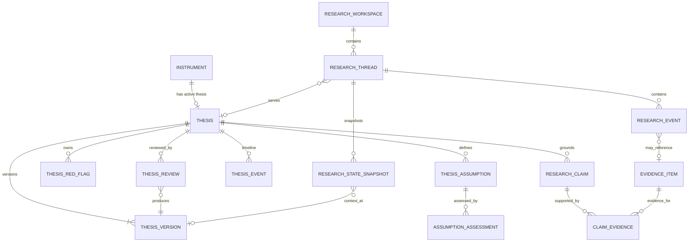
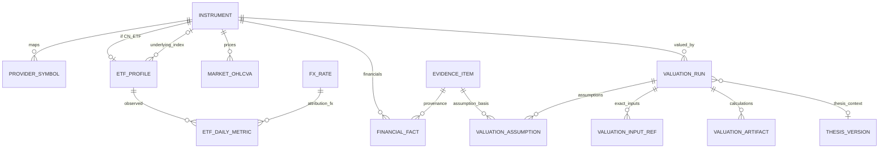
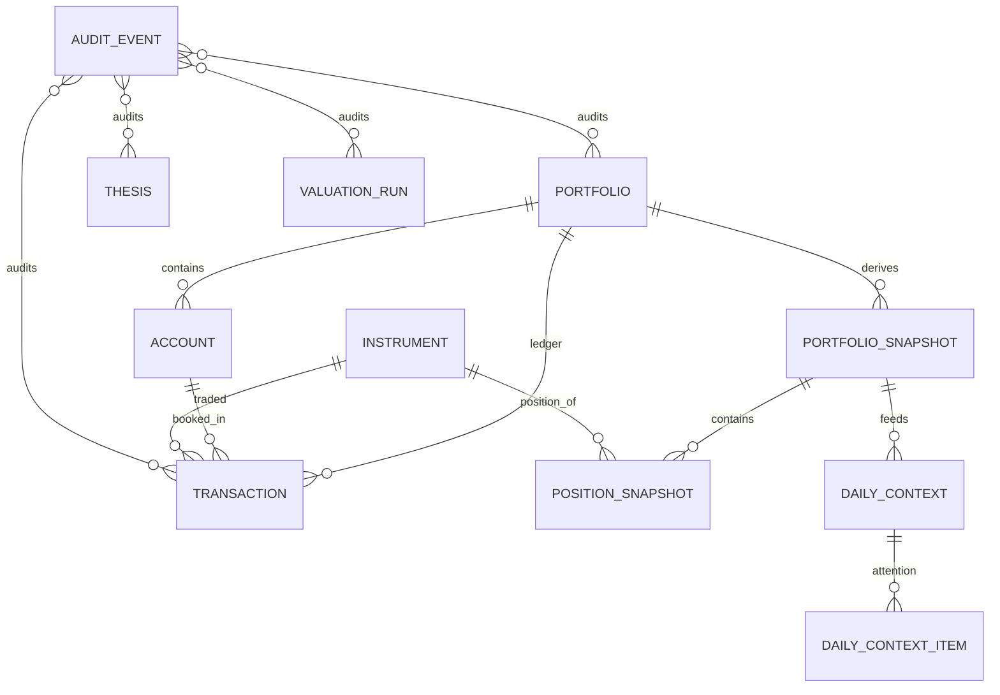

# Hermes Investment Office PostgreSQL ERD 技术规范

## 执行摘要

本报告是 **Technical Specification v0.1 的 TS-02 PostgreSQL ERD 初版**。设计基线严格服从《后端架构冻结规范 v1.0 Consolidated》，并以《Architecture Benchmark v1.0 Consolidated》的代码级验证结论作为外部参考：Hermes 仍是 Control Plane，PostgreSQL 负责业务事实、持久状态和审计；Thesis 是长期投资核心状态；Transaction Ledger 是组合唯一事实源；Valuation 必须是确定性、可复现运行；Evidence/Provenance 必须是一等数据。fileciteturn0file1 fileciteturn0file0

本次 ERD 的核心结论有六个：

**第一，采用 thesis-centric，而不是 chat-centric。** LangAlpha 的 `workspaces / conversation_threads / provenance_records` 适合借鉴 Workspace、Thread、Event、Provenance 的结构，但不能成为领域主轴。其初始 migration 的确围绕 workspace/conversation 组织，并使用 JSONB、状态 CHECK、组合索引和 checkpoint 体系；其 provenance migration 又证明了“外部数据访问记录 + source_timestamp + provider + result hash”的工程价值。Hermes 应借其形，不借其中心。fileciteturn12file0L2-L2 fileciteturn13file0L2-L2

**第二，QDII 静态属性和动态风险指标必须物理拆表。** `is_qdii`、`underlying_index_id` 属于 ETF Instrument Profile；`premium_discount`、`fx_contribution`、`quota_status`、`net_value_t1` 会随交易日变化，若塞进 `instruments`，历史溢价、NAV 时序和汇率归因会被覆盖，直接破坏审计。因此逻辑上的 “CN_ETF/QDII aggregate” 在物理上拆成：

```text
instruments
    |
    └── etf_profiles
            |
            └── etf_daily_metrics
```

这同时满足冻结规范对 QDII 字段和历史风险监控的要求。fileciteturn0file1

**第三，不建立可手工更新的 `positions` canonical table。** `transactions` 是唯一 Portfolio Source of Truth；`position_snapshots` 和 `portfolio_snapshots` 都只是可重新生成的 DERIVED state。当前持仓应暴露为 Backend service/view，而非允许业务代码直接修改。fileciteturn0file1

**第四，Valuation 不能只保存 `assumptions_json`。** Vibe-Trading 的 `agent/src/quantlib/valuation/contracts.py` 明确把缺失输入视为 “model not runnable”，并要求 Assumption 必须携带 basis；其 `dcf.py` 又显式禁止 silent default、要求终值双方法交叉检查，并记录资本结构 basis。这个工程范式要求 Hermes 将估值拆成 `valuation_runs + valuation_assumptions + valuation_input_refs + valuation_artifacts`，而不是单表 JSON 黑箱。fileciteturn5file0L2-L2 fileciteturn6file0L2-L2

**第五，Thesis 使用 Root + Immutable Version + Review/Assessment 模型。** AI Berkshire 实际的 thesis tracker 是 Markdown 工作流：维护 3–7 个可验证假设、红线、季度检查和状态变化，而不是数据库实现；因此这些“方法论实体”应映射为 Hermes 自研关系模型。fileciteturn15file0L2-L2

**第六，PostgreSQL 不应承担全部历史时间序列。** `market_ohlcva` 在 PG 中定位为 tracked-universe 的 normalized hot serving layer；完整长期 OHLCVA、历史财务序列和分析数据仍按冻结规范进入 Parquet + DuckDB。PostgreSQL 官方也建议只在数据量和访问模式确有收益时使用 declarative partitioning，而不是为了“架构完整”提前分区。citeturn1search2

本报告中未由冻结规范指定的参数，明确作为 **TS-02 Proposed Default，而非 Architecture Contract**：

|事项|冻结规范是否指定|本 TS-02 建议默认|
|---|---:|---|
|PostgreSQL major|否|18.x；DDL 保持 16+ 兼容|
|金额精度|否|`NUMERIC(28,8)`；比率 `NUMERIC(20,10)`|
|PG OHLCVA 热数据保留|否|18 个月|
|Parquet OHLCVA|只规定版本化|全历史永久保留|
|Raw provider 未引用 payload|否|3 年后可冷归档|
|Evidence/Thesis/Ledger/Audit|要求重点保护|永久保留|
|DB soft delete|否|仅 mutable root 使用 archive；事实/事件禁止软删|
|PG table partitioning threshold|否|先不分；达到约千万行或 EXPLAIN 证明必要后启用|

## 设计依据与代码级验证

### LangAlpha 给我们的不是 Domain Model，而是关系建模模式

代码级检查 `ginlix-ai/LangAlpha/migrations/versions/001_initial_schema.py` 后，可以确认几个值得迁移的模式：

`workspaces` 使用 UUID 主键、状态 CHECK、JSONB 配置和 `(user_id,status)` 等组合索引；`conversation_threads` 由 `workspace_id` 管理生命周期，并通过 `(workspace_id, thread_index)` 保证顺序唯一；Query/Response 又通过 `turn_index` 维护事件顺序。fileciteturn12file0L2-L2

这支持 Hermes 的：

```text
research_workspaces
        |
research_threads
        |
research_events
        |
research_state_snapshots
```

但 LangAlpha 的 workspace/thread 使用大量 `ON DELETE CASCADE`，Hermes **不应该照搬这一点**。投资 Thesis、Evidence、Valuation、Ledger 都承担多年审计责任，因此历史域对象原则上应 `RESTRICT` 删除或直接禁止删除，而不是级联消失。LangAlpha 自身官方开发说明还明确其 backend 采用 psycopg raw SQL 而非 ORM，进一步说明我们应迁移 schema 思路，而不是搬代码，因为冻结技术栈已经确定 SQLAlchemy + Alembic。citeturn0search4

其 `013_add_provenance_records.py` 更值得直接借鉴概念：记录 `source_type`、identifier、tool call、参数 fingerprint、result SHA-256、provider、source_timestamp，并将 provenance 作为可重新提取的索引。Hermes 进一步把这种“调用级 provenance”提升为“投资结论级 claim ↔ evidence”。fileciteturn13file0L2-L2

### Vibe-Trading 给 Valuation ERD 提供了最重要的约束

`HKUDS/Vibe-Trading/agent/src/quantlib/valuation/contracts.py` 的核心原则是：缺少参数时直接拒绝运行，Assumption 必须有非空 `basis`，可选 `source` 用来说明依据来自何处。fileciteturn5file0L2-L2

`dcf.py` 进一步要求：

- 风险自由利率、beta、ERP、债务成本、税率、terminal growth、exit multiple、shares 等都没有业务默认值；
- terminal growth 与 exit multiple 必须是带 justification 的 `Assumption`；
- perpetuity-growth 与 exit-multiple 两种终值同时计算并互相检查；
- `growth >= WACC` 直接拒绝；
- equity bridge 符号约定显式；
- capital structure basis 必须显式说明 `current` 或 `target`。fileciteturn6file0L2-L2

因此数据库必须保存的不仅是“结果”，还必须保存：

```text
Run Identity
+
Exact Inputs
+
Assumptions + Basis
+
Engine / Code Version
+
Calculation Artifacts
+
Output Hash
```

这也是本 ERD 中 `valuation_input_refs` 和 `valuation_artifacts` 被提升为正式表而不是 JSON 附件的原因。

相比之下，FinRobot 当前 `valuation_engine.py` 中可看到默认 12x EV/EBITDA、默认 DCF growth/WACC、缺失 FCF 时以 EBITDA×60% 代替、简化净债务为 EV×10%，以及 bare `except` 返回 `None` 的行为，因此它适合提供方法目录和结果结构，不适合作为数据库可复现规则的工程基线。fileciteturn11file0L2-L2

### AI Berkshire 提供 Thesis 语义，而不是 Schema

其 `skills/thesis-tracker.md` 明确实际持久化形式是 `reports/{公司名}-thesis.md`，内容包括核心投资论文、3–7 个可验证假设、验证频率、红线、估值锚点以及季度追踪记录。fileciteturn15file0L2-L2

这自然映射为：

```text
theses
thesis_versions
thesis_assumptions
thesis_assumption_assessments
thesis_red_flags
thesis_reviews
thesis_events
```

但这些表都是 **Hermes 自研数据库模型**，不是 AI Berkshire Schema 的移植。Benchmark v1.0 已对这一点正式修正。fileciteturn0file0

### PostgreSQL 物理设计原则

本 ERD 大量使用 `JSONB`，但仅限于“结构稳定但扩展字段较多”的 payload，例如 research event payload、calculation artifact、daily source status；核心状态、金额、日期、关系和判断条件全部关系化。PostgreSQL 官方说明 `jsonb` 支持索引且通常比 `json` 更适合查询，但也提醒大型 JSON document 的更新会锁整个 row；因此 Hermes 的 JSONB 主要用于 immutable artifacts/snapshots，而不是将 Thesis 或 Portfolio 塞成大 JSON document。citeturn2view1

普通 equality/range 查询以 B-tree 为默认；对于大规模、天然随时间追加且物理顺序与时间相关的表，可后期考虑 BRIN。PostgreSQL 明确说明 BRIN 面向“非常大的、列值与物理位置自然相关”的表，因此适合未来的 `audit_events.occurred_at` 或大规模 OHLCVA，而不应无差别使用。citeturn1search1turn1search4

Partial index 用于 “当前有效 provider symbol”“active thesis”“未归档 workspace” 等少数高频子集；PostgreSQL 官方说明 partial index 只索引满足 predicate 的部分行，可显著减少无关索引项，但查询条件必须能让 planner 推导出该 predicate，所以不会将其滥用为分区替代品。citeturn2view0

## 逻辑 ERD

### Thesis、Evidence 与 Research 主链

Hermes 的真正业务中心应该是：



关键点是 **Research Workspace 服务 Thesis，而不是 Thesis 附属于聊天线程**。`research_state_snapshots` 只保存 research-control-plane 上下文，不能成为仓位、估值或 Thesis current state 的事实来源。这正是从 LangAlpha chat-centric 模型适配到 Hermes thesis-centric 模型的边界。fileciteturn0file0

### Instrument、QDII、Facts 与 Valuation 主链



这里有一个重要物理决策：

> `premium_discount / fx_contribution / quota_status / net_value_t1` **不进入 `instruments`**。

否则今天的 6% 溢价会直接覆盖昨天的 2% 溢价，既不能画历史风险，也不能复盘买入时机。冻结规范要求这些指标成为 ETF Engine/Risk 的风险维度，物理上必须是 time-series observation。fileciteturn0file1

### Portfolio、Daily Context 与 Audit 主链



数据库中故意没有：

```text
positions  ← 可随意 UPDATE 的 canonical table
```

只有：

```text
transactions                CANONICAL
        ↓
portfolio_snapshot          DERIVED
        ↓
position_snapshot           DERIVED
```

这符合冻结规范的 Transaction Ledger 原则；长期收益必须由 Ledger + Corporate Action + Cash Flow 重新计算，而不是从 `adjusted_close` 或 mutable position 反推。fileciteturn0file1

## 物理 Schema Catalog

以下约定贯穿全库：

`NN` = `NOT NULL`；`?` = nullable。

Provider-originated factual tables统一拥有：

```text
source TEXT NN
provider TEXT NN
source_timestamp TIMESTAMPTZ ?
ingested_at TIMESTAMPTZ NN
quality_score NUMERIC(5,4) NN CHECK 0..1
fallback_used BOOLEAN NN
source_evidence_id UUID ?
```

`source_timestamp` 表示来源本身对应时间，`ingested_at` 表示 Hermes Backend 取得它的时间；二者禁止混为一谈。所有时间戳使用 `TIMESTAMPTZ`，业务日期如财报期末、交易日使用 `DATE`。冻结规范要求时间戳统一 UTC 存储并保留市场 session 语义。fileciteturn0file1

金额/价格不用 IEEE `float` 作为持久化类型。建议价格与单位值用 `NUMERIC(24,8)`，大额财务数用 `NUMERIC(30,8)`，比例用 `NUMERIC(20,10)`。

### Instrument 与数据事实

|Table|Owner|主要列与 nullability|关键约束 / FK|核心索引|
|---|---|---|---|---|
|`instruments`|instruments|`id uuid NN PK`; `symbol varchar(32) NN`; `name text NN`; `market varchar(16) NN`; `exchange varchar(16)?`; `asset_type varchar(32) NN`; `currency char(3) NN`; `lot_size numeric NN`; `status varchar(16) NN`; `isin varchar(32)?`; `trading_timezone varchar(64) NN`; `row_version bigint NN`; `created_at/updated_at timestamptz NN`; `archived_at?`|asset type v0.1=`CN_EQUITY/CN_ETF/INDEX/CASH`; provider symbol绝不作为 PK|`UNIQUE(market,exchange,symbol,asset_type)`；`(asset_type,status)`|
|`provider_symbols`|instruments|`id uuid`; `instrument_id uuid NN`; `provider text NN`; `provider_symbol text NN`; `valid_from date?`; `valid_to date?`; `metadata jsonb`; `created_at`|FK→instruments；历史映射不覆盖|`(instrument_id,provider)`；partial unique `(provider,provider_symbol) WHERE valid_to IS NULL`|
|`etf_profiles`|etf|`instrument_id uuid PK`; `is_qdii bool NN`; `underlying_index_id uuid?`; `benchmark_name text?`; `fund_manager text?`; `inception_date date?`; `row_version`; timestamps|FK instrument；`is_qdii=true` ⇒ `underlying_index_id NOT NULL`; underlying 必须为 INDEX，由 service/deferred trigger 验证|`underlying_index_id`; partial `(instrument_id) WHERE is_qdii`|
|`etf_daily_metrics`|etf|`id uuid`; `instrument_id`; `trade_date`; `market_price`; `nav_used`; `nav_basis`; **`net_value_t1`**; `nav_as_of_date`; `nav_published_at`; **`premium_discount`**; **`fx_contribution`**; `fx_rate_id`; `underlying_index_level`; `underlying_market_date`; **`quota_status`**; `quota_status_raw`; `metric_engine_version`; `inputs_hash`; provenance fields; `superseded_at?`|FK ETF；FX FK；QDII timing constraints见后文|current unique `(instrument_id,trade_date) WHERE superseded_at IS NULL`; `(instrument_id,underlying_market_date)`|
|`fx_rates`|fx|`id uuid`; `rate_date`; `base_currency`; `quote_currency`; `rate`; provenance; `superseded_at?`|`rate>0`; v0.1 至少 USD/CNY|current unique `(rate_date,base_currency,quote_currency) WHERE superseded_at IS NULL`|
|`market_ohlcva`|market_data|`id bigint`; `instrument_id`; `trade_date`; `open/high/low/close`; `volume`; `amount`; `pre_close`; `pct_change`; `turnover_rate`; `adj_factor`; `adjusted_close`; `data_status`; provenance; `superseded_at?`|FK instrument；允许 `SUSPENDED/NO_TRADE` 时价格为空；raw/adjusted 明确分列|current unique `(instrument_id,trade_date) WHERE superseded_at IS NULL`; `(instrument_id,trade_date DESC)`|
|`financial_facts`|fundamentals|`id uuid`; `instrument_id`; `metric_code`; `period_start?`; `period_end`; `report_date?`; `published_at`; `statement_type`; `original_value`; `original_unit`; `value`; `currency`; `unit`; `normalization_version`; `is_restated`; provenance; `revision_no`; `supersedes_fact_id?`; `superseded_at?`|PIT 查询只允许 `published_at <= as_of`; source evidence FK|`(instrument_id,metric_code,published_at DESC)`；current unique `(instrument_id,metric_code,period_end,statement_type,provider)`|

`financial_facts.published_at` 在 canonical normalized 层建议设为 `NOT NULL`：如果 provider 连披露时间都无法可靠给出，则不应把该行提升成可用于 PIT valuation 的 canonical fact，而应保留在 RAW/quality-warning 层。这样可从数据库层防止“不知道何时公开的数据”悄悄进入历史回测。这个要求源于冻结规范的 PIT 原则。fileciteturn0file1

### Thesis、Evidence 与 Research

|Table|Owner|主要列与 nullability|关键约束 / FK|核心索引|
|---|---|---|---|---|
|`evidence_items`|research|`id uuid`; `instrument_id?`; `source_type`; `provider?`; `source`; `url?`; `external_document_id?`; `published_at?`; `retrieved_at`; `source_timestamp?`; `content_hash char(64)`; `storage_uri`; `title?`; `mime_type?`; `quality_score`; `fallback_used`; `metadata jsonb`; `created_at`|raw snapshot/hash 是审计锚点|`content_hash`; `(instrument_id,published_at DESC)`; `(source_type,provider)`|
|`research_claims`|research|`id uuid`; `thesis_id?`; `instrument_id?`; `research_event_id?`; `claim text`; `claim_type`; `confidence`; `status`; `supersedes_claim_id?`; `asserted_at`; `created_by`; `created_at`|append/supersede，不覆盖 claim text|`(thesis_id,status)`；`(instrument_id,created_at DESC)`|
|`claim_evidence`|research|`claim_id`; `evidence_id`; `relation_type`; `weight?`; `notes?`; `created_at`|M:N；PK `(claim_id,evidence_id)`；relation=`SUPPORTS/CONTRADICTS/CONTEXT`|反向 `(evidence_id,claim_id)`|
|`theses`|thesis|`id uuid`; `instrument_id`; `status`; `current_version_id?`; `last_reviewed_at?`; `next_review_due_at?`; `current_conviction?`; `row_version`; `created_at/updated_at`; `archived_at?`|一标的一条 active Thesis；root mutable，历史内容不放这里|partial unique `(instrument_id) WHERE archived_at IS NULL`; `(status,next_review_due_at)`|
|`thesis_versions`|thesis|`id`; `thesis_id`; `version_no`; `status`; `summary`; `conviction?`; `fair_value_low/base/high?`; `currency?`; `based_on_review_id?`; `valuation_run_id?`; `content_hash`; `created_by`; `created_at`|**immutable**；fair value 保证 low≤base≤high|unique `(thesis_id,version_no)`；`(thesis_id,created_at DESC)`|
|`thesis_assumptions`|thesis|`id`; `thesis_id`; `assumption_code`; `statement`; `verification_method`; `review_frequency`; `current_status`; `importance`; `next_review_due_at?`; `created_in_version_id`; `retired_in_version_id?`; `row_version`; timestamps|status=`UNKNOWN/HEALTHY/WARNING/BROKEN`|`(thesis_id,current_status)`；`next_review_due_at`|
|`thesis_assumption_assessments`|thesis|`id`; `assumption_id`; `review_id`; `status`; `assessment`; `assessed_at`; `created_by`; `created_at`|每次 review 对 assumption 留历史，不覆写历史状态|unique `(assumption_id,review_id)`|
|`thesis_red_flags`|thesis|`id`; `thesis_id`; `condition_text`; `severity`; `action_if_triggered`; `active`; `created_in_version_id`; `retired_in_version_id?`; `created_at`|红线定义历史可追踪|`(thesis_id,active)`|
|`thesis_reviews`|thesis|`id`; `thesis_id`; `review_type`; `review_date`; `prior_version_id`; `resulting_version_id?`; `resulting_status`; `health_score?`; `conclusion`; `action_recommendation?`; `valuation_run_id?`; `research_thread_id?`; `created_by`; `created_at`|review 产生 version，而非覆盖 thesis|`(thesis_id,review_date DESC)`|
|`thesis_events`|thesis|`id`; `thesis_id`; `event_type`; `event_at`; `source_evidence_id?`; `payload jsonb`; `created_at`|append-only timeline|`(thesis_id,event_at DESC)`|
|`research_workspaces`|research|`id`; `name`; `description?`; `status`; `primary_instrument_id?`; `primary_thesis_id?`; `metadata jsonb`; `row_version`; timestamps; `archived_at?`|research container，不是 business truth|partial `(status) WHERE archived_at IS NULL`|
|`research_threads`|research|`id`; `workspace_id`; `thesis_id?`; `instrument_id?`; `thread_index`; `title?`; `purpose`; `status`; timestamps; `closed_at?`|参考 LangAlpha 的 thread-index 模型，但 thesis link 一等化|unique `(workspace_id,thread_index)`；`(thesis_id,status)`|
|`research_events`|research|`id`; `thread_id`; `sequence_no`; `event_type`; `actor_type`; `actor_id?`; `content?`; `payload jsonb`; `event_at`; `evidence_item_id?`; `created_at`|append-only；顺序不可重写|unique `(thread_id,sequence_no)`；`(thread_id,event_at)`|
|`research_state_snapshots`|research|`id`; `thread_id`; `version_no`; `up_to_event_id`; `thesis_version_id?`; `state_json jsonb`; `state_hash`; `generated_at`; `created_by`|只是 workflow context snapshot，不是 Thesis/Portfolio truth|unique `(thread_id,version_no)`|

### Valuation、Portfolio、Context 与 Audit

|Table|Owner|主要列与 nullability|关键约束 / FK|核心索引|
|---|---|---|---|---|
|`valuation_runs`|valuation|`id`; `instrument_id`; `thesis_version_id?`; `method`; `as_of_date`; `input_cutoff_at`; `status`; `currency`; `bear_value?`; `base_value?`; `bull_value?`; `current_price?`; `margin_of_safety?`; `engine_version`; `code_commit_sha`; `config_hash`; `input_hash`; `output_hash?`; `created_by`; `started_at`; `completed_at?`; `created_at`|COMPLETED 时必须具备 output/hash/result；run 完成后 immutable|`(instrument_id,as_of_date DESC)`；`(instrument_id,method,as_of_date DESC)`|
|`valuation_assumptions`|valuation|`id`; `run_id`; `scenario`; `name`; `value_type`; `numeric_value?`; `text_value?`; `json_value?`; `unit?`; **`basis text NN`**; `source_evidence_id?`; `created_by`; `created_at`|三个 value 字段恰一个非 NULL；**无估值参数 default**|unique `(run_id,scenario,name)`|
|`valuation_input_refs`|valuation|`id`; `run_id`; `input_type`; `source_table`; `source_pk`; `as_of_date?`; `published_at?`; `input_snapshot jsonb`; `content_hash`; `created_at`|即使原 fact 被 supersede，run 仍有当时 snapshot/hash|`run_id`; `(source_table,source_pk)`|
|`valuation_artifacts`|valuation|`id`; `run_id`; `artifact_type`; `artifact_json?`; `storage_uri?`; `content_hash`; `engine_component_version`; `created_at`|WACC build、terminal cross-check、sensitivity grid 等|`(run_id,artifact_type)`|
|`portfolios`|portfolio|`id`; `name`; `portfolio_type`; `base_currency`; `status`; `row_version`; timestamps; `archived_at?`|REAL/PAPER；v0.1 base currency=CNY|`(portfolio_type,status)`|
|`accounts`|portfolio|`id`; `portfolio_id`; `name`; `currency`; `account_type`; `status`; timestamps|FK Portfolio|`portfolio_id`|
|`transactions`|portfolio|`id`; `portfolio_id`; `account_id`; `instrument_id?`; `transaction_type`; `trade_date`; `settlement_date?`; `quantity?`; `price?`; `gross_amount?`; `fee_amount`; `cash_effect`; `currency`; `external_ref?`; `notes?`; `entry_source`; `confirmed_by?`; `confirmed_at?`; `created_by`; `created_at`|**append-only ledger**；REAL 经人工 ACCOUNT_WRITE；BUY/SELL 必须有 instrument/quantity/price|`(portfolio_id,trade_date,id)`；`(instrument_id,trade_date)`；partial unique external_ref|
|`portfolio_snapshots`|portfolio|`id`; `portfolio_id`; `as_of_date`; `snapshot_version`; `generated_at`; `engine_version`; `input_cutoff_at`; `ledger_hash`; `total_value_cny`; `cash_cny`; `invested_value_cny`; `pnl_cny?`; `created_at`|derived / reproducible|unique `(portfolio_id,as_of_date,snapshot_version)`|
|`position_snapshots`|portfolio|`id`; `portfolio_snapshot_id`; `account_id`; `instrument_id`; `quantity`; `avg_cost_cny`; `market_price_cny?`; `market_value_cny`; `unrealized_pnl_cny?`; `weight`; `price_as_of_date?`; `created_at`|不是 ledger truth|unique `(portfolio_snapshot_id,account_id,instrument_id)`|
|`daily_contexts`|briefing|`id`; `market_date`; `context_version`; `generated_at`; `data_freshness`; `markets jsonb`; `source_status jsonb`; `engine_versions jsonb`; `portfolio_snapshot_id?`; `input_hash`; `output_hash`; `created_at`|freshness=`OK/WARNING/STALE/FAILED`|`(market_date DESC)`；unique `(market_date,context_version)`|
|`daily_context_items`|briefing|`id`; `daily_context_id`; `instrument_id?`; `item_type`; `severity`; `rule_id?`; `title`; `payload jsonb`; `source_entity_type?`; `source_entity_id?`; `created_at`|Attention Item 必须由确定性规则产生|`(daily_context_id,severity)`|
|`audit_events`|audit|`id bigint`; `occurred_at`; `actor_type`; `actor_id?`; `action`; `entity_type`; `entity_id`; `request_id?`; `correlation_id?`; `reason?`; `before_json?`; `after_json?`; `metadata jsonb`; `code_version?`; `payload_hash`; `created_at`|append-only；禁止 UPDATE/DELETE|`(entity_type,entity_id,occurred_at DESC)`；`correlation_id`; 大规模后 BRIN(occurred_at)|
|`parquet_dataset_manifests`|audit/data|`id`; `dataset_name`; `schema_version`; `partition_key`; `storage_uri`; `min_date?`; `max_date?`; `row_count`; `content_hash`; `source_watermark`; `exported_at`; `created_at`|PG ↔ Parquet export audit anchor|unique `(dataset_name,schema_version,storage_uri)`|

这里故意没有一个通用 `version` 策略硬套所有表。**不同领域的版本语义不同**：

- Thesis：正式 `thesis_versions`；
- Financial Fact / Market Data：source correction → superseding revision；
- Valuation Run：每次 run 本身就是 immutable version；
- Portfolio：Ledger immutable，snapshot 是派生版本；
- Research：event append-only，state snapshot 有 `version_no`；
- mutable root：用 `row_version` 做 optimistic locking。

这比在每张表简单塞一个 `version=1` 更有实际意义。

## 核心 PostgreSQL DDL 草案

以下 SQL 是 **可实施的初版骨架**，用于 Alembic migration 设计，不意味着 TS-03 SQLAlchemy Models 已被冻结。枚举优先使用 `VARCHAR/TEXT + CHECK`，而非 PostgreSQL native ENUM，主要是为了降低后续状态扩展的 migration 摩擦。

### Instrument 与 ETF

```sql
CREATE EXTENSION IF NOT EXISTS pgcrypto;

CREATE TABLE instruments (
    id UUID PRIMARY KEY DEFAULT gen_random_uuid(),
    symbol VARCHAR(32) NOT NULL,
    name TEXT NOT NULL,
    market VARCHAR(16) NOT NULL,
    exchange VARCHAR(16),
    asset_type VARCHAR(32) NOT NULL
        CHECK (asset_type IN ('CN_EQUITY', 'CN_ETF', 'INDEX', 'CASH')),
    currency CHAR(3) NOT NULL,
    lot_size NUMERIC(20, 8) NOT NULL CHECK (lot_size > 0),
    status VARCHAR(16) NOT NULL
        CHECK (status IN ('ACTIVE', 'INACTIVE', 'DELISTED')),
    isin VARCHAR(32),
    trading_timezone VARCHAR(64) NOT NULL,
    row_version BIGINT NOT NULL DEFAULT 1,
    created_at TIMESTAMPTZ NOT NULL DEFAULT now(),
    updated_at TIMESTAMPTZ NOT NULL DEFAULT now(),
    archived_at TIMESTAMPTZ,

    CONSTRAINT uq_instrument_identity
        UNIQUE (market, exchange, symbol, asset_type)
);

CREATE INDEX idx_instruments_type_status
    ON instruments(asset_type, status);


CREATE TABLE etf_profiles (
    instrument_id UUID PRIMARY KEY
        REFERENCES instruments(id) ON DELETE RESTRICT,
    is_qdii BOOLEAN NOT NULL DEFAULT FALSE,
    underlying_index_id UUID
        REFERENCES instruments(id) ON DELETE RESTRICT,
    benchmark_name TEXT,
    fund_manager TEXT,
    inception_date DATE,
    row_version BIGINT NOT NULL DEFAULT 1,
    created_at TIMESTAMPTZ NOT NULL DEFAULT now(),
    updated_at TIMESTAMPTZ NOT NULL DEFAULT now(),

    CONSTRAINT ck_qdii_underlying_required
        CHECK (NOT is_qdii OR underlying_index_id IS NOT NULL)
);

CREATE INDEX idx_etf_profiles_underlying
    ON etf_profiles(underlying_index_id);

CREATE INDEX idx_etf_profiles_qdii
    ON etf_profiles(instrument_id)
    WHERE is_qdii;
```

`underlying_index_id` 指向的 Instrument 是否确为 `INDEX` 属于跨表 invariant，普通 SQL `CHECK` 不能可靠引用另一张表，因此应由 Backend domain service + architecture test 强制；若后续希望 DB hard guarantee，可加 deferred constraint trigger，而不要伪造不可执行的跨表 CHECK。PostgreSQL 的 CHECK/FK/unique 应各自承担适合的约束职责。citeturn2view2

### QDII 每日风险观测

```sql
CREATE TABLE etf_daily_metrics (
    id UUID PRIMARY KEY DEFAULT gen_random_uuid(),
    instrument_id UUID NOT NULL
        REFERENCES instruments(id) ON DELETE RESTRICT,

    trade_date DATE NOT NULL,

    market_price NUMERIC(24, 8),
    nav_used NUMERIC(24, 8),
    nav_basis VARCHAR(32)
        CHECK (nav_basis IS NULL OR nav_basis IN (
            'OFFICIAL_NAV_T1',
            'LATEST_OFFICIAL_NAV',
            'ESTIMATED_NAV'
        )),

    net_value_t1 NUMERIC(24, 8),
    nav_as_of_date DATE,
    nav_published_at TIMESTAMPTZ,

    premium_discount NUMERIC(20, 10),

    fx_contribution NUMERIC(20, 10),
    fx_rate_id UUID,

    underlying_index_level NUMERIC(24, 8),
    underlying_market_date DATE,

    quota_status VARCHAR(32) NOT NULL DEFAULT 'UNKNOWN'
        CHECK (quota_status IN (
            'UNKNOWN',
            'NORMAL',
            'RESTRICTED',
            'SUSPENDED'
        )),
    quota_status_raw TEXT,

    metric_engine_version VARCHAR(64) NOT NULL,
    inputs_hash CHAR(64) NOT NULL,

    source TEXT NOT NULL,
    provider TEXT NOT NULL,
    source_timestamp TIMESTAMPTZ,
    ingested_at TIMESTAMPTZ NOT NULL DEFAULT now(),
    quality_score NUMERIC(5, 4) NOT NULL
        CHECK (quality_score BETWEEN 0 AND 1),
    fallback_used BOOLEAN NOT NULL DEFAULT FALSE,
    source_evidence_id UUID,

    superseded_at TIMESTAMPTZ,
    created_at TIMESTAMPTZ NOT NULL DEFAULT now(),

    CHECK (market_price IS NULL OR market_price > 0),
    CHECK (nav_used IS NULL OR nav_used > 0),
    CHECK (net_value_t1 IS NULL OR net_value_t1 > 0),

    CHECK (
        net_value_t1 IS NULL
        OR nav_as_of_date IS NOT NULL
    ),

    CHECK (
        premium_discount IS NULL
        OR (market_price IS NOT NULL AND nav_used IS NOT NULL)
    ),

    CHECK (
        fx_contribution IS NULL
        OR fx_rate_id IS NOT NULL
    )
);

CREATE UNIQUE INDEX uq_etf_daily_metrics_current
    ON etf_daily_metrics(instrument_id, trade_date)
    WHERE superseded_at IS NULL;

CREATE INDEX idx_etf_daily_metrics_underlying_date
    ON etf_daily_metrics(instrument_id, underlying_market_date);
```

这里没有让数据库自己生成 `premium_discount`，是有意为之：ETF Engine 可能根据 `OFFICIAL_NAV_T1`、`LATEST_OFFICIAL_NAV` 或估算 NAV 使用不同 basis，因此结果必须与 `nav_basis + metric_engine_version + inputs_hash` 一起保存。如果直接做成简单 generated column，未来改变 NAV basis 后就丢失“当时为什么算出这个溢价率”的语义。

### OHLCVA

```sql
CREATE TABLE market_ohlcva (
    id BIGINT GENERATED ALWAYS AS IDENTITY PRIMARY KEY,
    instrument_id UUID NOT NULL
        REFERENCES instruments(id) ON DELETE RESTRICT,
    trade_date DATE NOT NULL,

    open NUMERIC(24, 8),
    high NUMERIC(24, 8),
    low NUMERIC(24, 8),
    close NUMERIC(24, 8),

    volume NUMERIC(30, 4),
    amount NUMERIC(30, 4),

    pre_close NUMERIC(24, 8),
    pct_change NUMERIC(20, 10),
    turnover_rate NUMERIC(20, 10),

    adj_factor NUMERIC(24, 12),
    adjusted_close NUMERIC(24, 8),

    data_status VARCHAR(16) NOT NULL
        CHECK (data_status IN (
            'OK',
            'NO_TRADE',
            'SUSPENDED',
            'MISSING',
            'ANOMALOUS'
        )),

    source TEXT NOT NULL,
    provider TEXT NOT NULL,
    source_timestamp TIMESTAMPTZ,
    ingested_at TIMESTAMPTZ NOT NULL DEFAULT now(),
    quality_score NUMERIC(5, 4) NOT NULL
        CHECK (quality_score BETWEEN 0 AND 1),
    fallback_used BOOLEAN NOT NULL DEFAULT FALSE,
    source_evidence_id UUID,

    superseded_at TIMESTAMPTZ,
    created_at TIMESTAMPTZ NOT NULL DEFAULT now(),

    CHECK (volume IS NULL OR volume >= 0),
    CHECK (amount IS NULL OR amount >= 0),
    CHECK (adj_factor IS NULL OR adj_factor > 0)
);

CREATE UNIQUE INDEX uq_market_ohlcva_current
    ON market_ohlcva(instrument_id, trade_date)
    WHERE superseded_at IS NULL;

CREATE INDEX idx_market_ohlcva_instrument_date
    ON market_ohlcva(instrument_id, trade_date DESC);
```

这里允许 `open/high/low/close=NULL`，不是“数据质量放松”，而是遵守冻结规范：停牌、无成交和 PIT 合法缺口不能被当成异常中断流水线。fileciteturn0file1

### Financial Fact

```sql
CREATE TABLE financial_facts (
    id UUID PRIMARY KEY DEFAULT gen_random_uuid(),
    instrument_id UUID NOT NULL
        REFERENCES instruments(id) ON DELETE RESTRICT,

    metric_code VARCHAR(64) NOT NULL,

    period_start DATE,
    period_end DATE NOT NULL,
    report_date DATE,
    published_at TIMESTAMPTZ NOT NULL,

    statement_type VARCHAR(32) NOT NULL,

    original_value NUMERIC(30, 8),
    original_unit VARCHAR(32),

    value NUMERIC(30, 8) NOT NULL,
    currency CHAR(3),
    unit VARCHAR(32) NOT NULL,
    normalization_version VARCHAR(32) NOT NULL,

    is_restated BOOLEAN NOT NULL DEFAULT FALSE,

    source TEXT NOT NULL,
    provider TEXT NOT NULL,
    source_timestamp TIMESTAMPTZ,
    ingested_at TIMESTAMPTZ NOT NULL DEFAULT now(),
    quality_score NUMERIC(5, 4) NOT NULL
        CHECK (quality_score BETWEEN 0 AND 1),
    fallback_used BOOLEAN NOT NULL DEFAULT FALSE,
    source_evidence_id UUID,

    revision_no INTEGER NOT NULL DEFAULT 1 CHECK (revision_no >= 1),
    supersedes_fact_id UUID
        REFERENCES financial_facts(id) ON DELETE RESTRICT,
    superseded_at TIMESTAMPTZ,

    created_at TIMESTAMPTZ NOT NULL DEFAULT now(),

    CHECK (period_start IS NULL OR period_start <= period_end)
);

CREATE INDEX idx_financial_facts_pit
    ON financial_facts(
        instrument_id,
        metric_code,
        published_at DESC
    );

CREATE UNIQUE INDEX uq_financial_fact_current_provider
    ON financial_facts(
        instrument_id,
        metric_code,
        period_end,
        statement_type,
        provider
    )
    WHERE superseded_at IS NULL;
```

PIT 查询必须走：

```sql
WHERE published_at <= :as_of
  AND superseded_at IS NULL
```

但需要特别注意：历史 `as_of` 查询不能简单使用“今天的 current row”，因为后续 restatement 可能在历史日期之后发生。最终 TS-04 Data Contract 应定义 bitemporal query rule：**按 `published_at` 与 revision 可见时间共同判断**。因此这份 ERD 已保留 `revision_no / supersedes_fact_id / ingested_at`，避免下一阶段发现 schema 无法支持真正 PIT。

### Evidence

```sql
CREATE TABLE evidence_items (
    id UUID PRIMARY KEY DEFAULT gen_random_uuid(),
    instrument_id UUID
        REFERENCES instruments(id) ON DELETE RESTRICT,

    source_type VARCHAR(32) NOT NULL,
    provider TEXT,
    source TEXT NOT NULL,

    url TEXT,
    external_document_id TEXT,

    published_at TIMESTAMPTZ,
    retrieved_at TIMESTAMPTZ NOT NULL,
    source_timestamp TIMESTAMPTZ,

    content_hash CHAR(64) NOT NULL,
    storage_uri TEXT NOT NULL,

    title TEXT,
    mime_type VARCHAR(128),

    quality_score NUMERIC(5, 4) NOT NULL
        CHECK (quality_score BETWEEN 0 AND 1),
    fallback_used BOOLEAN NOT NULL DEFAULT FALSE,

    metadata JSONB NOT NULL DEFAULT '{}'::jsonb,
    created_at TIMESTAMPTZ NOT NULL DEFAULT now()
);

CREATE INDEX idx_evidence_content_hash
    ON evidence_items(content_hash);

CREATE INDEX idx_evidence_instrument_published
    ON evidence_items(instrument_id, published_at DESC);
```

`content_hash` 不应被定义为全局 `UNIQUE`：同一份 PDF 或同一 provider payload 可能被不同 source identifier 或 ingestion context 合法引用。去重可以用 hash，但不要让数据库错误地把“相同内容”强制等同于“同一证据实体”。

### Thesis Root 与 Immutable Version

```sql
CREATE TABLE theses (
    id UUID PRIMARY KEY DEFAULT gen_random_uuid(),
    instrument_id UUID NOT NULL
        REFERENCES instruments(id) ON DELETE RESTRICT,

    status VARCHAR(16) NOT NULL
        CHECK (status IN ('UNKNOWN', 'HEALTHY', 'WARNING', 'BROKEN')),

    current_version_id UUID,

    last_reviewed_at TIMESTAMPTZ,
    next_review_due_at TIMESTAMPTZ,

    current_conviction NUMERIC(5, 2)
        CHECK (
            current_conviction IS NULL
            OR current_conviction BETWEEN 0 AND 100
        ),

    row_version BIGINT NOT NULL DEFAULT 1,

    created_at TIMESTAMPTZ NOT NULL DEFAULT now(),
    updated_at TIMESTAMPTZ NOT NULL DEFAULT now(),
    archived_at TIMESTAMPTZ
);

CREATE UNIQUE INDEX uq_active_thesis_per_instrument
    ON theses(instrument_id)
    WHERE archived_at IS NULL;


CREATE TABLE thesis_versions (
    id UUID PRIMARY KEY DEFAULT gen_random_uuid(),
    thesis_id UUID NOT NULL
        REFERENCES theses(id) ON DELETE RESTRICT,

    version_no INTEGER NOT NULL CHECK (version_no >= 1),

    status VARCHAR(16) NOT NULL
        CHECK (status IN ('UNKNOWN', 'HEALTHY', 'WARNING', 'BROKEN')),

    summary TEXT NOT NULL,

    conviction NUMERIC(5, 2)
        CHECK (conviction IS NULL OR conviction BETWEEN 0 AND 100),

    fair_value_low NUMERIC(28, 8),
    fair_value_base NUMERIC(28, 8),
    fair_value_high NUMERIC(28, 8),
    currency CHAR(3),

    based_on_review_id UUID,
    valuation_run_id UUID,

    content_hash CHAR(64) NOT NULL,

    created_by VARCHAR(128) NOT NULL,
    created_at TIMESTAMPTZ NOT NULL DEFAULT now(),

    UNIQUE (thesis_id, version_no),

    CHECK (
        fair_value_low IS NULL
        OR fair_value_base IS NULL
        OR fair_value_high IS NULL
        OR (
            fair_value_low <= fair_value_base
            AND fair_value_base <= fair_value_high
        )
    )
);

ALTER TABLE theses
    ADD CONSTRAINT fk_theses_current_version
    FOREIGN KEY (current_version_id)
    REFERENCES thesis_versions(id)
    DEFERRABLE INITIALLY DEFERRED;

CREATE INDEX idx_thesis_versions_history
    ON thesis_versions(thesis_id, version_no DESC);
```

这里 `theses.status/current_conviction` 是 current-state read model；历史权威记录仍是 `thesis_versions`。对 root 状态的更新必须与 `current_version_id` 在同一个 transaction 中完成，否则可能产生“root 显示 WARNING，而 current version 还是 HEALTHY”的 split-brain。

### Valuation Run

```sql
CREATE TABLE valuation_runs (
    id UUID PRIMARY KEY DEFAULT gen_random_uuid(),

    instrument_id UUID NOT NULL
        REFERENCES instruments(id) ON DELETE RESTRICT,

    thesis_version_id UUID
        REFERENCES thesis_versions(id) ON DELETE RESTRICT,

    method VARCHAR(32) NOT NULL,
    as_of_date DATE NOT NULL,
    input_cutoff_at TIMESTAMPTZ NOT NULL,

    status VARCHAR(16) NOT NULL
        CHECK (status IN (
            'PENDING',
            'RUNNING',
            'COMPLETED',
            'FAILED'
        )),

    currency CHAR(3) NOT NULL,

    bear_value NUMERIC(28, 8),
    base_value NUMERIC(28, 8),
    bull_value NUMERIC(28, 8),

    current_price NUMERIC(24, 8),
    margin_of_safety NUMERIC(20, 10),

    engine_version VARCHAR(64) NOT NULL,
    code_commit_sha VARCHAR(64) NOT NULL,
    config_hash CHAR(64) NOT NULL,
    input_hash CHAR(64) NOT NULL,
    output_hash CHAR(64),

    created_by VARCHAR(128) NOT NULL,

    started_at TIMESTAMPTZ NOT NULL,
    completed_at TIMESTAMPTZ,
    created_at TIMESTAMPTZ NOT NULL DEFAULT now(),

    CHECK (
        status <> 'COMPLETED'
        OR (
            completed_at IS NOT NULL
            AND base_value IS NOT NULL
            AND output_hash IS NOT NULL
        )
    ),

    CHECK (
        bear_value IS NULL
        OR base_value IS NULL
        OR bull_value IS NULL
        OR (
            bear_value <= base_value
            AND base_value <= bull_value
        )
    )
);

CREATE INDEX idx_valuation_instrument_date
    ON valuation_runs(instrument_id, as_of_date DESC);

CREATE INDEX idx_valuation_method_history
    ON valuation_runs(instrument_id, method, as_of_date DESC);
```

`code_commit_sha` 是 TS-02 建议新增字段。只存 `engine_version="1.2"` 仍不足以保证十年后复现：如果代码被修改但 version 漏升，结果仍不可追踪；commit SHA 是低成本的第二层保护。

### Valuation Assumption

```sql
CREATE TABLE valuation_assumptions (
    id UUID PRIMARY KEY DEFAULT gen_random_uuid(),

    run_id UUID NOT NULL
        REFERENCES valuation_runs(id) ON DELETE RESTRICT,

    scenario VARCHAR(16) NOT NULL
        CHECK (scenario IN ('COMMON', 'BEAR', 'BASE', 'BULL')),

    name VARCHAR(64) NOT NULL,

    value_type VARCHAR(16) NOT NULL
        CHECK (value_type IN ('NUMERIC', 'TEXT', 'JSON')),

    numeric_value NUMERIC(30, 12),
    text_value TEXT,
    json_value JSONB,

    unit VARCHAR(32),

    basis TEXT NOT NULL
        CHECK (length(btrim(basis)) > 0),

    source_evidence_id UUID
        REFERENCES evidence_items(id) ON DELETE RESTRICT,

    created_by VARCHAR(128) NOT NULL,
    created_at TIMESTAMPTZ NOT NULL DEFAULT now(),

    UNIQUE (run_id, scenario, name),

    CHECK (
        num_nonnulls(numeric_value, text_value, json_value) = 1
    )
);
```

这里**没有**：

```sql
terminal_growth DEFAULT 0.025
wacc DEFAULT 0.10
```

这是有意的。Vibe-Trading 的 contract 对此非常明确：缺输入应让模型不可运行，而不是让代码替 analyst 做投资假设。fileciteturn5file0L2-L2

### Transaction Ledger

```sql
CREATE TABLE transactions (
    id UUID PRIMARY KEY DEFAULT gen_random_uuid(),

    portfolio_id UUID NOT NULL,
    account_id UUID NOT NULL,

    instrument_id UUID
        REFERENCES instruments(id) ON DELETE RESTRICT,

    transaction_type VARCHAR(16) NOT NULL
        CHECK (transaction_type IN (
            'BUY',
            'SELL',
            'DIVIDEND',
            'FEE',
            'CASH_IN',
            'CASH_OUT'
        )),

    trade_date DATE NOT NULL,
    settlement_date DATE,

    quantity NUMERIC(28, 8),
    price NUMERIC(24, 8),

    gross_amount NUMERIC(30, 8),
    fee_amount NUMERIC(30, 8) NOT NULL DEFAULT 0,
    cash_effect NUMERIC(30, 8) NOT NULL,

    currency CHAR(3) NOT NULL
        CHECK (currency = 'CNY'),

    external_ref TEXT,
    notes TEXT,

    entry_source VARCHAR(32) NOT NULL,
    confirmed_by VARCHAR(128),
    confirmed_at TIMESTAMPTZ,

    created_by VARCHAR(128) NOT NULL,
    created_at TIMESTAMPTZ NOT NULL DEFAULT now(),

    CHECK (
        transaction_type NOT IN ('BUY', 'SELL')
        OR (
            instrument_id IS NOT NULL
            AND quantity > 0
            AND price > 0
        )
    )
);

CREATE INDEX idx_transactions_portfolio_date
    ON transactions(portfolio_id, trade_date, id);

CREATE INDEX idx_transactions_instrument_date
    ON transactions(instrument_id, trade_date);

CREATE UNIQUE INDEX uq_transactions_external_ref
    ON transactions(external_ref)
    WHERE external_ref IS NOT NULL;
```

这里直接把 v0.1 ledger currency 限制为 CNY，是因为冻结后的投资范围全部在 A 股场内交易，组合总资产单一人民币计价；USD/CNY 只参与 QDII NAV/FX attribution，而不参与 Portfolio currency translation。未来加入 US/HK direct assets 时，这个 CHECK 必须通过 ADR + migration 放开。fileciteturn0file1

### Append-only Audit

```sql
CREATE TABLE audit_events (
    id BIGINT GENERATED ALWAYS AS IDENTITY PRIMARY KEY,

    occurred_at TIMESTAMPTZ NOT NULL,

    actor_type VARCHAR(32) NOT NULL,
    actor_id VARCHAR(128),

    action VARCHAR(64) NOT NULL,

    entity_type VARCHAR(64) NOT NULL,
    entity_id VARCHAR(128) NOT NULL,

    request_id UUID,
    correlation_id UUID,

    reason TEXT,

    before_json JSONB,
    after_json JSONB,
    metadata JSONB NOT NULL DEFAULT '{}'::jsonb,

    code_version VARCHAR(64),
    payload_hash CHAR(64) NOT NULL,

    created_at TIMESTAMPTZ NOT NULL DEFAULT now()
);

CREATE INDEX idx_audit_entity_history
    ON audit_events(entity_type, entity_id, occurred_at DESC);

CREATE INDEX idx_audit_correlation
    ON audit_events(correlation_id)
    WHERE correlation_id IS NOT NULL;
```

应用数据库角色应不给 `audit_events` 普通 DELETE 权限；生产服务也不应提供 update repository 方法。Audit “append-only”不能只停留在 Python coding convention。

## 时序、版本、存储与性能策略

### QDII 的时间和 FX 语义必须成为数据库可见字段

冻结规范指出一个很容易被普通 ETF 系统忽略的问题：**A 股收盘时，美股通常还没有完成同一自然日交易，因此 QDII 的市价、官方 T+1 NAV、底层指数 close 和 USD/CNY 并不对应同一个时点。**fileciteturn0file1

因此不能只存：

```text
trade_date
premium_discount
```

至少必须同时保存：

```text
trade_date                 A 股场内价格对应日期
nav_as_of_date             NAV 经济归属日期
nav_published_at           NAV 实际何时发布
underlying_market_date     所用美股指数数据对应交易日
source_timestamp           来源数据时间
fx_rate_id                 归因使用的 USD/CNY 数据
nav_basis                  官方 T+1 / 最新官方 / estimated
metric_engine_version      ETF Engine 版本
inputs_hash                输入快照 hash
```

建议 TS-04 再冻结以下 QDII invariants：

|Invariant|执行位置|
|---|---|
|QDII instrument 必须 `asset_type=CN_ETF`、currency=CNY|Domain service + architecture test|
|`is_qdii=true` 必须有 `underlying_index_id`|DB CHECK|
|underlying instrument 必须是 `INDEX`|Domain service / deferred trigger|
|`fx_contribution != NULL` 必须有 `fx_rate_id`|DB CHECK|
|`net_value_t1 != NULL` 必须有 `nav_as_of_date`|DB CHECK|
|premium 使用什么 NAV 必须有 `nav_basis`|DB/application|
|用于 closed-session basis 的 US date 不得包含当时尚未结束的未来 session|Trading Calendar service|
|FX 不得进入 Portfolio base currency conversion|Portfolio architecture test|
|QDII freshness 缺失时 ETF/QDII risk 标 WARNING|ETF Engine + Daily Context|
|quota source 无法确认时必须 `UNKNOWN`，不得猜 NORMAL|Provider/Data Quality policy|

“前一美股交易日”不能简单用：

```sql
underlying_market_date = trade_date - 1
```

因为周末、美国节假日、中国节假日会破坏这个假设。真正约束必须调用被冻结的 US Trading Calendar，选择在该 observation cutoff 时刻已经完成的最新 US session。这个逻辑属于 deterministic Backend，不属于 LLM，也不适合硬塞进 CHECK constraint。fileciteturn0file1

### Soft delete 与历史不可变策略

建议冻结为以下规则：

|实体类别|删除策略|修改策略|
|---|---|---|
|Instrument|`status/archived_at`；不物理删|允许 metadata 更新，`row_version++`|
|Workspace/Thread|archive|mutable root|
|Thesis root|archive|current pointer 可更新|
|Thesis Version|**禁止删除**|**禁止更新内容**|
|Evidence|**禁止删除 decision-linked evidence**|metadata correction 走 audit|
|Claim|supersede/retract|不覆盖旧 claim|
|Financial Fact|supersede revision|不覆盖原事实|
|OHLCVA correction|supersede revision|不 silent overwrite|
|Valuation Run|完成后 immutable|失败 run 也保留|
|Transaction|**禁止删除**|错误修正应走 reversal/correction policy，后续 TS-05 冻结|
|Portfolio Snapshot|immutable derived|重算产生新 version|
|Research Event|append-only|不更新|
|Audit Event|append-only|禁止 update/delete|

这意味着“soft delete everything”也被否决。对事实表加 `deleted_at` 然后 UPDATE 掩掉记录并不是真正审计；历史业务数据应使用 **append/supersede/version**，只有 workspace 等用户界面对象才需要 archive semantics。

### PostgreSQL 与 Parquet 的职责分工

冻结架构已经确定 PostgreSQL + Parquet + DuckDB，而不是 PostgreSQL-only。fileciteturn0file1

建议：

|Dataset|PostgreSQL|Parquet|保留|
|---|---|---|---|
|OHLCVA|最近 18 个月 tracked universe hot layer|完整历史|Parquet 永久|
|Financial Facts|完整 PIT canonical facts|分析镜像|永久|
|ETF daily metrics|完整 tracked ETF；量很小|历史分析镜像|永久|
|FX rates|完整|可镜像|永久|
|Transactions|**唯一 canonical**|只能备份/analytics mirror|永久|
|Thesis / Reviews|**唯一 canonical**|不作为业务源|永久|
|Evidence metadata|canonical|不需要|永久|
|Evidence document/blob|仅 metadata|Raw Evidence Store|decision-linked 永久|
|Valuation Run metadata|canonical|可导出 artifact|永久|
|Large sensitivity artifacts|URI/hash|Parquet/document store|永久|
|Research events|canonical|冷归档可选|永久|
|Daily Context|canonical|analytics 可镜像|至少 10 年，建议永久|
|Audit|canonical|年度 cold copy 可选|永久|

这里的“18个月”不是冻结要求，是本 TS-02 的 proposed default。原因是完整历史本就属于 Parquet，而 PG 的主要价值是低延迟业务查询，不值得重复保存全市场十年时间序列。

### Parquet export contract

建议固定目录：

```text
data/parquet/
├── ohlcva/
│   └── v1/
│       ├── year=2025/
│       ├── year=2026/
│       └── ...
├── financial_facts/
│   └── v1/
│       └── report_year=2026/
├── etf_metrics/
│   └── v1/
└── fx/
    └── v1/
```

不建议：

```text
instrument=600519/
instrument=000001/
instrument=...
```

为每个标的制造大量 tiny files。个人系统规模较小，按年度 partition 足够；只有未来全市场数据量证明需要时才增加 month/bucket partition。

每次导出必须形成 `parquet_dataset_manifests`：

```text
dataset_name
schema_version
storage_uri
min_date
max_date
row_count
content_hash
source_watermark
exported_at
```

并执行：

```text
PG rows
   ↓
write temp parquet
   ↓
validate schema
   ↓
row count reconciliation
   ↓
hash / statistics check
   ↓
atomic publish
   ↓
manifest commit
   ↓
eligible PG hot-data cleanup
```

**禁止先删 PostgreSQL 再验证 Parquet。**

冻结规范已经明确 Parquet 的 schema 变更必须新建版本目录，旧版本保留，Alembic 不能代替 Parquet schema migration。fileciteturn0file1

### Partitioning 与 Indexing

PostgreSQL 官方把 declarative partitioning 定位为大表优化手段，而且其收益依赖 partition pruning 与查询集中在少数 partition；因此 Hermes v0.1 不应该因为“有时间序列”就立刻把每张表分区。citeturn1search2

推荐阶段化规则：

|Table|v0.1|触发条件|未来方案|
|---|---|---|---|
|`market_ohlcva`|不 partition；B-tree `(instrument_id,trade_date)`|PG hot rows > ~10M 或 EXPLAIN 明显受益|RANGE `trade_date` yearly/monthly|
|`financial_facts`|不 partition|远未达到必要规模|通常保持不分区|
|`etf_daily_metrics`|不 partition|个人系统几乎不会需要|保持|
|`transactions`|不 partition|长期也很小|保持|
|`research_events`|不 partition|>数百万事件|yearly 可选|
|`audit_events`|不 partition 初始|>5M 或 vacuum/index 成本明显|RANGE `occurred_at` yearly|
|Parquet OHLCVA|year partition|若单年文件过大|year/month|

索引策略：

**B-tree**：标的 + 日期、Thesis + version、Portfolio + trade_date 等 equality/range 查询。PostgreSQL 官方指出 B-tree 是最常见且适合可排序列 equality/range 的默认类型。citeturn1search4

**BRIN**：只在 `audit_events`、未来巨大 OHLCVA 这类按时间追加且物理顺序与时间强相关的超大表使用。BRIN 很小，但本质是 lossy block-range summary，并不适合取代普通业务 B-tree。citeturn1search1

**GIN/JSONB**：仅在已知 query pattern 需要 `@>`、jsonpath 等时创建。PostgreSQL 官方说明 `jsonb` GIN 可以有效检索 key/value，但 targeted expression index 往往比“整列万能 GIN”更小、更高效，因此不要给所有 JSONB 自动建 GIN。citeturn2view1

**Partial Index**：适合 `archived_at IS NULL`、`superseded_at IS NULL`、active thesis、current symbol mapping。它不是 partition substitute。citeturn2view0

**Composite Index**：主要保持在两到三列。PostgreSQL 官方也提醒 multicolumn indexes 应谨慎使用，很多超过三列的组合索引只有在非常固定的 workload 下才有价值。citeturn1search6

## 开源迁移风险与验收标准

### Migration / License Risk Matrix

|参考项目|本 TS-02 使用内容|代码级候选|迁移成本|License 状态|风险判断|
|---|---|---|---:|---|---|
|`ginlix-ai/LangAlpha`|Workspace/Thread/Event、status/index、provenance 模式|参考 `001_initial_schema.py`、`013_add_provenance_records.py`；**不直接复用 DB runtime**|中|Apache-2.0，官方仓库明确列出 Apache License 2.0。citeturn0search0|中：chat-centric、LangGraph、raw psycopg 与 Hermes 不同；只能 Adapt|
|`HKUDS/Vibe-Trading`|Valuation contract、Assumption、MissingInput、artifact 思想|`contracts.py` / `dcf.py` 是最强代码级参考；仍建议 Hermes 自研接口/测试|高|MIT。官方 LICENSE 明确允许使用、修改、分发，但须保留版权和许可声明。citeturn0search3|低-中：许可宽松；主要风险是把 trading runtime 一并引入|
|`xbtlin/ai-berkshire`|Thesis assumptions/red flags/review cadence|**无 DB schema 可复用**；只迁移 workflow 语义|低（方法）/高（数据库自研）|官方仓库 MIT。citeturn3search1|低：最大的风险不是许可，而是误认为已有 Thesis DB|
|`anthropics/financial-services-plugins`|Skill 标准，与 ERD 间接相关|无 PostgreSQL schema 候选|低|当前官方仓库为 Apache-2.0。citeturn4search0|低：主要在 TS Skill Contract 使用，不进入 domain DB|
|`AI4Finance-Foundation/FinRobot`|估值方法目录/结果 shape|**不建议迁移 valuation_engine.py 实现**|中|Apache-2.0；同时有 NOTICE 和独立 Trademark Policy。citeturn4search1turn4search2turn4search3|中：许可证可用，但实现含默认假设；品牌/NOTICE 复制时要遵守|

这里最重要的许可证结论是：

> **本 TS-02 实际上不需要 vendor 任何外部数据库代码。**

LangAlpha 迁移 schema idea；Vibe 迁移 valuation contract semantics；AI Berkshire 迁移 thesis methodology；FinRobot 只参考 method catalog；Anthropic 主要作用在 Skill Contract。这样许可证风险和第三方 runtime dependency 都显著下降，也符合 Benchmark 已冻结的 “Architecture Borrowing + Schema Adaptation，不 Fork” 方针。fileciteturn0file0

### TS-02 Acceptance Criteria

|验收项|PASS 条件|
|---|---|
|Architecture boundary|没有任何表让 Hermes 绕过 Backend 直接读写；SQL schema 仅属于 Backend|
|Instrument identity|所有业务 FK 使用 `instrument_id`; 无 TuShare/Yahoo/AkShare symbol 作为业务 PK|
|QDII scope|`CN_ETF + etf_profiles.is_qdii + underlying_index_id` 正确；无 `US_ETF` v0.1 类型|
|QDII history|`premium_discount/fx_contribution/quota_status/net_value_t1` 是日度历史数据，不覆盖 Instrument Master|
|QDII timing|存在 `trade_date/nav_as_of_date/nav_published_at/underlying_market_date/source_timestamp/fx_rate_id/nav_basis`|
|FX boundary|Portfolio base currency 固定 CNY；FX 仅由 QDII attribution 域引用，不存在全局 portfolio currency conversion|
|PIT|Financial fact 可按 `published_at` 和 revision 重建 historical `as_of`，禁止 look-ahead|
|Provenance|所有 provider-derived facts 至少有 `source/provider/source_timestamp/ingested_at/quality_score/fallback_used`|
|Fallback|任何 fallback 后行上 `fallback_used=true`，并保留实际 provider；Audit 可查|
|Evidence chain|Research Claim 与 Evidence 是 M:N，且 evidence 有 raw `storage_uri + content_hash`|
|Thesis history|存在 root + immutable versions + assumptions + assessments + red flags + reviews + events|
|Thesis concurrency|current version 更新使用 transaction + optimistic `row_version`，不能 silent overwrite|
|Valuation assumptions|不存在 decision-sensitive default；`basis NOT NULL`；缺输入必须 run FAILED/not runnable|
|Valuation reproducibility|Completed run 可定位 `as_of_date + input_cutoff_at + exact input refs/snapshots + assumptions + engine_version + code_commit_sha + input_hash + output_hash + artifacts`|
|Terminal validation|DCF artifacts 能保存 perpetuity-growth/exit-multiple cross-check 和 WACC build，而不是只保存最终 fair value|
|Portfolio truth|不存在可由用户/Hermes直接 UPDATE 的 canonical position；Transaction Ledger 为唯一事实源|
|REAL write path|REAL transaction 只有 ACCOUNT_WRITE 人工入口能产生；Hermes 只能 proposal|
|Snapshots|Portfolio/Position snapshot 有 ledger hash 和 engine version，可从 ledger 重算|
|Daily Context|存在 `data_freshness = OK/WARNING/STALE/FAILED` 和 engine versions/input hash|
|Stale gating|`data_freshness != OK` 时 application test 验证不能创建 Buy/Hold/Sell conclusion、Thesis update 或 Trade Proposal|
|Audit immutability|Audit append-only；application role 不具普通 UPDATE/DELETE 路径|
|Deletion|Thesis versions、Valuation runs、Transactions、Evidence、Research events 不允许通过普通 repository delete|
|PostgreSQL/Parquet boundary|长期 OHLCVA 不无限复制进 PostgreSQL；Parquet export 有 schema_version 和 manifest|
|Export integrity|只有 row count/hash/schema 验证通过后，PG hot rows 才允许按 retention 清理|
|Index discipline|每个 FK 高频查询路径有必要索引；无“所有列都索引”或“所有 JSONB 都 GIN”|
|Migration discipline|Fresh PostgreSQL 可从空库执行 Alembic `upgrade head`；migration 重放测试通过|
|Schema ownership|SQLAlchemy model 由所属领域模块定义，architecture test 禁止跨模块建表/写表|
|Golden tests|Valuation、portfolio、QDII premium/FX attribution 有固定输入输出 golden tests|
|No silent arithmetic|LLM 不承担 PE/DCF/premium/portfolio arithmetic；所有 decision-sensitive calculation 都有 deterministic engine version|

**TS-02 的推荐冻结结论**因此是：

```text
                         INSTRUMENT
                             │
          ┌──────────────────┼──────────────────┐
          │                  │                  │
          ▼                  ▼                  ▼
       FACTS              ETF PROFILE        THESIS
          │                  │                  │
          │             QDII DAILY             │
          │               METRICS              │
          │                  │                  │
          └──────────┬───────┘                  │
                     ▼                          │
               VALUATION RUN ◄─────────────────┘
                     │
        Input Snapshot + Assumption
          + Artifact + Code Version
                     │
                     ▼
               INVESTMENT VIEW

TRANSACTION LEDGER ──► PORTFOLIO SNAPSHOT
                           │
                           ▼
                     DAILY CONTEXT

EVIDENCE ──► CLAIM ──► THESIS REVIEW
     │
     └────────────────────────► AUDIT
```

这套 ERD 保留了 Architecture Freeze 的核心性质：**Thesis-centric、Evidence-first、Ledger-as-truth、Deterministic Calculation、PIT-safe、QDII-aware、Audit-ready**。它借用了 LangAlpha 已验证的 Workspace/Provenance 关系建模方式，但没有把系统变成 chat OS；吸收 AI Berkshire 的长期 Thesis 纪律，但数据库完全自研；以 Vibe-Trading 的 valuation contract 约束估值数据模型；FinRobot 只提供方法目录，不把其默认假设带入生产系统。fileciteturn0file0 fileciteturn0file1