# Hermes Investment Office SQLAlchemy 与 Pydantic 模型技术规范研究

**对应阶段：TS-03 — SQLAlchemy Models + Pydantic Domain Models**

**基线日期：2026-08-23**

**输入优先级：**

```text
Architecture Freeze v1.0 Consolidated
        ↓
TS-01 Domain Model
        ↓
TS-02 PostgreSQL ERD
        ↓
Architecture Benchmark v1.0 Consolidated
        ↓
代码级参考实现
```

冻结规范仍是最高约束：Hermes 是 Control Plane，Backend 是 Facts + Calculation + Persistent State + Audit 的 Source of Truth；关键计算必须确定性执行；Thesis、Evidence、Transaction Ledger、Valuation Run 必须可审计；PostgreSQL 管业务状态，Parquet/DuckDB 管大规模分析时间序列。fileciteturn0file3 TS-01 冻结了 thesis-centric、ledger-centric、provenance-first 的领域语义，TS-02 将其翻译为 PostgreSQL 物理 ERD；Architecture Benchmark 则限定了哪些模式来自 LangAlpha、Vibe-Trading 和 FinRobot，哪些必须由 Hermes 自研。fileciteturn0file0 fileciteturn0file1 fileciteturn0file2

## 执行摘要与设计裁决

TS-03 可以进入模型施工，但**不能机械地把 TS-02 一比一翻译成 ORM**。代码级复核后，我认为必须在 ORM/Pydantic 层修正六处 TS-01→TS-02 的语义损失，否则后续 API、MCP 和 Engine Contract 会被错误 Schema 固化。fileciteturn0file0 fileciteturn0file1

|问题|TS-01 / 冻结规范|TS-02 当前状态|TS-03 裁决|
|---|---|---|---|
|Thesis 状态|`lifecycle_status` 与 `health_status` 是两条独立轴|`theses.status` 被压缩成类似 HEALTHY/WARNING/BROKEN|**修正**：数据库根表恢复两个字段|
|Valuation 生命周期|CREATED → VALIDATING → BLOCKED_MISSING_INPUT → RUNNING → COMPLETED / FAILED / SUPERSEDED|被简化为 PENDING/RUNNING/COMPLETED/FAILED|**修正**：采用 TS-01 完整状态机|
|Valuation 假设|冻结规范要求历史 Run 有 `assumptions_json`；Benchmark 又要求结构化 Assumption + basis|TS-02 仅规范化成 `valuation_assumptions`|**双轨保存**：结构化行是工作模型，Run 同时冻结 `assumptions_json + assumptions_hash`|
|ETF NAV / Holdings|TS-01 明确定义 `ETFNavObservation`、`ETFHoldingSnapshot`|TS-02 没有独立物理表|**恢复物理表**|
|Job|冻结规范明确 Job State 与字段|TS-02 无 Job 表|**新增 `job_runs`**|
|Provenance|TS-01 有逻辑 `ProvenanceRecord`；TS-02 采用事实表内嵌 provenance|两种形态存在潜在重复|**不另造高基数 provenance 表**；用 ORM/Pydantic reusable provenance contract + Evidence Store|

此外，还有三个非常重要的建模原则。

**第一，QDII 的静态身份与动态分析绝不能混在 `instruments`。** `is_qdii`、`underlying_index_id` 属于 ETF 静态 Profile；`premium_discount`、`fx_contribution`、`quota_status`、`net_value_t1` 是按交易日变化的 QDII 分析结果，应进入 `etf_daily_metrics`。Pydantic 可以通过一个聚合型 `InstrumentDetail` 把它们一起返回给 Hermes，但数据库不能为了“查询方便”破坏时间序列语义。冻结规范已经明确这些指标的动态风险属性以及 QDII 的 T+1 净值和跨市场时序问题。fileciteturn0file3

**第二，不创建 canonical `Position` 表。** Transaction Ledger 是组合唯一事实源；`PositionSnapshot` 和 `PortfolioSnapshot` 都是可重新计算的派生快照。直接创建一个可手工 UPDATE 的 `positions` 表会违反 Architecture Contract。fileciteturn0file0 fileciteturn0file1

**第三，SQLAlchemy Model 与 Pydantic Domain Model 必须分离。** ORM 表达“怎样持久化”，Pydantic 表达“什么是合法领域对象与外部契约”。SQLAlchemy 2.0 当前官方 typed declarative 模式使用 `DeclarativeBase + Mapped + mapped_column()`；`mapped_column()` 可以利用类型注解推导 datatype/nullability。citeturn12search0 Pydantic v2 则适合统一使用 `ConfigDict(extra="forbid", strict=True, from_attributes=True)`，防止 API/MCP 输入 silently 接受未知字段或隐式类型转换；当前 Pydantic 文档也明确提供这些配置。citeturn15view0turn15view1

代码级 benchmark 对这一设计给出了很强的外部验证。Vibe-Trading 的 valuation `contracts.py` 明确拒绝所有未提供的关键输入，`Assumption` 必须携带非空 `basis`，而 `MissingInputError` 会一次列出全部缺失项；其 `dcf.py` 进一步强制 terminal growth 和 exit multiple 不是裸 float，并对两种终值方法进行交叉检查。fileciteturn2file0L2-L2 fileciteturn7file0L2-L2 LangAlpha 的 migration 则展示了 UUID、TIMESTAMPTZ、JSONB、显式索引以及独立 provenance 索引的成熟做法，但它的 provenance 是 chat-response 级索引，不能直接照搬成 Hermes 的投资事实模型。fileciteturn4file0L2-L2 fileciteturn5file0L2-L2

## 输入对账与模型翻译基线

TS-03 的核心不是“新增需求”，而是把 TS-01 的领域语义与 TS-02 的物理结构逐项对齐，并把仍未定义的部分显式标记出来。fileciteturn0file0 fileciteturn0file1

### 实体总账

下面是完整的 Entity → ORM → Pydantic → Table 映射基线。这里同时保留 TS-01 的逻辑实体和 TS-02 的物理拆分。

|领域实体|SQLAlchemy 类|Pydantic 主模型|主表|关键索引 / 唯一约束|
|---|---|---|---|---|
|Instrument|`InstrumentORM`|`Instrument` / `InstrumentDetail`|`instruments`|UQ `(market,exchange,symbol,asset_type)`；IX `(asset_type,status)`|
|ProviderSymbol|`ProviderSymbolORM`|`ProviderSymbol`|`provider_symbols`|IX `(instrument_id,provider)`；当前映射 partial UQ `(provider,provider_symbol)`|
|ETFProfile|`ETFProfileORM`|`ETFProfile`|`etf_profiles`|PK=`instrument_id`；IX `underlying_index_id`; partial IX `is_qdii`|
|ETFNavObservation|`ETFNavObservationORM`|`ETFNavObservation`|`etf_nav_observations`|当前记录 UQ `(instrument_id,nav_date,provider)`|
|ETFHoldingSnapshot|`ETFHoldingSnapshotORM`|`ETFHoldingSnapshot`|`etf_holding_snapshots`|IX `(etf_instrument_id,disclosure_date DESC)`|
|ETFHolding|`ETFHoldingORM`|`ETFHolding`|`etf_holdings`|UQ `(snapshot_id,holding_key)`；IX `snapshot_id`|
|ETFMetricSnapshot|`ETFDailyMetricORM`|`ETFDailyMetric`|`etf_daily_metrics`|当前记录 UQ `(instrument_id,trade_date)`|
|FXObservation|`FXRateORM`|`FXRate`|`fx_rates`|当前记录 UQ `(rate_date,base_currency,quote_currency)`|
|MarketBar|`MarketOHLCVAORM`|`MarketBar`|`market_ohlcva`|当前记录 UQ `(instrument_id,trade_date)`；IX `(instrument_id,trade_date DESC)`|
|FinancialFact|`FinancialFactORM`|`FinancialFact`|`financial_facts`|IX `(instrument_id,metric_code,published_at DESC)`；PIT/current uniqueness|
|ProvenanceRecord|`ProvenanceMixin` / logical DTO|`ProvenanceSummary` / `ProvenanceRecord`|**无单独表；未指定**|内嵌于事实行；原始 Evidence 独立|
|EvidenceItem|`EvidenceItemORM`|`EvidenceItem`|`evidence_items`|IX `instrument_id`、`content_hash`、`published_at`|
|ResearchClaim|`ResearchClaimORM`|`ResearchClaim`|`research_claims`|IX `(thesis_id,status)`、`instrument_id`|
|ClaimEvidence|`ClaimEvidenceORM`|`ClaimEvidenceLink`|`claim_evidence`|PK `(claim_id,evidence_id)`|
|Thesis|`ThesisORM`|`Thesis`|`theses`|IX `(instrument_id,lifecycle_status,health_status)`|
|ThesisRevision|`ThesisVersionORM`|`ThesisVersion`|`thesis_versions`|UQ `(thesis_id,version_no)`|
|ThesisAssumption|`ThesisAssumptionORM`|`ThesisAssumption`|`thesis_assumptions`|UQ `(thesis_id,assumption_code)`|
|Assumption Assessment|`ThesisAssumptionAssessmentORM`|`ThesisAssumptionAssessment`|`thesis_assumption_assessments`|UQ `(assumption_id,review_id)`|
|ThesisRedFlag|`ThesisRedFlagORM`|`ThesisRedFlag`|`thesis_red_flags`|IX `(thesis_id,active)`|
|ThesisReview|`ThesisReviewORM`|`ThesisReview`|`thesis_reviews`|IX `(thesis_id,review_date DESC)`|
|ThesisEvent|`ThesisEventORM`|`ThesisEvent`|`thesis_events`|IX `(thesis_id,event_at DESC)`|
|ValuationRun|`ValuationRunORM`|`ValuationRun`|`valuation_runs`|IX `(instrument_id,as_of_date DESC,method)`|
|ValuationAssumption|`ValuationAssumptionORM`|`ValuationAssumption`|`valuation_assumptions`|UQ `(run_id,scenario,name)`|
|ValuationInputRef|`ValuationInputRefORM`|`ValuationInputRef`|`valuation_input_refs`|IX `run_id`|
|ValuationArtifact|`ValuationArtifactORM`|`ValuationArtifact`|`valuation_artifacts`|IX `(run_id,artifact_type)`|
|Portfolio|`PortfolioORM`|`Portfolio`|`portfolios`|IX `(portfolio_type,status)`|
|Account|`AccountORM`|`Account`|`accounts`|IX `portfolio_id`|
|Transaction|`TransactionORM`|`Transaction`|`transactions`|IX `(portfolio_id,trade_date,id)`；IX `(instrument_id,trade_date)`|
|Position|**无 canonical ORM**|`PositionSnapshot`|`position_snapshots`|UQ `(portfolio_snapshot_id,account_id,instrument_id)`|
|PortfolioSnapshot|`PortfolioSnapshotORM`|`PortfolioSnapshot`|`portfolio_snapshots`|UQ `(portfolio_id,as_of_date,snapshot_version)`|
|ResearchWorkspace|`ResearchWorkspaceORM`|`ResearchWorkspace`|`research_workspaces`|IX `primary_thesis_id`、`primary_instrument_id`|
|ResearchThread|`ResearchThreadORM`|`ResearchThread`|`research_threads`|UQ `(workspace_id,thread_index)`|
|ResearchEvent|`ResearchEventORM`|`ResearchEvent`|`research_events`|UQ `(thread_id,sequence_no)`|
|StateSnapshot|`ResearchStateSnapshotORM`|`ResearchStateSnapshot`|`research_state_snapshots`|UQ `(thread_id,version_no)`|
|DailyContext|`DailyContextORM`|`DailyContext`|`daily_contexts`|UQ `(market_date,context_version)`|
|Attention/Risk Item|`DailyContextItemORM`|`DailyContextItem`|`daily_context_items`|IX `(daily_context_id,severity)`|
|AuditEvent|`AuditRecordORM`|`AuditRecord`|`audit_events`|IX `(entity_type,entity_id,occurred_at DESC)`；`correlation_id`|
|Job|`JobRunORM`|`JobRun`|`job_runs`|IX `(job_type,status,scheduled_for)`|
|Parquet Manifest|`ParquetDatasetManifestORM`|`ParquetDatasetManifest`|`parquet_dataset_manifests`|UQ `(dataset_name,schema_version,storage_uri)`|

这里有一个刻意设计：**“Entity 名称”和“Table 名称不要求一对一”。** 例如 TS-01 的 `EvidenceItem(claim,direction,source_ref)` 在 TS-02 已经被更成熟地规范化为 `research_claims + evidence_items + claim_evidence`；TS-03 应保留这一拆分，而不是重新把 claim 文本塞回 evidence source 表。fileciteturn0file0 fileciteturn0file1

### 核心字段合同

`未指定` 意味着输入文档没有冻结该字段；后面的“建议”是 TS-03 的 proposed default，不应被伪装成上游既有要求。

|模型|必填字段|可选字段|默认值|主要约束|TS-03 中仍属“未指定”的部分|
|---|---|---|---|---|---|
|Instrument|id, symbol, name, market, asset_type, currency, lot_size, status, trading_timezone|exchange, isin, archived_at|row_version=1|v0.1 类型 CN_EQUITY/CN_ETF/INDEX/CASH；内部 UUID PK|symbol 长度等属于 TS-02 物理建议|
|ProviderSymbol|id,instrument_id,provider,provider_symbol|valid_from,valid_to,metadata|无业务默认|一个 provider symbol 同期只能映射一个 Instrument|provider 名称 registry 未指定|
|ETFProfile|instrument_id,is_qdii|underlying_index_id,benchmark_name,fund_manager,inception_date|is_qdii=false 可作为创建默认|is_qdii=true ⇒ underlying_index_id 非空|普通 ETF 是否强制 underlying index 未指定|
|ETFNavObservation|id,instrument_id,nav_date,nav,published_at,provenance|superseded_at|无|NAV > 0；publication ≥ NAV date|物理表为 TS-03 恢复；字段精度未冻结|
|ETFHoldingSnapshot|id,etf_instrument_id,report_period,disclosure_date,confidence,provenance|holdings_as_of_date,superseded_at|无|不得伪装实时；必须保留披露日/confidence|`holdings_as_of_date`、holding row 结构未在 TS-02 定义|
|ETFHolding|id,snapshot_id,holding_key,holding_name,weight|underlying_instrument_id,symbol,market,shares,market_value,currency|无|0≤weight≤1；underlying UUID 可空|完整持仓识别机制未指定|
|ETFDailyMetric|id,instrument_id,trade_date,market_price,metric_engine_version,inputs_hash,provenance|nav_used,net_value_t1,nav_as_of_date,nav_published_at,premium_discount,fx_contribution,fx_rate_id,underlying_market_date,quota_status|quota 非 QDII = NOT_APPLICABLE|时间语义一致；不能把缺 FX 解释为贡献 0|nav_basis enum 未指定|
|MarketBar|instrument_id,trade_date,data_status,provider provenance|OHLCVA,pre_close,pct_change,turnover,adj_factor,adjusted_close|无|停牌/无交易允许 NULL；raw/adjusted 禁混|OHLC 数值精度属 TS-02 建议|
|FinancialFact|instrument_id,metric_code,period_end,published_at,statement_type,original_value,original_unit,value,currency,unit,normalization_version,provenance|period_start,report_date,supersedes_fact_id|is_restated=false|PIT 查询不得看到 published_at > as_of|完整 metric registry 未指定|
|EvidenceItem|id,source_type,source,retrieved_at,content_hash,quality_score|instrument_id,provider,url,document_id,published_at,source_timestamp,title,mime_type,storage_uri,metadata|fallback=false|source artifact 与 claim 分离|source_type registry 未完全冻结|
|ValuationRun|id,instrument_id,method,as_of_date,input_cutoff_at,status,currency,assumptions_json,engine_version,code_commit_sha,config_hash,input_hash,created_by|thesis_version_id,bear/base/bull,current_price,margin_of_safety,output_hash,completed_at|status=CREATED|COMPLETED 必须结果完整；bear≤base≤bull；无估值参数默认值|`assumptions_hash` 为 TS-03 建议|
|ValuationAssumption|run_id,scenario,name,value,basis|unit,source_evidence_id|**无默认**|basis 非空；决策参数必须显式提供|basis 结构未来 TS-06 可再细化|
|Thesis|id,instrument_id,lifecycle_status,health_status,row_version|current_version_id,last_reviewed_at,next_review_due_at,current_conviction|lifecycle=DRAFT,health=UNKNOWN|生命周期与健康度严禁合并|`current_conviction` 标尺未指定|
|ThesisAssumption|thesis_id,assumption_code,statement,current_status,created_in_version_id|category,test_condition,verification_method,review_frequency,importance,next_review_due_at,retired_in_version_id|UNKNOWN|assessment 追加，不改历史 assessment|category/importance enum 未指定|
|ThesisReview|id,thesis_id,review_type,review_date,resulting_status,conclusion,created_by|prior/result version,health_score,recommendation,valuation_run,thread|无|review 可导致新 thesis version|review_type enum 未完全冻结|
|Transaction|id,portfolio_id,account_id,transaction_type,trade_date,currency,cash_effect,entry_source,created_by|instrument_id,settlement_date,quantity,price,gross_amount,fee,external_ref,notes,confirmation|fee=0|BUY/SELL 要 instrument+quantity+price；v0.1 CNY；append-only|“reversal 记录”的精确物理形式未指定|
|PositionSnapshot|snapshot_id,account_id,instrument_id,quantity,avg_cost_cny,market_value_cny,weight|market_price,unrealized_pnl,price_as_of_date|无|只能派生，不允许作为交易事实修改|成本法细节留 TS Portfolio Contract|
|PortfolioSnapshot|id,portfolio_id,as_of_date,snapshot_version,generated_at,engine_version,input_cutoff_at,ledger_hash,total_value_cny,cash_cny,invested_value_cny|pnl_cny|无|同 Portfolio/date/version 唯一|snapshot retention policy 未指定|
|DailyContext|id,market_date,context_version,generated_at,data_freshness,markets,source_status,engine_versions,input_hash,output_hash|portfolio_snapshot_id,items|无|freshness != OK 时禁止投资建议/Thesis 更新/Proposal|items retention 未指定|
|AuditRecord|id,occurred_at,actor_type,action,entity_type,entity_id,payload_hash|actor_id,request_id,correlation_id,reason,before/after,metadata,code_version|无|append-only|actor registry 未完全冻结|
|JobRun|job_id,job_type,status,input_version|scheduled_for,started_at,finished_at,error,output_version,payload|status=PENDING|FAILED 必须 error；运行结束必须 finished_at|job_type/status 的完整 registry 在 TS-02 未指定|

TS-02 为价格和财务数据给出了 `NUMERIC` 精度方向，因此 Python 层统一使用 `Decimal`，而不是 `float`；这是金融数据模型中尤其应该保留的设计。fileciteturn0file1

## SQLAlchemy 持久化模型

SQLAlchemy 2.0 官方文档当前推荐 typed declarative：`DeclarativeBase`、`Mapped[T]` 和 `mapped_column()`。citeturn12search0 对 mutable root 使用 `Mapper.version_id_col` 可以在 ORM flush 的 UPDATE/DELETE 时检测 stale row；官方文档明确建议 version column 为 `NOT NULL`。citeturn13search1 约束命名统一通过 `MetaData.naming_convention`，这样 Alembic 生成和后续删除/修改 constraint 都有确定名称。citeturn13search0turn13search2

下面是推荐的 `backend/app/db/base.py` 核心。

```python
from __future__ import annotations

from datetime import date, datetime
from decimal import Decimal
from enum import StrEnum
from typing import Any
from uuid import UUID

from sqlalchemy import (
    BigInteger,
    Boolean,
    CheckConstraint,
    Date,
    DateTime,
    Enum as SAEnum,
    ForeignKey,
    Identity,
    Index,
    MetaData,
    Numeric,
    String,
    Text,
    UniqueConstraint,
    func,
    text,
)
from sqlalchemy.dialects.postgresql import JSONB, UUID as PG_UUID
from sqlalchemy.orm import (
    DeclarativeBase,
    Mapped,
    declared_attr,
    mapped_column,
)


NAMING_CONVENTION = {
    "ix": "ix_%(table_name)s_%(column_0_name)s",
    "uq": "uq_%(table_name)s_%(column_0_N_name)s",
    "ck": "ck_%(table_name)s_%(constraint_name)s",
    "fk": "fk_%(table_name)s_%(column_0_name)s_%(referred_table_name)s",
    "pk": "pk_%(table_name)s",
}


class Base(DeclarativeBase):
    metadata = MetaData(naming_convention=NAMING_CONVENTION)


def enum_type(enum_cls: type[StrEnum], name: str) -> SAEnum:
    """Persist enum values as VARCHAR + CHECK, not PostgreSQL native ENUM."""
    return SAEnum(
        enum_cls,
        name=name,
        native_enum=False,
        create_constraint=True,
        validate_strings=True,
        values_callable=lambda cls: [member.value for member in cls],
    )


class UUIDPrimaryKeyMixin:
    id: Mapped[UUID] = mapped_column(
        PG_UUID(as_uuid=True),
        primary_key=True,
        server_default=text("gen_random_uuid()"),
    )


class TimestampMixin:
    created_at: Mapped[datetime] = mapped_column(
        DateTime(timezone=True),
        nullable=False,
        server_default=func.now(),
    )
    updated_at: Mapped[datetime] = mapped_column(
        DateTime(timezone=True),
        nullable=False,
        server_default=func.now(),
        onupdate=func.now(),
    )


class MutableRootMixin:
    row_version: Mapped[int] = mapped_column(
        BigInteger,
        nullable=False,
        default=1,
        server_default=text("1"),
    )

    @declared_attr
    def __mapper_args__(cls) -> dict[str, Any]:
        return {"version_id_col": cls.row_version}


class ProvenanceMixin:
    """
    Hot factual-table provenance projection.

    Domain's `retrieved_at` intentionally maps to TS-02's physical
    `ingested_at` column.
    """

    source: Mapped[str] = mapped_column(Text, nullable=False)
    provider: Mapped[str] = mapped_column(String(64), nullable=False)

    source_timestamp: Mapped[datetime | None] = mapped_column(
        DateTime(timezone=True)
    )
    retrieved_at: Mapped[datetime] = mapped_column(
        "ingested_at",
        DateTime(timezone=True),
        nullable=False,
    )

    quality_score: Mapped[Decimal] = mapped_column(
        Numeric(5, 4),
        nullable=False,
    )
    quality_status: Mapped[str] = mapped_column(
        String(16),
        nullable=False,
    )
    quality_flags: Mapped[dict[str, Any]] = mapped_column(
        JSONB,
        nullable=False,
        default=dict,
        server_default=text("'{}'::jsonb"),
    )

    fallback_used: Mapped[bool] = mapped_column(
        Boolean,
        nullable=False,
        default=False,
        server_default=text("false"),
    )

    source_evidence_id: Mapped[UUID | None] = mapped_column(
        PG_UUID(as_uuid=True),
        ForeignKey("evidence_items.id", ondelete="SET NULL"),
    )
```

`quality_status` 与 `quality_flags` 是 **TS-03 对 TS-02 的增强**：TS-01 已经定义 VERIFIED / ACCEPTABLE / STALE / CONFLICT / REJECTED 等质量语义，而单独一个 `quality_score` 无法区分“低质量”“冲突”和“过期”。fileciteturn0file0

### 枚举基线

```python
class InstrumentType(StrEnum):
    CN_EQUITY = "CN_EQUITY"
    CN_ETF = "CN_ETF"
    INDEX = "INDEX"
    CASH = "CASH"


class InstrumentStatus(StrEnum):
    ACTIVE = "ACTIVE"
    SUSPENDED = "SUSPENDED"
    DELISTED = "DELISTED"


class DataQualityStatus(StrEnum):
    VERIFIED = "VERIFIED"
    ACCEPTABLE = "ACCEPTABLE"
    STALE = "STALE"
    CONFLICT = "CONFLICT"
    REJECTED = "REJECTED"


class ThesisLifecycleStatus(StrEnum):
    DRAFT = "DRAFT"
    ACTIVE = "ACTIVE"
    UNDER_REVIEW = "UNDER_REVIEW"
    INVALIDATED = "INVALIDATED"
    ARCHIVED = "ARCHIVED"


class ThesisHealthStatus(StrEnum):
    UNKNOWN = "UNKNOWN"
    HEALTHY = "HEALTHY"
    WARNING = "WARNING"
    BROKEN = "BROKEN"


class ValuationRunStatus(StrEnum):
    CREATED = "CREATED"
    VALIDATING = "VALIDATING"
    BLOCKED_MISSING_INPUT = "BLOCKED_MISSING_INPUT"
    RUNNING = "RUNNING"
    COMPLETED = "COMPLETED"
    FAILED = "FAILED"
    SUPERSEDED = "SUPERSEDED"


class QuotaStatus(StrEnum):
    NOT_APPLICABLE = "NOT_APPLICABLE"
    UNKNOWN = "UNKNOWN"
    OPEN = "OPEN"
    RESTRICTED = "RESTRICTED"
    SUSPENDED = "SUSPENDED"


class FreshnessStatus(StrEnum):
    OK = "OK"
    WARNING = "WARNING"
    STALE = "STALE"
    FAILED = "FAILED"


class TransactionType(StrEnum):
    BUY = "BUY"
    SELL = "SELL"
    DIVIDEND = "DIVIDEND"
    FEE = "FEE"
    CASH_IN = "CASH_IN"
    CASH_OUT = "CASH_OUT"


class JobStatus(StrEnum):
    PENDING = "PENDING"
    RUNNING = "RUNNING"
    SUCCEEDED = "SUCCEEDED"
    FAILED = "FAILED"
    SKIPPED = "SKIPPED"
```

这里有两个明确的 reconciliation：`CASH` 来自 Architecture Freeze / TS-02，即使 TS-01 的最小 enum 列表没有列出；而 QDII quota 的 `OPEN` 采用 TS-01 语义，若 TS-02 曾写作 `NORMAL`，迁移时映射 `NORMAL → OPEN`。fileciteturn0file0 fileciteturn0file1 fileciteturn0file3

### Instrument、Provider 与 QDII

```python
class InstrumentORM(Base, UUIDPrimaryKeyMixin, TimestampMixin, MutableRootMixin):
    __tablename__ = "instruments"

    symbol: Mapped[str] = mapped_column(String(32), nullable=False)
    name: Mapped[str] = mapped_column(String(255), nullable=False)
    market: Mapped[str] = mapped_column(String(16), nullable=False)
    exchange: Mapped[str | None] = mapped_column(String(16))

    asset_type: Mapped[InstrumentType] = mapped_column(
        enum_type(InstrumentType, "instrument_type"),
        nullable=False,
    )
    currency: Mapped[str] = mapped_column(String(3), nullable=False)
    lot_size: Mapped[Decimal] = mapped_column(Numeric(20, 8), nullable=False)

    status: Mapped[InstrumentStatus] = mapped_column(
        enum_type(InstrumentStatus, "instrument_status"),
        nullable=False,
    )

    isin: Mapped[str | None] = mapped_column(String(32))
    trading_timezone: Mapped[str] = mapped_column(String(64), nullable=False)
    archived_at: Mapped[datetime | None] = mapped_column(DateTime(timezone=True))

    __table_args__ = (
        UniqueConstraint(
            "market", "exchange", "symbol", "asset_type",
            name="instrument_identity",
        ),
        CheckConstraint("lot_size > 0", name="lot_size_positive"),
        Index("ix_instruments_type_status", "asset_type", "status"),
    )


class ProviderSymbolORM(Base, UUIDPrimaryKeyMixin):
    __tablename__ = "provider_symbols"

    instrument_id: Mapped[UUID] = mapped_column(
        PG_UUID(as_uuid=True),
        ForeignKey("instruments.id", ondelete="CASCADE"),
        nullable=False,
    )
    provider: Mapped[str] = mapped_column(String(64), nullable=False)
    provider_symbol: Mapped[str] = mapped_column(String(128), nullable=False)

    valid_from: Mapped[date | None] = mapped_column(Date)
    valid_to: Mapped[date | None] = mapped_column(Date)

    # SQLAlchemy declarative reserves the Python attribute name `metadata`,
    # so physical DB column "metadata" is mapped as `meta`.
    meta: Mapped[dict[str, Any]] = mapped_column(
        "metadata",
        JSONB,
        nullable=False,
        default=dict,
        server_default=text("'{}'::jsonb"),
    )

    created_at: Mapped[datetime] = mapped_column(
        DateTime(timezone=True),
        nullable=False,
        server_default=func.now(),
    )

    __table_args__ = (
        Index("ix_provider_symbols_instrument_provider", "instrument_id", "provider"),
        Index(
            "uq_provider_symbols_current",
            "provider",
            "provider_symbol",
            unique=True,
            postgresql_where=text("valid_to IS NULL"),
        ),
    )


class ETFProfileORM(Base, TimestampMixin, MutableRootMixin):
    __tablename__ = "etf_profiles"

    instrument_id: Mapped[UUID] = mapped_column(
        PG_UUID(as_uuid=True),
        ForeignKey("instruments.id", ondelete="CASCADE"),
        primary_key=True,
    )

    is_qdii: Mapped[bool] = mapped_column(
        Boolean,
        nullable=False,
        default=False,
        server_default=text("false"),
    )

    underlying_index_id: Mapped[UUID | None] = mapped_column(
        PG_UUID(as_uuid=True),
        ForeignKey("instruments.id", ondelete="RESTRICT"),
    )

    benchmark_name: Mapped[str | None] = mapped_column(String(255))
    fund_manager: Mapped[str | None] = mapped_column(String(255))
    inception_date: Mapped[date | None] = mapped_column(Date)

    __table_args__ = (
        CheckConstraint(
            "(NOT is_qdii) OR underlying_index_id IS NOT NULL",
            name="qdii_requires_underlying_index",
        ),
        Index("ix_etf_profiles_underlying", "underlying_index_id"),
        Index(
            "ix_etf_profiles_qdii",
            "instrument_id",
            postgresql_where=text("is_qdii = true"),
        ),
    )
```

QDII 的四个动态风险指标放在 daily metrics：

```python
class ETFDailyMetricORM(Base, UUIDPrimaryKeyMixin, ProvenanceMixin):
    __tablename__ = "etf_daily_metrics"

    instrument_id: Mapped[UUID] = mapped_column(
        PG_UUID(as_uuid=True),
        ForeignKey("instruments.id", ondelete="CASCADE"),
        nullable=False,
    )
    trade_date: Mapped[date] = mapped_column(Date, nullable=False)

    market_price: Mapped[Decimal] = mapped_column(Numeric(24, 8), nullable=False)

    nav_used: Mapped[Decimal | None] = mapped_column(Numeric(24, 8))
    nav_basis: Mapped[str | None] = mapped_column(String(32))

    net_value_t1: Mapped[Decimal | None] = mapped_column(Numeric(24, 8))
    nav_as_of_date: Mapped[date | None] = mapped_column(Date)
    nav_published_at: Mapped[datetime | None] = mapped_column(DateTime(timezone=True))

    premium_discount: Mapped[Decimal | None] = mapped_column(Numeric(20, 10))
    fx_contribution: Mapped[Decimal | None] = mapped_column(Numeric(20, 10))

    fx_rate_id: Mapped[UUID | None] = mapped_column(
        PG_UUID(as_uuid=True),
        ForeignKey("fx_rates.id", ondelete="SET NULL"),
    )

    underlying_index_level: Mapped[Decimal | None] = mapped_column(Numeric(24, 8))
    underlying_market_date: Mapped[date | None] = mapped_column(Date)

    quota_status: Mapped[QuotaStatus | None] = mapped_column(
        enum_type(QuotaStatus, "quota_status")
    )
    quota_status_raw: Mapped[str | None] = mapped_column(Text)

    metric_engine_version: Mapped[str] = mapped_column(String(64), nullable=False)
    inputs_hash: Mapped[str] = mapped_column(String(64), nullable=False)

    superseded_at: Mapped[datetime | None] = mapped_column(DateTime(timezone=True))

    __table_args__ = (
        Index(
            "uq_etf_daily_metrics_current",
            "instrument_id",
            "trade_date",
            unique=True,
            postgresql_where=text("superseded_at IS NULL"),
        ),
        Index(
            "ix_etf_daily_metrics_underlying_date",
            "instrument_id",
            "underlying_market_date",
        ),
    )
```

`net_value_t1` 在这里**不是 “trade_date - 1 calendar day”**。它表示“最新已正式披露、并绑定自身 NAV date 的基金净值”。A 股收盘时，美股当日 session 往往尚未结束，因此 `trade_date`、`nav_as_of_date`、`underlying_market_date` 和 `nav_published_at` 必须分别保存，不能通过一个日期猜测。冻结规范对此已经明确要求。fileciteturn0file3

ETF NAV 和持仓需要恢复 TS-01 的独立实体：

```python
class ETFNavObservationORM(Base, UUIDPrimaryKeyMixin, ProvenanceMixin):
    __tablename__ = "etf_nav_observations"

    instrument_id: Mapped[UUID] = mapped_column(
        PG_UUID(as_uuid=True),
        ForeignKey("instruments.id", ondelete="CASCADE"),
        nullable=False,
    )
    nav_date: Mapped[date] = mapped_column(Date, nullable=False)
    nav: Mapped[Decimal] = mapped_column(Numeric(24, 8), nullable=False)
    published_at: Mapped[datetime] = mapped_column(
        DateTime(timezone=True),
        nullable=False,
    )
    superseded_at: Mapped[datetime | None] = mapped_column(DateTime(timezone=True))

    __table_args__ = (
        CheckConstraint("nav > 0", name="nav_positive"),
        Index(
            "uq_etf_nav_current",
            "instrument_id", "nav_date", "provider",
            unique=True,
            postgresql_where=text("superseded_at IS NULL"),
        ),
    )


class ETFHoldingSnapshotORM(Base, UUIDPrimaryKeyMixin, ProvenanceMixin):
    __tablename__ = "etf_holding_snapshots"

    etf_instrument_id: Mapped[UUID] = mapped_column(
        PG_UUID(as_uuid=True),
        ForeignKey("instruments.id", ondelete="CASCADE"),
        nullable=False,
    )

    report_period: Mapped[date] = mapped_column(Date, nullable=False)
    holdings_as_of_date: Mapped[date | None] = mapped_column(Date)
    disclosure_date: Mapped[date] = mapped_column(Date, nullable=False)

    confidence: Mapped[Decimal] = mapped_column(Numeric(5, 4), nullable=False)
    superseded_at: Mapped[datetime | None] = mapped_column(DateTime(timezone=True))

    __table_args__ = (
        CheckConstraint(
            "confidence >= 0 AND confidence <= 1",
            name="confidence_range",
        ),
        Index(
            "ix_etf_holding_snapshots_disclosure",
            "etf_instrument_id",
            "disclosure_date",
        ),
    )


class ETFHoldingORM(Base, UUIDPrimaryKeyMixin):
    __tablename__ = "etf_holdings"

    snapshot_id: Mapped[UUID] = mapped_column(
        PG_UUID(as_uuid=True),
        ForeignKey("etf_holding_snapshots.id", ondelete="CASCADE"),
        nullable=False,
    )

    # Some QDII underlying US holdings are exposure entities, not v0.1
    # tradable Instrument Master entities; therefore nullable.
    underlying_instrument_id: Mapped[UUID | None] = mapped_column(
        PG_UUID(as_uuid=True),
        ForeignKey("instruments.id", ondelete="SET NULL"),
    )

    holding_key: Mapped[str] = mapped_column(String(128), nullable=False)
    holding_symbol: Mapped[str | None] = mapped_column(String(64))
    holding_name: Mapped[str] = mapped_column(String(255), nullable=False)
    holding_market: Mapped[str | None] = mapped_column(String(32))

    weight: Mapped[Decimal] = mapped_column(Numeric(20, 10), nullable=False)
    shares: Mapped[Decimal | None] = mapped_column(Numeric(30, 8))
    market_value: Mapped[Decimal | None] = mapped_column(Numeric(30, 8))
    currency: Mapped[str | None] = mapped_column(String(3))

    __table_args__ = (
        UniqueConstraint(
            "snapshot_id", "holding_key",
            name="holding_per_snapshot",
        ),
        CheckConstraint(
            "weight >= 0 AND weight <= 1",
            name="holding_weight_range",
        ),
        Index("ix_etf_holdings_snapshot", "snapshot_id"),
    )
```

这里故意允许 `underlying_instrument_id=NULL`。v0.1 明确不把 US_EQUITY / US_ETF 纳入可投资 Instrument Master；但 QDII 穿透又必须能表达 Apple、Microsoft 等底层 exposure。因此不应为了风险穿透而把所有美股强行升级成 Hermes 可投资 Instrument；`holding_symbol/name/market` 足够表达 exposure，未来扩展到 US_EQUITY 后再解析到内部 UUID。这个判断是对冻结范围与 QDII 穿透要求的直接推论。fileciteturn0file3

### 行情、财务与 Evidence

```python
class MarketOHLCVAORM(Base, ProvenanceMixin):
    __tablename__ = "market_ohlcva"

    id: Mapped[int] = mapped_column(
        BigInteger,
        Identity(),
        primary_key=True,
    )

    instrument_id: Mapped[UUID] = mapped_column(
        PG_UUID(as_uuid=True),
        ForeignKey("instruments.id", ondelete="CASCADE"),
        nullable=False,
    )
    trade_date: Mapped[date] = mapped_column(Date, nullable=False)

    open: Mapped[Decimal | None] = mapped_column(Numeric(24, 8))
    high: Mapped[Decimal | None] = mapped_column(Numeric(24, 8))
    low: Mapped[Decimal | None] = mapped_column(Numeric(24, 8))
    close: Mapped[Decimal | None] = mapped_column(Numeric(24, 8))

    volume: Mapped[Decimal | None] = mapped_column(Numeric(30, 8))
    amount: Mapped[Decimal | None] = mapped_column(Numeric(30, 8))

    pre_close: Mapped[Decimal | None] = mapped_column(Numeric(24, 8))
    pct_change: Mapped[Decimal | None] = mapped_column(Numeric(20, 10))
    turnover_rate: Mapped[Decimal | None] = mapped_column(Numeric(20, 10))

    adj_factor: Mapped[Decimal | None] = mapped_column(Numeric(24, 10))
    adjusted_close: Mapped[Decimal | None] = mapped_column(Numeric(24, 8))

    data_status: Mapped[str] = mapped_column(String(16), nullable=False)
    superseded_at: Mapped[datetime | None] = mapped_column(DateTime(timezone=True))

    created_at: Mapped[datetime] = mapped_column(
        DateTime(timezone=True),
        nullable=False,
        server_default=func.now(),
    )

    __table_args__ = (
        CheckConstraint(
            "volume IS NULL OR volume >= 0",
            name="volume_nonnegative",
        ),
        CheckConstraint(
            "amount IS NULL OR amount >= 0",
            name="amount_nonnegative",
        ),
        Index(
            "uq_market_ohlcva_current",
            "instrument_id", "trade_date",
            unique=True,
            postgresql_where=text("superseded_at IS NULL"),
        ),
        Index(
            "ix_market_ohlcva_instrument_date",
            "instrument_id",
            text("trade_date DESC"),
        ),
    )


class FinancialFactORM(Base, UUIDPrimaryKeyMixin, ProvenanceMixin):
    __tablename__ = "financial_facts"

    instrument_id: Mapped[UUID] = mapped_column(
        PG_UUID(as_uuid=True),
        ForeignKey("instruments.id", ondelete="CASCADE"),
        nullable=False,
    )

    metric_code: Mapped[str] = mapped_column(String(64), nullable=False)

    period_start: Mapped[date | None] = mapped_column(Date)
    period_end: Mapped[date] = mapped_column(Date, nullable=False)
    report_date: Mapped[date | None] = mapped_column(Date)
    published_at: Mapped[datetime] = mapped_column(
        DateTime(timezone=True),
        nullable=False,
    )

    statement_type: Mapped[str] = mapped_column(String(32), nullable=False)

    original_value: Mapped[Decimal] = mapped_column(Numeric(30, 8), nullable=False)
    original_unit: Mapped[str] = mapped_column(String(32), nullable=False)

    value: Mapped[Decimal] = mapped_column(Numeric(30, 8), nullable=False)
    currency: Mapped[str] = mapped_column(String(3), nullable=False)
    unit: Mapped[str] = mapped_column(String(32), nullable=False)

    normalization_version: Mapped[str] = mapped_column(String(64), nullable=False)

    is_restated: Mapped[bool] = mapped_column(
        Boolean,
        nullable=False,
        default=False,
        server_default=text("false"),
    )
    revision_no: Mapped[int] = mapped_column(
        BigInteger,
        nullable=False,
        default=1,
        server_default=text("1"),
    )

    supersedes_fact_id: Mapped[UUID | None] = mapped_column(
        PG_UUID(as_uuid=True),
        ForeignKey("financial_facts.id"),
    )
    superseded_at: Mapped[datetime | None] = mapped_column(DateTime(timezone=True))

    created_at: Mapped[datetime] = mapped_column(
        DateTime(timezone=True),
        nullable=False,
        server_default=func.now(),
    )

    __table_args__ = (
        CheckConstraint(
            "period_start IS NULL OR period_start <= period_end",
            name="valid_period",
        ),
        Index(
            "ix_financial_facts_pit",
            "instrument_id", "metric_code", "published_at",
        ),
    )


class EvidenceItemORM(Base, UUIDPrimaryKeyMixin):
    __tablename__ = "evidence_items"

    instrument_id: Mapped[UUID | None] = mapped_column(
        PG_UUID(as_uuid=True),
        ForeignKey("instruments.id", ondelete="SET NULL"),
    )

    source_type: Mapped[str] = mapped_column(String(32), nullable=False)
    source: Mapped[str] = mapped_column(Text, nullable=False)
    provider: Mapped[str | None] = mapped_column(String(64))

    url: Mapped[str | None] = mapped_column(Text)
    external_document_id: Mapped[str | None] = mapped_column(String(255))

    published_at: Mapped[datetime | None] = mapped_column(DateTime(timezone=True))
    retrieved_at: Mapped[datetime] = mapped_column(
        DateTime(timezone=True),
        nullable=False,
    )
    source_timestamp: Mapped[datetime | None] = mapped_column(
        DateTime(timezone=True)
    )

    content_hash: Mapped[str] = mapped_column(String(64), nullable=False)
    storage_uri: Mapped[str | None] = mapped_column(Text)

    title: Mapped[str | None] = mapped_column(Text)
    mime_type: Mapped[str | None] = mapped_column(String(128))

    quality_score: Mapped[Decimal] = mapped_column(Numeric(5, 4), nullable=False)
    fallback_used: Mapped[bool] = mapped_column(
        Boolean,
        nullable=False,
        default=False,
        server_default=text("false"),
    )

    meta: Mapped[dict[str, Any]] = mapped_column(
        "metadata",
        JSONB,
        nullable=False,
        default=dict,
        server_default=text("'{}'::jsonb"),
    )

    created_at: Mapped[datetime] = mapped_column(
        DateTime(timezone=True),
        nullable=False,
        server_default=func.now(),
    )

    __table_args__ = (
        Index("ix_evidence_items_instrument", "instrument_id"),
        Index("ix_evidence_items_content_hash", "content_hash"),
        Index("ix_evidence_items_published_at", "published_at"),
    )
```

`content_hash` **不设 UNIQUE**：同一文档可能从不同来源或不同采集 run 得到相同内容，hash 用于 dedup/reconciliation，但不等同业务 identity。TS-02 的选择是合理的。fileciteturn0file1

### Thesis 与 Valuation

```python
class ThesisORM(Base, UUIDPrimaryKeyMixin, TimestampMixin, MutableRootMixin):
    __tablename__ = "theses"

    instrument_id: Mapped[UUID] = mapped_column(
        PG_UUID(as_uuid=True),
        ForeignKey("instruments.id", ondelete="RESTRICT"),
        nullable=False,
    )

    lifecycle_status: Mapped[ThesisLifecycleStatus] = mapped_column(
        enum_type(ThesisLifecycleStatus, "thesis_lifecycle_status"),
        nullable=False,
        default=ThesisLifecycleStatus.DRAFT,
    )
    health_status: Mapped[ThesisHealthStatus] = mapped_column(
        enum_type(ThesisHealthStatus, "thesis_health_status"),
        nullable=False,
        default=ThesisHealthStatus.UNKNOWN,
    )

    current_version_id: Mapped[UUID | None] = mapped_column(
        PG_UUID(as_uuid=True),
        ForeignKey(
            "thesis_versions.id",
            ondelete="SET NULL",
            use_alter=True,
            name="fk_theses_current_version",
        ),
    )

    last_reviewed_at: Mapped[datetime | None] = mapped_column(
        DateTime(timezone=True)
    )
    next_review_due_at: Mapped[datetime | None] = mapped_column(
        DateTime(timezone=True)
    )
    current_conviction: Mapped[Decimal | None] = mapped_column(Numeric(10, 4))
    archived_at: Mapped[datetime | None] = mapped_column(DateTime(timezone=True))

    __table_args__ = (
        Index(
            "ix_theses_instrument_state",
            "instrument_id",
            "lifecycle_status",
            "health_status",
        ),
    )


class ThesisVersionORM(Base, UUIDPrimaryKeyMixin):
    __tablename__ = "thesis_versions"

    thesis_id: Mapped[UUID] = mapped_column(
        PG_UUID(as_uuid=True),
        ForeignKey("theses.id", ondelete="CASCADE"),
        nullable=False,
    )
    version_no: Mapped[int] = mapped_column(BigInteger, nullable=False)

    summary: Mapped[str] = mapped_column(Text, nullable=False)
    thesis_text: Mapped[str] = mapped_column(Text, nullable=False)
    change_reason: Mapped[str] = mapped_column(Text, nullable=False)

    conviction: Mapped[Decimal | None] = mapped_column(Numeric(10, 4))

    fair_value_low: Mapped[Decimal | None] = mapped_column(Numeric(24, 8))
    fair_value_base: Mapped[Decimal | None] = mapped_column(Numeric(24, 8))
    fair_value_high: Mapped[Decimal | None] = mapped_column(Numeric(24, 8))
    currency: Mapped[str | None] = mapped_column(String(3))

    based_on_review_id: Mapped[UUID | None] = mapped_column(
        PG_UUID(as_uuid=True)
    )
    valuation_run_id: Mapped[UUID | None] = mapped_column(
        PG_UUID(as_uuid=True),
        ForeignKey("valuation_runs.id", use_alter=True),
    )

    content_hash: Mapped[str] = mapped_column(String(64), nullable=False)
    created_by: Mapped[str] = mapped_column(String(128), nullable=False)
    created_at: Mapped[datetime] = mapped_column(
        DateTime(timezone=True),
        nullable=False,
        server_default=func.now(),
    )

    __table_args__ = (
        UniqueConstraint("thesis_id", "version_no", name="thesis_version_no"),
    )


class ThesisAssumptionORM(
    Base,
    UUIDPrimaryKeyMixin,
    TimestampMixin,
    MutableRootMixin,
):
    __tablename__ = "thesis_assumptions"

    thesis_id: Mapped[UUID] = mapped_column(
        PG_UUID(as_uuid=True),
        ForeignKey("theses.id", ondelete="CASCADE"),
        nullable=False,
    )
    assumption_code: Mapped[str] = mapped_column(String(64), nullable=False)
    statement: Mapped[str] = mapped_column(Text, nullable=False)

    category: Mapped[str | None] = mapped_column(String(64))
    test_condition: Mapped[str | None] = mapped_column(Text)
    verification_method: Mapped[str | None] = mapped_column(Text)
    review_frequency: Mapped[str | None] = mapped_column(String(32))
    importance: Mapped[str | None] = mapped_column(String(32))

    current_status: Mapped[ThesisHealthStatus] = mapped_column(
        enum_type(ThesisHealthStatus, "thesis_assumption_status"),
        nullable=False,
        default=ThesisHealthStatus.UNKNOWN,
    )

    next_review_due_at: Mapped[datetime | None] = mapped_column(
        DateTime(timezone=True)
    )

    created_in_version_id: Mapped[UUID] = mapped_column(
        PG_UUID(as_uuid=True),
        ForeignKey("thesis_versions.id"),
        nullable=False,
    )
    retired_in_version_id: Mapped[UUID | None] = mapped_column(
        PG_UUID(as_uuid=True),
        ForeignKey("thesis_versions.id"),
    )

    __table_args__ = (
        UniqueConstraint(
            "thesis_id",
            "assumption_code",
            name="thesis_assumption_code",
        ),
    )


class ThesisReviewORM(Base, UUIDPrimaryKeyMixin):
    __tablename__ = "thesis_reviews"

    thesis_id: Mapped[UUID] = mapped_column(
        PG_UUID(as_uuid=True),
        ForeignKey("theses.id", ondelete="CASCADE"),
        nullable=False,
    )

    review_type: Mapped[str] = mapped_column(String(32), nullable=False)
    review_date: Mapped[date] = mapped_column(Date, nullable=False)

    prior_version_id: Mapped[UUID | None] = mapped_column(
        PG_UUID(as_uuid=True),
        ForeignKey("thesis_versions.id"),
    )
    resulting_version_id: Mapped[UUID | None] = mapped_column(
        PG_UUID(as_uuid=True),
        ForeignKey("thesis_versions.id"),
    )

    resulting_lifecycle_status: Mapped[ThesisLifecycleStatus] = mapped_column(
        enum_type(ThesisLifecycleStatus, "review_lifecycle_status"),
        nullable=False,
    )
    resulting_health_status: Mapped[ThesisHealthStatus] = mapped_column(
        enum_type(ThesisHealthStatus, "review_health_status"),
        nullable=False,
    )

    health_score: Mapped[Decimal | None] = mapped_column(Numeric(10, 4))
    conclusion: Mapped[str] = mapped_column(Text, nullable=False)
    action_recommendation: Mapped[str | None] = mapped_column(Text)

    valuation_run_id: Mapped[UUID | None] = mapped_column(
        PG_UUID(as_uuid=True),
        ForeignKey("valuation_runs.id"),
    )
    research_thread_id: Mapped[UUID | None] = mapped_column(
        PG_UUID(as_uuid=True),
        ForeignKey("research_threads.id"),
    )

    created_by: Mapped[str] = mapped_column(String(128), nullable=False)
    created_at: Mapped[datetime] = mapped_column(
        DateTime(timezone=True),
        nullable=False,
        server_default=func.now(),
    )

    __table_args__ = (
        Index("ix_thesis_reviews_date", "thesis_id", "review_date"),
    )
```

`ThesisVersion` 和 `ThesisReview` 应视为 immutable history；`Thesis` root 才是当前指针，`ThesisAssumption.current_status` 是当前投影，同时历史 assessment 进入 append-only assessment 表。这样既能快速查询“现在 thesis 怎么样”，又不会静默覆盖“2026 年一季度为什么判断 HEALTHY”。这是 TS-01 的核心生命周期要求。fileciteturn0file0

Valuation 则要把 Vibe-Trading 的“no silent defaults”真正翻译成数据模型，而不只是写进 prompt。Vibe 的 `Assumption` 强制 `basis` 非空，其缺失输入 contract 会直接令模型不可运行。fileciteturn2file0L2-L2

```python
class ValuationRunORM(Base, UUIDPrimaryKeyMixin):
    __tablename__ = "valuation_runs"

    instrument_id: Mapped[UUID] = mapped_column(
        PG_UUID(as_uuid=True),
        ForeignKey("instruments.id", ondelete="RESTRICT"),
        nullable=False,
    )
    thesis_version_id: Mapped[UUID | None] = mapped_column(
        PG_UUID(as_uuid=True),
        ForeignKey("thesis_versions.id", use_alter=True),
    )

    method: Mapped[str] = mapped_column(String(32), nullable=False)
    as_of_date: Mapped[date] = mapped_column(Date, nullable=False)
    input_cutoff_at: Mapped[datetime] = mapped_column(
        DateTime(timezone=True),
        nullable=False,
    )

    status: Mapped[ValuationRunStatus] = mapped_column(
        enum_type(ValuationRunStatus, "valuation_run_status"),
        nullable=False,
        default=ValuationRunStatus.CREATED,
    )

    currency: Mapped[str] = mapped_column(String(3), nullable=False)

    bear_value: Mapped[Decimal | None] = mapped_column(Numeric(24, 8))
    base_value: Mapped[Decimal | None] = mapped_column(Numeric(24, 8))
    bull_value: Mapped[Decimal | None] = mapped_column(Numeric(24, 8))

    current_price: Mapped[Decimal | None] = mapped_column(Numeric(24, 8))
    margin_of_safety: Mapped[Decimal | None] = mapped_column(Numeric(20, 10))

    # Required frozen snapshot. Deliberately NO `{}` default.
    assumptions_json: Mapped[dict[str, Any]] = mapped_column(
        JSONB,
        nullable=False,
    )
    assumptions_hash: Mapped[str] = mapped_column(String(64), nullable=False)

    engine_version: Mapped[str] = mapped_column(String(64), nullable=False)
    code_commit_sha: Mapped[str] = mapped_column(String(64), nullable=False)
    config_hash: Mapped[str] = mapped_column(String(64), nullable=False)
    input_hash: Mapped[str] = mapped_column(String(64), nullable=False)
    output_hash: Mapped[str | None] = mapped_column(String(64))

    created_by: Mapped[str] = mapped_column(String(128), nullable=False)

    started_at: Mapped[datetime | None] = mapped_column(DateTime(timezone=True))
    completed_at: Mapped[datetime | None] = mapped_column(DateTime(timezone=True))
    created_at: Mapped[datetime] = mapped_column(
        DateTime(timezone=True),
        nullable=False,
        server_default=func.now(),
    )

    __table_args__ = (
        CheckConstraint(
            """
            bear_value IS NULL OR base_value IS NULL OR bull_value IS NULL
            OR (bear_value <= base_value AND base_value <= bull_value)
            """,
            name="scenario_order",
        ),
        Index(
            "ix_valuation_runs_lookup",
            "instrument_id",
            "as_of_date",
            "method",
        ),
    )


class ValuationAssumptionORM(Base, UUIDPrimaryKeyMixin):
    __tablename__ = "valuation_assumptions"

    run_id: Mapped[UUID] = mapped_column(
        PG_UUID(as_uuid=True),
        ForeignKey("valuation_runs.id", ondelete="CASCADE"),
        nullable=False,
    )

    scenario: Mapped[str] = mapped_column(String(16), nullable=False)
    name: Mapped[str] = mapped_column(String(64), nullable=False)

    value_type: Mapped[str] = mapped_column(String(16), nullable=False)
    numeric_value: Mapped[Decimal | None] = mapped_column(Numeric(30, 12))
    text_value: Mapped[str | None] = mapped_column(Text)
    json_value: Mapped[dict[str, Any] | None] = mapped_column(JSONB)

    unit: Mapped[str | None] = mapped_column(String(32))

    # No default. Required explicit justification.
    basis: Mapped[str] = mapped_column(Text, nullable=False)

    source_evidence_id: Mapped[UUID | None] = mapped_column(
        PG_UUID(as_uuid=True),
        ForeignKey("evidence_items.id", ondelete="SET NULL"),
    )

    created_by: Mapped[str] = mapped_column(String(128), nullable=False)
    created_at: Mapped[datetime] = mapped_column(
        DateTime(timezone=True),
        nullable=False,
        server_default=func.now(),
    )

    __table_args__ = (
        UniqueConstraint(
            "run_id", "scenario", "name",
            name="valuation_assumption_identity",
        ),
        CheckConstraint(
            """
            (
              (numeric_value IS NOT NULL)::int +
              (text_value IS NOT NULL)::int +
              (json_value IS NOT NULL)::int
            ) = 1
            """,
            name="one_assumption_value",
        ),
        CheckConstraint(
            "length(trim(basis)) > 0",
            name="basis_nonempty",
        ),
    )
```

这里保留 **normalized assumptions + immutable `assumptions_json` snapshot** 并不是重复造轮子。前者适合审计、比较“过去十次 DCF 的 terminal growth 如何变化”；后者保证一次历史 Run 不依赖未来数据库 join 才能复现。冻结规范原本就要求 `assumptions_json + engine_version + as_of_date` 可复现，而 Benchmark 进一步验证了结构化 assumption/basis 的工程价值。fileciteturn0file3 fileciteturn0file2

### Portfolio、Context、Audit 与 Job

```python
class PortfolioORM(Base, UUIDPrimaryKeyMixin, TimestampMixin, MutableRootMixin):
    __tablename__ = "portfolios"

    name: Mapped[str] = mapped_column(String(128), nullable=False)
    portfolio_type: Mapped[str] = mapped_column(String(16), nullable=False)
    base_currency: Mapped[str] = mapped_column(
        String(3),
        nullable=False,
        default="CNY",
        server_default=text("'CNY'"),
    )
    status: Mapped[str] = mapped_column(String(16), nullable=False)
    archived_at: Mapped[datetime | None] = mapped_column(DateTime(timezone=True))

    __table_args__ = (
        CheckConstraint("base_currency = 'CNY'", name="v01_base_currency_cny"),
    )


class TransactionORM(Base, UUIDPrimaryKeyMixin):
    __tablename__ = "transactions"

    portfolio_id: Mapped[UUID] = mapped_column(
        PG_UUID(as_uuid=True),
        ForeignKey("portfolios.id", ondelete="RESTRICT"),
        nullable=False,
    )
    account_id: Mapped[UUID] = mapped_column(
        PG_UUID(as_uuid=True),
        ForeignKey("accounts.id", ondelete="RESTRICT"),
        nullable=False,
    )
    instrument_id: Mapped[UUID | None] = mapped_column(
        PG_UUID(as_uuid=True),
        ForeignKey("instruments.id", ondelete="RESTRICT"),
    )

    transaction_type: Mapped[TransactionType] = mapped_column(
        enum_type(TransactionType, "transaction_type"),
        nullable=False,
    )

    trade_date: Mapped[date] = mapped_column(Date, nullable=False)
    settlement_date: Mapped[date | None] = mapped_column(Date)

    quantity: Mapped[Decimal | None] = mapped_column(Numeric(30, 8))
    price: Mapped[Decimal | None] = mapped_column(Numeric(24, 8))
    gross_amount: Mapped[Decimal | None] = mapped_column(Numeric(30, 8))

    fee_amount: Mapped[Decimal] = mapped_column(
        Numeric(30, 8),
        nullable=False,
        default=Decimal("0"),
        server_default=text("0"),
    )

    cash_effect: Mapped[Decimal] = mapped_column(Numeric(30, 8), nullable=False)
    currency: Mapped[str] = mapped_column(
        String(3),
        nullable=False,
        default="CNY",
        server_default=text("'CNY'"),
    )

    external_ref: Mapped[str | None] = mapped_column(String(255))
    notes: Mapped[str | None] = mapped_column(Text)

    entry_source: Mapped[str] = mapped_column(String(32), nullable=False)

    confirmed_by: Mapped[str | None] = mapped_column(String(128))
    confirmed_at: Mapped[datetime | None] = mapped_column(DateTime(timezone=True))

    created_by: Mapped[str] = mapped_column(String(128), nullable=False)
    created_at: Mapped[datetime] = mapped_column(
        DateTime(timezone=True),
        nullable=False,
        server_default=func.now(),
    )

    __table_args__ = (
        CheckConstraint("fee_amount >= 0", name="fee_nonnegative"),
        CheckConstraint("currency = 'CNY'", name="v01_transaction_currency_cny"),
        CheckConstraint(
            """
            transaction_type NOT IN ('BUY','SELL')
            OR (
                instrument_id IS NOT NULL
                AND quantity IS NOT NULL AND quantity > 0
                AND price IS NOT NULL AND price > 0
            )
            """,
            name="trade_requires_instrument_qty_price",
        ),
        Index(
            "ix_transactions_portfolio_date",
            "portfolio_id", "trade_date", "id",
        ),
        Index(
            "ix_transactions_instrument_date",
            "instrument_id", "trade_date",
        ),
        Index(
            "uq_transactions_external_ref",
            "external_ref",
            unique=True,
            postgresql_where=text("external_ref IS NOT NULL"),
        ),
    )


class PortfolioSnapshotORM(Base, UUIDPrimaryKeyMixin):
    __tablename__ = "portfolio_snapshots"

    portfolio_id: Mapped[UUID] = mapped_column(
        PG_UUID(as_uuid=True),
        ForeignKey("portfolios.id", ondelete="CASCADE"),
        nullable=False,
    )
    as_of_date: Mapped[date] = mapped_column(Date, nullable=False)
    snapshot_version: Mapped[int] = mapped_column(BigInteger, nullable=False)

    generated_at: Mapped[datetime] = mapped_column(
        DateTime(timezone=True), nullable=False
    )
    engine_version: Mapped[str] = mapped_column(String(64), nullable=False)
    input_cutoff_at: Mapped[datetime] = mapped_column(
        DateTime(timezone=True), nullable=False
    )
    ledger_hash: Mapped[str] = mapped_column(String(64), nullable=False)

    total_value_cny: Mapped[Decimal] = mapped_column(Numeric(30, 8), nullable=False)
    cash_cny: Mapped[Decimal] = mapped_column(Numeric(30, 8), nullable=False)
    invested_value_cny: Mapped[Decimal] = mapped_column(
        Numeric(30, 8), nullable=False
    )
    pnl_cny: Mapped[Decimal | None] = mapped_column(Numeric(30, 8))

    created_at: Mapped[datetime] = mapped_column(
        DateTime(timezone=True),
        nullable=False,
        server_default=func.now(),
    )

    __table_args__ = (
        UniqueConstraint(
            "portfolio_id", "as_of_date", "snapshot_version",
            name="portfolio_snapshot_version",
        ),
    )


class PositionSnapshotORM(Base, UUIDPrimaryKeyMixin):
    __tablename__ = "position_snapshots"

    portfolio_snapshot_id: Mapped[UUID] = mapped_column(
        PG_UUID(as_uuid=True),
        ForeignKey("portfolio_snapshots.id", ondelete="CASCADE"),
        nullable=False,
    )
    account_id: Mapped[UUID] = mapped_column(
        PG_UUID(as_uuid=True),
        ForeignKey("accounts.id"),
        nullable=False,
    )
    instrument_id: Mapped[UUID] = mapped_column(
        PG_UUID(as_uuid=True),
        ForeignKey("instruments.id"),
        nullable=False,
    )

    quantity: Mapped[Decimal] = mapped_column(Numeric(30, 8), nullable=False)
    avg_cost_cny: Mapped[Decimal] = mapped_column(Numeric(30, 8), nullable=False)
    market_price_cny: Mapped[Decimal | None] = mapped_column(Numeric(24, 8))
    market_value_cny: Mapped[Decimal] = mapped_column(Numeric(30, 8), nullable=False)
    unrealized_pnl_cny: Mapped[Decimal | None] = mapped_column(Numeric(30, 8))
    weight: Mapped[Decimal] = mapped_column(Numeric(20, 10), nullable=False)

    price_as_of_date: Mapped[date | None] = mapped_column(Date)
    created_at: Mapped[datetime] = mapped_column(
        DateTime(timezone=True),
        nullable=False,
        server_default=func.now(),
    )

    __table_args__ = (
        UniqueConstraint(
            "portfolio_snapshot_id", "account_id", "instrument_id",
            name="position_snapshot_identity",
        ),
    )


class DailyContextORM(Base, UUIDPrimaryKeyMixin):
    __tablename__ = "daily_contexts"

    market_date: Mapped[date] = mapped_column(Date, nullable=False)
    context_version: Mapped[int] = mapped_column(BigInteger, nullable=False)

    generated_at: Mapped[datetime] = mapped_column(
        DateTime(timezone=True),
        nullable=False,
    )

    data_freshness: Mapped[FreshnessStatus] = mapped_column(
        enum_type(FreshnessStatus, "freshness_status"),
        nullable=False,
    )

    markets: Mapped[dict[str, Any]] = mapped_column(JSONB, nullable=False)
    source_status: Mapped[dict[str, Any]] = mapped_column(JSONB, nullable=False)
    engine_versions: Mapped[dict[str, str]] = mapped_column(JSONB, nullable=False)

    portfolio_snapshot_id: Mapped[UUID | None] = mapped_column(
        PG_UUID(as_uuid=True),
        ForeignKey("portfolio_snapshots.id"),
    )

    input_hash: Mapped[str] = mapped_column(String(64), nullable=False)
    output_hash: Mapped[str] = mapped_column(String(64), nullable=False)

    created_at: Mapped[datetime] = mapped_column(
        DateTime(timezone=True),
        nullable=False,
        server_default=func.now(),
    )

    __table_args__ = (
        UniqueConstraint(
            "market_date", "context_version",
            name="daily_context_version",
        ),
    )


class AuditRecordORM(Base):
    __tablename__ = "audit_events"

    id: Mapped[int] = mapped_column(BigInteger, Identity(), primary_key=True)

    occurred_at: Mapped[datetime] = mapped_column(
        DateTime(timezone=True),
        nullable=False,
    )
    actor_type: Mapped[str] = mapped_column(String(32), nullable=False)
    actor_id: Mapped[str | None] = mapped_column(String(128))

    action: Mapped[str] = mapped_column(String(64), nullable=False)
    entity_type: Mapped[str] = mapped_column(String(64), nullable=False)
    entity_id: Mapped[str] = mapped_column(String(128), nullable=False)

    request_id: Mapped[str | None] = mapped_column(String(128))
    correlation_id: Mapped[str | None] = mapped_column(String(128))

    reason: Mapped[str | None] = mapped_column(Text)
    before_json: Mapped[dict[str, Any] | None] = mapped_column(JSONB)
    after_json: Mapped[dict[str, Any] | None] = mapped_column(JSONB)

    meta: Mapped[dict[str, Any]] = mapped_column(
        "metadata",
        JSONB,
        nullable=False,
        default=dict,
        server_default=text("'{}'::jsonb"),
    )

    code_version: Mapped[str | None] = mapped_column(String(64))
    payload_hash: Mapped[str] = mapped_column(String(64), nullable=False)

    created_at: Mapped[datetime] = mapped_column(
        DateTime(timezone=True),
        nullable=False,
        server_default=func.now(),
    )

    __table_args__ = (
        Index(
            "ix_audit_entity_time",
            "entity_type", "entity_id", "occurred_at",
        ),
        Index("ix_audit_correlation", "correlation_id"),
    )


class JobRunORM(Base):
    __tablename__ = "job_runs"

    job_id: Mapped[UUID] = mapped_column(
        PG_UUID(as_uuid=True),
        primary_key=True,
        server_default=text("gen_random_uuid()"),
    )

    # job_type is necessary for physical execution but wasn't specified by TS-02.
    job_type: Mapped[str] = mapped_column(String(64), nullable=False)

    status: Mapped[JobStatus] = mapped_column(
        enum_type(JobStatus, "job_status"),
        nullable=False,
        default=JobStatus.PENDING,
    )

    scheduled_for: Mapped[datetime | None] = mapped_column(DateTime(timezone=True))
    started_at: Mapped[datetime | None] = mapped_column(DateTime(timezone=True))
    finished_at: Mapped[datetime | None] = mapped_column(DateTime(timezone=True))

    error: Mapped[str | None] = mapped_column(Text)

    input_version: Mapped[str] = mapped_column(String(128), nullable=False)
    output_version: Mapped[str | None] = mapped_column(String(128))

    payload: Mapped[dict[str, Any] | None] = mapped_column(JSONB)

    created_at: Mapped[datetime] = mapped_column(
        DateTime(timezone=True),
        nullable=False,
        server_default=func.now(),
    )

    __table_args__ = (
        Index("ix_job_runs_schedule", "job_type", "status", "scheduled_for"),
    )
```

**Append-only 不应只靠开发纪律。** 对 `transactions`、`thesis_versions`、`thesis_reviews`、`thesis_events`、`audit_events`、completed `valuation_runs`，建议 Alembic migration 加 DB privilege/trigger 级 UPDATE/DELETE guard；ORM Repository 再做第二层防护。这与冻结规范“研究历史不可静默覆盖、Ledger canonical、Audit append-only”的要求一致。fileciteturn0file3

## Pydantic 领域契约与校验

Pydantic 的职责不是复制 SQLAlchemy column，而是把关键业务不变量挡在 Backend 边界。当前官方文档显示 `ConfigDict` 可配置 `extra='forbid'`、`strict=True`、`from_attributes=True`、`frozen=True` 等行为；当前文档还提示在较新的 v2 中应优先使用 `validate_by_name` / `validate_by_alias`，而不是继续扩散旧的 `populate_by_name` 用法。citeturn15view0

推荐基础模型：

```python
from __future__ import annotations

from datetime import date
from decimal import Decimal
from typing import Annotated, Any, Literal, Self
from uuid import UUID

from pydantic import (
    AwareDatetime,
    BaseModel,
    ConfigDict,
    Field,
    model_validator,
)


QualityScore = Annotated[
    Decimal,
    Field(ge=Decimal("0"), le=Decimal("1")),
]

NonNegativeDecimal = Annotated[
    Decimal,
    Field(ge=Decimal("0")),
]

PositiveDecimal = Annotated[
    Decimal,
    Field(gt=Decimal("0")),
]

CurrencyCode = Annotated[
    str,
    Field(pattern=r"^[A-Z]{3}$"),
]


class DomainContract(BaseModel):
    """
    External/domain contract version, not DB row version.
    """

    model_config = ConfigDict(
        extra="forbid",
        strict=True,
        from_attributes=True,
        allow_inf_nan=False,
        validate_default=True,
        validate_by_name=True,
        validate_by_alias=True,
    )

    schema_version: Literal["1.0"] = "1.0"


class ImmutableContract(DomainContract):
    model_config = ConfigDict(
        extra="forbid",
        strict=True,
        from_attributes=True,
        allow_inf_nan=False,
        validate_default=True,
        validate_by_name=True,
        validate_by_alias=True,
        frozen=True,
    )


class ProvenanceSummary(ImmutableContract):
    source: str
    provider: str
    source_timestamp: AwareDatetime | None = None
    retrieved_at: AwareDatetime

    quality_score: QualityScore
    quality_status: DataQualityStatus
    quality_flags: dict[str, Any] = Field(default_factory=dict)

    fallback_used: bool = False
    source_evidence_id: UUID | None = None
```

`extra="forbid"` 很重要，因为 Pydantic 默认会忽略 extra data；对 Typed MCP/API Contract 来说， silently 忽略错拼字段例如 `quality_socre` 是不合格行为。官方配置文档明确说明默认 `extra` 是 ignore，而 `forbid` 会产生 validation error。citeturn15view0

### 核心 Pydantic 模型

```python
class Instrument(ImmutableContract):
    instrument_id: UUID
    symbol: str
    name: str
    market: str
    exchange: str | None = None

    asset_type: InstrumentType
    currency: CurrencyCode
    lot_size: PositiveDecimal
    status: InstrumentStatus
    trading_timezone: str

    isin: str | None = None
    row_version: int = Field(ge=1)


class ProviderSymbol(ImmutableContract):
    provider_symbol_id: UUID
    instrument_id: UUID
    provider: str
    provider_symbol: str
    valid_from: date | None = None
    valid_to: date | None = None
    metadata: dict[str, Any] = Field(default_factory=dict)

    @model_validator(mode="after")
    def validate_range(self) -> Self:
        if (
            self.valid_from is not None
            and self.valid_to is not None
            and self.valid_from > self.valid_to
        ):
            raise ValueError("valid_from must be <= valid_to")
        return self


class ETFProfile(ImmutableContract):
    instrument_id: UUID
    is_qdii: bool
    underlying_index_id: UUID | None = None

    benchmark_name: str | None = None
    fund_manager: str | None = None
    inception_date: date | None = None

    @model_validator(mode="after")
    def validate_qdii(self) -> Self:
        if self.is_qdii and self.underlying_index_id is None:
            raise ValueError(
                "QDII ETF requires underlying_index_id"
            )
        return self


class ETFDailyMetric(ImmutableContract):
    instrument_id: UUID
    trade_date: date

    market_price: PositiveDecimal

    nav_used: PositiveDecimal | None = None
    nav_basis: str | None = None

    net_value_t1: PositiveDecimal | None = None
    nav_as_of_date: date | None = None
    nav_published_at: AwareDatetime | None = None

    premium_discount: Decimal | None = None
    fx_contribution: Decimal | None = None

    underlying_index_level: PositiveDecimal | None = None
    underlying_market_date: date | None = None

    quota_status: QuotaStatus

    metric_engine_version: str
    inputs_hash: str

    provenance: ProvenanceSummary

    @model_validator(mode="after")
    def validate_nav_semantics(self) -> Self:
        if self.net_value_t1 is not None and self.nav_as_of_date is None:
            raise ValueError(
                "net_value_t1 requires nav_as_of_date"
            )

        if (
            self.nav_as_of_date is not None
            and self.nav_as_of_date > self.trade_date
        ):
            raise ValueError(
                "nav_as_of_date cannot be after A-share trade_date"
            )

        if (
            self.market_price is not None
            and self.nav_used is not None
            and self.premium_discount is not None
        ):
            expected = self.market_price / self.nav_used - Decimal("1")
            tolerance = Decimal("0.000001")
            if abs(expected - self.premium_discount) > tolerance:
                raise ValueError(
                    "premium_discount inconsistent with market_price/nav_used"
                )

        return self


class ETFNavObservation(ImmutableContract):
    nav_observation_id: UUID
    instrument_id: UUID

    nav_date: date
    nav: PositiveDecimal
    published_at: AwareDatetime

    provenance: ProvenanceSummary


class ETFHolding(ImmutableContract):
    holding_id: UUID
    underlying_instrument_id: UUID | None = None

    holding_key: str
    holding_symbol: str | None = None
    holding_name: str
    holding_market: str | None = None

    weight: Annotated[
        Decimal,
        Field(ge=Decimal("0"), le=Decimal("1")),
    ]

    shares: NonNegativeDecimal | None = None
    market_value: NonNegativeDecimal | None = None
    currency: CurrencyCode | None = None


class ETFHoldingSnapshot(ImmutableContract):
    snapshot_id: UUID
    etf_instrument_id: UUID

    report_period: date
    holdings_as_of_date: date | None = None
    disclosure_date: date

    confidence: QualityScore
    provenance: ProvenanceSummary

    holdings: tuple[ETFHolding, ...]


class MarketBar(ImmutableContract):
    instrument_id: UUID
    trade_date: date

    open: Decimal | None = None
    high: Decimal | None = None
    low: Decimal | None = None
    close: Decimal | None = None

    volume: NonNegativeDecimal | None = None
    amount: NonNegativeDecimal | None = None

    pre_close: Decimal | None = None
    pct_change: Decimal | None = None
    turnover_rate: Decimal | None = None

    adj_factor: PositiveDecimal | None = None
    adjusted_close: Decimal | None = None

    data_status: Literal[
        "OK",
        "NO_TRADE",
        "SUSPENDED",
        "MISSING",
        "ANOMALOUS",
    ]

    provenance: ProvenanceSummary

    @model_validator(mode="after")
    def validate_ohlc(self) -> Self:
        if self.data_status == "OK":
            prices = (self.open, self.high, self.low, self.close)
            if any(v is None for v in prices):
                raise ValueError("OK market bar requires complete OHLC")

            assert self.open is not None
            assert self.high is not None
            assert self.low is not None
            assert self.close is not None

            if self.low > min(self.open, self.close):
                raise ValueError("low inconsistent with open/close")
            if self.high < max(self.open, self.close):
                raise ValueError("high inconsistent with open/close")
            if self.low > self.high:
                raise ValueError("low must be <= high")

        return self


class FinancialFact(ImmutableContract):
    fact_id: UUID
    instrument_id: UUID
    metric_code: str

    period_start: date | None = None
    period_end: date
    report_date: date | None = None
    published_at: AwareDatetime

    statement_type: str

    original_value: Decimal
    original_unit: str

    value: Decimal
    currency: CurrencyCode
    unit: str

    normalization_version: str
    is_restated: bool = False
    revision_no: int = Field(ge=1)

    provenance: ProvenanceSummary

    @model_validator(mode="after")
    def validate_period(self) -> Self:
        if (
            self.period_start is not None
            and self.period_start > self.period_end
        ):
            raise ValueError("period_start must be <= period_end")
        return self
```

Valuation Contract：

```python
class ValuationAssumption(ImmutableContract):
    scenario: Literal["COMMON", "BEAR", "BASE", "BULL"]
    name: str

    value: Decimal | str | dict[str, Any]
    unit: str | None = None

    basis: str = Field(min_length=1)
    source_evidence_id: UUID | None = None

    @model_validator(mode="after")
    def validate_basis(self) -> Self:
        if not self.basis.strip():
            raise ValueError("valuation assumption basis cannot be blank")
        return self


class ValuationRun(ImmutableContract):
    run_id: UUID
    instrument_id: UUID
    thesis_version_id: UUID | None = None

    method: str
    as_of_date: date
    input_cutoff_at: AwareDatetime

    status: ValuationRunStatus
    currency: CurrencyCode

    bear_value: Decimal | None = None
    base_value: Decimal | None = None
    bull_value: Decimal | None = None

    current_price: Decimal | None = None
    margin_of_safety: Decimal | None = None

    assumptions: tuple[ValuationAssumption, ...]
    assumptions_json: dict[str, Any]
    assumptions_hash: str

    engine_version: str
    code_commit_sha: str
    config_hash: str
    input_hash: str
    output_hash: str | None = None

    created_by: str
    started_at: AwareDatetime | None = None
    completed_at: AwareDatetime | None = None

    @model_validator(mode="after")
    def validate_run(self) -> Self:
        if self.status == ValuationRunStatus.COMPLETED:
            required = (
                self.bear_value,
                self.base_value,
                self.bull_value,
                self.completed_at,
                self.output_hash,
            )
            if any(v is None for v in required):
                raise ValueError(
                    "COMPLETED valuation requires scenario values, "
                    "completed_at and output_hash"
                )

        if (
            self.bear_value is not None
            and self.base_value is not None
            and self.bull_value is not None
            and not (
                self.bear_value <= self.base_value <= self.bull_value
            )
        ):
            raise ValueError("expected bear <= base <= bull")

        return self
```

Thesis Contract：

```python
class Thesis(ImmutableContract):
    thesis_id: UUID
    instrument_id: UUID

    lifecycle_status: ThesisLifecycleStatus
    health_status: ThesisHealthStatus

    current_version_id: UUID | None = None

    last_reviewed_at: AwareDatetime | None = None
    next_review_due_at: AwareDatetime | None = None

    current_conviction: Decimal | None = None
    row_version: int = Field(ge=1)


class ThesisAssumption(ImmutableContract):
    assumption_id: UUID
    thesis_id: UUID
    assumption_code: str

    statement: str
    category: str | None = None
    test_condition: str | None = None

    verification_method: str | None = None
    review_frequency: str | None = None
    importance: str | None = None

    current_status: ThesisHealthStatus

    next_review_due_at: AwareDatetime | None = None
    created_in_version_id: UUID
    retired_in_version_id: UUID | None = None


class ThesisReview(ImmutableContract):
    review_id: UUID
    thesis_id: UUID

    review_type: str
    review_date: date

    prior_version_id: UUID | None = None
    resulting_version_id: UUID | None = None

    resulting_lifecycle_status: ThesisLifecycleStatus
    resulting_health_status: ThesisHealthStatus

    health_score: Decimal | None = None
    conclusion: str
    action_recommendation: str | None = None

    valuation_run_id: UUID | None = None
    research_thread_id: UUID | None = None

    created_by: str
    created_at: AwareDatetime
```

Portfolio / Context / Audit：

```python
class Transaction(ImmutableContract):
    transaction_id: UUID
    portfolio_id: UUID
    account_id: UUID

    instrument_id: UUID | None = None
    transaction_type: TransactionType

    trade_date: date
    settlement_date: date | None = None

    quantity: Decimal | None = None
    price: Decimal | None = None
    gross_amount: Decimal | None = None

    fee_amount: NonNegativeDecimal = Decimal("0")
    cash_effect: Decimal

    currency: Literal["CNY"] = "CNY"

    external_ref: str | None = None
    notes: str | None = None

    entry_source: str
    confirmed_by: str | None = None
    confirmed_at: AwareDatetime | None = None

    created_by: str
    created_at: AwareDatetime

    @model_validator(mode="after")
    def validate_trade(self) -> Self:
        if self.transaction_type in {
            TransactionType.BUY,
            TransactionType.SELL,
        }:
            if self.instrument_id is None:
                raise ValueError("BUY/SELL requires instrument_id")
            if self.quantity is None or self.quantity <= 0:
                raise ValueError("BUY/SELL requires positive quantity")
            if self.price is None or self.price <= 0:
                raise ValueError("BUY/SELL requires positive price")

        return self


class PositionSnapshot(ImmutableContract):
    position_snapshot_id: UUID
    portfolio_snapshot_id: UUID
    account_id: UUID
    instrument_id: UUID

    quantity: Decimal
    avg_cost_cny: Decimal
    market_price_cny: Decimal | None = None
    market_value_cny: Decimal

    unrealized_pnl_cny: Decimal | None = None
    weight: Decimal

    price_as_of_date: date | None = None


class PortfolioSnapshot(ImmutableContract):
    portfolio_snapshot_id: UUID
    portfolio_id: UUID

    as_of_date: date
    snapshot_version: int = Field(ge=1)

    generated_at: AwareDatetime
    engine_version: str
    input_cutoff_at: AwareDatetime
    ledger_hash: str

    total_value_cny: Decimal
    cash_cny: Decimal
    invested_value_cny: Decimal
    pnl_cny: Decimal | None = None

    positions: tuple[PositionSnapshot, ...] = ()


class DailyContextItem(ImmutableContract):
    item_id: UUID
    instrument_id: UUID | None = None

    item_type: str
    severity: str
    rule_id: str | None = None

    title: str
    payload: dict[str, Any]

    source_entity_type: str | None = None
    source_entity_id: str | None = None


class DailyContext(ImmutableContract):
    daily_context_id: UUID

    market_date: date
    context_version: int = Field(ge=1)
    generated_at: AwareDatetime

    data_freshness: FreshnessStatus

    markets: dict[str, Any]
    source_status: dict[str, Any]
    engine_versions: dict[str, str]

    portfolio_snapshot_id: UUID | None = None

    input_hash: str
    output_hash: str

    attention_items: tuple[DailyContextItem, ...] = ()


class AuditRecord(ImmutableContract):
    audit_id: int
    occurred_at: AwareDatetime

    actor_type: str
    actor_id: str | None = None

    action: str
    entity_type: str
    entity_id: str

    request_id: str | None = None
    correlation_id: str | None = None

    reason: str | None = None

    before: dict[str, Any] | None = None
    after: dict[str, Any] | None = None
    metadata: dict[str, Any] = Field(default_factory=dict)

    code_version: str | None = None
    payload_hash: str


class JobRun(ImmutableContract):
    job_id: UUID
    job_type: str
    status: JobStatus

    scheduled_for: AwareDatetime | None = None
    started_at: AwareDatetime | None = None
    finished_at: AwareDatetime | None = None

    error: str | None = None

    input_version: str
    output_version: str | None = None

    payload: dict[str, Any] | None = None

    @model_validator(mode="after")
    def validate_job_state(self) -> Self:
        if self.status == JobStatus.FAILED and not self.error:
            raise ValueError("FAILED job requires error")

        if self.status in {
            JobStatus.SUCCEEDED,
            JobStatus.FAILED,
            JobStatus.SKIPPED,
        } and self.finished_at is None:
            raise ValueError("terminal job state requires finished_at")

        return self
```

这里最值得强调的是：**validator 只做 contract validation，不做估值计算。** Pydantic 可以检查 `bear <= base <= bull`、basis 非空、日期关系、BUY/SELL 字段齐全；DCF、WACC、premium calculation、portfolio accounting 本身仍然属于确定性 Engine。这样不会把业务计算偷偷挪进 DTO。冻结 Architecture Contract 正是要求这个边界。fileciteturn0file3

## 实体示例、JSON Schema 与代码级迁移证据

下面的 JSON 是“序列化后的契约示例”，不是数据库 INSERT 语句。所有 UUID 和数值仅为结构示例。

```json
{
  "InstrumentDetail": {
    "schema_version": "1.0",
    "instrument": {
      "schema_version": "1.0",
      "instrument_id": "11111111-1111-4111-8111-111111111111",
      "symbol": "513500",
      "name": "标普500ETF",
      "market": "CN",
      "exchange": "SSE",
      "asset_type": "CN_ETF",
      "currency": "CNY",
      "lot_size": "100",
      "status": "ACTIVE",
      "trading_timezone": "Asia/Shanghai",
      "isin": null,
      "row_version": 3
    },
    "etf_profile": {
      "schema_version": "1.0",
      "instrument_id": "11111111-1111-4111-8111-111111111111",
      "is_qdii": true,
      "underlying_index_id": "22222222-2222-4222-8222-222222222222",
      "benchmark_name": "S&P 500",
      "fund_manager": "example",
      "inception_date": "2013-12-05"
    },
    "latest_etf_metric": {
      "schema_version": "1.0",
      "instrument_id": "11111111-1111-4111-8111-111111111111",
      "trade_date": "2026-08-21",
      "market_price": "2.3500",
      "nav_used": "2.2000",
      "nav_basis": "LATEST_PUBLISHED_OFFICIAL_NAV",
      "net_value_t1": "2.2000",
      "nav_as_of_date": "2026-08-20",
      "nav_published_at": "2026-08-21T02:00:00Z",
      "premium_discount": "0.0681818182",
      "fx_contribution": "0.0017",
      "underlying_index_level": "6370.00",
      "underlying_market_date": "2026-08-20",
      "quota_status": "RESTRICTED",
      "metric_engine_version": "etf-engine/0.1.0",
      "inputs_hash": "sha256:example",
      "provenance": {
        "schema_version": "1.0",
        "source": "fund-company-disclosure",
        "provider": "fund_company",
        "source_timestamp": "2026-08-21T01:30:00Z",
        "retrieved_at": "2026-08-21T02:05:00Z",
        "quality_score": "0.9800",
        "quality_status": "VERIFIED",
        "quality_flags": [],
        "fallback_used": false,
        "source_evidence_id": null
      }
    }
  },

  "MarketBar": {
    "schema_version": "1.0",
    "instrument_id": "11111111-1111-4111-8111-111111111111",
    "trade_date": "2026-08-21",
    "open": "2.3100",
    "high": "2.3700",
    "low": "2.3000",
    "close": "2.3500",
    "volume": "115000000",
    "amount": "269000000",
    "pre_close": "2.3000",
    "pct_change": "0.0217391304",
    "turnover_rate": "0.052",
    "adj_factor": "1.000000",
    "adjusted_close": "2.3500",
    "data_status": "OK",
    "provenance": {
      "schema_version": "1.0",
      "source": "exchange-market-data",
      "provider": "tushare",
      "source_timestamp": "2026-08-21T07:00:00Z",
      "retrieved_at": "2026-08-21T07:05:00Z",
      "quality_score": "0.9500",
      "quality_status": "ACCEPTABLE",
      "quality_flags": [],
      "fallback_used": false,
      "source_evidence_id": null
    }
  },

  "FinancialFact": {
    "schema_version": "1.0",
    "fact_id": "33333333-3333-4333-8333-333333333333",
    "instrument_id": "44444444-4444-4444-8444-444444444444",
    "metric_code": "REVENUE",
    "period_start": "2025-01-01",
    "period_end": "2025-12-31",
    "report_date": "2026-03-28",
    "published_at": "2026-03-28T00:00:00Z",
    "statement_type": "ANNUAL",
    "original_value": "174100000000",
    "original_unit": "CNY",
    "value": "174100000000",
    "currency": "CNY",
    "unit": "CNY",
    "normalization_version": "financial-normalization/1.0",
    "is_restated": false,
    "revision_no": 1,
    "provenance": {
      "schema_version": "1.0",
      "source": "annual-report",
      "provider": "cninfo",
      "source_timestamp": "2026-03-28T00:00:00Z",
      "retrieved_at": "2026-03-28T00:15:00Z",
      "quality_score": "1.0000",
      "quality_status": "VERIFIED",
      "quality_flags": [],
      "fallback_used": false,
      "source_evidence_id": "55555555-5555-4555-8555-555555555555"
    }
  },

  "ValuationRun": {
    "schema_version": "1.0",
    "run_id": "66666666-6666-4666-8666-666666666666",
    "instrument_id": "44444444-4444-4444-8444-444444444444",
    "thesis_version_id": "77777777-7777-4777-8777-777777777777",
    "method": "DCF",
    "as_of_date": "2026-08-21",
    "input_cutoff_at": "2026-08-21T07:05:00Z",
    "status": "COMPLETED",
    "currency": "CNY",
    "bear_value": "1200",
    "base_value": "1450",
    "bull_value": "1700",
    "current_price": "1380",
    "margin_of_safety": "0.0482758621",
    "assumptions": [
      {
        "schema_version": "1.0",
        "scenario": "COMMON",
        "name": "terminal_growth",
        "value": "0.035",
        "unit": "ratio",
        "basis": "长期名义增长假设，由投资人显式给定",
        "source_evidence_id": null
      }
    ],
    "assumptions_json": {
      "COMMON": {
        "terminal_growth": {
          "value": "0.035",
          "unit": "ratio",
          "basis": "长期名义增长假设，由投资人显式给定"
        }
      }
    },
    "assumptions_hash": "sha256:assumptions",
    "engine_version": "valuation-engine/0.1.0",
    "code_commit_sha": "abcdef0123456789",
    "config_hash": "sha256:config",
    "input_hash": "sha256:inputs",
    "output_hash": "sha256:outputs",
    "created_by": "hermes",
    "started_at": "2026-08-21T08:00:00Z",
    "completed_at": "2026-08-21T08:00:01Z"
  },

  "Thesis": {
    "schema_version": "1.0",
    "thesis_id": "88888888-8888-4888-8888-888888888888",
    "instrument_id": "44444444-4444-4444-8444-444444444444",
    "lifecycle_status": "ACTIVE",
    "health_status": "HEALTHY",
    "current_version_id": "77777777-7777-4777-8777-777777777777",
    "last_reviewed_at": "2026-06-30T12:00:00Z",
    "next_review_due_at": "2026-09-30T12:00:00Z",
    "current_conviction": "0.80",
    "row_version": 7
  },

  "ThesisAssumption": {
    "schema_version": "1.0",
    "assumption_id": "99999999-9999-4999-8999-999999999999",
    "thesis_id": "88888888-8888-4888-8888-888888888888",
    "assumption_code": "PREMIUM_DEMAND_STABLE",
    "statement": "高端需求长期保持韧性",
    "category": "DEMAND",
    "test_condition": "连续两个报告期核心需求指标显著恶化",
    "verification_method": "季度财报与渠道证据交叉验证",
    "review_frequency": "QUARTERLY",
    "importance": "CRITICAL",
    "current_status": "HEALTHY",
    "next_review_due_at": "2026-09-30T12:00:00Z",
    "created_in_version_id": "77777777-7777-4777-8777-777777777777",
    "retired_in_version_id": null
  },

  "Transaction": {
    "schema_version": "1.0",
    "transaction_id": "aaaaaaaa-aaaa-4aaa-8aaa-aaaaaaaaaaaa",
    "portfolio_id": "bbbbbbbb-bbbb-4bbb-8bbb-bbbbbbbbbbbb",
    "account_id": "cccccccc-cccc-4ccc-8ccc-cccccccccccc",
    "instrument_id": "44444444-4444-4444-8444-444444444444",
    "transaction_type": "BUY",
    "trade_date": "2026-08-21",
    "settlement_date": "2026-08-22",
    "quantity": "100",
    "price": "1380",
    "gross_amount": "138000",
    "fee_amount": "20",
    "cash_effect": "-138020",
    "currency": "CNY",
    "external_ref": "manual-20260821-001",
    "notes": null,
    "entry_source": "ACCOUNT_WRITE",
    "confirmed_by": "owner",
    "confirmed_at": "2026-08-21T07:10:00Z",
    "created_by": "owner",
    "created_at": "2026-08-21T07:10:01Z"
  },

  "PositionSnapshot": {
    "schema_version": "1.0",
    "position_snapshot_id": "dddddddd-dddd-4ddd-8ddd-dddddddddddd",
    "portfolio_snapshot_id": "eeeeeeee-eeee-4eee-8eee-eeeeeeeeeeee",
    "account_id": "cccccccc-cccc-4ccc-8ccc-cccccccccccc",
    "instrument_id": "44444444-4444-4444-8444-444444444444",
    "quantity": "100",
    "avg_cost_cny": "1380.20",
    "market_price_cny": "1400",
    "market_value_cny": "140000",
    "unrealized_pnl_cny": "1980",
    "weight": "0.28",
    "price_as_of_date": "2026-08-21"
  },

  "DailyContext": {
    "schema_version": "1.0",
    "daily_context_id": "ffffffff-ffff-4fff-8fff-ffffffffffff",
    "market_date": "2026-08-21",
    "context_version": 1,
    "generated_at": "2026-08-21T08:30:00Z",
    "data_freshness": "OK",
    "markets": {
      "CN": {"date": "2026-08-21", "session": "CLOSED"},
      "US": {"date": "2026-08-20", "session": "CLOSED"}
    },
    "source_status": {
      "market": "OK",
      "fundamentals": "OK",
      "fx": "OK"
    },
    "engine_versions": {
      "valuation": "0.1.0",
      "portfolio": "0.1.0",
      "risk": "0.1.0"
    },
    "portfolio_snapshot_id": "eeeeeeee-eeee-4eee-8eee-eeeeeeeeeeee",
    "input_hash": "sha256:context-input",
    "output_hash": "sha256:context-output",
    "attention_items": []
  },

  "JobRun": {
    "schema_version": "1.0",
    "job_id": "01234567-89ab-4cde-8fab-0123456789ab",
    "job_type": "market_sync_job",
    "status": "SUCCEEDED",
    "scheduled_for": "2026-08-21T07:01:00Z",
    "started_at": "2026-08-21T07:01:01Z",
    "finished_at": "2026-08-21T07:01:21Z",
    "error": null,
    "input_version": "provider-capability/1.0",
    "output_version": "market-data/2026-08-21",
    "payload": {
      "instrument_count": 18
    }
  }
}
```

Evidence / Audit 的示例：

```json
{
  "EvidenceItem": {
    "schema_version": "1.0",
    "evidence_id": "55555555-5555-4555-8555-555555555555",
    "instrument_id": "44444444-4444-4444-8444-444444444444",
    "source_type": "FILING",
    "source": "2025 Annual Report",
    "provider": "cninfo",
    "url": null,
    "external_document_id": "example-annual-report-2025",
    "published_at": "2026-03-28T00:00:00Z",
    "retrieved_at": "2026-03-28T00:15:00Z",
    "source_timestamp": "2026-03-28T00:00:00Z",
    "content_hash": "sha256:document",
    "storage_uri": "documents/example.pdf",
    "title": "2025 年年度报告",
    "mime_type": "application/pdf",
    "quality_score": "1.0000",
    "fallback_used": false,
    "metadata": {}
  },

  "AuditRecord": {
    "schema_version": "1.0",
    "audit_id": 10001,
    "occurred_at": "2026-08-21T08:00:01Z",
    "actor_type": "BACKEND_ENGINE",
    "actor_id": "valuation-engine",
    "action": "VALUATION_COMPLETED",
    "entity_type": "valuation_run",
    "entity_id": "66666666-6666-4666-8666-666666666666",
    "request_id": null,
    "correlation_id": "valuation-20260821-001",
    "reason": null,
    "before": null,
    "after": {
      "status": "COMPLETED",
      "base_value": "1450"
    },
    "metadata": {
      "engine_version": "0.1.0"
    },
    "code_version": "abcdef0123456789",
    "payload_hash": "sha256:audit"
  }
}
```

### JSON Schema 的权威生成方式

JSON Schema **不应该手写第二份独立真相**。Pydantic 官方支持从模型直接生成 JSON Schema，因此 TS-03 应规定：Pydantic Model 是 contract source；CI 中运行 `model_json_schema()` 生成并提交快照。citeturn15view2

```python
import json
from pathlib import Path

CONTRACTS = {
    "instrument": Instrument,
    "market_bar": MarketBar,
    "financial_fact": FinancialFact,
    "valuation_run": ValuationRun,
    "thesis": Thesis,
    "transaction": Transaction,
    "daily_context": DailyContext,
    "job_run": JobRun,
}


def export_json_schemas(output_dir: Path) -> None:
    output_dir.mkdir(parents=True, exist_ok=True)

    for name, model in CONTRACTS.items():
        schema = model.model_json_schema(
            mode="serialization",
            ref_template="#/$defs/{model}",
        )
        path = output_dir / f"{name}.v1.json"
        path.write_text(
            json.dumps(schema, indent=2, ensure_ascii=False),
            encoding="utf-8",
        )
```

建议存储：

```text
docs/
└── data-contracts/
    └── jsonschema/
        └── v1/
            ├── instrument.v1.json
            ├── market_bar.v1.json
            ├── financial_fact.v1.json
            ├── valuation_run.v1.json
            ├── thesis.v1.json
            ├── transaction.v1.json
            ├── daily_context.v1.json
            └── job_run.v1.json
```

例如 `ValuationRun` 的关键 JSON Schema 语义应该等价于：

```json
{
  "$id": "hermes://contracts/valuation-run/1.0",
  "type": "object",
  "required": [
    "schema_version",
    "run_id",
    "instrument_id",
    "method",
    "as_of_date",
    "input_cutoff_at",
    "status",
    "currency",
    "assumptions",
    "assumptions_json",
    "assumptions_hash",
    "engine_version",
    "code_commit_sha",
    "config_hash",
    "input_hash",
    "created_by"
  ],
  "properties": {
    "schema_version": {"const": "1.0"},
    "status": {
      "enum": [
        "CREATED",
        "VALIDATING",
        "BLOCKED_MISSING_INPUT",
        "RUNNING",
        "COMPLETED",
        "FAILED",
        "SUPERSEDED"
      ]
    },
    "assumptions": {
      "type": "array",
      "items": {"$ref": "#/$defs/ValuationAssumption"}
    },
    "assumptions_json": {"type": "object"},
    "engine_version": {"type": "string"},
    "code_commit_sha": {"type": "string"},
    "input_hash": {"type": "string"}
  },
  "additionalProperties": false
}
```

### 源码级参考的实际迁移价值

**Vibe-Trading** 是 TS-03 的 Valuation Model 主要工程参考。我们审查的 `contracts.py` 明确规定：missing input 时模型停止；`Assumption` 保存 `name/value/basis/source`；zero 和 False 不是 missing；basis 为空直接拒绝。其 `dcf.py` 又明确拒绝裸 terminal-growth / exit-multiple，并保留显式 capital-structure basis。fileciteturn2file0L2-L2 fileciteturn7file0L2-L2

源码：

```text
https://github.com/HKUDS/Vibe-Trading
https://github.com/HKUDS/Vibe-Trading/blob/67e562a2f85080bcd5416f751061acba1885e57c/agent/src/quantlib/valuation/contracts.py
https://github.com/HKUDS/Vibe-Trading/blob/67e562a2f85080bcd5416f751061acba1885e57c/agent/src/quantlib/valuation/dcf.py
```

该仓库当前 LICENSE 文件为 MIT。fileciteturn11file0L2-L2

**LangAlpha** 的主要价值不是投资 Domain Model，而是 migration / provenance / workspace 工程范式。它的 provenance migration 保存 `source_type`、`identifier`、`args`、result hash、provider、source_timestamp、created_at，并明确建立 thread/response 索引；其 initial schema 使用 UUID、TIMESTAMPTZ、JSONB、CHECK、UNIQUE 和专门索引。fileciteturn4file0L2-L2 fileciteturn5file0L2-L2

源码：

```text
https://github.com/ginlix-ai/LangAlpha
https://github.com/ginlix-ai/LangAlpha/blob/main/migrations/versions/013_add_provenance_records.py
https://github.com/ginlix-ai/LangAlpha/blob/main/migrations/versions/001_initial_schema.py
```

该仓库当前 LICENSE 文件为 Apache License 2.0。fileciteturn12file0L2-L2

**FinRobot** 可以借 Valuation output shape 与方法清单，但不能作为 TS-03 的模型完整性模板。代码级检查显示其 `ValuationResult` 确实有 method / target / low / high / assumptions / confidence 结构；但同一实现也存在宽泛异常吞掉、12x EV/EBITDA 默认倍数以及 DCF 默认 WACC、terminal growth 等，因此正好反证 Hermes 为什么需要 `MissingInputError + explicit Assumption`。fileciteturn9file0L2-L2

源码：

```text
https://github.com/AI4Finance-Foundation/FinRobot
https://github.com/AI4Finance-Foundation/FinRobot/blob/master/finrobot_equity/core/src/modules/valuation_engine.py
```

FinRobot 当前根 LICENSE 是 Apache License 2.0；仓库树还包含 NOTICE 与 TRADEMARK_POLICY。fileciteturn8file0L2-L2 fileciteturn13file0L2-L2

因此 TS-03 的复用结论是：

```text
LangAlpha
    → migration / provenance / explicit index pattern
    → Adapt

Vibe-Trading
    → assumption contract / missing-input semantics
    → Adopt engineering pattern

FinRobot
    → result vocabulary / valuation-method catalogue
    → Reference only

Hermes
    → actual SQLAlchemy + Pydantic investment domain
    → Build
```

这与 Consolidated Benchmark 的最终迁移矩阵一致。fileciteturn0file2

## QDII、PIT 与估值可复现语义

QDII 是 TS-03 最容易因“方便建模”而犯严重错误的区域，因此需要把时间、FX、NAV、quota 四条轴分开。

**QDII 的一个日度分析对象至少涉及四个日期/时间：**

```text
A 股 ETF trade_date
        ≠
官方 NAV 对应的 nav_as_of_date
        ≠
官方 NAV 的 nav_published_at
        ≠
底层美股指数 underlying_market_date
```

A 股收盘后，美股同一自然日的 session 可能尚未结束，因此不能将这些字段压缩成一个 `date`。冻结规范要求所有时间戳存为 UTC + 时区语义，并明确 QDII 应标注底层美股对应交易日。fileciteturn0file3

所以 `net_value_t1` 应被解释为：

> **当前分析时点“最新已正式披露”的基金官方净值值，同时必须通过 `nav_as_of_date` 指明该净值对应的基金 NAV 日期。**

不应该解释成：

```python
net_value_t1 = nav[trade_date - timedelta(days=1)]
```

周末、美国节假日、中国节假日和跨市场交易日错位都会让这种实现出错。fileciteturn0file0 fileciteturn0file3

`premium_discount` 应来自确定性计算：

```text
market_price / nav_basis_value - 1
```

但必须同时保存 `nav_basis`，因为“正式 T+1 NAV”与“基于底层指数/FX 的盘中估算 NAV”代表不同信息质量。**缺失 NAV 或 FX 必须得到 NULL / WARNING，而不能得到 0。** 这与冻结规范禁止 silent fallback 以及 Freshness Contract 一致。fileciteturn0file3

FX 的建模边界同样需要明确：

```text
Portfolio NAV:
A股 + A股场内 ETF
→ 全部 CNY
→ 不依赖 FX 转换

QDII Analysis:
USD underlying
→ USD/CNY
→ NAV attribution
→ premium explanation
→ fx_contribution
```

也就是说 `PortfolioSnapshot.total_value_cny` 不需要 `fx_rate_id`；`ETFDailyMetric.fx_contribution` 和 QDII attribution 才需要 FX。fileciteturn0file3

FinancialFact 的 PIT 则依赖：

```text
economic period:
period_start / period_end

information availability:
published_at

system knowledge:
retrieved_at / source_timestamp
```

任何 `as_of=2026-03-01` 查询都必须过滤掉 `published_at > 2026-03-01` 的财务事实，即使该事实描述的是 2025-12-31 的年度数据。TS-01 与冻结规范都将这是防止 look-ahead bias 的核心语义。fileciteturn0file0 fileciteturn0file3

Valuation 则形成完整可复现链：

```text
FinancialFact / Market / Evidence
            ↓
valuation_input_refs
            ↓
canonical input_hash
            ↓
valuation_assumptions
            ↓
canonical assumptions_json
            ↓
assumptions_hash
            ↓
engine_version
+
code_commit_sha
+
config_hash
            ↓
Valuation Engine
            ↓
bear / base / bull
            ↓
output_hash
            ↓
ValuationRun COMPLETED
```

Vibe-Trading 对所有 decision-sensitive parameter 无默认值的实践，尤其适合直接成为 TS-03/TS-06 的 invariant：不存在“没传 WACC，所以模型替你猜 10%”这种状态。fileciteturn2file0L2-L2 fileciteturn7file0L2-L2 相反，FinRobot 当前公开实现中的默认 DCF 参数和简化净债务假设说明了为什么它只能作为方法参考，不能作为 Hermes 的可审计引擎模板。fileciteturn9file0L2-L2

还有一个 JSONB 纪律：

> **对 immutable snapshot JSONB 不使用原地 mutation。**

`assumptions_json`、`state_json`、`daily_context.markets` 等应整体替换并重新 hash；这不仅简化审计，也避免“数据库记录变了但 hash/version 没变”的风险。SQLAlchemy/PostgreSQL 的 JSONB 是合适的承载类型，但业务上应把这些对象视为 immutable snapshots，而不是方便随手修改的 dict。

## 迁移、版本与向后兼容策略

这里必须区分四种经常被混为一谈的 “version”。

|版本概念|用途|存储位置|例子|
|---|---|---|---|
|`row_version`|并发更新检测|mutable PostgreSQL root row|`theses.row_version=7`|
|`schema_version`|数据契约/Parquet 结构版本|Pydantic JSON contract、Parquet manifest|`1.0`|
|`model_version` / `engine_version`|计算语义/算法版本|Valuation/Portfolio/Risk/Context output|`valuation-engine/0.1.0`|
|business version|领域历史版本|Thesis Version / Portfolio Snapshot|`thesis.version_no=5`|

**不要给所有 PostgreSQL 表盲目增加 `model_version` 和 `schema_version`。** PostgreSQL 的物理 Schema 版本应由 Alembic revision 管；Parquet 才显式持有 dataset `schema_version`；Pydantic 外部 Contract 则持有 `schema_version`；计算输出持有 `engine_version/model_version`。这是比“每张表加两个 version 字段”更清晰的职责分离。TS-02 本身已经针对 Thesis、Portfolio Snapshot、Daily Context、Parquet Manifest 使用不同版本语义。fileciteturn0file1

对于 mutable root：

```text
Instrument
ETFProfile
Thesis
ThesisAssumption
Portfolio
ResearchWorkspace
```

使用：

```python
__mapper_args__ = {
    "version_id_col": row_version
}
```

SQLAlchemy 官方 `version_id_col` 会在 ORM flush 的 UPDATE/DELETE 时将内存 version 与数据库 version 一起放入 WHERE 条件，从而检测 stale write；官方文档明确建议 version column 为 NOT NULL。citeturn13search1

对于 immutable/history：

```text
Transaction
ThesisVersion
ThesisReview
ThesisEvent
ValuationAssumption
ValuationInputRef
PortfolioSnapshot
PositionSnapshot
AuditEvent
```

**不要 row_version。** 这些对象发生变化时应该产生新记录，而不是更新旧记录。

数据库 migration 推荐：

```text
Alembic revision
    ↓
human review
    ↓
migration test on empty DB
    ↓
migration test from previous release
    ↓
schema invariants test
    ↓
deploy
```

Alembic 的 autogenerate 应被视为**候选 migration**而不是可信自动施工；官方文档自己也明确提醒 autogenerate 生成的是 candidate commands，需要人工调整/检查。citeturn14search2turn14search3

命名 convention 推荐冻结：

```python
NAMING_CONVENTION = {
    "ix": "ix_%(table_name)s_%(column_0_name)s",
    "uq": "uq_%(table_name)s_%(column_0_N_name)s",
    "ck": "ck_%(table_name)s_%(constraint_name)s",
    "fk": "fk_%(table_name)s_%(column_0_name)s_%(referred_table_name)s",
    "pk": "pk_%(table_name)s",
}
```

SQLAlchemy 文档明确支持 `MetaData.naming_convention`，并说明它能让 constraint/index 名在 migration 中保持稳定。citeturn13search0

向后兼容采用 **expand → migrate → contract**：

```text
Release A
ADD nullable/new-compatible field

        ↓

Application reads old + new
Application writes new

        ↓

Backfill / Recalculate

        ↓

Validate no old rows remain

        ↓

ADD NOT NULL / CHECK / UNIQUE

        ↓

Release B
Stop old-field compatibility

        ↓

Release C
DROP old field
```

具体规则：

|变化|兼容等级|规则|
|---|---|---|
|新增可选 Pydantic response 字段|通常向后兼容|minor schema version|
|新增必填 request 字段|breaking|major schema version 或 dual contract|
|字段 rename|breaking|先双字段/alias 过渡|
|Enum 新增值|对 strict client 可能 breaking|必须 contract review|
|数据库新增 nullable column|通常安全|expand first|
|数据库 NULL→NOT NULL|需 backfill 后执行|不得一步上线|
|删除字段/table|breaking|至少跨一个 release|
|改变 financial value unit|高度 breaking|新 normalization/schema version|
|Parquet column/type 改变|新目录版本|例如 `ohlcva/v2/`，保留 v1|
|改变 DCF 公式|不是 DB migration|升级 `engine_version`，历史 Run 不重算覆盖|

`schema_version="1.0"` 代表 contract family，而不是服务 release number。比如 Backend 可升级到 `0.8.4`，只要 `ValuationRun` 的外部 contract 没 breaking change，它仍可输出 schema `1.0`。

对于 Thesis 状态的 TS-02→TS-03 修正，migration 应明确转换：

```sql
ALTER TABLE theses
    ADD COLUMN lifecycle_status VARCHAR(32),
    ADD COLUMN health_status VARCHAR(32);

UPDATE theses
SET
    lifecycle_status = CASE
        WHEN archived_at IS NOT NULL THEN 'ARCHIVED'
        ELSE 'ACTIVE'
    END,
    health_status = status;

-- Verify manually / application-assisted where lifecycle cannot be inferred.

ALTER TABLE theses
    ALTER COLUMN lifecycle_status SET NOT NULL,
    ALTER COLUMN health_status SET NOT NULL;

-- Only after all application versions stop using old `status`:
ALTER TABLE theses DROP COLUMN status;
```

由于旧 `status` 只编码 health，**历史 lifecycle 不能凭空重建**；无法确定的状态不能 LLM 猜测，应通过 migration report 标记人工审阅。这符合系统禁止伪造事实的原则。fileciteturn0file3

Valuation status 则可以做明确映射：

```text
PENDING → CREATED
RUNNING → RUNNING
COMPLETED → COMPLETED
FAILED → FAILED
```

新引入的：

```text
VALIDATING
BLOCKED_MISSING_INPUT
SUPERSEDED
```

只用于 migration 后的新 Run，不回填虚构历史状态。

## 核心关系模型与验收结论

最终 TS-03 的核心 ERD 应以以下关系为准：

```mermaid
erDiagram
    INSTRUMENT ||--o{ PROVIDER_SYMBOL : maps_to
    INSTRUMENT ||--o| ETF_PROFILE : may_have
    INSTRUMENT ||--o{ MARKET_OHLCVA : has
    INSTRUMENT ||--o{ FINANCIAL_FACT : has
    INSTRUMENT ||--o{ EVIDENCE_ITEM : relates_to

    ETF_PROFILE ||--o{ ETF_NAV_OBSERVATION : publishes
    ETF_PROFILE ||--o{ ETF_DAILY_METRIC : analyzed_by
    ETF_PROFILE ||--o{ ETF_HOLDING_SNAPSHOT : discloses
    ETF_HOLDING_SNAPSHOT ||--o{ ETF_HOLDING : contains

    INSTRUMENT ||--o{ THESIS : has
    THESIS ||--o{ THESIS_VERSION : versions
    THESIS ||--o{ THESIS_ASSUMPTION : assumes
    THESIS ||--o{ THESIS_REVIEW : reviewed_by
    THESIS ||--o{ THESIS_EVENT : evolves_by

    THESIS_VERSION o|--o{ VALUATION_RUN : contextualizes
    INSTRUMENT ||--o{ VALUATION_RUN : valued_by
    VALUATION_RUN ||--o{ VALUATION_ASSUMPTION : uses
    VALUATION_RUN ||--o{ VALUATION_INPUT_REF : snapshots
    VALUATION_RUN ||--o{ VALUATION_ARTIFACT : produces

    RESEARCH_CLAIM ||--o{ CLAIM_EVIDENCE : supported_by
    EVIDENCE_ITEM ||--o{ CLAIM_EVIDENCE : evidences

    PORTFOLIO ||--o{ ACCOUNT : contains
    PORTFOLIO ||--o{ TRANSACTION : ledger
    ACCOUNT ||--o{ TRANSACTION : records
    INSTRUMENT o|--o{ TRANSACTION : traded_as

    PORTFOLIO ||--o{ PORTFOLIO_SNAPSHOT : derives
    PORTFOLIO_SNAPSHOT ||--o{ POSITION_SNAPSHOT : contains
    INSTRUMENT ||--o{ POSITION_SNAPSHOT : position_in

    PORTFOLIO_SNAPSHOT o|--o{ DAILY_CONTEXT : informs
    DAILY_CONTEXT ||--o{ DAILY_CONTEXT_ITEM : contains

    RESEARCH_WORKSPACE ||--o{ RESEARCH_THREAD : contains
    RESEARCH_THREAD ||--o{ RESEARCH_EVENT : records
    RESEARCH_THREAD ||--o{ RESEARCH_STATE_SNAPSHOT : checkpoints

    EVIDENCE_ITEM o|--o{ MARKET_OHLCVA : provenance
    EVIDENCE_ITEM o|--o{ FINANCIAL_FACT : provenance
    EVIDENCE_ITEM o|--o{ ETF_DAILY_METRIC : provenance

    JOB_RUN ||--o{ AUDIT_EVENT : emits
```



这个模型保持了三个真正重要的方向：

```text
Thesis-centric
Thesis → Revision → Assumption → Evidence → Review

Ledger-centric
Transaction → PortfolioSnapshot → PositionSnapshot

Provenance-first
Source/Evidence → Fact → Engine Run → Thesis Revision → Conclusion
```

它与 TS-01 的领域边界、TS-02 的主要物理结构以及 Architecture Freeze 的 Source-of-Truth 原则一致。fileciteturn0file0 fileciteturn0file1 fileciteturn0file3

**TS-03 最终裁决：`PASS WITH REQUIRED AMENDMENTS`。**

进入正式模型文件前，应把下列事项视为 TS-03 的强制修订，而不是 optional enhancement：

|修订|级别|理由|
|---|---|---|
|Thesis 拆为 lifecycle + health|**MUST**|否则 Thesis 状态机语义错误|
|Valuation 恢复完整 run status|**MUST**|支持显式 missing-input blocked state|
|ValuationRun 同时冻结 `assumptions_json`|**MUST**|满足 Architecture Freeze 的历史可复现性|
|新增 `assumptions_hash`|**SHOULD**|验证 normalized rows 与 snapshot 一致|
|恢复 ETF NAV observation|**MUST**|QDII T+1 NAV 不能只嵌日度 metric|
|恢复 ETF holding snapshot/holding|**MUST**|ETF/Risk 穿透必须有披露日期和 confidence|
|新增 `job_runs`|**MUST**|冻结 Job System 明确要求持久状态|
|Provenance 增加 quality status/flags|**SHOULD**|只有 quality_score 无法表达 conflict/stale/rejected|
|不创建 canonical positions|**MUST NOT**|Transaction Ledger 才是组合事实源|
|QDII 动态指标不放 Instrument|**MUST NOT**|避免覆盖历史与静态/动态语义污染|
|估值参数不设业务默认值|**MUST NOT**|与可审计 deterministic valuation contract 冲突|
|关键 Decimal 不用 float|**MUST**|避免把财务精度丢给二进制浮点|
|Pydantic `extra="forbid"` + strict validation|**MUST**|Typed API/MCP 不接受 silent schema drift|
|Alembic autogenerate 必须人工 review|**MUST**|生成结果只是 migration candidate citeturn14search2|

最终建议的代码边界因此是：

```text
backend/app/
├── db/
│   ├── base.py
│   └── types.py
│
├── instruments/
│   ├── models.py          # SQLAlchemy
│   └── schemas.py         # Pydantic
│
├── market_data/
│   ├── models.py
│   └── schemas.py
│
├── fundamentals/
│   ├── models.py
│   └── schemas.py
│
├── etf/
│   ├── models.py
│   └── schemas.py
│
├── valuation/
│   ├── models.py
│   ├── schemas.py
│   └── contracts.py      # deterministic engine contracts
│
├── thesis/
│   ├── models.py
│   └── schemas.py
│
├── research/
│   ├── models.py
│   └── schemas.py
│
├── portfolio/
│   ├── models.py
│   └── schemas.py
│
├── briefing/
│   ├── models.py
│   └── schemas.py
│
├── audit/
│   ├── models.py
│   └── schemas.py
│
└── jobs/
    ├── models.py
    └── schemas.py
```

**SQLAlchemy Models 是 persistence boundary；Pydantic Models 是 domain/API contract boundary；Engine contracts 是 calculation boundary。三者不得合并成一个“万能 model.py”。** 这既保持 Modular Monolith 的模块边界，也避免未来 REST、MCP、数据库和计算引擎互相锁死。冻结规范本身已经要求领域模块明确边界、API/MCP 为薄适配层、关键 Engine 由独立确定性代码负责；本 TS-03 设计正是这一原则在数据模型层的具体落地。fileciteturn0file3