# Hermes Investment Office Technical Specification：PostgreSQL ERD 研究报告

## 执行摘要

本报告将 **TS-02 PostgreSQL ERD** 定义为把 TS-01 Domain Model Specification（thesis-centric / ledger-centric / provenance-first）落地为物理数据库设计的阶段。主要输入是 [TS-01 Domain Model Specification 研究报告](ts01.md) 与 [《后端架构冻结规范 v1.0 Consolidated》](Hermes_Investment_Office_后端架构冻结规范_v1.0_Consolidated.md)。

TS-02 的职责**不是重新发明实体**，而是把 TS-01 已冻结的语义翻译为：

```text
主外键与唯一性约束
    ↓
时态语义（PIT / as_of / temporal unique）
    ↓
append-only 与纠错路径（supersede / reversal / versioned update）
    ↓
PostgreSQL 与 Parquet 的物理分工
    ↓
索引与查询模式
    ↓
事务边界与审计 outbox
```

TS-02 最重要的设计结论：

> **PostgreSQL 只承载"当前业务状态 + 审计链 + 事实元数据索引"；大规模时间序列（OHLCVA、历史财务、ETF 持仓明细）归 Parquet/DuckDB；任何"修正过去"都必须通过新记录（supersede / reversal / 新 revision），禁止 UPDATE 覆盖。**

物理 Schema 冻结清单（40 张表 / 9 个表族）：

| 表族 | 表 | 来源 |
|---|---|---|
| Reference & Instrument | `instruments`、`provider_symbols`、`etf_profiles` | TS-01 / 冻结规范 §10 |
| Facts & Provenance | `provenance_records`、`market_bar_index`、`financial_facts`、`etf_nav_observations`、`etf_holding_snapshots`、`etf_metric_snapshots`、`fx_observations` | TS-01 / 冻结规范 §11-19 |
| Thesis & Evidence | `theses`、`thesis_revisions`、`thesis_assumptions`、`thesis_reviews`、`thesis_red_flags`、`thesis_events`、`evidence_items`、`evidence_links` | TS-01 / 冻结规范 §27-28 |
| Valuation | `valuation_runs`、`valuation_assumptions`、`valuation_input_refs` | TS-01 / 冻结规范 §22 |
| Portfolio & Ledger | `portfolios`、`accounts`、`portfolio_transactions`、`position_snapshots`、`portfolio_snapshots`、`target_allocations`、`trade_proposals` | TS-01 / 冻结规范 §24-25 |
| Research Workspace | `research_workspaces`、`research_threads`、`research_events`、`research_notes` | TS-01 / 冻结规范 §28 |
| Briefing | `daily_contexts`、`attention_items`、`daily_briefs` | 冻结规范 §36-39 |
| Audit / Jobs / Outbox | `audit_events`、`job_runs`、`outbox_events` | TS-01 / 冻结规范 §35 |
| 支撑域 | `trading_calendar`、`corporate_actions` | 冻结规范 §17、§20（补充实体） |

> 注：`trading_calendar` 与 `corporate_actions` 不在 TS-01 实体目录中，但冻结规范第 17/20 章将其列为必须能力，TS-02 作为支撑实体补入，不改变任何 TS-01 领域决策。

---

## 1. 物理设计原则（TS-02.1）

### 1.1 从 Domain Freeze 继承的不可谈判项

| 领域决策（TS-01） | ERD 翻译 |
|---|---|
| 所有一级实体使用不可变 UUID 主键 | 全表 `UUID PRIMARY KEY`，`gen_random_uuid()` 生成，禁止业务键作主键 |
| Position 是 Ledger 派生状态 | `position_snapshots` 无任何"写持仓"服务端点；只有 Ledger 服务可写入 |
| ThesisRevision / ValuationRun / Transaction 不可变 | 无 UPDATE 路径的 append-only 表；纠错走 supersede / reversal |
| Provenance 是一级领域对象 | `provenance_records` 独立表，所有 facts/runs 以 FK 引用；无 provenance 的 decision-sensitive 写入被服务层拒绝 |
| QDII = CN_ETF 特征 | `etf_profiles.is_qdii + underlying_index_id`；**不新增 US_ETF 类型、不新增第二套 ETF 表** |
| 组合单币种 CNY | `portfolios.base_currency` CHECK 恒等于 `'CNY'` |
| FX 仅 QDII 分析 | `fx_observations` 只被 ETF Engine 消费，不进入组合 NAV 计算路径 |
| 时间戳统一 UTC | 全部 `TIMESTAMPTZ`，应用层负责时区标注；`trade_date/market_date` 等业务日字段单独 `DATE` 列 |

### 1.2 类型与精度规范（全库统一）

| 用途 | 类型 | 说明 |
|---|---|---|
| 主键 / 外键 | `UUID` | `gen_random_uuid()` |
| 时间点 | `TIMESTAMPTZ` | UTC 存储 |
| 业务日期 | `DATE` | trade_date / market_date / nav_date / period_end 等 |
| 价格 / 金额（CNY） | `NUMERIC(18,4)` | 组合金额、估值结果 |
| 单价（NAV / 指数点位） | `NUMERIC(12,6)` | NAV、ETF 市价、指数值 |
| 数量 / 份额 | `NUMERIC(24,6)` | 支持大额 ETF 份额 |
| 比率（0-1） | `NUMERIC(10,6)` | target_weight、quality_score 等 |
| 质量评分 | `NUMERIC(5,4)` | 继承 TS-01 DDL：0.0000 ~ 9.9999，CHECK 0-1 |
| 汇率 | `NUMERIC(16,8)` | USD/CNY |
| 结构化内容 | `JSONB` | thesis_body、result_json、holdings、exposures、quality_flags |
| 枚举 | `TEXT + CHECK` | **不使用 PG enum type**（迁移灵活性；Alembic 对 CHECK 的演进更安全） |

> **金额精度决策**：金额统一 `NUMERIC(18,4)`（4 位小数）。理由：A 股最小报价单位 0.01 元，4 位小数足以容纳费用/税费中间结果且避免浮点误差；`NUMERIC` 保证确定性计算（黄金值测试依赖定点语义）。

### 1.3 命名规范

```text
表名：snake_case 复数（instruments, portfolio_transactions）
主键：<单数实体>_id（instrument_id, provenance_id）
外键：引用表单数 + _id（portfolio_id, thesis_id）
布尔：is_ 前缀（is_qdii, is_restated, is_red_line）
时间：created_at / updated_at / published_at / retrieved_at / observed_at / as_of / started_at / finished_at
枚举 CHECK 约束：<表>_<列>_check（PG 自动命名，migration 中显式命名更佳）
索引：ix_<表>_<列>（唯一：uq_<表>_<列>；部分：ix_<表>_<列>_partial）
```

### 1.4 PG / Parquet 分工总原则（冻结）

```text
PostgreSQL：
  - 业务状态（portfolio, thesis, valuation_run header, daily_context…）
  - 审计链（audit_events, outbox_events, job_runs）
  - 事实元数据索引（market_bar_index, financial_facts 行, etf_holding_snapshots header）
  - 引用数据（instruments, provider_symbols, trading_calendar, corporate_actions）

Parquet + DuckDB：
  - OHLCVA 全量历史（ohlcva/v1/）
  - 财务时间序列全量（financial_history/v1/）
  - ETF 持仓明细（etf_holdings/v2/；v1 历史兼容读取）
  - 指数点位、Screening Dataset、横截面分析数据
```

判断标准：**"是否需要事务一致性 / 是否参与业务状态机 / 是否高频更新但低频读取"** —— 前者进 PG，后者进 Parquet。任何写入 PG 的 Parquet 数据，PG 侧只保存可验证指针（parquet_path + 版本目录 + 行数/hash 摘要），查询走 DuckDB。

---

## 2. 逻辑 ERD 总览（TS-02.2）

```mermaid
erDiagram
    %% ===== Reference & Instrument =====
    INSTRUMENTS ||--o{ PROVIDER_SYMBOLS : mapped_as
    INSTRUMENTS ||--o| ETF_PROFILES : described_by
    ETF_PROFILES }o--|| INSTRUMENTS : tracks_index
    INSTRUMENTS ||--o{ THESES : researched_by
    INSTRUMENTS ||--o{ VALUATION_RUNS : valued_by
    INSTRUMENTS ||--o{ CORPORATE_ACTIONS : affected_by

    %% ===== Facts & Provenance =====
    PROVENANCE_RECORDS ||--o{ MARKET_BAR_INDEX : traces
    PROVENANCE_RECORDS ||--o{ FINANCIAL_FACTS : traces
    PROVENANCE_RECORDS ||--o{ ETF_NAV_OBSERVATIONS : traces
    PROVENANCE_RECORDS ||--o{ ETF_HOLDING_SNAPSHOTS : traces
    PROVENANCE_RECORDS ||--o{ ETF_METRIC_SNAPSHOTS : traces
    PROVENANCE_RECORDS ||--o{ FX_OBSERVATIONS : traces
    PROVENANCE_RECORDS ||--o{ EVIDENCE_ITEMS : traces
    PROVENANCE_RECORDS ||--o{ CORPORATE_ACTIONS : traces
    INSTRUMENTS ||--o{ MARKET_BAR_INDEX : has
    INSTRUMENTS ||--o{ FINANCIAL_FACTS : reports
    INSTRUMENTS ||--o{ ETF_NAV_OBSERVATIONS : publishes_nav
    INSTRUMENTS ||--o{ ETF_HOLDING_SNAPSHOTS : discloses
    INSTRUMENTS ||--o{ ETF_METRIC_SNAPSHOTS : produces_metrics

    %% ===== Thesis & Evidence =====
    THESES ||--o{ THESIS_REVISIONS : versions
    THESES ||--o{ THESIS_REVIEWS : reviewed_by
    THESES ||--o{ THESIS_RED_FLAGS : flags
    THESES ||--o{ THESIS_EVENTS : logs
    THESES ||--o{ THESIS_ASSUMPTIONS : contains
    THESIS_REVISIONS ||--o{ THESIS_ASSUMPTIONS : declared_in
    THESIS_REVISIONS }o--o{ EVIDENCE_ITEMS : linked_via
    THESIS_ASSUMPTIONS }o--o{ EVIDENCE_ITEMS : linked_via
    EVIDENCE_LINKS }o--|| EVIDENCE_ITEMS : binds

    %% ===== Valuation =====
    VALUATION_RUNS ||--o{ VALUATION_ASSUMPTIONS : freezes
    VALUATION_RUNS ||--o{ VALUATION_INPUT_REFS : consumes

    %% ===== Portfolio & Ledger =====
    PORTFOLIOS ||--o{ ACCOUNTS : has
    PORTFOLIOS ||--o{ PORTFOLIO_TRANSACTIONS : ledger
    INSTRUMENTS ||--o{ PORTFOLIO_TRANSACTIONS : traded
    PORTFOLIO_TRANSACTIONS }o--|| PORTFOLIO_TRANSACTIONS : reverses
    PORTFOLIOS ||--o{ POSITION_SNAPSHOTS : derives
    INSTRUMENTS ||--o{ POSITION_SNAPSHOTS : position_of
    PORTFOLIOS ||--o{ PORTFOLIO_SNAPSHOTS : snapshots
    PORTFOLIOS ||--o{ TARGET_ALLOCATIONS : targets
    PORTFOLIOS ||--o{ TRADE_PROPOSALS : proposes
    INSTRUMENTS ||--o{ TRADE_PROPOSALS : about

    %% ===== Research =====
    RESEARCH_WORKSPACES ||--o{ RESEARCH_THREADS : contains
    RESEARCH_THREADS ||--o{ RESEARCH_EVENTS : records
    RESEARCH_THREADS ||--o{ RESEARCH_NOTES : holds
    RESEARCH_WORKSPACES ||--o{ RESEARCH_NOTES : holds

    %% ===== Briefing =====
    DAILY_CONTEXTS ||--o{ ATTENTION_ITEMS : triggers
    DAILY_CONTEXTS ||--o| DAILY_BRIEFS : feeds

    %% ===== Audit / Jobs =====
    OUTBOX_EVENTS }o--|| AUDIT_EVENTS : delivers
    INGESTION_RUNS ||--o{ PROVENANCE_RECORDS : tracked_by
    JOB_RUNS ||--o{ INGESTION_RUNS : executes
```



> **INGESTION_RUNS 说明**：`provenance_records.ingestion_run_id` 引用的 ingestion 批次表。为避免过度设计，TS-02 将其简化为 `job_runs` 的子概念（`job_runs` 增加 `job_type` 区分 `SYNC_JOB / COMPUTE_JOB / INGESTION`），`ingestion_run_id` 直接引用 `job_runs.job_run_id`，**不新增第 41 张表**。

### 2.1 关系图的刻意选择（与 TS-01 一致）

1. **`etf_profiles.underlying_index_id` 指向 `instruments(INDEX)`**，不存 `"^NDX"` 裸字符串——`^NDX` 只是 Yahoo ProviderSymbol。
2. **ThesisRevision ↔ Evidence 是 M:N**，通过 `evidence_links` 桥接表（TS-01 要求：同一公告可支持多个假设，同一 revision 依赖多个来源），不塞 `evidence_json`。
3. **Transaction → Position 是计算方向**：ER 中 `position_snapshots` 只从 `portfolio_transactions` 派生，Position 永不出现在任何写入路径的上游。
4. **Workspace 引用但不拥有 Thesis**：`research_workspaces` 与 `theses` 无 FK 级联删除关系，删除 Workspace 不得级联删除任何投资状态。

---

## 3. Reference & Instrument 表族（TS-02.3）

### 3.1 `instruments` — 统一资产身份（SoT）

| 列 | 类型 | 约束 | 说明 |
|---|---|---|---|
| instrument_id | UUID | PK | 内部唯一身份，不可变 |
| instrument_type | TEXT | CHECK IN ('CN_EQUITY','CN_ETF','INDEX') | v0.1 冻结三类型 |
| symbol | TEXT | NOT NULL | 交易所代码（展示用，如 `600519`），**不是主键** |
| name | TEXT | NOT NULL | 中文名 |
| market | TEXT | NOT NULL | `SSE` / `SZSE` |
| exchange | TEXT | NULL | 冗余保留 |
| currency | TEXT | NOT NULL DEFAULT 'CNY' | 结算币种 |
| lot_size | NUMERIC(12,0) | NULL | 一手股数 |
| status | TEXT | CHECK IN ('ACTIVE','SUSPENDED','DELISTED') | 独立于 Thesis 生命周期 |
| isin | TEXT | NULL | 预留 |
| version | INTEGER | NOT NULL DEFAULT 1 | 属性版本（乐观并发） |
| created_at | TIMESTAMPTZ | NOT NULL | |
| updated_at | TIMESTAMPTZ | NOT NULL | |

约束：

```sql
ALTER TABLE instruments
  ADD CONSTRAINT uq_instruments_symbol_market UNIQUE (symbol, market);
```

> **身份演进**：`instrument_id` 不可变；名称、状态、isin 等属性允许 versioned update（`version` 递增 + `updated_at`），但 symbol/market 变更必须走 Instrument Master 审核流程并保留历史（provider_symbols 已有时间语义，symbol 本身的变化记录在审计中）。

### 3.2 `provider_symbols` — Provider 代码映射（时态）

| 列 | 类型 | 约束 | 说明 |
|---|---|---|---|
| provider_symbol_id | UUID | PK | |
| instrument_id | UUID | FK → instruments | |
| provider | TEXT | NOT NULL | `tushare` / `akshare` / `yahoo` / `cninfo` / `internal` |
| symbol | TEXT | NOT NULL | Provider 侧代码（`600519.SH` / `600519` / `^NDX`） |
| valid_from | DATE | NOT NULL | 该映射生效日 |
| valid_to | DATE | NULL | NULL = 当前有效 |
| created_at | TIMESTAMPTZ | NOT NULL | |

```sql
ALTER TABLE provider_symbols
  ADD CONSTRAINT uq_provider_symbols_provider_sym_from
  UNIQUE (provider, symbol, valid_from);

CREATE INDEX ix_provider_symbols_instrument ON provider_symbols (instrument_id);
CREATE INDEX ix_provider_symbols_lookup
  ON provider_symbols (provider, symbol) WHERE valid_to IS NULL;
```

> 查询模式：`resolve_instrument()` = 按 `(provider, symbol)` 找当前有效行（部分索引命中），再反查 instrument。

### 3.3 `etf_profiles` — ETF 静态/准静态属性

| 列 | 类型 | 约束 | 说明 |
|---|---|---|---|
| instrument_id | UUID | PK, FK → instruments | 1:1 |
| is_qdii | BOOLEAN | NOT NULL DEFAULT FALSE | |
| underlying_index_id | UUID | NULL, FK → instruments(INDEX) | is_qdii=true 时必填 |
| fund_manager | TEXT | NULL | 基金管理人 |
| fund_name | TEXT | NULL | 基金全称 |
| tracking_index_name | TEXT | NULL | 跟踪指数名（展示） |
| updated_at | TIMESTAMPTZ | NOT NULL | |

```sql
ALTER TABLE etf_profiles
  ADD CONSTRAINT ck_etf_profiles_qdii_index CHECK (
    is_qdii = FALSE OR underlying_index_id IS NOT NULL
  );
```

> **跨表约束**：`underlying_index_id` 指向的 instrument 必须 `instrument_type='INDEX'`。PG 无法直接表达跨表 CHECK，由 Instrument Master 服务层验证 + 触发器兜底（`trg_etf_profile_index_type`，migration 中实现），架构测试覆盖。

---

## 4. Facts & Provenance 表族（TS-02.4）

### 4.1 `provenance_records` — 统一数据血缘（一等公民）

| 列 | 类型 | 约束 | 说明 |
|---|---|---|---|
| provenance_id | UUID | PK | 不可变 |
| source_kind | TEXT | CHECK IN ('OFFICIAL_FILING','EXCHANGE','PROVIDER','HUMAN','HERMES','DERIVED_ENGINE') | |
| source | TEXT | NOT NULL | 来源名/数据集名 |
| provider | TEXT | NOT NULL | 无外部 provider 时显式 `internal` |
| source_uri | TEXT | NULL | 网页/公告/文件/API 定位 |
| source_record_id | TEXT | NULL | Provider 原始记录标识 |
| published_at | TIMESTAMPTZ | NULL | 原始信息发布时点 |
| observed_at | TIMESTAMPTZ | NOT NULL | 该数值代表的市场/事实时点 |
| retrieved_at | TIMESTAMPTZ | NOT NULL | 系统取得数据时间 |
| as_of_date | DATE | NULL | PIT 语义日期 |
| quality_score | NUMERIC(5,4) | NOT NULL, CHECK 0-1 | 只表示数据质量，不表示来源权威度 |
| quality_status | TEXT | NOT NULL, CHECK IN ('VERIFIED','ACCEPTABLE','STALE','CONFLICT','REJECTED') | |
| quality_flags | JSONB | NOT NULL DEFAULT '[]' | 缺失/异常/fallback/时间错配 |
| fallback_used | BOOLEAN | NOT NULL DEFAULT FALSE | 禁止 silent fallback |
| raw_hash | TEXT | NULL | 原始内容 hash |
| raw_object_key | TEXT | NULL | Parquet/raw artifact 路径 |
| ingestion_run_id | UUID | NULL, FK → job_runs | 回溯 ingestion job |
| transform_version | TEXT | NOT NULL | 规范化/计算版本 |
| actor_id | TEXT | NULL | source_kind=HERMES/HUMAN 时必填 |
| created_at | TIMESTAMPTZ | NOT NULL | |

```sql
CREATE INDEX ix_provenance_provider_record
  ON provenance_records (provider, source_record_id);
CREATE INDEX ix_provenance_asof_quality
  ON provenance_records (as_of_date, quality_status);
```

> **TS-02 关键规则**：`provenance_records` 与业务事务同事务提交（或经 outbox），保证"事实写入必有血缘"。任何 `quality_status IN ('CONFLICT','REJECTED')` 的记录被 decision-sensitive 引擎引用时，引擎必须拒绝产出 `VERIFIED` 结果（服务层强制，架构测试覆盖）。

### 4.2 `market_bar_index` — OHLCVA 元数据索引（数值在 Parquet）

| 列 | 类型 | 约束 | 说明 |
|---|---|---|---|
| bar_id | UUID | PK | |
| instrument_id | UUID | FK → instruments | |
| trade_date | DATE | NOT NULL | A 股交易日 |
| provider | TEXT | NOT NULL | 实际取数 provider |
| source_timestamp | TIMESTAMPTZ | NULL | Provider 时间戳 |
| ingested_at | TIMESTAMPTZ | NOT NULL | |
| quality_status | TEXT | NOT NULL | |
| provenance_id | UUID | FK → provenance_records | |
| parquet_path | TEXT | NOT NULL | `ohlcva/v1/…` 版本化路径 |
| created_at | TIMESTAMPTZ | NOT NULL | |

```sql
ALTER TABLE market_bar_index
  ADD CONSTRAINT uq_market_bar_index_inst_date
  UNIQUE (instrument_id, trade_date, provider);
```

> **物理分工**：OHLCVA 数值（open/high/low/close/volume/amount/pre_close/pct_change/turnover_rate/adj_factor/adjusted_close）**全部位于 Parquet `ohlcva/v1/`**（schema 见 TS-04），PG 只回答"某日某标的有无该 provider 数据、质量如何、去哪查"。禁止在 PG 中新增行情数值列。查询路径：PG 索引定位 parquet_path → DuckDB 读取 → 返回。

### 4.3 `financial_facts` — 标准化财务事实（PIT 核心）

| 列 | 类型 | 约束 | 说明 |
|---|---|---|---|
| financial_fact_id | UUID | PK | |
| instrument_id | UUID | FK → instruments | |
| metric_code | TEXT | NOT NULL | 冻结清单见下 |
| period_start | DATE | NULL | 报告期起 |
| period_end | DATE | NOT NULL | 报告期止 |
| period_type | TEXT | NULL | `Q1/H1/Q3/FY` |
| statement_type | TEXT | NOT NULL | `INCOME/BALANCE/CASH_FLOW/OTHER` |
| report_date | DATE | NULL | 财报本身日期 |
| published_at | TIMESTAMPTZ | NULL | **正式披露时点（PIT 关键）** |
| retrieved_at | TIMESTAMPTZ | NOT NULL | |
| original_value | NUMERIC(24,6) | NULL | 原始值 |
| original_unit | TEXT | NULL | `元/万元/亿元` |
| value | NUMERIC(24,6) | NOT NULL | 归一化值 |
| currency | TEXT | NOT NULL DEFAULT 'CNY' | |
| unit | TEXT | NOT NULL DEFAULT 'CNY' | 归一化单位（base_unit=CNY） |
| is_restated | BOOLEAN | NOT NULL DEFAULT FALSE | 重述标记 |
| provider | TEXT | NOT NULL | |
| source_document_id | TEXT | NULL | 原始文档标识 |
| provenance_id | UUID | FK → provenance_records | |
| quality_status | TEXT | NOT NULL | |
| created_at | TIMESTAMPTZ | NOT NULL | |

metric_code 冻结清单（v0.1，TS-01/冻结规范 §16）：

```text
REVENUE GROSS_PROFIT OPERATING_INCOME NET_INCOME
OPERATING_CASH_FLOW CAPEX FREE_CASH_FLOW
TOTAL_ASSETS TOTAL_LIABILITIES TOTAL_EQUITY
CASH DEBT SHARES_OUTSTANDING
```

```sql
ALTER TABLE financial_facts
  ADD CONSTRAINT uq_financial_facts_inst_metric_period
  UNIQUE (instrument_id, metric_code, period_end, statement_type, published_at, provider);

CREATE INDEX ix_financial_facts_pit
  ON financial_facts (instrument_id, metric_code, period_end, published_at);
```

> **PIT 查询模式（冻结）**：
> ```sql
> -- as_of = '2026-08-20' 时可见的 2025 年报营收
> SELECT * FROM financial_facts
> WHERE instrument_id = $1
>   AND metric_code = 'REVENUE'
>   AND period_end = '2025-12-31'
>   AND (published_at IS NULL OR published_at <= $2)   -- $2 = as_of
> ORDER BY published_at DESC NULLS LAST
> LIMIT 1;
> ```
> **数据缺口语义**："财报该披露尚未披露"是正常状态（无行返回），不是错误；停牌/NaN 通过 `quality_status` 显式标记，不抛异常。

### 4.4 `etf_nav_observations` — 基金 NAV 事实

| 列 | 类型 | 约束 | 说明 |
|---|---|---|---|
| nav_observation_id | UUID | PK | |
| instrument_id | UUID | FK → instruments(CN_ETF) | |
| nav_date | DATE | NOT NULL | **净值对应日（基金估值日）** |
| nav | NUMERIC(12,6) | NOT NULL | 单位净值 |
| currency | TEXT | NOT NULL DEFAULT 'CNY' | |
| published_at | TIMESTAMPTZ | NULL | 管理人正式披露时点（T+1 语义） |
| retrieved_at | TIMESTAMPTZ | NOT NULL | |
| provider | TEXT | NOT NULL | |
| provenance_id | UUID | FK → provenance_records | |
| created_at | TIMESTAMPTZ | NOT NULL | |

```sql
ALTER TABLE etf_nav_observations
  ADD CONSTRAINT uq_etf_nav_inst_date_provider
  UNIQUE (instrument_id, nav_date, provider);
```

> `nav_date` 与 `published_at` 必须并存：`nav_date=2026-08-20`（美股交易日收盘对应的估值日）与 `published_at=2026-08-21 19:00`（A 股当日收盘后才披露）是两个不同事实。

### 4.5 `etf_holding_snapshots` — 披露持仓快照（明细在 Parquet）

| 列 | 类型 | 约束 | 说明 |
|---|---|---|---|
| holding_snapshot_id | UUID | PK | |
| instrument_id | UUID | FK → instruments(CN_ETF) | |
| report_period | DATE | NOT NULL | 报告期（季报/半年报/年报） |
| disclosure_date | DATE | NOT NULL | 披露日 |
| source | TEXT | NOT NULL | `QUARTERLY/HALF_YEAR/ANNUAL/OTHER` |
| holding_count | INTEGER | NULL | 持仓数量 |
| holdings_json | JSONB | NULL | 可选：短持仓直接存 PG |
| parquet_path | TEXT | NULL | `etf_holdings/v2/…` 全量明细；v1 仅历史兼容读取 |
| provenance_id | UUID | FK → provenance_records | |
| created_at | TIMESTAMPTZ | NOT NULL | |

```sql
ALTER TABLE etf_holding_snapshots
  ADD CONSTRAINT uq_etf_holdings_inst_period_source
  UNIQUE (instrument_id, report_period, source);
```

> **穿透分级（冻结规范 §23.1）**：本表即 Level 1（最新披露持仓）。`disclosure_date` 是穿透结果 `as_of` 的依据；禁止假设实时穿透。Level 2（估算 exposure）由 ETF Engine 计算产出，不进本表。

### 4.6 `etf_metric_snapshots` — ETF 分析结果（引擎产出）

| 列 | 类型 | 约束 | 说明 |
|---|---|---|---|
| etf_metric_snapshot_id | UUID | PK | |
| instrument_id | UUID | FK → instruments(CN_ETF) | |
| as_of | TIMESTAMPTZ | NOT NULL | 计算时点 |
| market_date | DATE | NOT NULL | A 股交易日 |
| is_qdii | BOOLEAN | NOT NULL | 冗余快照（防 join） |
| underlying_index_id | UUID | NULL | 冗余快照 |
| market_price_cny | NUMERIC(12,6) | NULL | 场内价格 |
| nav | NUMERIC(12,6) | NULL | 配对参考净值 |
| nav_date | DATE | NULL | 净值日期 |
| underlying_session_date | DATE | NULL | **美股指数交易日（QDII 关键）** |
| premium_discount | NUMERIC(12,6) | NULL | 溢价率（可为负） |
| fx_contribution | NUMERIC(12,6) | NULL | 汇率贡献（QDII） |
| fx_as_of | TIMESTAMPTZ | NULL | FX 时点 |
| quota_status | TEXT | NULL, CHECK IN ('NOT_APPLICABLE','UNKNOWN','OPEN','RESTRICTED','SUSPENDED') | |
| net_value_t1 | NUMERIC(12,6) | NULL | 最新可得已发布净值 |
| index_pe | NUMERIC(12,4) | NULL | 指数 PE（Level 2） |
| index_pb | NUMERIC(12,4) | NULL | 指数 PB |
| engine_version | TEXT | NOT NULL | 计算版本 |
| input_hash | TEXT | NOT NULL | 输入冻结 hash |
| quality_score | NUMERIC(5,4) | NOT NULL | |
| quality_status | TEXT | NOT NULL | |
| quality_flags | JSONB | NOT NULL DEFAULT '[]' | 如 `NAV_TIME_ALIGNMENT_FAILED` |
| provenance_id | UUID | FK → provenance_records | 计算 provenance |
| created_at | TIMESTAMPTZ | NOT NULL | |

```sql
CREATE INDEX ix_etf_metric_inst_asof
  ON etf_metric_snapshots (instrument_id, as_of DESC);
```

> **QDII 时序建模（TS-01 冻结）**：`market_date`（A 股）、`nav_date`（基金估值日）、`underlying_session_date`（美股交易日）、`fx_as_of` 四个日期必须同时保存；`premium_discount` 无法时间对齐时置 NULL + `quality_flags=['NAV_TIME_ALIGNMENT_FAILED']`，禁止返回"看起来精确"的错误值。`quota_status` 是事件状态（来自公告 provenance），**禁止从溢价率推断**。

### 4.7 `fx_observations` — 汇率观察（仅 QDII 分析）

| 列 | 类型 | 约束 | 说明 |
|---|---|---|---|
| fx_observation_id | UUID | PK | |
| base_currency | TEXT | NOT NULL | `USD` |
| quote_currency | TEXT | NOT NULL | `CNY` |
| rate | NUMERIC(16,8) | NOT NULL | 1 base = rate quote |
| as_of | TIMESTAMPTZ | NOT NULL | 观察时点 |
| trade_date | DATE | NULL | 对应交易日 |
| provider | TEXT | NOT NULL | TS-05 冻结后确定 |
| provenance_id | UUID | FK → provenance_records | |
| created_at | TIMESTAMPTZ | NOT NULL | |

```sql
ALTER TABLE fx_observations
  ADD CONSTRAINT uq_fx_inst_pair_asof_provider
  UNIQUE (base_currency, quote_currency, as_of, provider);
```

---

## 5. Thesis & Evidence 表族（TS-02.5）

### 5.1 `theses` — Thesis 稳定身份

| 列 | 类型 | 约束 | 说明 |
|---|---|---|---|
| thesis_id | UUID | PK | |
| instrument_id | UUID | FK → instruments | 可空？（v0.1 非空：thesis 必须有标的） |
| lifecycle_status | TEXT | NOT NULL, CHECK IN ('DRAFT','ACTIVE','UNDER_REVIEW','INVALIDATED','ARCHIVED') | |
| health_status | TEXT | NOT NULL, CHECK IN ('UNKNOWN','HEALTHY','WARNING','BROKEN') | 与 lifecycle 正交 |
| conviction | TEXT | NULL, CHECK IN ('HIGH','MEDIUM','LOW') | |
| fair_value_low | NUMERIC(18,4) | NULL | 最新估值区间（冗余展示） |
| fair_value_base | NUMERIC(18,4) | NULL | |
| fair_value_high | NUMERIC(18,4) | NULL | |
| current_revision_id | UUID | NULL, FK → thesis_revisions | 延迟设置（先建 revision 再指向） |
| created_at | TIMESTAMPTZ | NOT NULL | |
| updated_at | TIMESTAMPTZ | NOT NULL | |

> **循环 FK 处理**：`theses.current_revision_id` 引用 `thesis_revisions`，而 revision 也引用 thesis。PG 常规做法是创建 revision 后 UPDATE thesis 指向它（两步事务），或使用 `DEFERRABLE INITIALLY DEFERRED` 外键。TS-02 冻结：**两步事务 + 服务层原子提交**，不引入延迟约束（降低并发复杂度）。

### 5.2 `thesis_revisions` — 不可变版本

| 列 | 类型 | 约束 | 说明 |
|---|---|---|---|
| thesis_revision_id | UUID | PK | |
| thesis_id | UUID | FK → theses | |
| version | INTEGER | NOT NULL | 单调递增 |
| thesis_body | JSONB | NOT NULL | 结构化论文（TS-04 定义结构） |
| summary | TEXT | NULL | 一页摘要 |
| change_reason | TEXT | NOT NULL | 变更原因（审计必需） |
| authored_by | TEXT | NOT NULL | `HERMES` / `HUMAN` / `SYSTEM` |
| base_revision_id | UUID | NULL, FK → thesis_revisions | 父版本（链式） |
| provenance_id | UUID | NULL, FK → provenance_records | |
| created_at | TIMESTAMPTZ | NOT NULL | |

```sql
ALTER TABLE thesis_revisions
  ADD CONSTRAINT uq_thesis_revisions_thesis_version
  UNIQUE (thesis_id, version);
CREATE INDEX ix_thesis_revisions_thesis
  ON thesis_revisions (thesis_id, version DESC);
```

> **不可变性（冻结）**：本表无任何 UPDATE 业务路径；`theses.current_revision_id` 的移动是唯一"状态变化"。所有修改 = 新 revision（version+1），与 TS-01 的 `409 DOMAIN_CONFLICT`（base_revision_id 过期）规则配合。

### 5.3 `thesis_assumptions` — 结构化假设

| 列 | 类型 | 约束 | 说明 |
|---|---|---|---|
| assumption_id | UUID | PK | |
| thesis_id | UUID | FK → theses | |
| thesis_revision_id | UUID | FK → thesis_revisions | 声明于哪个版本 |
| statement | TEXT | NOT NULL | 假设陈述 |
| category | TEXT | NULL, CHECK IN ('BUSINESS','FINANCIAL','VALUATION','MACRO','GOVERNANCE') | |
| status | TEXT | NOT NULL, CHECK IN ('UNKNOWN','HEALTHY','WARNING','BROKEN') | 冻结规范 §27.1 |
| test_condition | TEXT | NULL | 可验证条件 |
| verification_frequency | TEXT | NULL | `QUARTERLY` 等 |
| is_red_line | BOOLEAN | NOT NULL DEFAULT FALSE | 红线假设 |
| superseded_at | TIMESTAMPTZ | NULL | 被取代时点 |
| superseded_by | UUID | NULL, FK → thesis_assumptions | 新假设 |
| created_at | TIMESTAMPTZ | NOT NULL | |

> **注意**：TS-01 修订示例中出现的 `AT_RISK` 与冻结规范 §27.1 的 `UNKNOWN/HEALTHY/WARNING/BROKEN` 冲突。TS-02 **以冻结规范为准**，assumption status 与 ThesisHealthStatus 共用同一枚举；`AT_RISK` 不作为合法值（在数据校验层拒绝）。

### 5.4 `thesis_reviews` — 周期/事件复核

| 列 | 类型 | 约束 | 说明 |
|---|---|---|---|
| review_id | UUID | PK | |
| thesis_id | UUID | FK → theses | |
| review_type | TEXT | NOT NULL, CHECK IN ('SCHEDULED_QUARTERLY','EVENT_DRIVEN','RED_FLAG','DRIFT_CHECK') | |
| conclusion | TEXT | NOT NULL, CHECK IN ('REAFFIRM','REVISE','INVALIDATE') | |
| health_before | TEXT | NULL | |
| health_after | TEXT | NULL | |
| notes | TEXT | NULL | |
| reviewed_at | TIMESTAMPTZ | NOT NULL | |
| actor_id | TEXT | NOT NULL | |
| provenance_id | UUID | NULL, FK → provenance_records | |
| created_at | TIMESTAMPTZ | NOT NULL | |

### 5.5 `thesis_red_flags` — 风险红线

| 列 | 类型 | 约束 | 说明 |
|---|---|---|---|
| red_flag_id | UUID | PK | |
| thesis_id | UUID | FK → theses | |
| description | TEXT | NOT NULL | |
| severity | TEXT | NOT NULL, CHECK IN ('RED_LINE','HIGH','MEDIUM') | 红线 = 触发必须重新评估 |
| trigger_condition | TEXT | NOT NULL | 触发条件（可验证） |
| status | TEXT | NOT NULL, CHECK IN ('ARMED','TRIGGERED','RESOLVED') | |
| triggered_at | TIMESTAMPTZ | NULL | |
| resolved_at | TIMESTAMPTZ | NULL | |
| provenance_id | UUID | NULL, FK → provenance_records | |
| created_at | TIMESTAMPTZ | NOT NULL | |

### 5.6 `thesis_events` — Thesis 事件流

| 列 | 类型 | 约束 | 说明 |
|---|---|---|---|
| thesis_event_id | UUID | PK | |
| thesis_id | UUID | FK → theses | |
| event_type | TEXT | NOT NULL | `CREATED/REVISION/REVIEW/RED_FLAG_TRIGGERED/DRIFT_DETECTED/STATUS_CHANGED/HEALTH_CHANGED` |
| event_data | JSONB | NOT NULL DEFAULT '{}' | |
| actor_id | TEXT | NULL | |
| created_at | TIMESTAMPTZ | NOT NULL | |

```sql
CREATE INDEX ix_thesis_events_thesis ON thesis_events (thesis_id, created_at);
```

### 5.7 `evidence_items` — 证据（Provenance 绑定）

| 列 | 类型 | 约束 | 说明 |
|---|---|---|---|
| evidence_id | UUID | PK | |
| title | TEXT | NOT NULL | |
| claim | TEXT | NOT NULL | 研究结论/主张 |
| claim_type | TEXT | NULL, CHECK IN ('FACT','INTERPRETATION','ESTIMATE','WARNING') | |
| direction | TEXT | NOT NULL, CHECK IN ('SUPPORT','CONTRADICT','NEUTRAL') | 支持/反驳/中性 |
| confidence | TEXT | NULL, CHECK IN ('HIGH','MEDIUM','LOW') | |
| source_type | TEXT | NOT NULL, CHECK IN ('OFFICIAL_FILING','EXCHANGE','NEWS','WEB','PROVIDER','HERMES_NOTE','DOCUMENT') | |
| source_ref | TEXT | NULL | url / document_id |
| instrument_id | UUID | NULL, FK → instruments | 相关标的（可空） |
| observed_at | TIMESTAMPTZ | NULL | 事实发生时点 |
| published_at | TIMESTAMPTZ | NULL | |
| retrieved_at | TIMESTAMPTZ | NOT NULL | |
| content_hash | TEXT | NULL | |
| raw_object_key | TEXT | NULL | 原始快照路径 |
| provenance_id | UUID | NOT NULL, FK → provenance_records | **获取即写 provenance** |
| created_at | TIMESTAMPTZ | NOT NULL | |

### 5.8 `evidence_links` — Evidence ↔ Revision/Assumption 桥接

| 列 | 类型 | 约束 | 说明 |
|---|---|---|---|
| evidence_link_id | UUID | PK | |
| evidence_id | UUID | FK → evidence_items | |
| thesis_revision_id | UUID | NULL, FK → thesis_revisions | |
| assumption_id | UUID | NULL, FK → thesis_assumptions | |
| created_at | TIMESTAMPTZ | NOT NULL | |

```sql
ALTER TABLE evidence_links
  ADD CONSTRAINT ck_evidence_links_target CHECK (
    (thesis_revision_id IS NOT NULL) OR (assumption_id IS NOT NULL)
  );
CREATE UNIQUE INDEX uq_evidence_links_target
  ON evidence_links (evidence_id, COALESCE(thesis_revision_id, '00000000-0000-0000-0000-000000000000'), COALESCE(assumption_id, '00000000-0000-0000-0000-000000000000'));
```

> 唯一索引用 COALESCE 哨兵 UUID 处理"可空列去重"，保证同一证据不会重复挂到同一目标。

---

## 6. Valuation 表族（TS-02.6）

### 6.1 `valuation_runs` — 可复现估值（不可变）

| 列 | 类型 | 约束 | 说明 |
|---|---|---|---|
| valuation_run_id | UUID | PK | |
| instrument_id | UUID | FK → instruments | |
| model_type | TEXT | NOT NULL, CHECK IN ('DCF','DDM','OWNER_EARNINGS','COMPARABLE','SCENARIO') | |
| status | TEXT | NOT NULL, CHECK IN ('CREATED','VALIDATING','BLOCKED_MISSING_INPUT','RUNNING','COMPLETED','FAILED','SUPERSEDED') | |
| as_of | TIMESTAMPTZ | NOT NULL | 估值基准时点 |
| engine_version | TEXT | NOT NULL | 引擎版本（可复现三要素之一） |
| input_snapshot_hash | TEXT | NULL | 输入冻结 hash |
| bear_value | NUMERIC(18,4) | NULL | |
| base_value | NUMERIC(18,4) | NULL | |
| bull_value | NUMERIC(18,4) | NULL | |
| current_price | NUMERIC(18,4) | NULL | as_of 时点市价 |
| margin_of_safety | NUMERIC(10,6) | NULL | 安全边际 |
| result_json | JSONB | NULL | 完整结果（含明细） |
| created_by | TEXT | NOT NULL | `HERMES` / `HUMAN` / `SYSTEM` |
| created_at | TIMESTAMPTZ | NOT NULL | |
| completed_at | TIMESTAMPTZ | NULL | |

```sql
CREATE INDEX ix_valuation_runs_inst_asof
  ON valuation_runs (instrument_id, as_of DESC);
```

> **不可变性（冻结）**：`COMPLETED` 后 assumption / input ref / engine_version / result 全部禁止修改（服务层拒绝 + 无 UPDATE 路径）；需要新假设 = 新 Run。`SUPERSEDED` 由"更新的已批准 run"触发，旧 run 保留。

### 6.2 `valuation_assumptions` — 显式假设（携带 basis）

| 列 | 类型 | 约束 | 说明 |
|---|---|---|---|
| valuation_assumption_id | UUID | PK | |
| valuation_run_id | UUID | FK → valuation_runs | |
| name | TEXT | NOT NULL | `wacc` / `terminal_growth` / `revenue_cagr` / `operating_margin` / `exit_multiple`… |
| value | NUMERIC(16,8) | NOT NULL | |
| unit | TEXT | NOT NULL | `ratio` / `cny` / `percent` / `years` |
| basis | TEXT | NOT NULL | 假设依据（TS-01 冻结：拒绝裸 float） |
| source_tags | JSONB | NOT NULL DEFAULT '[]' | `["thesis_rev_19", "macro_context"]` |
| created_at | TIMESTAMPTZ | NOT NULL | |

```sql
ALTER TABLE valuation_assumptions
  ADD CONSTRAINT uq_valuation_assumptions_run_name
  UNIQUE (valuation_run_id, name);
```

### 6.3 `valuation_input_refs` — 冻结输入集合

| 列 | 类型 | 约束 | 说明 |
|---|---|---|---|
| valuation_input_ref_id | UUID | PK | |
| valuation_run_id | UUID | FK → valuation_runs | |
| input_type | TEXT | NOT NULL, CHECK IN ('MARKET_PRICE','FINANCIAL_FACT','THESIS_REVISION','FX_OBSERVATION','PROVIDER_SNAPSHOT','PARQUET_DATASET','MANUAL') | |
| object_id | UUID | NULL | 引用对象 id |
| object_version | TEXT | NULL | 版本/日期标识 |
| object_hash | TEXT | NULL | 内容 hash（冻结证明） |
| created_at | TIMESTAMPTZ | NOT NULL | |

```sql
ALTER TABLE valuation_input_refs
  ADD CONSTRAINT uq_valuation_input_refs_run_type_obj
  UNIQUE (valuation_run_id, input_type, object_id);
```

> **可复现三要素（冻结规范 §22.3）**：`assumptions_json（valuation_assumptions）+ engine_version + as_of_date` 齐备即任何历史估值可复现；`input_snapshot_hash` 与 `valuation_input_refs` 提供更强的输入冻结证明（防"当时数据后来被 supersede"导致的复现漂移）。

---

## 7. Portfolio & Ledger 表族（TS-02.7）

### 7.1 `portfolios` — 组合身份

| 列 | 类型 | 约束 | 说明 |
|---|---|---|---|
| portfolio_id | UUID | PK | |
| name | TEXT | NOT NULL | |
| mode | TEXT | NOT NULL, CHECK IN ('REAL','PAPER') | 完全隔离 |
| base_currency | TEXT | NOT NULL, CHECK (base_currency = 'CNY') | 单币种冻结 |
| status | TEXT | NOT NULL DEFAULT 'ACTIVE', CHECK IN ('ACTIVE','CLOSED') | |
| created_at | TIMESTAMPTZ | NOT NULL | |
| updated_at | TIMESTAMPTZ | NOT NULL | |

### 7.2 `accounts` — 账户

| 列 | 类型 | 约束 | 说明 |
|---|---|---|---|
| account_id | UUID | PK | |
| portfolio_id | UUID | FK → portfolios | |
| account_type | TEXT | NOT NULL, CHECK IN ('CASH','BROKERAGE') | |
| name | TEXT | NOT NULL | |
| currency | TEXT | NOT NULL DEFAULT 'CNY' | |
| status | TEXT | NOT NULL DEFAULT 'ACTIVE' | |
| created_at | TIMESTAMPTZ | NOT NULL | |

### 7.3 `portfolio_transactions` — Transaction Ledger（唯一事实来源）

| 列 | 类型 | 约束 | 说明 |
|---|---|---|---|
| transaction_id | UUID | PK | |
| portfolio_id | UUID | FK → portfolios | |
| account_id | UUID | NULL, FK → accounts | |
| instrument_id | UUID | NULL, FK → instruments | CASH 类交易可空 |
| transaction_type | TEXT | NOT NULL, CHECK IN ('BUY','SELL','DIVIDEND','FEE','CASH_IN','CASH_OUT') | |
| quantity | NUMERIC(24,6) | NULL | 数量（BUY/SELL/DIVIDEND） |
| price_cny | NUMERIC(18,4) | NULL | 成交单价 |
| amount_cny | NUMERIC(18,4) | NOT NULL | 成交金额（含符号约定） |
| fees_cny | NUMERIC(18,4) | NOT NULL DEFAULT 0 | |
| tax_cny | NUMERIC(18,4) | NOT NULL DEFAULT 0 | |
| trade_at | TIMESTAMPTZ | NOT NULL | 成交时点 |
| trade_date | DATE | NOT NULL | A 股交易日 |
| source | TEXT | NOT NULL, CHECK IN ('MANUAL','HERMES_PAPER','CORPORATE_ACTION','REVERSAL','SYSTEM') | |
| reverses_transaction_id | UUID | NULL, FK → portfolio_transactions | 纠错引用 |
| note | TEXT | NULL | |
| provenance_id | UUID | NULL, FK → provenance_records | |
| created_by | TEXT | NOT NULL | |
| created_at | TIMESTAMPTZ | NOT NULL | |

```sql
ALTER TABLE portfolio_transactions
  ADD CONSTRAINT ck_transactions_instrument_required CHECK (
    transaction_type IN ('CASH_IN','CASH_OUT') OR instrument_id IS NOT NULL
  );
ALTER TABLE portfolio_transactions
  ADD CONSTRAINT ck_transactions_reversal CHECK (
    reverses_transaction_id IS NULL OR reverses_transaction_id <> transaction_id
  );
CREATE INDEX ix_transactions_portfolio_date
  ON portfolio_transactions (portfolio_id, trade_date);
CREATE INDEX ix_transactions_portfolio_instrument
  ON portfolio_transactions (portfolio_id, instrument_id);
```

> **金额符号约定（冻结，对齐 TS-06 Portfolio Engine）**：`amount_cny` 采用"现金视角"——BUY 为负（现金流出）、SELL 为正、DIVIDEND 为正、FEE 为负。**绝对值语义 + 公式负责符号**（与 Vibe-Trading equity bridge 同构），禁止在数据层混用正负约定。
>
> **纠错路径（禁止 UPDATE）**：
> ```text
> 原交易 T1（录错）
>   ↓
> REVERSAL 交易 T2（reverses_transaction_id = T1，数量符号相反）
>   ↓
> 正确交易 T3
> ```
> Ledger replay = fold(transactions ORDER BY trade_at, created_at)。

### 7.4 `position_snapshots` — 派生持仓（只读 SoT）

| 列 | 类型 | 约束 | 说明 |
|---|---|---|---|
| position_snapshot_id | UUID | PK | |
| portfolio_id | UUID | FK → portfolios | |
| instrument_id | UUID | FK → instruments | |
| snapshot_date | DATE | NOT NULL | |
| quantity | NUMERIC(24,6) | NOT NULL | |
| cost_basis_cny | NUMERIC(18,4) | NOT NULL | 加权成本 |
| market_price_cny | NUMERIC(18,4) | NULL | |
| market_value_cny | NUMERIC(18,4) | NULL | |
| realized_pnl_cny | NUMERIC(18,4) | NULL | |
| unrealized_pnl_cny | NUMERIC(18,4) | NULL | |
| is_qdii | BOOLEAN | NOT NULL DEFAULT FALSE | 冗余 |
| engine_version | TEXT | NOT NULL | replay 引擎版本 |
| created_at | TIMESTAMPTZ | NOT NULL | |

```sql
ALTER TABLE position_snapshots
  ADD CONSTRAINT uq_position_snapshots_pf_inst_date
  UNIQUE (portfolio_id, instrument_id, snapshot_date);
CREATE INDEX ix_position_snapshots_pf_date
  ON position_snapshots (portfolio_id, snapshot_date DESC);
```

> **验证规则**：`Position(t) = fold(Transaction[<=t])`；同一 engine_version + corporate-action policy 下 replay 必须得到同一持仓（黄金值测试，TS-08）。`CLOSED` 持仓不删除。

### 7.5 `portfolio_snapshots` — 时点组合状态

| 列 | 类型 | 约束 | 说明 |
|---|---|---|---|
| portfolio_snapshot_id | UUID | PK | |
| portfolio_id | UUID | FK → portfolios | |
| snapshot_date | DATE | NOT NULL | |
| as_of | TIMESTAMPTZ | NOT NULL | |
| cash_cny | NUMERIC(18,4) | NOT NULL | |
| market_value_cny | NUMERIC(18,4) | NOT NULL | |
| nav_cny | NUMERIC(18,4) | NOT NULL | NAV = 现金 + 市值 |
| exposures | JSONB | NULL | 行业/资产类暴露 |
| risk_summary | JSONB | NULL | 集中度/回撤摘要 |
| engine_version | TEXT | NOT NULL | |
| created_at | TIMESTAMPTZ | NOT NULL | |

```sql
ALTER TABLE portfolio_snapshots
  ADD CONSTRAINT uq_portfolio_snapshots_pf_date
  UNIQUE (portfolio_id, snapshot_date);
```

### 7.6 `target_allocations` — 目标配置

| 列 | 类型 | 约束 | 说明 |
|---|---|---|---|
| target_allocation_id | UUID | PK | |
| portfolio_id | UUID | FK → portfolios | |
| instrument_id | UUID | NULL, FK → instruments | 或按资产类别 |
| asset_class | TEXT | NULL | `CN_EQUITY` / `CN_ETF` / `CASH` 等 |
| target_weight | NUMERIC(10,6) | NOT NULL, CHECK (target_weight BETWEEN 0 AND 1) | |
| rebalance_frequency | TEXT | NULL | |
| effective_from | DATE | NOT NULL | |
| effective_to | DATE | NULL | |
| created_at | TIMESTAMPTZ | NOT NULL | |

### 7.7 `trade_proposals` — 交易建议（REAL 唯一入口）

| 列 | 类型 | 约束 | 说明 |
|---|---|---|---|
| trade_proposal_id | UUID | PK | |
| portfolio_id | UUID | FK → portfolios | |
| instrument_id | UUID | FK → instruments | |
| proposal_type | TEXT | NOT NULL, CHECK IN ('BUY','SELL') | |
| quantity | NUMERIC(24,6) | NOT NULL | |
| limit_price_cny | NUMERIC(18,4) | NULL | |
| target_weight | NUMERIC(10,6) | NULL | |
| status | TEXT | NOT NULL, CHECK IN ('DRAFT','PROPOSED','APPROVED','REJECTED','EXECUTED') | 状态机冻结 |
| rationale | TEXT | NULL | |
| thesis_revision_id | UUID | NULL, FK → thesis_revisions | 决策依据 |
| created_by | TEXT | NOT NULL | `HERMES` / `HUMAN` |
| approved_by | TEXT | NULL | 仅 HUMAN |
| approved_at | TIMESTAMPTZ | NULL | |
| executed_transaction_id | UUID | NULL, FK → portfolio_transactions | 落账后回填 |
| created_at | TIMESTAMPTZ | NOT NULL | |
| updated_at | TIMESTAMPTZ | NOT NULL | |

> **ACCOUNT_WRITE 边界（冻结规范 §25.2）**：`trade_proposals` 是 Hermes 对 REAL 组合能写的**最高权限对象**；`EXECUTED` 只能由人工入口（localhost admin）在确认后落账（写 `portfolio_transactions` 并回填 `executed_transaction_id`）。任何自动化路径（含 Hermes Cron、Job）写 REAL 交易 = 架构违规（TS-08 架构测试拦截）。

---

## 8. Research / Briefing / Audit / 支撑域表族（TS-02.8）

### 8.1 Research 表族

**`research_workspaces`**：`workspace_id` PK、`subject_type`（INSTRUMENT/THESIS/GENERAL）、`subject_id` UUID NULL、`title`、`status`（OPEN/ARCHIVED）、`created_at`、`archived_at` NULL。

**`research_threads`**：`thread_id` PK、`workspace_id` FK、`thread_type`（RESEARCH/ANALYSIS/REVIEW）、`status`（THREAD_OPEN/PAUSED/CLOSED）、`title`、`created_at`、`updated_at`。

**`research_events`**：`research_event_id` PK、`thread_id` FK、`event_type`、`actor`、`artifact_ref` JSONB（指向 thesis/evidence/valuation_run 的引用，**不拥有**）、`payload` JSONB、`created_at`。

**`research_notes`**：`research_note_id` PK、`workspace_id` NULL FK、`thread_id` NULL FK、`instrument_id` NULL FK、`title`、`body_md` TEXT、`provenance_id` NULL FK、`created_by`、`created_at`、`updated_at`。

> **隔离规则**：Workspace/Thread 删除**不级联**任何 Thesis/Evidence/ValuationRun（无 ON DELETE CASCADE 外键；应用层软归档）。

### 8.2 Briefing 表族

**`daily_contexts`**：

| 列 | 类型 | 约束 | 说明 |
|---|---|---|---|
| daily_context_id | UUID | PK | |
| market_date | DATE | NOT NULL, UNIQUE | 唯一（每日一份） |
| generated_at | TIMESTAMPTZ | NOT NULL | |
| freshness_status | TEXT | NOT NULL, CHECK IN ('OK','WARNING','STALE','FAILED') | Freshness Contract |
| data_freshness | JSONB | NOT NULL | 各数据源状态明细 |
| markets | JSONB | NOT NULL | `{CN:{date,session},US:{date,session}}` |
| engine_versions | JSONB | NOT NULL | 参与引擎版本 |
| source_status | JSONB | NOT NULL | provider 状态 |
| summary | TEXT | NULL | |
| created_at | TIMESTAMPTZ | NOT NULL | |

**`attention_items`**：`attention_item_id` PK、`daily_context_id` FK、`item_type`（PRICE_DROP/FILING/PE_PERCENTILE/EVENT/ANOMALY…）、`rule_name`（attention_rules.yaml 规则标识）、`instrument_id` NULL FK、`severity`、`detail` JSONB、`is_processed` BOOL DEFAULT FALSE、`created_at`。

> 规则触发（冻结规范 §38.1）：`attention_items` 只能由 Backend 确定性规则引擎写入；LLM 只解释，不创建。

**`daily_briefs`**：`daily_brief_id` PK、`daily_context_id` FK、`market_date` UNIQUE、`content_md` TEXT、`sections` JSONB、`model_profile` TEXT（记 profile 名，**禁止记具体模型名**）、`status`（DRAFT/PUBLISHED/FAILED）、`generated_by`、`created_at`。

### 8.3 Audit / Jobs / Outbox 表族

**`audit_events`**：

| 列 | 类型 | 约束 | 说明 |
|---|---|---|---|
| audit_event_id | UUID | PK | |
| actor_type | TEXT | NOT NULL | `HERMES` / `HUMAN` / `SYSTEM` / `JOB` |
| actor_id | TEXT | NULL | |
| action | TEXT | NOT NULL | `CREATE/UPDATE/APPROVE/REJECT/EXECUTE/REVERSE/SUPERSEDE/STATUS_CHANGE/LOGIN` |
| entity_type | TEXT | NOT NULL | 表/域对象名 |
| entity_id | UUID | NULL | |
| before_hash | TEXT | NULL | 变更前快照 hash |
| after_hash | TEXT | NULL | 变更后快照 hash |
| payload | JSONB | NULL | 上下文 |
| request_id | TEXT | NULL | 关联 MCP request_id |
| created_at | TIMESTAMPTZ | NOT NULL | |

```sql
CREATE INDEX ix_audit_events_entity
  ON audit_events (entity_type, entity_id, created_at);
```

**`job_runs`**：`job_run_id` PK、`job_name`、`job_type`（SYNC_JOB/COMPUTE_JOB/INGESTION/BRIEF_JOB）、`status`（PENDING/RUNNING/SUCCEEDED/FAILED/SUPERSEDED）、`started_at`、`finished_at`、`error` TEXT NULL、`input_version`、`output_version`、`params` JSONB、`created_at`。索引 `(job_name, created_at DESC)`。

**`outbox_events`**：`outbox_event_id` PK、`topic`（AUDIT/PROVENANCE/NOTIFICATION）、`payload` JSONB、`status`（PENDING/PUBLISHED/FAILED）、`created_at`、`published_at` NULL。

> **事务原子性（冻结）**：provenance/audit 写入与业务事务同事务提交；跨服务通知（如 brief 完成通知 Hermes）走 outbox → 消费者轮询发布。v0.1 不引入消息队列（冻结规范 §7）。

### 8.4 支撑域表族

**`trading_calendar`**：

| 列 | 类型 | 约束 | 说明 |
|---|---|---|---|
| calendar_entry_id | UUID | PK | |
| market | TEXT | NOT NULL | `CN` / `US` |
| trade_date | DATE | NOT NULL | |
| is_trading_day | BOOLEAN | NOT NULL | |
| session_status | TEXT | NOT NULL | `OPEN` / `CLOSED` / `PARTIAL` |
| holiday_name | TEXT | NULL | |
| source | TEXT | NOT NULL | 数据来源 |
| created_at | TIMESTAMPTZ | NOT NULL | |

```sql
ALTER TABLE trading_calendar
  ADD CONSTRAINT uq_trading_calendar_market_date UNIQUE (market, trade_date);
```

**`corporate_actions`**：

| 列 | 类型 | 约束 | 说明 |
|---|---|---|---|
| corporate_action_id | UUID | PK | |
| instrument_id | UUID | FK → instruments | |
| action_type | TEXT | NOT NULL, CHECK IN ('DIVIDEND','SPLIT','BONUS_SHARE','RIGHTS_ISSUE') | |
| announce_date | DATE | NULL | |
| ex_date | DATE | NULL | 除权除息日 |
| record_date | DATE | NULL | |
| effective_date | DATE | NULL | |
| parameters | JSONB | NOT NULL | 每股股利、比例等 |
| adj_factor | NUMERIC(16,8) | NULL | 复权因子 |
| status | TEXT | NOT NULL, CHECK IN ('ANNOUNCED','IMPLEMENTED','ADJUSTED') | |
| provenance_id | UUID | FK → provenance_records | 可追溯（来源+生效日+参数） |
| created_at | TIMESTAMPTZ | NOT NULL | |

```sql
CREATE INDEX ix_corporate_actions_inst_exdate
  ON corporate_actions (instrument_id, ex_date);
```

> **复权因子策略（冻结规范 §20）**：`adj_factor` 与 OHLCVA 的 `adj_factor` 列对应，由 Corporate Actions 模块统一维护（来源 + 生效日 + 参数可追溯）；长期收益计算**不得只依赖 adjusted_close**（组合收益走 Ledger，见 TS-06）。

---

## 9. PIT 与时态设计汇总（TS-02.9）

### 9.1 三类时态语义（全库统一）

| 语义 | 表达方式 | 代表表 |
|---|---|---|
| **有效区间（temporal）** | `valid_from / valid_to`（NULL=当前） | `provider_symbols`、`target_allocations` |
| **披露时点（PIT）** | `published_at`（信息可使用时点）+ `retrieved_at` | `financial_facts`、`etf_nav_observations`、`evidence_items` |
| **观察时点（as-of）** | `as_of / as_of_date / observed_at` | `provenance_records`、`valuation_runs`、`etf_metric_snapshots` |

### 9.2 as_of 查询模式（冻结）

所有 PIT 查询必须支持 `as_of=<date>` 参数，且**默认禁止**返回"当时不可见"的信息：

1. `financial_facts`：`published_at <= as_of` 过滤（见 4.3 SQL）；
2. `theses`：`thesis_revisions.created_at <= as_of` 取最近版本（`get_thesis(as_of)` 必须返回 PIT 可见版本，TS-01 冻结）；
3. `position_snapshots` / `portfolio_snapshots`：`snapshot_date <= as_of` 取最近快照；
4. `valuation_runs`：`as_of <= 查询时点 AND status='COMPLETED'` 且 run 自身的 `as_of` 是语义日期。

### 9.3 时态唯一约束清单

| 表 | 唯一约束 | 语义 |
|---|---|---|
| provider_symbols | (provider, symbol, valid_from) | 同 provider 同代码不同时期可复用 |
| financial_facts | (instrument_id, metric_code, period_end, statement_type, published_at, provider) | 同一期间多次披露 = 多行（重述/更正） |
| etf_nav_observations | (instrument_id, nav_date, provider) | 每日每 provider 一条 |
| market_bar_index | (instrument_id, trade_date, provider) | 同上 |
| thesis_revisions | (thesis_id, version) | 版本单调 |
| valuation_assumptions | (valuation_run_id, name) | run 内假设唯一 |
| position_snapshots | (portfolio_id, instrument_id, snapshot_date) | 每日每标的一条 |
| portfolio_snapshots | (portfolio_id, snapshot_date) | 每日一条 |
| daily_contexts / daily_briefs | (market_date) | 每日一份 |

### 9.4 缺口语义（冻结）

- `financial_facts` 无行 = "该披露尚未披露"，合法状态；
- 停牌/无成交：`market_bar_index` 无行或 `quality_status` 标记，不抛异常；
- `etf_metric_snapshots.premium_discount IS NULL` + quality_flags = 时间对齐失败，**不是数据缺失错误**；
- Anomaly Detection 不得把合法缺口当错误上报（冻结规范 §15）。

---

## 10. Append-only 与纠错路径（TS-02.10）

### 10.1 不可变表清单（无 UPDATE 业务路径）

```text
provenance_records        —— append only
thesis_revisions          —— append only（head 指针可动）
portfolio_transactions    —— 纠错 = REVERSAL 新记录
valuation_runs            —— COMPLETED 后不可变；SUPERSEDED 是状态迁移
valuation_assumptions     —— run 内不可变
valuation_input_refs      —— run 内不可变
evidence_items / evidence_links —— append only（metadata 可 supersede）
audit_events / outbox_events    —— append only
position_snapshots / portfolio_snapshots —— append only
thesis_events / research_events  —— append only
```

### 10.2 可变表清单（versioned update）

```text
instruments / etf_profiles    —— version 递增 + updated_at，身份不可变
theses                        —— current_revision_id / lifecycle / health（状态迁移走事件）
thesis_assumptions            —— 状态迁移（HEALTHY→WARNING）+ supersede 链
thesis_red_flags              —— ARMED→TRIGGERED→RESOLVED
trade_proposals               —— 状态机 DRAFT→…→EXECUTED
daily_contexts / daily_briefs —— 生成态流转
research_workspaces / threads —— 状态迁移
```

### 10.3 数据库级兜底

migration 中为不可变表创建 **reject-update 触发器**（`trg_*_no_update`，RAISE EXCEPTION），作为服务层纪律的物理兜底：

```sql
CREATE OR REPLACE FUNCTION fn_reject_update() RETURNS trigger AS $$
BEGIN
  RAISE EXCEPTION 'table % is append-only', TG_TABLE_NAME;
END $$ LANGUAGE plpgsql;

CREATE TRIGGER trg_thesis_revisions_no_update
  BEFORE UPDATE OR DELETE ON thesis_revisions
  FOR EACH ROW EXECUTE FUNCTION fn_reject_update();
```

> 例外：`theses.current_revision_id` 的移动不影响 `thesis_revisions` 表本身；触发器按表粒度配置，`provenance_records` 等纯 append 表全部启用。

---

## 11. 索引与查询模式（TS-02.11）

### 11.1 索引清单汇总

| 索引 | 表 | 目的 |
|---|---|---|
| `uq_instruments_symbol_market` | instruments | 代码查重 |
| `ix_provider_symbols_lookup`（部分，valid_to IS NULL） | provider_symbols | resolve_instrument 主路径 |
| `ix_provenance_provider_record` | provenance_records | 按 provider 记录反查 |
| `ix_provenance_asof_quality` | provenance_records | 质量审计 |
| `ix_financial_facts_pit` | financial_facts | **as_of 查询主路径** |
| `ix_etf_metric_inst_asof` | etf_metric_snapshots | 最新指标查询 |
| `ix_thesis_revisions_thesis` | thesis_revisions | 版本链 |
| `ix_thesis_events_thesis` | thesis_events | 事件流 |
| `ix_valuation_runs_inst_asof` | valuation_runs | 历史估值序列 |
| `ix_transactions_portfolio_date` | portfolio_transactions | Ledger replay |
| `ix_transactions_portfolio_instrument` | portfolio_transactions | 持仓归因 |
| `ix_position_snapshots_pf_date` | position_snapshots | 组合时点快照 |
| `ix_audit_events_entity` | audit_events | 实体审计追踪 |
| `ix_corporate_actions_inst_exdate` | corporate_actions | 复权因子应用 |
| `ix_job_runs_name_created` | job_runs | 最近 job 状态 |

### 11.2 高频查询模式（v0.1 目标）

| 查询 | 路径 | 复杂度 |
|---|---|---|
| get_market_snapshot(ids, as_of) | market_bar_index → DuckDB | 索引 + 点查 |
| get_financial_history(inst, metrics, as_of) | financial_facts PIT 索引 | 覆盖索引扫描 |
| get_portfolio(as_of) | portfolio_snapshots → position_snapshots | 点查 + join |
| replay portfolio to date | transactions 顺序扫描（组合内） | 组合规模小，可接受 |
| get_thesis(as_of) | thesis_revisions 版本链 | 点查 |
| 最新 daily_context | daily_contexts (market_date) | 点查 |

> v0.1 组合规模（个人投资者）不引入物化视图/分区表；若 `portfolio_transactions` 超过 ~10 万行再评估按年分区（ADR）。

---

## 12. 事务边界与一致性（TS-02.12）

### 12.1 事务边界清单

| 操作 | 事务内容 | 一致性要求 |
|---|---|---|
| 创建 Thesis Revision | revision + assumptions + evidence_links + audit + provenance | 原子（要么全成要么全败） |
| 落账交易 | transaction + audit + provenance | 原子；REAL 走人工入口 |
| Valuation Run 完成 | run + assumptions + input_refs + audit + provenance | 原子 |
| 建 Daily Context | context + attention_items | 原子 |
| Instrument 创建 | instrument + provider_symbols | 原子 |
| FX/NAV/行情入库 | facts + provenance + market_bar_index | 原子（每批次） |

### 12.2 一致性等级（冻结）

- **强一致**：Thesis、Ledger、Valuation Run、Audit —— 单库事务；
- **最终一致（批次）**：行情/财务同步（job 驱动，幂等 upsert-by-supersede）；
- **跨服务通知**：outbox 模式，v0.1 无 MQ。

### 12.3 并发控制

- `theses.current_revision_id` 乐观并发：`UPDATE theses SET current_revision_id=$1 WHERE thesis_id=$2 AND current_revision_id=$3`，影响行数 0 → `409 DOMAIN_CONFLICT`（TS-01 冻结）；
- `instruments.version` 乐观锁；
- `trade_proposals.status` 状态机迁移用条件 UPDATE（`WHERE status = 'PROPOSED'`），冲突返回 typed error。

---

## 13. Alembic 迁移规划（TS-02.13）

### 13.1 版本策略

```text
migrations/
├── env.py
├── versions/
│   ├── 0001_create_instruments.py
│   ├── 0002_create_provenance.py
│   ├── ...
│   └── 0040_create_outbox_events.py
```

- 每张表/表族一个 migration，命名 `NNNN_<描述>.py`；
- **Parquet schema 版本化不在 Alembic 管理**（`ohlcva/v1/` 等目录版本由 TS-04 data-contracts 管理）；
- 所有 CHECK/UNIQUE/索引显式命名；
- 触发器（append-only 兜底）随对应表 migration 创建。

### 13.2 迁移顺序（依赖拓扑）

```text
0001 instruments → 0002 provider_symbols → 0003 etf_profiles
0004 job_runs → 0005 provenance_records
0006 market_bar_index → 0007 financial_facts → 0008 etf_nav_observations
0009 etf_holding_snapshots → 0010 fx_observations → 0011 etf_metric_snapshots
0012 theses → 0013 thesis_revisions → 0014 thesis_assumptions
0015 thesis_reviews → 0016 thesis_red_flags → 0017 thesis_events
0018 evidence_items → 0019 evidence_links
0020 valuation_runs → 0021 valuation_assumptions → 0022 valuation_input_refs
0023 portfolios → 0024 accounts → 0025 portfolio_transactions
0026 position_snapshots → 0027 portfolio_snapshots → 0028 target_allocations
0029 trade_proposals
0030 research_workspaces → 0031 research_threads → 0032 research_events → 0033 research_notes
0034 daily_contexts → 0035 attention_items → 0036 daily_briefs
0037 audit_events → 0038 outbox_events
0039 trading_calendar → 0040 corporate_actions
```

> **修订记录（TS-03 验证回流）**：`job_runs` 必须先行于 `provenance_records`（`provenance_records.ingestion_run_id` FK 依赖，见 §4.1）；原初稿顺序已修正。TS-03 对 40 张表做了列级机器比对，唯一差异为 `etf_profiles` 不存在 `created_at` 列（本文件定义正确，TS-03 侧已对齐）。

### 13.3 回滚策略

- 每个 migration 提供 `downgrade()`；
- append-only 触发器在 downgrade 中一并移除；
- 数据迁移（如有）必须幂等。

---

## 14. 数据保留与归档（TS-02.14）

| 对象 | 保留策略 |
|---|---|
| instruments / provider_symbols | 永久（DELISTED 保留） |
| theses + revisions + assumptions | 永久 |
| portfolio_transactions / position_snapshots | 永久 |
| valuation_runs | 永久 |
| evidence / provenance / audit / outbox | 永久 |
| financial_facts / market_bar_index | 永久（Parquet 分层归档） |
| etf_nav / holding / metric snapshots | 永久 |
| daily_contexts / daily_briefs | 长期（≥3 年，滚动归档） |
| research_workspaces / threads / events | 长期（归档不删除） |
| job_runs | 长期（≥1 年） |
| raw artifacts（data/raw、documents） | 永久（备份策略见冻结规范 §41） |

---

## 15. 验收标准（TS-02.15）

TS-02 冻结的验收线：

| 验收问题 | 必须得到的答案 |
|---|---|
| 能否表达 TS-01 全部 29 个一级实体？ | 是；40 张表覆盖 9 个表族，无实体丢失 |
| Position 是否只能派生？ | 是；`position_snapshots` 无写入端点，replay 黄金值测试 |
| 历史是否不可静默覆盖？ | 是；append-only 触发器 + supersede/reversal 路径 |
| as_of 查询是否防 look-ahead？ | 是；financial_facts PIT 索引 + thesis PIT 版本 |
| QDII 是否无第二套模型？ | 是；`etf_profiles.is_qdii + underlying_index_id`，CHECK 约束 |
| 组合是否单币种？ | 是；`base_currency CHECK = 'CNY'` |
| 无 provenance 能否写入？ | 不能；决策敏感表 provenance_id 非空或服务层拒绝 |
| 交易纠错是否无 UPDATE？ | 是；REVERSAL 链 + `reverses_transaction_id` |
| 审计是否与业务原子？ | 是；同事务或 outbox |
| Parquet 与 PG 分工是否清晰？ | 是；OHLCVA/持仓明细数值零进 PG |

**架构测试挂钩（TS-08 细化）**：

1. 数据库访问边界：SQLAlchemy 模型注册白名单——每表只属一个领域模块；
2. append-only 触发器存在性测试（thesis_revisions / portfolio_transactions / provenance_records…）；
3. CHECK 约束测试（base_currency='CNY'、quality_score 0-1、QDII 关联）；
4. PIT 黄金测试：给定历史 as_of，查询结果集合与"当时可见信息"一致；
5. 并发测试：thesis head 竞争更新返回 409。

---

## 16. 开放问题与下一步（TS-02.16）

1. **`theses.instrument_id` 是否允许 NULL**：v0.1 冻结非空（Thesis 必须有标的）；组合级/宏观级 thesis 留待 ADR。
2. **`thesis_assumptions` 是否挂 revision**：冻结"声明于哪个 revision"（`thesis_revision_id`），但 assumption 独立演进（supersede 链）——允许不随 revision 重建，M4 验收时复核。
3. **`research_notes` 是否独立于 workspace**：v0.1 允许 `workspace_id` 为空（快速笔记），M4 后评估。
4. **Parquet schema 的具体列**：由 TS-04 Data Contract 冻结（`ohlcva/v1/`、`financial_history/v1/`、`etf_holdings/v2/`）；`etf_holdings/v1/` 保留兼容读取。
5. **`portfolio_transactions.amount_cny` 符号约定**：已冻结现金视角；TS-06 Portfolio Engine Contract 必须与之一致并给出黄金值。
6. **trading_calendar 数据来源与校准流程**：Provider 契约（TS-05）确认，M1 验收。

**下一步**：TS-03 SQLAlchemy + Pydantic Model —— 以本 ERD 为唯一输入，生成 ORM 映射与 API 域模型；本文件冻结后不再新增表（除非 ADR）。

---

## 文档状态

**TS-02 PostgreSQL ERD：FROZEN（v0.1 基线）**

冲突优先级：`TS-02 > TS-01（ERD 级）> 冻结规范 v1.0 > 旧版本文档`。任何表结构变更必须通过 ADR 并同步更新本文件与 TS-03/TS-04。
