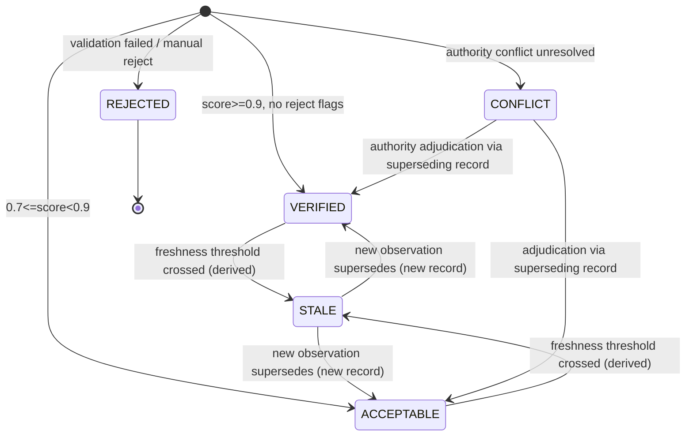
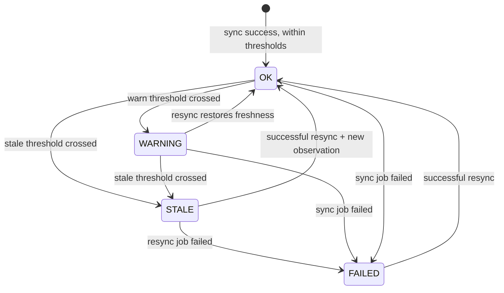

# Hermes Investment Office Technical Specification：Data Contract 研究报告

> 状态：**DRAFT v0.1（契约内容已对齐冻结规范 v1.0 与 ts01/ts02；正式冻结条件见 §11）**
>
> 输入：TS-01 Domain Model Specification（ts01.md）、TS-02 PostgreSQL ERD（ts02.md）、[《后端架构冻结规范 v1.0 Consolidated》](Hermes_Investment_Office_后端架构冻结规范_v1.0_Consolidated.md)
>
> 定位：把冻结规范 §2/§50 的 **"Data Contract 负责长期稳定"** 落地为可施工、可机器验证、可演进的数据契约层。本文件只做**设计规范**，不产生实现代码。

## 1. 执行摘要

TS-01 冻结了领域语义（thesis-centric / ledger-centric / provenance-first），TS-02 冻结了 PostgreSQL 物理 Schema（40 张表 / 9 个表族）。但"长期稳定"还需要一层独立契约：**无论 Provider 怎么换、行情怎么刷新、代码怎么演进，Hermes 与 Backend 之间交换的数据必须始终满足同一套结构、语义与质量承诺。** 这层契约就是 TS-04 Data Contract。

TS-04 最重要的设计结论：

> **数据契约是分层的：PG Schema 契约管"业务状态长什么样"，Parquet Schema 契约管"时间序列长什么样"，语义契约管"单位/时区/PIT 是什么意思"，质量契约管"这个数可不可信"，Freshness 契约管"这个数现在还新不新"。五层契约共同把"长期稳定"变成机器可验证的约束，而不是文档承诺。**

### 1.1 契约分级（冻结）

| 层 | 契约 | 冻结载体 | 核心内容 | 变更机制 |
|---|---|---|---|---|
| L1 | **PG Schema Contract** | TS-02 ERD（40 表/9 表族）+ TS-03 ORM | 业务状态、审计链、事实元数据索引的物理表结构 | Alembic migration + ADR；禁止新增表（除非 ADR） |
| L2 | **Parquet Schema Contract** | 本文件 §2 + `docs/data-contracts/parquet-schema.md` | 时间序列列契约、版本目录、分区策略、读取规则 | **新版本目录**（`v2/`），永不覆盖旧版本 |
| L3 | **语义契约** | ts01 §1/§5 + 本文件 §3–§5 | 单位归一化四元组、时区/日期、PIT、枚举、命名 | ADR + Spike 结果回流 |
| L4 | **质量契约** | ts01 §5 + 本文件 §6 | quality_score / quality_status / quality_flags、冲突解决顺序、fallback 记录结构 | ADR；评分权重 M0.5 后参数化 |
| L5 | **Freshness Contract** | 冻结规范 §36 + 本文件 §7 | 字段级新鲜度状态、阈值、Hermes 行为门禁 | ADR；阈值为参数化建议值 |

支撑契约：

| 契约 | 冻结载体 | 核心内容 |
|---|---|---|
| Attention Filtering Contract | 冻结规范 §38.1 + 本文件 §8 | attention_rules.yaml schema、规则引擎确定性执行语义、禁止 LLM 自主判断阈值 |
| Data Contracts 文档体系 | 冻结规范 §43 + 本文件 §9 | `docs/data-contracts/` 七份文档的职责与模板 |

### 1.2 冻结结论（关键设计决策）

| # | 决策 | 说明 |
|---|---|---|
| D1 | **Parquet 变更 = 新版本目录** | `ohlcva/v1/` → 列/类型/语义变更必须新建 `v2/` 并保留 `v1/`；`schema_version` 写入目录名 + 文件 `_metadata` + 目录内 `schema.json`（机器可验证） |
| D2 | **四元组全链路保留** | `original_value / original_unit / normalized_value / normalized_unit` 在 PG 列、Parquet 列、MCP JSON 三处同构存在；原始单位（元/万元/亿元）永不丢弃 |
| D3 | **QDII 四日期并存** | `market_date / nav_date / underlying_session_date / fx_as_of` 必须同时保存；FX 仅参与 QDII 分析，组合 NAV 恒为 CNY 单币种 |
| D4 | **quality_status 写时静态判定，STALE 读时派生** | `provenance_records` 是 append-only 表（ts02 §10 触发器兜底），故 VERIFIED/ACCEPTABLE/CONFLICT/REJECTED 在写入时确定；时效性过期（STALE）由 Freshness 引擎在读取路径派生，不原地改写 provenance 行 |
| D5 | **quality_score 只表质量，不表权威度** | 冲突解决先看 source authority，再看评分（ts01 冻结）；评分权重为建议值，M0.5 后参数化 |
| D6 | **Attention 规则确定性触发** | 阈值只存在于 `attention_rules.yaml`；LLM 只解释不触发；`attention_items` 只允许规则引擎写入 |
| D7 | **Freshness 门禁冻结** | `data_freshness != OK` 时禁止 Buy/Hold/Sell 建议、Thesis 更新、Trade Proposal（冻结规范 §36.3） |
| D8 | **缺口语义冻结** | 未披露 = 正常状态（无行）；停牌/无成交/NaN = 显式标记；Anomaly Detection 不得把合法缺口当错误上报（冻结规范 §15） |
| D9 | **禁止静默 fallback、冲突不静默消失** | 任何 fallback 必须 `fallback_used=true` + `FALLBACK_USED` flag + Audit 记录；冲突保留并标 `CONFLICT` + `superseded_by` 指针 |

### 1.3 命名与枚举对齐清单（硬约束）

本文件所有表名、列名、枚举与 ts01/ts02 严格一致。以下为全文件强制清单：

```text
表名（PG）：provenance_records  market_bar_index  financial_facts  etf_nav_observations
            etf_holding_snapshots  etf_metric_snapshots  fx_observations
            daily_contexts  attention_items  daily_briefs  trading_calendar  corporate_actions
数据集（Parquet）：ohlcva  financial_history  etf_holdings  index_history

枚举：
  DataQualityStatus    = VERIFIED / ACCEPTABLE / STALE / CONFLICT / REJECTED
  FreshnessStatus      = OK / WARNING / STALE / FAILED
  QuotaStatus          = NOT_APPLICABLE / UNKNOWN / OPEN / RESTRICTED / SUSPENDED
  InstrumentType       = CN_EQUITY / CN_ETF / INDEX
  SourceKind           = OFFICIAL_FILING / EXCHANGE / PROVIDER / HUMAN / HERMES / DERIVED_ENGINE
  SessionStatus        = OPEN / CLOSED / PARTIAL
  CorporateActionType  = DIVIDEND / SPLIT / BONUS_SHARE / RIGHTS_ISSUE
  CorporateActionStatus= ANNOUNCED / IMPLEMENTED / ADJUSTED
```

违规示例（一律不允许出现在本文件及下游实现中）：`US_ETF` 作为 instrument_type、`AT_RISK` 作为 assumption status（ts02 §5.3 已裁决以 `UNKNOWN/HEALTHY/WARNING/BROKEN` 为准）、`FRESH` 作为 FreshnessStatus 值（ts01 §6 示例中的 `FRESH` 是展示性文字，正式枚举以冻结规范 §36.2 的 `OK/WARNING/STALE/FAILED` 为准）。

---

## 2. Parquet Schema 版本化细则（冻结）

本节对应 **TS-04.2**，落地冻结规范 §8.2 "Parquet Schema 版本化（冻结）" 与 §49.4 第 17 项 "Parquet Schema 版本化细则"。ts02 §13.1 已明确：**Parquet schema 版本化不在 Alembic 管理**，由本文件与 `parquet-schema.md` 管理。

### 2.1 版本化总规则（冻结）

#### 2.1.1 目录版本规则

```text
data/parquet/
├── ohlcva/v1/
├── financial_history/v1/
├── etf_holdings/v1/
└── index_history/v1/
```

冻结规则：

1. **目录名携带 `schema_version`**：`<dataset>/v<N>/`，`N` 从 1 开始单调递增，永不复用；
2. **列名/类型/语义变更必须新增版本目录**（`v2/`），旧版本目录与旧文件**永久保留**（分层归档策略见 §2.7）；
3. **读取按版本解析**：读取器根据 `market_bar_index.parquet_path`（PG 侧指针）或目录名中的版本号选择对应 schema 解析器；禁止"一个读取器猜测所有版本"；
4. **schema_version 三处写入**：目录名（人可读）、每个文件的 Parquet `_metadata` key-value（机器可读）、目录内 `schema.json`（完整列契约，见 §2.1.2）；
5. **每次 schema 变更必须在 `parquet-schema.md` 记录迁移说明**：变更内容、变更原因、影响范围、迁移脚本/查询兼容策略（冻结规范 §8.2）；
6. **物理分区调整不触发版本升级**：分区目录（`trade_date_month=…`、`instrument_id_hash=…`）属于物理布局，不改变列契约；调整时更新 `parquet-schema.md` 的实现说明即可；
7. **数据纠错不触发版本升级**：同一 schema 内的 supersede/追加写（如财务重述新增行）走数据层 append，不改变 schema；
8. **instrument_id 表示变更（string UUID → int64）属于 schema 语义变更**，必须升级为 `v2`（见 §11 开放问题）。

#### 2.1.2 `schema.json` 机器可验证契约（冻结）

每个版本目录根部必须包含 `schema.json`，读取器（DuckDB 视图工厂 / 数据质量检查）在加载时校验：

```json
{
  "dataset": "ohlcva",
  "schema_version": 1,
  "frozen_at": "2026-08-23",
  "columns": [
    {"name": "instrument_id", "type": "string", "required": true, "description": "内部稳定标识，与 PG instruments.instrument_id 对齐"},
    {"name": "trade_date", "type": "date32", "required": true, "description": "A 股交易日（Asia/Shanghai 日历日）"}
  ],
  "partitions": ["instrument_id_hash", "trade_date_month"],
  "unit_contract": "base_unit=CNY；pct_change/turnover_rate 为百分比数值；金额类列 base_unit=CNY",
  "timezone_contract": "所有 timestamp 列 UTC 存储；业务日期列 DATE 不带时区",
  "migration_notes": []
}
```

校验规则：`schema.json` 列清单必须与目录内实际 Parquet 文件的列**完全一致**（顺序可不同，名称/类型/必填性必须一致）；不一致 → 数据加载失败并产生 `job_runs.status=FAILED`，禁止静默读取。

#### 2.1.3 数据集注册表（冻结）

| 数据集 | v0.1 版本 | 数据内容 | PG 侧指针表 | Freshness 域 | 写入方 |
|---|---|---|---|---|---|
| `ohlcva` | `v1` | A 股个股/ETF 日线 OHLCVA | `market_bar_index` | market | market_data 模块 |
| `financial_history` | `v1` | 财务事实全量时间序列（含重述历史） | `financial_facts`（行级） | fundamental | fundamentals 模块 |
| `etf_holdings` | `v1` | ETF 披露持仓明细（Level 1） | `etf_holding_snapshots`（header） | etf_holdings | etf 模块 |
| `index_history` | `v1` | 指数点位序列（美股 ^GSPC/^NDX 等，A 股指数可选） | `market_bar_index`（复用，见 §2.6.3） | index | market_data 模块 |

> **注册表是契约的一部分**：新增数据集（如 screening_dataset、factor 数据）必须在此登记并遵循同一版本化规则，禁止绕过注册表直接落盘。

### 2.2 `ohlcva/v1` Schema（冻结）

必须与冻结规范 §19 完全一致，并补齐 `quality_status`（对齐 ts02 `market_bar_index.quality_status`，便于按质量直接过滤）。

| 列 | Parquet 类型 | 必填 | 单位/语义 | 说明 |
|---|---|---|---|---|
| `instrument_id` | STRING | 是 | — | 内部稳定标识（v0.1 = PG UUID 字符串）；禁止存 Provider symbol |
| `trade_date` | DATE (date32) | 是 | Asia/Shanghai 日历日 | A 股交易日 |
| `open` | DOUBLE | 是 | CNY/份 | 开盘价（raw price） |
| `high` | DOUBLE | 是 | CNY/份 | 最高价（raw price） |
| `low` | DOUBLE | 是 | CNY/份 | 最低价（raw price） |
| `close` | DOUBLE | 是 | CNY/份 | 收盘价（raw price） |
| `volume` | DOUBLE | 是 | 股/份 | 成交量 |
| `amount` | DOUBLE | 是 | CNY（base_unit） | 成交额 |
| `pre_close` | DOUBLE | 是 | CNY/份 | 昨收（raw price，复权口径与 close 一致） |
| `pct_change` | DOUBLE | 是 | **百分比数值**（-8.1 表示 -8.1%） | 与 Provider 原生形态一致，与 §38.1 阈值示例对齐 |
| `turnover_rate` | DOUBLE | 否 | **百分比数值** | 换手率 |
| `adj_factor` | DOUBLE | 是 | 无量纲 | 后复权因子，与 `corporate_actions` 模块统一维护（冻结规范 §20） |
| `adjusted_close` | DOUBLE | 是 | CNY/份 | 复权价 = raw close × adj_factor（契约关系，黄金值校验，见 §2.2.2） |
| `provider` | STRING | 是 | — | 实际取数 provider（`tushare`/`akshare`/…） |
| `source_timestamp` | TIMESTAMP (UTC) | 否 | — | Provider 数据时间戳 |
| `ingested_at` | TIMESTAMP (UTC) | 是 | — | 系统写入时间 |
| `quality_status` | STRING | 是 | 枚举见 §6.2 | 行级质量状态（与 PG `market_bar_index.quality_status` 一致） |

**冻结的类型契约说明**：Parquet 为分析层，数值统一 DOUBLE（DuckDB 计算友好）；账本/黄金值所需的定点语义由 PG `NUMERIC` 保证（ts02 §1.2）。金额精度要求（4 位小数）在分析层通过容差测试保障，不改变列类型。

**分区策略（冻结布局）**：

```text
data/parquet/ohlcva/v1/
└── instrument_id_hash=<2位hex>/
    └── trade_date_month=YYYY-MM/
        └── part-*.parquet
```

- 一级分区 `instrument_id_hash`：`hash(instrument_id) mod 256` 的两位十六进制（00–FF），保证单标的点查收敛到少量文件，且写入负载均衡；
- 二级分区 `trade_date_month`：按月切割，支持 `as_of` 范围裁剪与横截面扫描；
- v0.1 标的宇宙较小（个人组合规模）时允许实现侧简化为仅 `trade_date_month` 分区（属物理布局调整，不触发版本升级，但必须在 `parquet-schema.md` 记录）。

#### 2.2.1 代表性行

```text
instrument_id | trade_date  | open    | high    | low     | close   | volume       | amount        | pre_close | pct_change | turnover_rate | adj_factor | adjusted_close | provider | source_timestamp           | ingested_at                 | quality_status
31d8…ab2      | 2026-08-21 | 1.3800  | 1.3920  | 1.3760  | 1.3820  | 123450000.0  | 1706069000.0  | 1.3700    | 0.876      | 1.23          | 1.0000     | 1.3820         | tushare  | 2026-08-21T15:00:00+08:00  | 2026-08-21T15:35:12Z       | VERIFIED
```

#### 2.2.2 契约校验（黄金关系）

- `pct_change ≈ (close - pre_close) / pre_close × 100`（容差 0.01）；
- `adjusted_close ≈ close × adj_factor`（容差 1e-6 元级）；
- 复权因子变更必须与 `corporate_actions` 表一致（同一 `ex_date` 起新因子生效，冻结规范 §20）。

### 2.3 `financial_history/v1` Schema（冻结）

对应 ts02 `financial_facts`（§4.3），但**存全量时间序列**：同一 `(instrument_id, metric_code, period_end)` 的多次披露（初值、重述、更正）全部保留，PIT 查询按 `published_at` 过滤（见 §5）。

| 列 | Parquet 类型 | 必填 | 说明 |
|---|---|---|---|
| `instrument_id` | STRING | 是 | 与 PG 对齐 |
| `metric_code` | STRING | 是 | 冻结清单：`REVENUE GROSS_PROFIT OPERATING_INCOME NET_INCOME OPERATING_CASH_FLOW CAPEX FREE_CASH_FLOW TOTAL_ASSETS TOTAL_LIABILITIES TOTAL_EQUITY CASH DEBT SHARES_OUTSTANDING`（冻结规范 §16） |
| `period_start` | DATE | 否 | 报告期起 |
| `period_end` | DATE | 是 | 报告期止（PIT 关键时点之一） |
| `period_type` | STRING | 否 | `Q1/H1/Q3/FY` |
| `statement_type` | STRING | 是 | `INCOME/BALANCE/CASH_FLOW/OTHER` |
| `original_value` | DOUBLE | 否 | 原始值（Provider 原样） |
| `original_unit` | STRING | 否 | 原始单位：`元/万元/亿元/千元/USD` 等 |
| `value` | DOUBLE | 是 | 归一化值（base_unit 契约，见 §3） |
| `currency` | STRING | 是 | `CNY`（v0.1 财务事实统一 CNY；外币原始值仅在 QDII 分析中换算，见 §3.5） |
| `unit` | STRING | 是 | 归一化单位（金额类 = `CNY`；`SHARES_OUTSTANDING` = `SHARE`；见 §3.2 映射表） |
| `is_restated` | BOOLEAN | 是 | 重述标记（重述 = 新行，不覆盖原值） |
| `published_at` | TIMESTAMP (UTC) | 否 | **正式披露时点（PIT 可见性判定依据）** |
| `retrieved_at` | TIMESTAMP (UTC) | 是 | 系统取得时间（仅日志语义，不得用于可见性判定） |
| `provider` | STRING | 是 | 实际 provider |
| `provenance_id` | STRING | 是 | 引用 PG `provenance_records`（行级血缘） |
| `quality_status` | STRING | 是 | 见 §6.2 |

**四元组在 Parquet 的落地**：`original_value / original_unit / value / unit` 即四元组的列表示（`normalized_value`=value、`normalized_unit`=unit）。缺原始值时 `original_value/original_unit` 为 NULL 且 `quality_flags` 必须含 `UNIT_AMBIGUOUS` 或 `UNIT_NOT_PROVIDED`（见 §6.3）。

**分区策略**：`instrument_id_hash` + `period_end_month=YYYY-MM`（二级分区按报告期止月切割）。

### 2.4 `etf_holdings/v1` Schema（冻结）

对应冻结规范 §23.1 **Level 1（最新披露持仓）**，明细行全量进 Parquet；PG `etf_holding_snapshots` 只保存 header（报告期/披露日/来源/parquet_path）。**禁止假设实时穿透**；所有行携带 `report_period` 与 `disclosure_date`，穿透结果的 `as_of` 以 `disclosure_date` 为准。

| 列 | Parquet 类型 | 必填 | 说明 |
|---|---|---|---|
| `holding_snapshot_id` | STRING | 是 | 与 PG `etf_holding_snapshots.holding_snapshot_id` 对齐（快照级聚合键） |
| `instrument_id` | STRING | 是 | ETF 的 instrument_id |
| `report_period` | DATE | 是 | 报告期（季报/半年报/年报） |
| `disclosure_date` | DATE | 是 | 披露日（穿透 `as_of` 依据） |
| `rank` | INT32 | 否 | 披露序号（前十大持仓等） |
| `stock_code` | STRING | 是 | 披露证券代码（如 `600519.SH`）；**不是内部主键**，映射到 `instruments` 通过 PG `provider_symbols` 查询时解析 |
| `stock_name` | STRING | 否 | 披露证券名称 |
| `weight` | DOUBLE | 否 | **归一化权重（比率 0–1）**；披露常为百分比，换算规则见 §3.2 注 |
| `quantity` | DOUBLE | 否 | 持股数量（股/份） |
| `market_value` | DOUBLE | 否 | 市值（base_unit=CNY） |
| `source` | STRING | 是 | `QUARTERLY/HALF_YEAR/ANNUAL/OTHER`（对齐 ts02 `etf_holding_snapshots.source`） |

**Level 2（估算 exposure）不进本表**：由 ETF Engine 计算产出（派生数据，携带 `as_of_date/source/confidence` 三元组，冻结规范 §23.1）。

**分区策略**：`instrument_id_hash` + `report_period_month=YYYY-MM`。

### 2.5 `index_history/v1` Schema（冻结）

存放指数点位序列：美股指数（Yahoo `^GSPC`/`^NDX`，仅 INDEX，冻结规范 §12.3）与 A 股指数（可选）。`trade_date` 为**该指数所在市场的交易日**（美股 = America/New_York 日历日；A 股 = Asia/Shanghai 日历日）。

| 列 | Parquet 类型 | 必填 | 说明 |
|---|---|---|---|
| `instrument_id` | STRING | 是 | 指向 `instrument_type='INDEX'` 的 instrument |
| `trade_date` | DATE | 是 | 指数市场交易日（时区语义见 §4） |
| `open` | DOUBLE | 否 | 指数开盘点位 |
| `high` | DOUBLE | 否 | 指数最高点位 |
| `low` | DOUBLE | 否 | 指数最低点位 |
| `close` | DOUBLE | 是 | 指数收盘点位（QDII 溢价/归因的基准输入） |
| `adjusted_close` | DOUBLE | 否 | Provider 提供的复权点位（如 Yahoo Adj Close），无则 NULL |
| `volume` | DOUBLE | 否 | 成交量（指数可能无） |
| `provider` | STRING | 是 | `yahoo` 等 |
| `source_timestamp` | TIMESTAMP (UTC) | 否 | Provider 时间戳 |
| `ingested_at` | TIMESTAMP (UTC) | 是 | |
| `quality_status` | STRING | 是 | |

**分区策略**：`instrument_id_hash` + `trade_date_month=YYYY-MM`。

**PG 指针说明（ts02 冻结边界内）**：ts02 未定义 `index_history` 专用指针表。v0.1 复用 `market_bar_index`（`instrument_id` 指向 INDEX 类型、`trade_date` 为美股交易日、`parquet_path` 指向 `index_history/v1/…`），`uq_market_bar_index_inst_date` 唯一约束天然适用。若 TS-05/TS-06 认为需要独立指针表，必须走 ADR（ts02 §16 冻结：不再新增表除非 ADR）。

### 2.6 DuckDB 视图与查询模式（冻结）

#### 2.6.1 版本感知视图工厂

```sql
-- 视图按版本解析：读取 v1 用 v1 列契约（schema.json 校验通过后）
CREATE VIEW v_ohlcva_v1 AS
SELECT instrument_id, trade_date, open, high, low, close, volume, amount,
       pre_close, pct_change, turnover_rate, adj_factor, adjusted_close,
       provider, source_timestamp, ingested_at, quality_status
FROM read_parquet('data/parquet/ohlcva/v1/**/*.parquet',
                  hive_partitioning = true);

-- 默认业务视图只暴露"当前最新版本"，上层业务禁止直接读裸目录
CREATE VIEW v_ohlcva AS SELECT * FROM v_ohlcva_v1;
```

规则：业务代码只能通过视图/版本解析器读取；目录版本升级时，视图工厂切换到新版本视图并保留旧版本视图用于历史复现。**禁止业务代码硬编码 `v1` 路径字符串**（除数据层注册表本身）。

#### 2.6.2 as_of 过滤（对齐 ts02 §9.2）

```sql
-- A 股日线：as_of 是 A 股日历日
SELECT * FROM v_ohlcva
WHERE instrument_id = $1
  AND trade_date <= DATE '2026-08-20';

-- 美股指数：as_of 是美股交易日（QDII 计算以 underlying_session_date 为锚）
SELECT * FROM v_index_history_v1
WHERE instrument_id = $2
  AND trade_date = DATE '2026-08-20';   -- 精确取"最新已完成美股 session"
```

#### 2.6.3 与 PG 元数据 join（标准路径）

```text
① PG 定位：SELECT parquet_path, quality_status, provenance_id
           FROM market_bar_index
           WHERE instrument_id = $1 AND trade_date = $2 AND provider = $3;
② 质量过滤：quality_status NOT IN ('CONFLICT','REJECTED')（决策敏感场景还须排除 STALE，见 §7.6）；
③ DuckDB 读取：read_parquet(<parquet_path>) 按行返回；
④ 血缘回填：结果携带 provenance_id → 查询 provenance_records 获得完整血缘。
```

#### 2.6.4 跨数据集查询示例（QDII 溢价归因骨架）

```sql
-- 输入：QDII ETF instrument_id（CN 市场），目标 market_date = '2026-08-21'
WITH etf_price AS (
  SELECT close, trade_date FROM v_ohlcva
  WHERE instrument_id = $etf AND trade_date = DATE '2026-08-21'
),
underlying AS (
  SELECT close AS index_close, trade_date AS us_session
  FROM v_index_history_v1
  WHERE instrument_id = $index
    AND trade_date = (SELECT MAX(trade_date) FROM v_index_history_v1
                      WHERE instrument_id = $index AND trade_date <= DATE '2026-08-20')
),
fx AS (
  SELECT rate FROM fx_observations
  WHERE base_currency = 'USD' AND quote_currency = 'CNY'
    AND as_of <= '2026-08-21T15:00:00+08:00'
  ORDER BY as_of DESC LIMIT 1
)
SELECT * FROM etf_price, underlying, fx;
-- 该骨架的输出必须同时携带 etf_market_date / underlying_session_date / fx_as_of，
-- 由 ETF Engine（TS-06）完成 premium_discount 计算与时间对齐校验。
```

#### 2.6.5 数据质量扫描

```sql
-- 缺失检查：给定标的与日期范围，对比 PG market_bar_index 应有记录 vs Parquet 实际行
SELECT i.instrument_id, i.trade_date
FROM market_bar_index i
LEFT JOIN v_ohlcva o
  ON o.instrument_id = i.instrument_id AND o.trade_date = i.trade_date
WHERE o.instrument_id IS NULL;
-- 结果 ≠ 空 → 产生 job FAILED / quality_flags=MISSING_FIELD，禁止静默吞
```

### 2.7 保留与归档（冻结）

| 数据集 | 保留策略 | 归档层 |
|---|---|---|
| `ohlcva/v1` | 永久 | hot（近 2 年）/ warm（2–10 年）/ cold（压缩归档）分层，实现细节 ADR 化 |
| `financial_history/v1` | 永久（重述行也保留） | 同上 |
| `etf_holdings/v1` | 永久 | 同上 |
| `index_history/v1` | 永久 | 同上 |
| 旧版本目录（`v0` 不存在，未来 `v2`+） | 永久保留，只读 | cold 层优先 |

> 备份：Parquet 目录纳入 `data/parquet/` 增量备份（冻结规范 §41.2）；节假日数据在 `trading_calendar` 中并纳入备份范围（冻结规范 §17）。

---

## 3. 单位归一化契约（冻结）

本节对应 **TS-04.3**，落地冻结规范 §14.2 单位归一化（冻结）与 §47.2 Financial Unit Normalization Spike。目标：**同一个 metric 在任何 Provider、任何原始单位下，归一化后必须得到同一数值语义**——这是"财务事实可跨源比较、可跨年复现"的前提。

### 3.1 基础规则（冻结）

1. **base_unit = CNY（金额类）**：所有金额类 metric 归一化到人民币元；
2. **原始单位必须保留**：`original_value / original_unit` 永不丢弃（Provider 原样），即使归一化成功；
3. **四元组是唯一合法表示**：任何金额/数量字段的对外表示（PG 列、Parquet 列、MCP JSON、Daily Brief 引用）必须可追溯到四元组或其等价列（`normalized_value/normalized_unit`）；
4. **归一化是确定性纯函数**：`normalize(metric_code, original_value, original_unit, fx_context?) → (normalized_value, normalized_unit)`，无随机、无 LLM 参与、版本化（`transform_version` 写入 provenance，ts01 §1）；
5. **数量级换算与汇率换算是两个动作**：元→万元是数量级（×1e4）；美元→人民币是汇率换算（仅 QDII 分析，见 §3.5）。两者禁止混为一谈。

### 3.2 metric 单位映射表（冻结 v0.1）

| metric_code | 类别 | 归一化单位 | 原始单位允许集 | 换算规则 |
|---|---|---|---|---|
| REVENUE / GROSS_PROFIT / OPERATING_INCOME / NET_INCOME | 利润表金额 | `CNY` | 元/千元/万元/亿元 | 数量级换算到元 |
| OPERATING_CASH_FLOW / CAPEX / FREE_CASH_FLOW | 现金流量金额 | `CNY` | 元/千元/万元/亿元 | 同上 |
| TOTAL_ASSETS / TOTAL_LIABILITIES / TOTAL_EQUITY | 资产负债表金额 | `CNY` | 元/千元/万元/亿元 | 同上 |
| CASH / DEBT | 资产负债金额 | `CNY` | 元/千元/万元/亿元 | 同上 |
| SHARES_OUTSTANDING | 数量 | `SHARE` | 股/万股/亿股 | 数量级换算到股 |
| （派生）EPS | 每股指标 | `CNY/SHARE` | — | 由 NET_INCOME ÷ SHARES_OUTSTANDING 派生，不归一化原始值 |
| （派生）ROE / ROA / 各类比率 | 比率 | `RATIO`（0–1） | 百分比/小数 | 百分比 ÷ 100 → 小数；**ratio 统一用 0–1 小数表示**（对齐 ts01 premium_discount 0.0634 表示法） |
| （行情）OHLCVA 金额 | 行情金额 | `CNY` | — | amount 直接为元（base_unit） |
| （ETF）NAV / market_value | 单位净值/市值 | `CNY`（每份/总额） | — | 净值与市价单位 CNY/份 |
| （ETF 持仓）weight | 权重 | `RATIO`（0–1） | 披露百分比 | 披露 12.34% → 0.1234 |
| （FX）rate | 汇率 | `RATE` | — | 1 base = rate quote（ts02 §4.7） |

> **单位/比例表示约定（冻结）**：`RATIO` 类（premium_discount、fx_contribution、target_weight、weight）统一 0–1 小数；`pct_change`/`turnover_rate`（OHLCVA）保持 Provider 原生**百分比数值**（-8.1 表示 -8.1%）。两条约定并存但**各自作用域冻结**，禁止在计算链中隐式混用（换算必须在归一化层完成并记录 `transform_version`）。

### 3.3 四元组的表示（三处同构）

**PG 列（ts02 `financial_facts` §4.3）**：

```sql
original_value  NUMERIC(24,6)   -- 原始值
original_unit   TEXT            -- 元/万元/亿元
value           NUMERIC(24,6)   -- 归一化值（NOT NULL）
unit            TEXT DEFAULT 'CNY'  -- 归一化单位
```

**Parquet 列（本文件 §2.3 `financial_history/v1`）**：`original_value / original_unit / value / unit` 同名同义。

**MCP/API JSON（对齐 ts01 §6 响应包络）**：

```json
{
  "metric_code": "REVENUE",
  "period_end": "2025-12-31",
  "original_value": 12345.6789,
  "original_unit": "万元",
  "normalized_value": 123456789.0,
  "normalized_unit": "CNY",
  "normalized_currency": "CNY",
  "transform_version": "unit-normalizer/0.1.0",
  "quality": {"status": "VERIFIED", "flags": []}
}
```

**可重建验收**：给定 `(metric_code, original_value, original_unit)` 与归一化版本号，任何时刻都能重建 `(normalized_value, normalized_unit)`；反方向（归一化值 → 原始值）同样成立（数量级换算可逆）。这是 §10 验收标准 #2 的机器测试基础。

### 3.4 Financial Unit Normalization Spike（§47.2）输出契约

Spike 必须产出以下内容并**回流**到 `unit-normalization.md`（冻结规范 §47 强制回流，禁止"报告写一份、实现按另一套"）：

| 输出 | 内容 | 验收 |
|---|---|---|
| 单位映射表 v1 | §3.2 表的完整版：覆盖 TuShare/AkShare 实测返回的所有金额单位（含 `千元/百万元/亿` 等变体） | 每个单位有黄金换算用例 |
| 边界案例清单 | 单位缺失、单位模糊（同字段出现多单位）、负值、外币值、零值、`--`/`-` 占位符 | 每个案例有处理决策（flag 或拒绝） |
| 验证数据集 | 真实标的多期财务数据的"原始→归一化→重建"对照 | 重建误差 = 0（数量级换算为精确十进制） |
| transform_version 命名 | `unit-normalizer/<semver>` | 每次映射表变更必须递增 |

### 3.5 汇率参与单位归一化的边界（冻结）

1. **汇率只出现在 QDII 分析路径**（冻结规范 §18：组合总资产 CNY，无需跨币种折算）；`fx_observations` 只被 ETF Engine 消费；
2. **外币原始值（如 USD 计价的底层美股数据）**：原始值以 `original_unit=USD` 保留；归一化到 CNY 仅发生在 QDII 归因/穿透计算内部，且**必须携带 fx provenance**（`fx_as_of`、provider、rate 快照，见 ts01 §5 QDII lineage）；
3. **禁止把"USD 原始值直接当 CNY 归一化值"**：无 FX 时该计算不得产出 VERIFIED 结果，只能产出带 `FX_MISSING` 或按 §7.3 阈值的 WARNING/STALE 标注结果；
4. **组合账本永不参与汇率**：`portfolio_transactions.amount_cny`、`portfolio_snapshots.nav_cny` 等字段不存在任何 FX 转换路径（ts02 §7 冻结）；
5. **unit 与 currency 是两个维度**：`unit` 表达计量单位（元/股/比率），`currency` 表达币种（CNY/USD）。`financial_history/v1` 的 `unit=CNY` 表示"以人民币元计量"，不隐含任何汇率换算。

---

## 4. 时区与日期契约（冻结）

本节对应 **TS-04.4**，落地冻结规范 §14.2 时区语义（冻结）与 §17 Trading Calendar（冻结）。目标是消灭三类经典错误：裸本地时间入库、把"美股交易日"当"A 股交易日"、把 `market_date` 当单一事实。

### 4.1 存储与时区标注规则（冻结）

1. **所有时间戳统一 UTC 存储**（PG `TIMESTAMPTZ`、Parquet `TIMESTAMP (UTC)`），**禁止裸本地时间**（冻结规范 §14.2）；
2. **业务日期单独 `DATE` 列**（trade_date / market_date / nav_date / period_end / disclosure_date 等），不塞进时间戳；
3. **时区标注规则**：
   - A 股数据（行情、财报披露、NAV 披露）：`Asia/Shanghai`；
   - 美股指数数据：`America/New_York`；
   - 标注是"数据语义"而非"存储格式"：存储为 UTC，字段说明/契约记录其业务时区，展示层按需转换；
4. **跨市场日期不相等**：`2026-08-21`（CN 周五收盘）与美股 session 边界无关；任何跨市场比较必须显式通过 §4.2 的 markets 结构与 §4.3 的四日期完成。

### 4.2 `market_date` 表达（冻结）

`daily_contexts.markets` JSONB（ts02 §8.2）采用**"用户主时区日期 + 各市场 session 标注"**：

```json
{
  "market_date": "2026-08-21",
  "markets": {
    "CN": {"date": "2026-08-21", "session": "CLOSED"},
    "US": {"date": "2026-08-20", "session": "CLOSED"}
  }
}
```

规则：

- `market_date` = 用户主时区（v0.1 = Asia/Shanghai）的日历日，唯一（`daily_contexts.market_date` UNIQUE）；
- 每个市场给出**该市场的实际交易日期**（不是主时区日期）与 session 状态；
- `session` 枚举：`OPEN / CLOSED / PARTIAL`（对齐 ts02 `trading_calendar.session_status`）；
- 非交易日：Backend Scheduler 不生成 daily_context（或标记 FAILED），Hermes 依据 Freshness Contract 跳过 LLM 阶段（冻结规范 §31.1），**禁止在 Hermes 侧重复实现交易日历**；
- QDII 场景：CN `session=CLOSED`（15:00 收盘）时 US 可能仍 `OPEN`，日报必须同时给出两个市场状态，禁止假设"同一天同一时刻两个市场都收盘"。

### 4.3 QDII 四日期建模（冻结）

`etf_metric_snapshots`（ts02 §4.6）的四个日期**必须并存**，任何单一 `as_of` 都无法替代（ts01 §5 冻结）：

```text
market_date            = A 股交易日（ETF 场内价格所在日）
nav_date               = 基金估值日（参考净值对应日，T+1 披露语义）
underlying_session_date= 美股指数交易日（底层指数最新收盘日）
fx_as_of               = 汇率观察时点
```

**lineage 契约**（对齐 ts01 §5 QDII lineage）：

```json
{
  "etf_market_date": "2026-08-21",
  "nav_date": "2026-08-20",
  "underlying_session_date": "2026-08-20",
  "fx_as_of": "2026-08-21T09:15:00+08:00"
}
```

规则：

1. 四日期各自有独立来源与 NULL 语义：无法时间对齐时对应指标置 NULL + `quality_flags=['NAV_TIME_ALIGNMENT_FAILED']`（ts01 §5/ts02 §4.6 冻结），**禁止返回"看起来精确"的错误值**；
2. `net_value_t1` 定义为"查询时最新可获得、并被 ETF Engine 明确映射到其基金 NAV 日期的已发布净值"（ts01 §5 冻结），不是自然日 T-1；
3. `quota_status` 是事件状态（公告 provenance），**禁止从溢价率推断**（ts01 §5 冻结）；
4. 交易日历对 QDII 的用途：为 `underlying_session_date` 与 `nav_date` 提供"最新已完成 session"的确定性锚点。

### 4.4 交易日历接口契约（冻结）

冻结规范 §17 要求两个确定性接口，本文件冻结其契约：

```text
is_trading_day(market: 'CN'|'US', date: DATE) -> BOOLEAN
next_trading_day(market: 'CN'|'US', date: DATE) -> DATE
```

| 属性 | 契约 |
|---|---|
| 确定性 | 同输入必同输出；纯查表（`trading_calendar` 表 + 缓存），无外部调用 |
| 幂等性 | 重复调用无副作用 |
| 数据维护 | 人工校准 + 来源同步双通道（冻结规范 §17）；节假日纳入备份范围 |
| 使用方 | Backend Scheduler（触发同步/日报生成时机）、FX 交易日、QDII 四日期锚定、freshness 阈值计算 |
| 禁止 | Hermes 侧实现（§31.1）；Provider 代码直接访问日历表（须经 calendar 模块） |
| 数据来源 | TS-05 Provider 契约确认 + M1 验收校准（ts02 §16 开放问题 #6） |

---

## 5. PIT 数据契约（冻结）

本节对应 **TS-04.5**，落地冻结规范 §15 与 ts02 §9。PIT 是 Hermes 能"多年后复盘为什么当时那么判断"的根基：**任何历史查询默认只允许看到当时公开的信息**。

### 5.1 三时点定义（冻结）

| 时点 | 字段 | 语义 | 能否用于"当时可见性"判定 |
|---|---|---|---|
| 报告期止 | `period_end` | 财务数据覆盖的期间终点（如 2025-12-31） | **否**——它是数据内容属性，不是时间属性 |
| 正式披露时点 | `published_at` | 原始信息对外发布/可取得的时点（如年报披露 2026-03-28 18:00） | **是**——PIT 可见性的唯一判定依据 |
| 系统取得时点 | `retrieved_at` | 系统实际拉取到数据的时间 | **否**——仅日志/运维语义 |

**look-ahead 的核心判据**：`2025-12-31 年报期间 ≠ 2025-12-31 市场已知年报内容`。只有 `published_at <= as_of` 的信息才在当时可见。

### 5.2 as_of 查询语义（对齐 ts02 §9.2，冻结）

所有 PIT 查询必须支持 `as_of=<date>` 参数，且**默认禁止返回"当时不可见"的信息**：

| 查询对象 | PIT 过滤 | 说明 |
|---|---|---|
| `financial_facts` / `financial_history/v1` | `published_at <= as_of`（NULL 视为未披露） | 同一期间多次披露取 `published_at` 最新一条（重述/更正为多行，ts02 §4.3） |
| `theses` | `thesis_revisions.created_at <= as_of` 取最近版本 | `get_thesis(as_of)` 必须返回 PIT 可见版本（ts01 冻结） |
| `position_snapshots` / `portfolio_snapshots` | `snapshot_date <= as_of` 取最近快照 | |
| `valuation_runs` | `as_of <= 查询时点 AND status='COMPLETED'` | run 自身 `as_of` 是语义日期 |
| `etf_metric_snapshots` | `as_of <= 查询时点`，四日期各按自身锚点对齐 | 见 §4.3 |
| `ohlcva/v1` | `trade_date <= as_of`（CN） | 指数按美股 session 锚点 |

**实现要求**：as_of 过滤必须在数据访问层强制执行（PG 索引 `ix_financial_facts_pit` 命中 + DuckDB 视图参数化），不允许业务代码自行拼装"不过滤"的查询。

### 5.3 缺口语义（冻结，对齐 ts02 §9.4）

| 情形 | 表达 | 处理 |
|---|---|---|
| 财报该披露尚未披露 | `financial_facts` 无行 / Parquet 无记录 | **正常状态**，不是错误；不抛异常、不产生 FAILED |
| 停牌/无成交 | `market_bar_index` 无行 或 `quality_status` 显式标记 | 合法状态，显式标记，不中断流水线 |
| NaN/占位符 | 归一化层清洗 + `quality_flags` 记录（`MISSING_FIELD`/`VALUE_NA`） | 显式标记，不抛异常 |
| 时间对齐失败 | `premium_discount IS NULL` + `quality_flags=['NAV_TIME_ALIGNMENT_FAILED']` | 是"不可计算"而非"数据缺失错误" |
| Anomaly Detection | — | **不得把合法缺口当错误上报**（冻结规范 §15） |

### 5.4 look-ahead 防护规则（冻结）

1. **可见性判定只用 `published_at`**；`retrieved_at`、`period_end`、`ingested_at` 一律不得参与；
2. **决策敏感引擎输入校验**：Valuation/Portfolio/Risk/ETF Engine 的输入快照必须经过 PIT 过滤；引用 provenance 存在 `CONFLICT/REJECTED` 或可见性不满足时，拒绝产出 `VERIFIED` 结果（ts01 §1 验证规则）；
3. **回测/复盘**：任何历史回放（thesis review、估值复盘、attention 历史解释）使用统一的 `as_of` 语义日期，禁止使用"今天的数据解释昨天"；
4. **重述语义**：`is_restated=true` 的新行不影响历史 `as_of` 查询——历史查询看到的是披露时点的旧值，重述值只在 `as_of >= 重述披露时点` 后可见；
5. **测试保障**：§10 验收标准 #3（as_of 黄金测试）覆盖"重述/更正/多次披露"场景。

---

## 6. 数据质量契约（Data Quality Policy）

本节对应 **TS-04.6**，把 ts01 §1 的 provenance 质量语义与冻结规范 §13 的 fallback 纪律细化为可执行的质量评估、状态机与编码体系。**质量契约的目标不是"评分越高越权威"，而是"每个数字进入系统时都留下可审计的可信度证据"。**

### 6.1 quality_score 计算（建议值，M0.5 后可参数化）

`quality_score` ∈ [0, 1]，由四维加权组成（**建议权重，非冻结硬编码**；M0.5 Data Feasibility Spike 后按真实数据形态校准参数，写入 `freshness-contract.md` 或独立配置）：

```text
quality_score =
  w_completeness × completeness
+ w_timeliness   × timeliness
+ w_consistency  × consistency
+ w_reliability  × source_reliability
```

| 维度 | 建议权重 | 评估内容 | 示例扣分 |
|---|---|---|---|
| completeness 完整性 | 0.30 | 必填字段缺失率、行级字段完整度 | 缺 `source_timestamp` → −0.1；缺字段且 `MISSING_FIELD` flag → 每项 −0.15 |
| timeliness 时效性 | 0.30 | 相对该数据域 freshness 阈值的滞后程度（阈值见 §7.3） | 落后 1 session → −0.1；落后 >2 session → −0.3 |
| consistency 一致性 | 0.20 | 跨源/跨字段一致性、契约关系校验（§2.2.2 黄金关系、单位换算自洽） | 单位换算异常 → −0.2；与权威源冲突未决 → −0.4 |
| reliability 来源可靠性 | 0.20 | Provider 历史可靠度（capability matrix 分级）+ fallback 记录 | `fallback_used=true` → −0.15；Provider 评级 C → −0.1 |

**评分规则（建议）**：

- `score ≥ 0.90 且无 REJECT 级 flag` → `VERIFIED`；
- `0.70 ≤ score < 0.90` → `ACCEPTABLE`；
- `score < 0.70` 或存在严重 flag → 不高于 `CONFLICT`/`REJECTED`（结合 §6.2 判定）；
- **score 只表数据质量，不表来源权威度**（ts01 §1 硬约束）：官方公告记录即使 `score=0.80` 也优先于 `score=0.99` 的第三方聚合（见 §6.4 冲突解决顺序）；
- 内部事件（`source_kind=HERMES/HUMAN`，如 thesis revision 记录）可给 `score=1.0`，仅表示"事件记录完整"，不表示业务判断正确（ts01 §3 澄清）。

> 参数化位置：权重与分级阈值存放在 Data Quality Policy 配置（v0.1 建议 `backend/app/quality/config.yaml`），**不得硬编码进业务代码**；变更走配置版本 + 测试，不改契约本身。

### 6.2 quality_status 状态机（冻结语义）

枚举（ts01 冻结）：`VERIFIED / ACCEPTABLE / STALE / CONFLICT / REJECTED`。



**冻结语义**：

| 状态 | 判定时机 | 触发条件 | 决策敏感引擎可用性 |
|---|---|---|---|
| `VERIFIED` | 写入时 | score ≥ 0.9 且无 REJECT 级 flag 且无未决冲突 | 可用 |
| `ACCEPTABLE` | 写入时 | 0.7 ≤ score < 0.9 | 可用，但输出必须携带质量标注 |
| `STALE` | **读取时派生**（见下） | 时效性越过 §7.3 阈值 | 不可用（除非显式降级流程） |
| `CONFLICT` | 写入时 | 多源冲突无法按 §6.4 解决 | **不可用**，等待仲裁 |
| `REJECTED` | 写入时 | 校验失败（schema/单位/范围）或人工拒绝 | **不可用**，不可逆 |

**STALE 派生设计决策（关键）**：`provenance_records` 是 append-only 表（ts02 §10 触发器兜底，禁止 UPDATE）。因此：

- 写入时只判定 `VERIFIED / ACCEPTABLE / CONFLICT / REJECTED`（静态）；
- `STALE` 由 Freshness 引擎在**读取路径**派生（§7 定义），不写回 provenance 行——查询层以"静态状态 + 时效性派生"合成最终可用性；
- `STALE` 作为枚举值保留：用于"显式标记为过期"的观测（如人工标注某快照失效），此类写入仍走新增 provenance 记录而非原地修改；
- 状态推进（STALE→VERIFIED 等）一律通过**新 observation + supersede 指针**完成，禁止原地迁移。

### 6.3 quality_flags 编码清单（冻结）

`quality_flags`（JSONB 数组，ts01/ts02 冻结字段）编码清单按类别划分：

**缺失类**

| flag | 含义 | 影响 |
|---|---|---|
| `MISSING_FIELD` | 必填字段缺失 | 扣 completeness |
| `MISSING_SNAPSHOT` | 预期存在的快照/记录缺失 | 触发缺口检查（§2.6.5） |
| `GAP_BAR` | 交易日无行情行（停牌/无成交） | 合法缺口，显式标记 |
| `UNIT_NOT_PROVIDED` | 原始单位缺失 | 不高于 ACCEPTABLE |

**异常类**

| flag | 含义 | 影响 |
|---|---|---|
| `OUTLIER_SUSPECTED` | 数值超出合理区间（如单日 ±20%、负市值） | 触发人工复核；决策敏感引擎默认拒绝 |
| `NEGATIVE_NAV` / `NEGATIVE_PRICE` | 语义上不应为负的字段为负 | 大概率 REJECTED |
| `VALUE_OUT_OF_RANGE` | 数值越界（精度/量级） | 视上下文降级 |

**fallback 类**

| flag | 含义 | 影响 |
|---|---|---|
| `FALLBACK_USED` | 实际来源非请求来源 | 扣 reliability；必须伴随 §6.5 记录 |
| `PRIMARY_TIMEOUT` | primary provider 超时 | 记录 fallback_reason |
| `PRIMARY_INVALID` | primary 返回数据校验失败 | 记录 fallback_reason |

**时间类**

| flag | 含义 | 影响 |
|---|---|---|
| `TIME_ALIGNMENT_FAILED` | QDII 指标无法时间对齐（ts01/ts02 冻结用法） | 对应指标 NULL，禁止产假值 |
| `OBSERVED_AFTER_RETRIEVED` | observed_at 晚于 retrieved_at | 数据异常，降级 |
| `PUBLISHED_IN_FUTURE` | published_at 在未来 | 降级/拒绝 |
| `AS_OF_MISMATCH` | 记录 as_of 与请求 as_of 不匹配 | PIT 查询层处理 |

**单位类**

| flag | 含义 | 影响 |
|---|---|---|
| `UNIT_AMBIGUOUS` | 原始单位无法确定（如字段混合单位） | 归一化拒绝；不高于 ACCEPTABLE |
| `UNIT_CONVERSION_MANUAL` | 单位换算依赖人工/外部决策 | 必须人工确认后解除 |

**冲突类**

| flag | 含义 | 影响 |
|---|---|---|
| `CONFLICT_WITH_AUTHORITY` | 与更高权威源冲突 | 进入 §6.4 仲裁 |
| `SUPERSEDED` | 被更新的观测取代 | 保留历史，PIT 查询可见性控制 |
| `RESTATED` | 财务重述 | 历史 as_of 查询不受影响（§5.4） |

**状态类**

| flag | 含义 | 影响 |
|---|---|---|
| `SUSPENDED_DAY` | 当日停牌 | 合法状态 |
| `NO_TRADING` | 无成交 | 合法状态 |
| `ESTIMATED_VALUE` | 估算值（如 Level 2 穿透、iNAV 估算） | 必须携带 confidence |
| `MANUAL_REVIEW_REQUIRED` | 需要人工复核 | 挂起，禁止自动使用 |

规则：flag 是**证据**不是结论——引擎根据 flag 组合降级可用性；`FALLBACK_USED`、`CONFLICT_WITH_AUTHORITY`、`UNIT_AMBIGUOUS` 三类 flag 出现时，决策敏感引擎默认拒绝产出 VERIFIED 结果。

### 6.4 冲突解决顺序（冻结，对齐 ts01 §5）

两个来源给出同一事实的不同值时，按以下确定性顺序裁决，**任何一步都不能跳过**：

```text
① Source authority（来源权威度）
        ↓
② Point-in-time validity（PIT 有效性）
        ↓
③ Publication/version recency（披露/版本新旧）
        ↓
④ Schema/unit validation（结构与单位校验）
        ↓
⑤ Provider quality（Provider 质量评分）
        ↓
⑥ Manual adjudication（人工仲裁，未决时）
```

| 步骤 | 判定规则 | 输出 |
|---|---|---|
| ① Source authority | 官方披露（OFFICIAL_FILING/EXCHANGE）> 聚合 Provider（PROVIDER）> 派生/估算 | 权威源胜出 → 权威观测标 VERIFIED，另一方标 `CONFLICT` + `superseded_by` |
| ② PIT validity | 谁在目标 as_of 时点可见（published_at） | 当时不可见的值不参与裁决 |
| ③ Recency | 同一口径下较新披露优先（版本/重述） | 新披露胜出，旧值保留为历史 |
| ④ Schema/unit validation | 通过 §3 单位归一化与 §2.2.2 契约校验者优先 | 校验失败方降级 |
| ⑤ Provider quality | 上述均无法区分时，`quality_score` 较高者优先 | 仍须保留失败方记录 |
| ⑥ Manual adjudication | 仍未决 → 双方标 `CONFLICT`，人工裁决 | 裁决后新记录 + supersede 指针 |

**冻结规则**：

1. **冲突不静默消失**：失败方记录保留（不删除），标 `quality_status=CONFLICT` 与 `superseded_by=<胜出观测 id>`；
2. **无法裁决 → 保持 CONFLICT**：决策敏感引擎默认拒绝使用（ts01 §1/§5 冻结）；
3. **quality_score 不覆盖 source authority**（D5）：第三方 0.99 不能覆盖正式公告；
4. 冲突解决结果必须可审计：AuditEvent 记录裁决过程（actor/依据/时间）。

### 6.5 禁止静默 fallback 的记录结构（冻结）

对齐冻结规范 §13（value/provider/source_timestamp/ingested_at/adjustment/quality/fallback_used）与 ts01 §5 fallback policy（requested_provider/actual_provider/fallback_reason/quality_score）。

**fallback 事件必须同时满足**：

```json
{
  "requested_provider": "tushare",
  "actual_provider": "akshare",
  "fallback_used": true,
  "fallback_reason": "PRIMARY_TIMEOUT",
  "quality_score": 0.91,
  "quality_flags": ["FALLBACK_USED", "PRIMARY_TIMEOUT"],
  "source_record_id": "600519.SH@2026-08-21",
  "retrieved_at": "2026-08-21T15:35:12Z",
  "transform_version": "market-normalizer/0.1.0"
}
```

| 落点 | 内容 |
|---|---|
| `provenance_records` | 上述 JSON 的全部字段（provider=actual、fallback_used=true、quality_flags 含 FALLBACK_USED、quality_score 已扣分） |
| `audit_events` | `action='FALLBACK'`，payload 含 requested/actual/reason |
| 数据行 | `provider` 列 = actual provider（`ohlcva/v1.provider`、`market_bar_index.provider` 等） |

**判定规则**：若 `fallback_used=true` 但 provenance/audit 中无对应记录，或数据行 `provider` 与请求 provider 不一致且无 fallback 标记 → 数据质量检查 FAILED（架构测试覆盖）。**禁止**"TuShare 失败 → 偷偷改 AkShare → 对上层声称行情正常"（ts01 §5）。

---

## 7. Freshness Contract（冻结，字段级）

本节对应 **TS-04.7**，把冻结规范 §36 的 Daily Context Freshness Contract 细化为**字段级**契约：`daily_contexts.data_freshness` 的 JSON 结构、每类数据的阈值表、状态转换规则、Hermes 行为门禁、以及与 provenance 的联动。**Hermes 不允许在过期数据上生成投资判断（冻结规范 §36 首句）。**

### 7.1 总体模型（冻结）

```text
FreshnessStatus = OK | WARNING | STALE | FAILED
```

- **逐域评估**：7 个数据域各自评估：`market / fundamental / etf_nav / etf_holdings / index / fx / quota`；
- **整体状态 = 最差域**：`daily_contexts.freshness_status = worst(各域 status)`，偏序 `FAILED > STALE > WARNING > OK`；
- **评估时机**：每次 Daily Context Builder 运行时（数据同步 + 质量检查之后、Hermes LLM 阶段之前，冻结规范 §37）；
- **FAILED 语义**：该域同步 job 失败导致完全不可用（不是"旧但可用"），`daily_contexts` 生成失败或标记 FAILED。

### 7.2 `data_freshness` JSON 结构（冻结，字段级）

每个域条目统一 schema：

```json
{
  "market": {
    "status": "OK",
    "evaluated_at": "2026-08-21T16:05:00Z",
    "latest_point": "2026-08-21",
    "expected_point": "2026-08-21",
    "lag": {"sessions": 0, "days": 0},
    "thresholds": {"warn_lag_sessions": 1, "stale_lag_sessions": 2},
    "detail": "最新已完成 A 股交易日 2026-08-21 已入库",
    "affected_scope": null,
    "stale_provenance_ids": [],
    "required_action": null
  },
  "fundamental": {
    "status": "OK",
    "evaluated_at": "2026-08-21T16:05:00Z",
    "latest_sync_at": "2026-08-21T15:50:00Z",
    "new_filings_captured": true,
    "detail": "已捕获 2026-08-21 前全部已知披露",
    "affected_scope": null,
    "stale_provenance_ids": [],
    "required_action": null
  },
  "etf_nav": {
    "status": "OK",
    "latest_nav_date": "2026-08-20",
    "published_at": "2026-08-21T19:02:00+08:00",
    "detail": "最新已发布 NAV 为 2026-08-20 净值"
  },
  "etf_holdings": {
    "status": "OK",
    "latest_report_period": "2026-06-30",
    "disclosure_date": "2026-07-20",
    "detail": "最新已披露持仓为 2026 年中报"
  },
  "index": {
    "status": "OK",
    "latest_us_session": "2026-08-20",
    "detail": "最新已完成美股 session 2026-08-20"
  },
  "fx": {
    "status": "OK",
    "latest_as_of": "2026-08-21T09:15:00+08:00",
    "detail": "USD/CNY 观察值可用"
  },
  "quota": {
    "status": "OK",
    "quota_status": "OPEN",
    "source_validity": "valid",
    "detail": "额度状态来自 2026-08-18 公告"
  }
}
```

字段说明（每域条目共有的核心字段）：`status`（枚举）、`evaluated_at`（评估时间）、`latest_point`（最新数据点）、`expected_point`（应达数据点）、`detail`（人读说明）、`affected_scope`（受影响的标的/区间）、`stale_provenance_ids`（触发 STALE 的 provenance 引用，见 §7.6）、`required_action`（建议的恢复动作，如 `resync: market_sync_job`）。

### 7.3 每类数据 freshness 阈值表（参数化建议值）

继承 ts01 §5 建议值，**标注为参数化建议值**（配置键示例），M0.5/实际运行后校准，变更走配置而非代码：

| 数据域 | Freshness 语义 | WARNING 条件 | STALE / BLOCK 条件 | 参数键（建议） |
|---|---|---|---|---|
| market（A 股/ETF 日行情） | 最新已完成 A 股交易日 | 落后 >1 session | 落后 >2 sessions 用于即时决策时 | `market.warn_lag_sessions=1`、`market.stale_lag_sessions=2` |
| index（美股指数） | 最新已完成美股 session | 落后 >1 US session | 与 QDII 计算所需时点不兼容 | `index.warn_lag_sessions=1` |
| fundamental | 已捕获最新正式披露 | 新披露后 ingestion >24h | 已知存在新披露但仍用旧版本做决策敏感估值 | `fundamental.warn_ingestion_hours=24` |
| etf_nav | 最新正式可得 NAV | 超过预计发布周期 | premium 计算无法进行时间对齐 | `etf_nav.warn_publish_cycle_hours`（按产品参数化） |
| etf_holdings | 最新已公开持仓报告 | 超过预期披露周期 | 穿透风险分析声称 current 但无有效 snapshot | `etf_holdings.warn_disclosure_cycle_days` |
| quota | 有效公告状态 | source validity 不明确 | 置为 `UNKNOWN`，禁止假装 OPEN | `quota.warn_source_validity` |
| fx | QDII attribution 所需最新 business observation | >1 business day（视分析而定） | 时点无法与 NAV/index 对齐 | `fx.warn_business_days=1` |

**跨域联动**：`etf_nav`/`index`/`fx` 任一为 STALE 时，QDII 域相关指标（premium_discount/fx_contribution）自动降级（§4.3 时间对齐规则）；`quota` 置 `UNKNOWN` 时禁止假装 `OPEN`（ts01 §5）。

### 7.4 状态转换规则（冻结）



- **恢复条件**：新 observation 成功写入且滞后归零 → 回 `OK`（STALE 域恢复后，`stale_provenance_ids` 清空并记录审计）；
- **评估器**：Freshness 引擎（确定性代码），输入 = 各域最新 provenance（`retrieved_at/as_of_date`）+ 交易日历（`is_trading_day/next_trading_day`）+ 阈值配置；
- **禁止**：LLM 判断新鲜度；Provider 自行声明新鲜度。

### 7.5 Hermes 行为规则（冻结，对齐 §36.3）

`data_freshness != OK`（任意域非 OK）时：

| 动作 | 禁止/允许 |
|---|---|
| 生成 Buy/Hold/Sell 建议 | **禁止** |
| 更新 Thesis | **禁止** |
| 创建 Trade Proposal | **禁止** |
| 输出数据异常报告 | 允许 |
| 请求重新同步（get_job_status / 触发重跑） | 允许 |
| 标记 Attention Item | 允许 |
| 生成 Daily Brief（LLM 阶段） | WARNING：允许（带标注）；FAILED：Hermes 跳过 LLM 阶段（§31.1） |

**域级门禁细化（设计建议，供 TS-06 落引擎）**：

| 域状态 | 受影响引擎 | 行为 |
|---|---|---|
| market = STALE | Valuation（current_price 输入）、Portfolio（市值） | 拒绝产出 VERIFIED 快照/估值 |
| fundamental = STALE | Valuation（财务输入） | 拒绝使用旧版本做决策敏感估值 |
| etf_nav / index / fx 任一 STALE | ETF Engine（QDII） | premium/fx_contribution 置 NULL + 时间对齐 flag |
| quota = UNKNOWN | ETF Engine | 禁止假装 OPEN，标记 UNKNOWN |
| etf_holdings = STALE | Risk Engine（穿透） | 穿透结果禁止声称 current |

### 7.6 Freshness 与 provenance 的联动（冻结）

1. **STALE 必须可追溯**：域条目 `stale_provenance_ids` 列出触发 STALE 的具体 provenance 记录（`retrieved_at/as_of_date` 越过阈值）；
2. **decision-sensitive 引擎输入校验**：引用的 provenance 存在 `STALE/CONFLICT/REJECTED` → 拒绝产出 `VERIFIED` 结果（与 ts01 §1 验证规则一致）；STALE 的 provenance 不得作为"当前决策"的依据，但**允许作为 PIT 历史查询的依据**（§5）；
3. **source_status 联动**：`daily_contexts.source_status`（provider 健康，ts02 §8.2）记录各 provider 最近同步结果；provider 失败 → 对应域 WARNING/FAILED；
4. **恢复动作闭环**：`required_action` 指向具体重同步 job（`market_sync_job` 等，§35.3 冻结）；重同步成功 → 新 provenance 写入 → 下一评估周期恢复 OK；
5. **审计**：每次 freshness 状态转换写入 `audit_events`（`action='FRESHNESS_CHANGE'`，payload 含前后状态、域、阈值、触发 provenance）。

---

## 8. Attention Filtering 规则契约（冻结）

本节对应 **TS-04.8**，落地冻结规范 §38.1 与 §47.3 Attention Filtering Config Spike。目标：**把"什么值得看"从 LLM 的临时判断变成确定性、可配置、可审计的规则**——降低 token 成本、降低噪音、保证日报只分析 Attention Items（冻结规范 §38）。

### 8.1 不可谈判项（冻结）

1. **Attention Detection 必须由 Backend 确定性规则完成**（冻结规范 §38.1）；
2. **禁止 LLM 自主判断阈值**；LLM 只解释，不触发；
3. **`attention_items` 只能由规则引擎写入**（ts02 §8.2 冻结）；LLM 无创建/修改 attention_item 的工具；
4. 规则配置单一事实来源：`attention_rules.yaml`（版本化，见 §8.4）。

### 8.2 `attention_rules.yaml` 完整 schema（冻结）

```yaml
schema_version: 1            # 配置 schema 版本（注意：与 Parquet schema_version 无关）
defaults:                    # 规则缺省值
  scope: all
  enabled: true
rules:
  - name: <string>                # 规则标识（写入 attention_items.rule_name）
    data_type: <enum>             # market_bar | index_point | financial_fact
                                  # | etf_metric | filing_event | corporate_action | state_change
    rule_type: <enum>             # NUMERIC_THRESHOLD | EVENT_EXISTS | STATE_CHANGE | COMPOSITE
    metric: <string>              # 数值规则的数据字段（pct_change / pe_percentile / revenue_change …）
    operator: <enum>              # le | lt | ge | gt | eq | neq | exists | changed
    threshold: <number|string>    # 数值阈值或事件/状态条件
    unit: <enum>                  # percent | ratio | days | none
    window: <string>              # current_day | 3d | 5d | since_last_brief …
    scope: <enum|list>            # portfolio | watchlist | thesis | all
    severity: <enum>              # INFO | LOW | MEDIUM | HIGH | CRITICAL
    description: <string>         # 人读说明（LLM 解释的依据）
    enabled: <boolean>            # 默认 true
    dedupe: <string>              # daily | per_period（同一规则+标的+周期只出一条）
```

**规则类型语义**：

| rule_type | 语义 | operator 集 |
|---|---|---|
| `NUMERIC_THRESHOLD` | 数值与阈值比较 | le/lt/ge/gt/eq/neq |
| `EVENT_EXISTS` | 事件是否存在（filings/公告） | exists |
| `STATE_CHANGE` | 状态机发生迁移（quota/额度、corporate action 状态） | changed |
| `COMPOSITE` | 子条件 and/or 组合（v0.1 可选，标注为扩展，不承诺实现） | — |

**severity 与 attention_items.severity 对齐**（ts02 `attention_items` 未冻结取值，本文件冻结 `INFO/LOW/MEDIUM/HIGH/CRITICAL`）。

### 8.3 完整示例（冻结基线，M0.5 Spike 后校准）

```yaml
schema_version: 1
defaults:
  scope: all
  enabled: true
rules:
  - name: price_drop
    data_type: market_bar
    rule_type: NUMERIC_THRESHOLD
    metric: pct_change
    operator: le
    threshold: -8.0          # 百分比（-8%），与 OHLCVA pct_change 单位一致
    unit: percent
    window: current_day
    scope: [portfolio, watchlist]
    severity: HIGH
    description: 持仓或观察池标的单日跌幅超过 8%
    dedupe: daily

  - name: pe_percentile_low
    data_type: etf_metric
    rule_type: NUMERIC_THRESHOLD
    metric: pe_percentile
    operator: le
    threshold: 20            # 历史分位低于 20%
    unit: ratio
    window: since_last_brief
    scope: [thesis, watchlist]
    severity: MEDIUM
    description: 标的估值历史分位进入低位区（pe_percentile <= 20）
    dedupe: daily

  - name: revenue_change_drop
    data_type: financial_fact
    rule_type: NUMERIC_THRESHOLD
    metric: revenue_change
    operator: le
    threshold: -20.0         # 同比营收增速低于 -20%
    unit: percent
    window: since_last_brief
    scope: [thesis, portfolio]
    severity: MEDIUM
    description: 最新报告期营收同比变化低于 -20%
    dedupe: per_period

  - name: new_filing
    data_type: filing_event
    rule_type: EVENT_EXISTS
    condition: exists
    scope: [thesis, portfolio, watchlist]
    severity: MEDIUM
    description: Thesis/持仓/观察池覆盖标的出现新披露（财报/重大公告）
    dedupe: daily

  - name: corporate_action_announced
    data_type: corporate_action
    rule_type: STATE_CHANGE
    condition: status_changed_to: ANNOUNCED
    scope: [portfolio, thesis]
    severity: HIGH
    description: 持仓或 Thesis 标的发生新公告的公司行为（分红/送转/配股）
    dedupe: per_period

  - name: quota_status_change
    data_type: state_change
    rule_type: STATE_CHANGE
    condition: quota_status_changed: true
    scope: [portfolio]
    severity: HIGH
    description: QDII ETF 额度状态发生迁移（OPEN/RESTRICTED/SUSPENDED/UNKNOWN）
    dedupe: daily

  - name: premium_discount_spike
    data_type: etf_metric
    rule_type: NUMERIC_THRESHOLD
    metric: premium_discount
    operator: ge
    threshold: 0.05           # 溢价率 >= 5%（ratio 单位）
    unit: ratio
    window: current_day
    scope: [portfolio]
    severity: HIGH
    description: QDII ETF 溢价率异常升高（须结合 quota_status 解释，禁止由溢价推断额度）
    dedupe: daily
```

### 8.4 规则引擎执行语义（冻结）

1. **执行位置与时机**：Daily Pipeline 中 Anomaly Detection 之后、Daily Context Builder 之前（冻结规范 §37）；输入为各数据域当日评估结果（确定性派生）；
2. **输出**：`attention_items` 行——`item_type`（规则类别映射）、`rule_name`（必须存在于当前配置）、`instrument_id`（可空）、`severity`、`detail` JSON（含触发值、阈值、触发时点、数据引用/provenance）；
3. **确定性**：相同输入 + 相同配置 → 相同输出；禁止随机数、禁止 LLM 参与、禁止依赖执行顺序的隐式状态；
4. **去重**：按 `dedupe` 策略（`daily`=同 daily_context 同规则同标的一条；`per_period`=同报告期一条）；重复触发产生新行而非覆盖；
5. **配置版本化**：`attention_rules.yaml` 带 `schema_version`；配置加载时校验 schema 与规则引用（`metric` 必须存在于数据域契约、`operator/threshold` 合法），非法配置 → job FAILED，**禁止静默忽略规则**；
6. **失败语义**：规则引擎异常 → `job_runs.status=FAILED`，不产生部分 attention 集（或显式标记部分集），禁止静默吞（§35.4）；
7. **审计**：规则配置变更、规则触发结果均可审计（配置 hash 记入 daily_contexts.engine_versions 类字段或 audit_events）；
8. **LLM 的角色**：对 `attention_items` 进行解释（日报生成），不创建、不修改、不删除 item，不修改阈值。

### 8.5 禁止 LLM 自主判断阈值的落地检查（架构测试挂钩）

| # | 检查 | 机制 |
|---|---|---|
| 1 | `attention_items` 写入白名单 | SQLAlchemy 模型注册白名单：仅 briefing/规则引擎模块可写（ts02 §15 架构测试 #2） |
| 2 | MCP 暴露面 | MCP 工具清单（冻结规范 §32）无"设置阈值/创建 attention item"类工具；架构测试 #5 校验 |
| 3 | 阈值来源唯一 | 审计性检查：业务代码中禁止出现硬编码的 -8/20/-20 类阈值常量（阈值只存在于 YAML）；架构测试 #4 风格检查 |
| 4 | 确定性 | 黄金测试：同输入两次执行结果一致（§10 验收 #5） |
| 5 | Spike 回流 | §47.3 Spike 输出规则基线 → `attention-rules.md`；实测阈值变更走配置版本，不走代码 |

---

## 9. 文档体系（docs/data-contracts/）

本节对应 **TS-04.9**，落地冻结规范 §43 的 `docs/data-contracts/` 目录规划。Data Contract 的长期稳定不仅靠本文件，还靠一组**持续维护、带模板、可被机器校验**的配套文档。冻结规范已列出 4 份，本文件补齐 3 份（unit-normalization / freshness-contract / attention-rules）。

### 9.1 目录规划与职责（冻结）

```text
docs/data-contracts/
├── provider-capability.md     # Provider 能力矩阵（冻结规范 §11.1）
├── performance-policy.md      # 收益计算政策（冻结规范 §21）
├── corporate-action-policy.md # 公司行为与复权因子政策（冻结规范 §20）
├── parquet-schema.md          # Parquet schema 版本化与迁移说明（§8.2）
├── unit-normalization.md      # 单位归一化四元组与映射表（§14.2 + §47.2）
├── freshness-contract.md      # Freshness 阈值与状态（§36）
└── attention-rules.md         # attention_rules.yaml 规则目录（§38.1 + §47.3）
```

| 文档 | 职责 | 负责人（模块） | 更新触发 |
|---|---|---|---|
| `provider-capability.md` | 每个数据域的 primary/fallback/权威冲突源/质量分级/已知限制（积分、限流、停更风险） | providers / market_data | M0.5 Spike 产出初版；Provider 变更走 ADR |
| `performance-policy.md` | raw vs adjusted 的用途边界、组合收益计算唯一依据（Ledger + Corporate Action + Cash Flow）、禁止项 | portfolio / market_data | 冻结规范 §21 落地；不轻易变更 |
| `corporate-action-policy.md` | 四类公司行为的字段契约、复权因子来源与生效日规则、可追溯要求 | corporate_actions | 因子来源变更走 ADR |
| `parquet-schema.md` | 数据集注册表、各版本 schema、迁移说明日志、分区实现说明 | market_data / 数据层 | **每次 schema 版本变更必须更新** |
| `unit-normalization.md` | 四元组契约、metric 单位映射表、边界案例、normalize 版本 | fundamentals | Spike 回流 + 映射表变更 |
| `freshness-contract.md` | 阈值参数表、状态转换、行为门禁、配置键 | briefing / jobs | 阈值参数化校准 |
| `attention-rules.md` | 规则目录（含示例与 severity 说明）、配置版本日志、确定性验收 | briefing | 规则增删走配置版本 + 测试 |

### 9.2 模板骨架（每份文档必须包含的小节）

**`provider-capability.md`**

```text
# Provider Capability Matrix
1. 数据域总览（表：域 | primary | fallback | 权威冲突源）
2. 每 Provider 明细（数据接口 | 覆盖率 | 质量分级 | 限流/积分 | 停更风险）
3. Provider 优先级与 fallback 策略（引用本文件 §6.5）
4. 已知限制与实测记录（M0.5 Spike 结论，必须回流）
5. 变更日志（ADR 关联）
```

**`performance-policy.md`**

```text
# Performance Calculation Policy
1. 价格语义（raw price / adjusted price 定义与禁止混用）
2. 行情分析口径（adjusted price 适用场景）
3. 组合收益口径（Transaction Ledger + Corporate Action + Cash Flow，唯一依据）
4. 黄金值测试清单（收益/回撤/仓位）
5. 禁止项（LLM 计算收益、直接用 adjusted_close 推组合收益）
```

**`corporate-action-policy.md`**

```text
# Corporate Action Policy
1. 支持类型（DIVIDEND/SPLIT/BONUS_SHARE/RIGHTS_ISSUE）字段契约
2. 复权因子规则（来源、生效日 ex_date、与 ohlcva.adj_factor 的关系）
3. 收益影响（分红/送转/配股对 Ledger replay 的影响）
4. 可追溯要求（provenance：来源 + 生效日 + 参数）
5. 状态机（ANNOUNCED → IMPLEMENTED → ADJUSTED）与 attention 联动
```

**`parquet-schema.md`**

```text
# Parquet Schema & Versioning
1. 版本化总规则（本文件 §2.1，含 schema.json 校验）
2. 数据集注册表（dataset | 当前版本 | PG 指针表 | Freshness 域）
3. 各数据集 schema（引用本文件 §2.2–§2.5 的冻结列表）
4. 分区与物理布局实现说明
5. 迁移说明日志（版本 | 日期 | 变更内容 | 原因 | 影响 | 迁移脚本）
6. 读取器/视图工厂约定（版本感知）
```

**`unit-normalization.md`**

```text
# Unit Normalization
1. 四元组契约（original_value/original_unit/normalized_value/normalized_unit）
2. metric 单位映射表 v1（本文件 §3.2 完整版）
3. normalize 函数契约（确定性、版本、transform_version）
4. 边界案例清单（单位缺失/模糊/外币/负值/占位符）
5. 汇率参与边界（仅 QDII 分析，携带 fx provenance）
6. Spike 验证数据集与重建验收
```

**`freshness-contract.md`**

```text
# Freshness Contract
1. 状态枚举与总体模型（OK/WARNING/STALE/FAILED，最差域聚合）
2. data_freshness JSON 字段级 schema（本文件 §7.2）
3. 阈值参数表（本文件 §7.3 + 配置键）
4. 状态转换规则与恢复条件
5. Hermes 行为门禁（§36.3 落地表）
6. 阈值校准记录（M0.5/实际运行后更新，变更走配置版本）
```

**`attention-rules.md`**

```text
# Attention Rules
1. 契约定位（确定性触发、LLM 只解释）
2. attention_rules.yaml schema（本文件 §8.2）
3. 规则目录（当前生效规则清单：名称 | 条件 | 阈值 | severity | 说明 | 触发示例）
4. 配置版本日志（schema_version | 变更 | 原因 | 测试）
5. 确定性验收方法与去重策略
6. 禁止项（LLM 阈值、代码硬编码阈值）
```

---

## 10. 验收标准

TS-04 冻结的验收线：**契约不是文档，而是可机器验证的约束。**

| # | 验收项 | 方法 | 里程碑 |
|---|---|---|---|
| 1 | **Schema 版本化可机器验证** | 每个版本目录存在 `schema.json` 且与实际 Parquet 列一致（加载校验测试）；列变更未新建版本目录 → CI 失败（禁止原地覆盖检查）；旧版本目录只读保留 | M1 |
| 2 | **四元组可重建** | normalize 黄金测试：给定 `(metric_code, original_value, original_unit)` 与 transform_version → 期望 `(normalized_value, normalized_unit)`，覆盖 元/千元/万元/亿元/股/百分比 全用例，重建误差 = 0 | M0.5 / M1 |
| 3 | **as_of 黄金测试** | 固定历史 as_of 下 `financial_facts`/`financial_history`/OHLCVA 查询结果 = "当时可见信息集"；覆盖多次披露、重述（is_restated）、更正（supersede）场景；断言 period_end/retrieved_at 不参与可见性判定 | M1 |
| 4 | **Freshness 状态转换测试** | 状态机转换矩阵测试：OK→WARNING→STALE→FAILED 及恢复路径；阈值注入参数化配置（不硬编码）；断言最差域聚合、`stale_provenance_ids` 回填 | M1 / M6 |
| 5 | **Attention 规则确定性测试** | 相同输入两次执行结果一致（确定性）；阈值变更后结果按配置变化（配置驱动）；非法规则配置 → job FAILED；`attention_items` 无 LLM 写入路径 | M0.5 / M6 |
| 6 | **fallback 可见性测试** | 注入 primary 失败：断言 `fallback_used=true` + `FALLBACK_USED` flag + Audit 记录 + 数据行 provider=actual；缺失任一 → 质量检查 FAILED | M1 |
| 7 | **冲突不消失测试** | 构造权威冲突：断言失败方保留、`quality_status=CONFLICT`、`superseded_by` 指针存在、决策敏感引擎拒绝使用；人工仲裁后新记录生效 | M1 |
| 8 | **QDII 四日期完整性测试** | 每条 `etf_metric_snapshots` 断言 `market_date/nav_date/underlying_session_date/fx_as_of` 并存或显式 NULL + 对应 flag；时间对齐失败 → premium 为 NULL 而非假值 | M3 |
| 9 | **行为门禁测试** | `data_freshness != OK` 时 MCP/API 层拒绝 Buy/Hold/Sell 建议、Thesis 更新、Trade Proposal（返回 typed error）；FAILED 时 Hermes 跳过 LLM 阶段 | M6 |
| 10 | **文档体系完整性测试** | `docs/data-contracts/` 七份文档存在且包含 §9.2 强制小节；parquet-schema.md 迁移日志与目录版本一致 | M1 |
| 11 | **PIT 缺口语义测试** | 未披露 = 无行不报错；停牌/无成交 = 显式标记不中断；Anomaly Detection 不把合法缺口当错误上报（冻结规范 §15） | M1 |

---

## 11. 开放问题与下一步

以下事项**未决，不允许假装已被解决**（延续 ts01/ts02 的纪律）：

1. **FX Provider 未定（TS-05）**：`fx_observations.provider` 契约待 Provider Architecture 确认（ts01 §5 故意保持未冻结）；§7.3 fx 阈值语义依赖之；
2. **`index_history` 的 PG 指针**：v0.1 复用 `market_bar_index`（§2.5 说明）；若 TS-05/TS-06 认为需要独立指针表，必须走 ADR（ts02 §16 冻结：40 表不再新增）；
3. **instrument_id 表示**：v0.1 冻结 string UUID（Parquet STRING 列）；若未来改 timestamp-based int64，属于 schema 语义变更 → `ohlcva/v2` 等新版本目录；
4. **quality_score 权重与分级阈值参数化**：本文件 §6.1 为建议值，M0.5 Data Feasibility Spike 后按真实数据形态校准；
5. **freshness 阈值参数化配置载体**：配置键（§7.3）的存放位置（env/config yaml）与热更新机制由 M1 实现确定，不变更契约语义；
6. **attention 规则基线校准**：§8.3 为冻结基线，M0.5 Spike（§47.3）实测后校准阈值；`COMPOSITE` 规则类型为扩展项，不承诺 v0.1；
7. **交易日历数据来源与校准流程**：TS-05 Provider 契约确认，M1 验收（ts02 §16 开放问题 #6）；
8. **Parquet 分层归档（hot/warm/cold）与压缩策略**：实现细节留待 TS-07 或 ADR，本文件只冻结"旧版本目录永久保留"。

**依赖关系（供后续技术规范使用）**：

| 后续规范 | 依赖本文件的内容 |
|---|---|
| TS-05 Provider Architecture | §2 数据集注册表与版本契约、§3 单位映射（Provider 归一化职责）、§6 Provider 质量分级与 fallback 记录、§9.1 provider-capability.md |
| TS-06 Engine Contract（Valuation/ETF/Portfolio/Risk） | §5 PIT 输入契约、§6 质量门禁（CONFLICT/REJECTED/STALE 拒绝规则）、§7 Freshness 域级门禁、§8 attention 输出消费、§4.3 QDII 四日期 |
| TS-03 SQLAlchemy + Pydantic | §2.3–§2.5 Parquet 列 ↔ PG 表映射校验、§7.2 data_freshness JSON 结构、§8.2 规则 schema |
| M1 Data Layer 施工 | §2 全部（Parquet 落地）、§3 normalize 实现、§5 as_of 查询、§6 质量评估器、§7 Freshness 评估器、§8 规则引擎 |

---

## 文档状态

**TS-04 Data Contract：DRAFT v0.1（契约内容已对齐冻结规范 v1.0 与 ts01/ts02；建议在 TS-05/TS-06 复核后正式冻结）**

冲突优先级：`TS-04（数据契约层）> TS-02（PG Schema）> TS-01（领域语义）> 冻结规范 v1.0 > 旧版本文档`。任何数据契约变更（Parquet 版本、单位映射、freshness 阈值、attention 规则、文档体系）必须通过 ADR 记录修改原因、影响范围与迁移方案，并同步更新本文件与 `docs/data-contracts/` 对应文档。

> 冻结规范 §50 的最终定义在本文件中的落点：
>
> **Hermes 负责思考、编排和解释。Backend 负责事实、状态和计算。Data Contract 负责长期稳定——而"长期稳定"在这里被定义为：五层契约 + 四元组 + 四日期 + PIT + 质量状态机 + Freshness 门禁 + 确定性 Attention 规则，全部可以被机器验证。**


