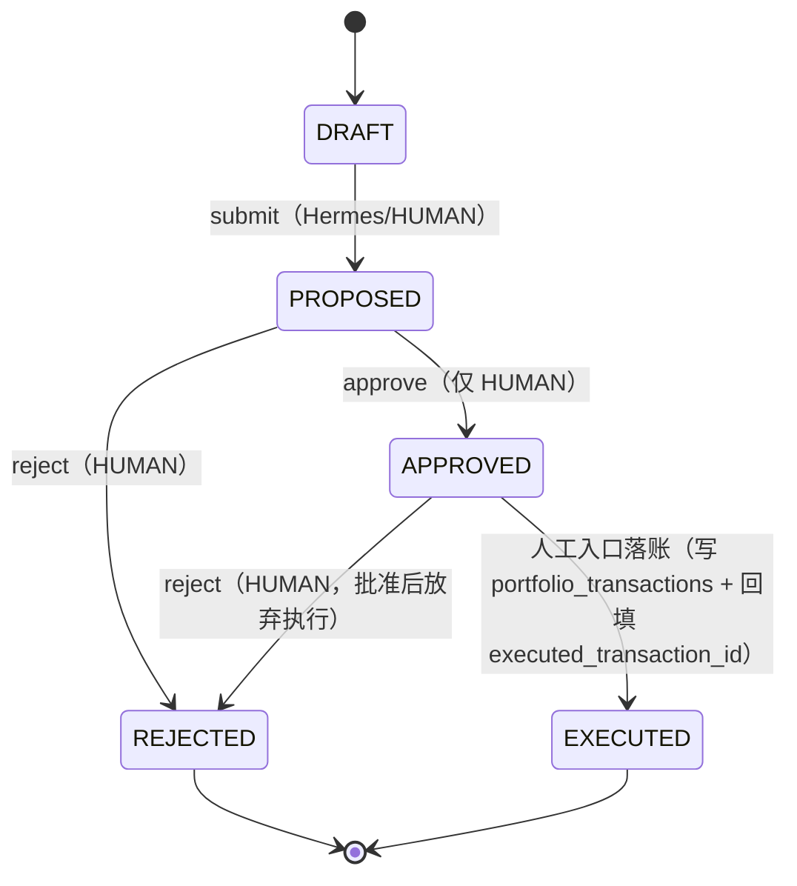

# Hermes Investment Office Technical Specification：Engine Contract 研究报告

> 状态：**DRAFT v0.1（契约内容已对齐冻结规范 v1.0 与 ts01/ts02/ts04/ts05；正式冻结条件见 §11）**
>
> 输入：TS-01 Domain Model Specification（ts01.md）、TS-02 PostgreSQL ERD（ts02.md）、TS-04 Data Contract（ts04.md）、TS-05 Provider Architecture（ts05.md）、[《后端架构冻结规范 v1.0 Consolidated》](Hermes_Investment_Office_后端架构冻结规范_v1.0_Consolidated.md)、[《Architecture Benchmark v1.0 Consolidated》](Hermes_Investment_Office_Architecture_Benchmark_v1.0_Consolidated.md)
>
> 定位：TS-06 冻结**所有确定性计算引擎的外部契约**——输入 / 输出 / 前置条件 / 错误语义 / 可复现性。**不包括内部算法细节**（实现留给施工），但**必须冻结工程范式**（无默认参数、Assumption 携带 basis、黄金值测试要求）。本文件只做设计规范，不产生实现代码。

## 1. 执行摘要

### 1.1 引擎层在架构中的位置

TS-01 冻结了领域语义（thesis-centric / ledger-centric / provenance-first），TS-02 冻结了 PostgreSQL 物理 Schema（40 张表 / 9 个表族），TS-04 冻结了数据契约（五层：PG Schema / Parquet Schema / 语义 / 质量 / Freshness），TS-05 冻结了 Provider 架构（归一化事实的入口墙）。TS-06 冻结的是它们之上的一层：**确定性计算引擎的外部契约**。

引擎层是"事实与计算平面"（Investment Backend）的确定性计算层。冻结规范 §4.2 已经给出最根本的责任划分：

> **Hermes 负责提出假设、解释结果、比较情景；Backend 的确定性代码负责一切会影响投资判断的精确计算。**

TS-06 把这条架构原则变成六个引擎的可施工契约。引擎层在数据流中的位置：

```text
Provider 层（TS-05）
    │  归一化事实（MarketBar / FinancialFact / NAV / FX / 持仓快照）
    │  + provenance 链（provenance_records）
    ▼
PG（指针/元数据/业务状态） + Parquet（时间序列全量）   ← TS-02 / TS-04
    │
    ▼
Deterministic Engines（本文件 TS-06）
    ├── Valuation Engine       → valuation_runs / valuation_assumptions / valuation_input_refs
    ├── ETF Engine             → etf_metric_snapshots / 穿透 exposure
    ├── Portfolio Engine       → position_snapshots / portfolio_snapshots / 收益
    ├── Risk Engine            → 风险指标（exposures / risk_summary）
    ├── FX Engine              → fx_contribution / premium attribution（仅 QDII 分析）
    └── Anomaly Detection      → attention_items（确定性规则）
    │
    ▼
Daily Context Builder → Hermes Cron（仅 LLM 阶段，只解释不计算）
```

### 1.2 六大引擎总览

| 引擎 | 核心职责 | 主要输出落点（ts02 表） | 计算性质 |
|---|---|---|---|
| Valuation Engine（TS-06.2） | 个股客观估值层 + 内在价值层（可复现估值） | `valuation_runs`、`valuation_assumptions`、`valuation_input_refs` | 同步点查 / job 批量 |
| ETF Engine（TS-06.3） | ETF 独立估值体系、穿透分级、QDII 指标、指数估值带 | `etf_metric_snapshots` | 同步点查 / job 批量 |
| Portfolio Engine（TS-06.4） | Ledger replay、成本、收益、快照、Trade Proposal 状态机 | `position_snapshots`、`portfolio_snapshots`、`trade_proposals` | 同步点查 / 事件驱动 |
| Risk Engine（TS-06.5） | 集中度 / 暴露 / 回撤 / 相关性 / 现金比 / 估值集中度 | `portfolio_snapshots.risk_summary`、`exposures` | job 批量（EOD） |
| FX Engine（TS-06.6） | QDII 折溢价归因、汇率贡献拆分、NAV 归因 | `etf_metric_snapshots.fx_contribution` | 同步点查 / job |
| Anomaly Detection（TS-06.7） | 确定性 Attention 规则引擎 | `attention_items` | job 批量（Daily Pipeline） |

**边界纪律**：六个引擎全部是**只读消费者**（消费归一化事实 + provenance）与**派生事实生产者**（写出带 DERIVED_ENGINE provenance 的结果）。引擎**不写**任何上游事实表（`market_bar_index`、`financial_facts`、`etf_nav_observations`、`fx_observations`、`portfolio_transactions` 等），也不反向依赖 Provider 层（ts05 §P1：`valuation/portfolio/risk` 禁止 import `providers.*`）。

### 1.3 共同工程范式（冻结，来自 Benchmark 对 Vibe-Trading quantlib 的审计）

Architecture Benchmark §7.3 对 Vibe-Trading `agent/src/quantlib/valuation/`（dcf.py / comps.py / threestatement.py / contracts.py）的代码级审计，给出了与本架构最契合的工程范式。TS-06 将其提升为**全部六个引擎的强制工程范式**，而非仅 Valuation Engine 的建议：

| # | 范式 | 冻结语义 | 违反后果 |
|---|---|---|---|
| E1 | **无默认参数** | 无风险利率、beta、ERP、税率、wacc、terminal_growth、exit_multiple 等一切经济参数**全部 required**；缺失 → typed error（`MissingInputError`），调用方精确知道缺什么 | 返回建立在猜测上的数字 = 架构违规（架构测试拦截） |
| E2 | **缺失即 typed error** | 必需输入缺失必须显式失败（ValuationRun → `BLOCKED_MISSING_INPUT`），绝不自动补默认值（**绝不自动补 `wacc=8%`**） | 静默补值 = 违反 ts01 §1.6 / 冻结规范 §22 |
| E3 | **Assumption 携带 basis** | 一切假设必须是结构化对象（name/value/unit/basis/source_tags），**拒绝裸 float**——"估值观点穿着常量外衣"反模式被显式禁止 | 裸 float 假设在数据校验层拒绝 |
| E4 | **输入冻结** | 每次计算前将输入集冻结为不可变快照（input_hash + 输入引用），PIT 过滤后进入计算 | 无冻结证明的估值不可复现 |
| E5 | **结果不可变** | `COMPLETED` 后结果 / 假设 / 输入引用 / engine_version 全部禁止修改；新假设 = 新 Run | 服务层拒绝 + append-only 触发器兜底（ts02 §10） |
| E6 | **engine_version 可复现** | 每个输出必须携带 engine_version；同一版本 + 同一输入 → 同一输出（黄金值测试的根基） | 版本缺失 → 可复现性验收失败 |
| E7 | **禁止吞异常** | 禁止 `except: pass` 吞异常（FinRobot 教学/演示级反模式，Benchmark §8.2）；错误必须 typed、可审计（job_runs.error / audit_events） | 静默吞异常 = 数据质量检查 FAILED |
| E8 | **黄金值测试** | 每个引擎每个计算路径至少一组黄金值（输入表 → 期望输出），定点语义（PG NUMERIC）保证确定性 | 无黄金值 → 该路径不可合入 |

> **引用来源**：无默认参数、终值双方法交叉验证、growth>=WACC 直接拒绝、Assumption 携带 basis、equity bridge 符号约定、WACC 权重 basis 显式参数、contracts.py 契约层（Assumption / MissingInputError / ValuationError / require_inputs / require_positive）——全部来自 [Architecture Benchmark §7.3](Hermes_Investment_Office_Architecture_Benchmark_v1.0_Consolidated.md)；`except: pass` 反模式来自 FinRobot Review §8.2。

### 1.4 硬性一致性约束（违反即返工）

本文件全部契约与 ts01/ts02/ts04 严格对齐，以下为全文件强制清单：

```text
表名（PG）：valuation_runs  valuation_assumptions  valuation_input_refs
            etf_metric_snapshots  position_snapshots  portfolio_snapshots
            portfolio_transactions  trade_proposals  attention_items
            fx_observations  corporate_actions  provenance_records  job_runs

枚举：
  ValuationRunStatus = CREATED / VALIDATING / BLOCKED_MISSING_INPUT / RUNNING / COMPLETED / FAILED / SUPERSEDED
  QuotaStatus        = NOT_APPLICABLE / UNKNOWN / OPEN / RESTRICTED / SUSPENDED
  TradeProposalStatus= DRAFT / PROPOSED / APPROVED / REJECTED / EXECUTED
  TransactionType    = BUY / SELL / DIVIDEND / FEE / CASH_IN / CASH_OUT
  FreshnessStatus    = OK / WARNING / STALE / FAILED
  DataQualityStatus  = VERIFIED / ACCEPTABLE / STALE / CONFLICT / REJECTED
  InstrumentType     = CN_EQUITY / CN_ETF / INDEX
  SourceKind         = OFFICIAL_FILING / EXCHANGE / PROVIDER / HUMAN / HERMES / DERIVED_ENGINE
  CorporateActionType= DIVIDEND / SPLIT / BONUS_SHARE / RIGHTS_ISSUE
  CorporateActionStatus = ANNOUNCED / IMPLEMENTED / ADJUSTED
```

不可谈判项（贯穿全文件）：

1. **引擎输出必须携带 provenance（`source_kind=DERIVED_ENGINE`）+ engine_version + input_hash**；禁止无 provenance 输出；
2. **QDII 一律表示为 `CN_ETF + is_qdii + underlying_index_id`**，不新增 `US_ETF`；组合 CNY 单币种；FX 仅分析，不进组合折算；
3. **无默认参数原则贯穿所有引擎**；禁止 `except: pass`；禁止 LLM 计算（冻结规范 §4.2 / §21）；
4. **可复现三要素**：assumptions + engine_version + as_of（+ input_snapshot_hash 增强，ts02 §6.3）；
5. **decision-sensitive 输出拒绝 CONFLICT / REJECTED / STALE 输入**（ts01 §1 验证规则 / ts04 §7.6）。

---

## 2. 引擎公共契约（TS-06.1）

本节定义六个引擎共享的公共契约。各引擎专用契约见 §3–§8。

### 2.1 engine_version 规范（冻结）

#### 2.1.1 命名与语义化版本

引擎标识采用 `<engine-name>/<semver>` 格式，`engine-name` 全局唯一：

```text
valuation-engine/0.1.0
etf-engine/0.1.0
portfolio-engine/0.1.0
risk-engine/0.1.0
fx-engine/0.1.0
attention-engine/0.1.0
```

semver 语义（`MAJOR.MINOR.PATCH`）：

| 位 | 触发条件 | 示例 |
|---|---|---|
| MAJOR | 输入契约破坏性变更（必需输入集合改变、输入 schema 改变、单位语义改变）、输出契约破坏性变更（结果结构/字段语义改变）、算法语义根本改变（如估值带边界口径变化） | `valuation-engine/1.0.0` |
| MINOR | 向后兼容的新能力：新增 model_type、新增指标、新增可选输出字段 | `valuation-engine/0.2.0` |
| PATCH | 纯 bug fix，不改变任何已定义输入下的输出语义（修复不改变结果的数值实现错误） | `valuation-engine/0.1.1` |

#### 2.1.2 版本变更纪律（冻结）

1. **任何算法变更、输入契约变更、输出契约变更必须升版本并 ADR 记录**——即使只是"我们认为算得更准了"（ts01 §49.3 变更流程）；
2. 同一 `engine_version` 下，同一输入必须产生同一输出（黄金值测试强制，见 §2.6）；
3. 引擎版本写入位置（与 ts02 对齐）：
   - `valuation_runs.engine_version`（NOT NULL）
   - `etf_metric_snapshots.engine_version`（NOT NULL）
   - `position_snapshots.engine_version`、`portfolio_snapshots.engine_version`（NOT NULL）
   - `daily_contexts.engine_versions`（JSONB，参与当日计算的引擎版本快照）
   - 引擎输出自带的 `engine_version` 字段（MCP 响应可见）
4. **禁止"版本内静默改公式"**：同一版本输出语义漂移 = 违反 E6，架构测试（TS-08）以黄金值回归拦截；
5. 历史输出引用旧版本：`valuation_runs` 保留 `engine_version` 列，查询历史估值时必须按该列选择对应公式语义（引擎实现必须支持按版本解析，禁止"新代码读旧 run 后按新公式解释"）。

### 2.2 输入契约（冻结）

#### 2.2.1 输入来源：只消费归一化事实

引擎**只消费归一化事实**，输入必须满足以下形状（三条路径，全部携带 provenance）：

```text
① PG 业务状态 / 元数据：   instruments / etf_profiles / market_bar_index（指针）/
                          financial_facts（PIT 行） / etf_nav_observations /
                          etf_holding_snapshots（header） / fx_observations /
                          corporate_actions / trading_calendar
② Parquet 时间序列（经版本感知视图，ts04 §2.6）：ohlcva/v1 / financial_history/v1 /
                          etf_holdings/v1 / index_history/v1
③ provenance 链：          provenance_records（每个事实行通过 provenance_id 引用）
```

**禁止**：

- 直接消费 provider schema（TuShare/AkShare/Yahoo 字段名、单位、代码格式——ts05 §P1 无 schema 泄漏）；
- 绕过 PG 指针直接读裸 Parquet 路径（ts04 §2.6.1：业务代码禁止硬编码 `v1` 路径字符串）；
- 依赖 provider 返回顺序、字段别名、隐式单位约定。

#### 2.2.2 输入获取标准路径（冻结）

引擎读取事实必须走 ts04 §2.6.3 标准路径：

```text
① PG 定位：按 instrument_id + 日期 + provider 查指针表（market_bar_index / financial_facts / …）
② 质量过滤：quality_status NOT IN ('CONFLICT','REJECTED')
            （decision-sensitive 场景还须排除 STALE，见 §2.2.3）
③ DuckDB 读取：read_parquet(<parquet_path>) 或 PIT 查询
④ 血缘回填：结果携带 provenance_id → provenance_records
```

PIT 过滤（ts04 §5.2，强制）：所有历史输入必须经过 `as_of` 过滤——`published_at <= as_of`（financial_facts / financial_history）、`trade_date <= as_of`（ohlcva）、`snapshot_date <= as_of`（position/portfolio snapshots）。**禁止在引擎内部绕过 PIT 过滤**（look-ahead 防护由数据访问层强制执行，引擎不得自行拼装"不过滤"查询）。

#### 2.2.3 输入质量门禁（冻结）

引用输入时，按以下规则判定可用性：

| 输入 provenance 状态 | 普通输出 | decision-sensitive 输出 |
|---|---|---|
| `VERIFIED` | 可用 | 可用 |
| `ACCEPTABLE` | 可用，输出携带质量标注 | 可用，输出携带质量标注（`quality_status=ACCEPTABLE`） |
| `STALE`（读时派生） | 可用（PIT 历史查询） | **拒绝作为当前决策依据**；只允许 PIT 历史复现 |
| `CONFLICT` | 拒绝产出 VERIFIED 结果 | **拒绝**（ts01 §1 / ts02 §4.1） |
| `REJECTED` | 拒绝 | **拒绝**（不可逆） |

**Freshness 联动**（ts04 §7.5 域级门禁）：`data_freshness != OK` 时——

| 域状态 | 受影响引擎 | 行为 |
|---|---|---|
| market = STALE | Valuation（current_price 输入）、Portfolio（市值） | 拒绝产出 VERIFIED 快照/估值 |
| fundamental = STALE | Valuation（财务输入） | 拒绝使用旧版本做决策敏感估值 |
| etf_nav / index / fx 任一 STALE | ETF Engine（QDII） | premium_discount / fx_contribution 置 NULL + 时间对齐 flag |
| quota = UNKNOWN | ETF Engine | 禁止假装 OPEN，标记 UNKNOWN |
| etf_holdings = STALE | Risk Engine（穿透） | 穿透结果禁止声称 current |

#### 2.2.4 输入冻结与 input_hash（冻结）

每次计算前，引擎将**实际使用的输入集**冻结为不可变快照：

```text
input_hash = sha256(规范化输入集的规范序列化)
```

- 规范化序列化必须**确定**：所有输入按固定规则排序（instrument_id → 日期 → 字段名），数值使用定点/规范表示（禁止浮点序列化歧义）；
- `input_hash` 写入所有引擎输出（`valuation_runs.input_snapshot_hash`、`etf_metric_snapshots.input_hash` 等）与 MCP 响应；
- Valuation Engine 额外写 `valuation_input_refs`（input_type / object_id / object_version / object_hash，ts02 §6.3）作为**更强的输入冻结证明**（防"当时数据后来被 supersede 导致的复现漂移"，ts02 §6.3）；
- **input_hash 的语义**：hash 的是"引擎实际消费的归一化事实集合 + 假设 + 参数"，不是"原始 provider payload"。provider payload 的 hash 由 provenance_records.raw_hash 承担。

### 2.3 输出契约（冻结）

#### 2.3.1 输出包络（EngineOutputEnvelope）

所有引擎的对外输出（MCP 响应、API 响应、写入 PG 的结果行）必须携带统一包络：

```json
{
  "engine": "valuation-engine",
  "engine_version": "valuation-engine/0.1.0",
  "as_of": "2026-08-23T10:30:00+08:00",
  "input_hash": "sha256:…",
  "provenance": {
    "provenance_id": "uuid",
    "source_kind": "DERIVED_ENGINE",
    "source": "valuation-engine",
    "provider": "internal",
    "observed_at": "2026-08-23T10:30:01+08:00",
    "retrieved_at": "2026-08-23T10:30:01+08:00",
    "as_of_date": "2026-08-23",
    "quality_score": 1.0,
    "quality_status": "VERIFIED",
    "quality_flags": [],
    "fallback_used": false,
    "transform_version": "valuation-engine/0.1.0"
  },
  "data": { }
}
```

契约规则：

1. `source_kind` 恒为 `DERIVED_ENGINE`（ts01 枚举）；`provider` 恒为 `internal`；`transform_version` 恒等于 `engine_version`；
2. `quality_status` 继承自输入质量判定（§2.2.3）：输入全 VERIFIED → `VERIFIED`；含 ACCEPTABLE → `ACCEPTABLE`；触发质量门禁 → 拒绝产出 VERIFIED 结果；
3. `quality_flags` 用于携带计算侧 flag（如 `NAV_TIME_ALIGNMENT_FAILED`、`ESTIMATED_VALUE`、`FX_MISSING`）；
4. `as_of` 是**语义日期/时点**，各引擎按其语义解释（Valuation = 估值基准时点；ETF = 计算时点 + 四日期并存；Portfolio = 快照时点）；
5. 派生结果写入 PG 时，`provenance_id` 必须引用一条实际落库的 `provenance_records` 记录（`source_kind=DERIVED_ENGINE`），与业务行同事务提交（ts02 §12.1）。

#### 2.3.2 decision-sensitive 输出规则（冻结）

下列输出被判定为 decision-sensitive，适用 §2.2.3 门禁与 §2.3.1 包络：

```text
ValuationRun 全部结果（bear/base/bull/margin_of_safety）
etf_metric_snapshots 全部指标（premium_discount / fx_contribution / 估值带 / 指数指标）
position_snapshots / portfolio_snapshots（持仓、成本、市值、收益、NAV）
Risk 指标（集中度、暴露、回撤、相关性、现金比、估值集中度）
attention_items 触发判定（threshold 比较结果）
Trade Proposal 相关计算（target_weight 规则计算，冻结规范 §4.2）
```

**禁止无 provenance 输出**：任何 decision-sensitive 结果缺少 provenance / input_hash / engine_version 之一 → 输出层拒绝返回（架构测试拦截）。

### 2.4 错误契约（冻结）

#### 2.4.1 typed error 层级

全部引擎共享同一错误层级（继承自 Benchmark §7.3 contracts.py 思想，扩展为全引擎）：

```text
EngineError                                  ← 基类（携带 engine / engine_version / request_id）
├── MissingInputError                        ← 必需输入缺失（E2）
│     └── MissingValuationInputError         ← Valuation 假设/输入缺失（映射 BLOCKED_MISSING_INPUT）
│     └── MissingFxInputError                ← QDII 所需 FX 缺失
├── InvalidInputError                        ← 输入存在但非法（负数价格、单位不符、枚举越界）
│     └── InvalidAssumptionError             ← 假设值非法（如 wacc <= 0、g >= wacc）
├── ValuationError                           ← 估值计算语义错误
│     └── TerminalValueUndefinedError        ← growth >= wacc（终值未定义，不是"很大"）
│     └── TerminalValueCrossCheckError       ← 终值双方法交叉验证不通过
├── TimeAlignmentError                       ← QDII 时序无法对齐（NAV/index/FX 配对失败）
├── InsufficientDataError                    ← 数据量不足（历史分位窗口不足、收益率序列不足）
├── DataQualityError                         ← 输入触发质量门禁（CONFLICT/REJECTED/STALE）
├── ProvenanceError                          ← 输入缺失 provenance / provenance 引用断裂
├── UnsupportedModelError                    ← model_type 不在引擎支持清单
└── EngineVersionMismatchError               ← 输入快照的 engine_version 与当前解析器不一致
```

契约规则：

1. **错误必须 typed**：调用方（MCP 层 / Job 层）必须能精确判断"缺什么、为什么失败、如何恢复"，禁止返回笼统字符串；
2. **禁止 `except: pass` 吞异常**（E7）：引擎内部任何异常必须向上传播为 typed error 或写入 `job_runs.error` + audit（FinRobot 反模式，Benchmark §8.2）；
3. 错误映射到持久化状态：
   - `MissingValuationInputError` → `valuation_runs.status = BLOCKED_MISSING_INPUT`（ts01 §1.4 状态机）；
   - `InvalidInputError` / `ValuationError` / `TerminalValueUndefinedError` / `DataQualityError` → `valuation_runs.status = FAILED`（VALIDATING 阶段失败）；
   - Job 内错误 → `job_runs.status = FAILED`，`error` 列记录 typed error 码 + 消息（ts02 §8.3 / 冻结规范 §35.4）；
4. **缺口语义不是错误**（ts04 §5.3 / 冻结规范 §15）："财报该披露尚未披露"= 无行（正常状态）、停牌/无成交 = 显式标记（`GAP_BAR`/`NO_TRADING` flag）、时间对齐失败 = `NULL + flag`。这些**禁止**抛异常、禁止产生 `job_runs.status=FAILED`；
5. 错误消息不得泄漏 SQL / 表名 / provider 细节到 MCP 层（与 ts01 §1.6 验收一致）。

#### 2.4.2 错误码与 HTTP/MCP 映射（建议）

| 错误 | 建议 HTTP | MCP error.code |
|---|---|---|
| MissingInputError（Valuation） | 200 + `status=BLOCKED_MISSING_INPUT`（业务态）或 422 | `MISSING_VALUATION_INPUT`（对齐 ts01 §1.6） |
| InvalidInputError | 422 | `INVALID_INPUT` |
| DataQualityError | 409 | `INPUT_DATA_QUALITY_BLOCKED` |
| TimeAlignmentError | 200 + `data=null` + `quality_flags`（业务态，非错误） | `NAV_TIME_ALIGNMENT_FAILED`（flag，不抛错） |
| UnsupportedModelError | 422 | `UNSUPPORTED_MODEL_TYPE` |
| 未知异常 | 500 | `ENGINE_INTERNAL_ERROR`（audit 必记录） |

> 注意：`TimeAlignmentError` 作为 typed error 类型存在（用于引擎内部强制校验路径），但**对外业务表达**是 `NULL + NAV_TIME_ALIGNMENT_FAILED flag`（ts01 §1.6 冻结：比返回假精确值安全），不视为 HTTP 错误。

### 2.5 运行模式（冻结）

每个引擎支持**双运行模式**，引擎本身无状态、可重入：

| 模式 | 触发方 | 语义 | 典型场景 |
|---|---|---|---|
| **同步（点查）** | MCP / API 请求 | 同步阻塞返回（或有限超时内），直接消费当前已入库事实 | `run_valuation`、`get_etf_metrics`、`get_portfolio`、`get_portfolio_risk` |
| **job（批量）** | Backend Scheduler（APScheduler） | 后台 job，批量 EOD 计算，结果写 PG + provenance | `valuation_job`、`risk_job`、ETF 指标批量刷新 |

契约规则：

1. **引擎无状态**：不持有跨请求会话状态；所有输入显式传入（参数 + 事实引用），禁止依赖隐式全局状态（执行顺序、环境变量、缓存内容不得影响结果语义——结果确定性只由输入 + engine_version 决定）；
2. **可重入 / 幂等**：同一输入集重复调用必须产生同一结果（黄金值测试）；job 模式支持幂等重跑（§9.3）；
3. 同步模式超时策略：见 §3.8（Valuation）与各引擎专用契约；
4. 同步模式与 job 模式**共享同一计算核心**（同一 engine_version），不允许两种模式存在两套公式实现（双实现 = 复现漂移风险，架构测试拦截：同一输入经两模式输出必须一致）。

### 2.6 黄金值测试总纲（冻结）

1. **定义**：黄金值 = 一组冻结的 `(输入表 → 期望输出)` 用例，输入表显式列出全部输入（事实值 + 假设 + 参数 + engine_version），期望输出显式列出全部输出字段（含中间关键量）；
2. **覆盖要求**：每个引擎的**每个计算路径**至少一组黄金值（Valuation 每个 model_type、ETF 每个指标类别、Portfolio replay/成本/收益、Risk 每个指标、FX 拆分、Attention 每条规则类型）；
3. **执行**：TS-08 Test Matrix 消费黄金值要求；CI 强制——黄金值回归失败 = 版本不得发布；
4. **定点语义**：黄金值使用 PG `NUMERIC` 定点语义（ts02 §1.2），分析层 DOUBLE 计算须通过容差测试保障（ts04 §2.2），但**黄金值断言必须基于定点结果**；
5. **可复现三要素**：黄金值用例必须同时固定 assumptions + engine_version + as_of（+ input_snapshot_hash），三者齐备（ts02 §6.3）——黄金值本身就是可复现性的机器证明。

---

## 3. Valuation Engine Contract（TS-06.2，最核心）

### 3.1 定位与职责边界

Valuation Engine 是**确定性估值引擎**（冻结规范 §22），把 Hermes 提出的假设（Revenue CAGR / Terminal Growth / Discount Rate / Operating Margin 等）与归一化事实（价格、财务事实）组合为**可复现、不可变的 ValuationRun**。

职责：

```text
Objective Valuation Layer（客观估值层）   —— 事实驱动的估值指标（无需主观假设）
Intrinsic Value Layer（内在价值层）      —— 假设驱动的估值模型（bear/base/bull）
```

**禁止**：

- 由 LLM 直接产出估值数字（冻结规范 §4.2 / §21）；
- 在引擎内部补充缺失的经济参数（E1/E2：无默认参数）；
- 修改或"修正"输入事实（引擎只读事实，纠错走 Data Service 的 supersede 路径，ts02 §4.3）；
- 对 `COMPLETED` 的 Run 做任何 UPDATE（E5，ts02 §6.1 不可变性）。

### 3.2 两个层次（冻结）

#### 3.2.1 Objective Valuation Layer（TS-06.2.1）

自动计算以下指标（冻结规范 §22.1），全部**事实驱动**（输入为归一化事实，无主观假设；参数仅限回看窗口等中性参数）：

| 指标 | 公式语义（冻结） | 必需输入（归一化事实） | 输出字段（建议） |
|---|---|---|---|
| PE | `current_price / EPS`；EPS 取最新可得报告期年化值（TTM 优先，无 TTM 时取最新 FY，须在输出中标注口径） | `ohlcva.close`、`NET_INCOME`、`SHARES_OUTSTANDING` | `pe`, `eps`, `pe_basis`（`TTM`/`FY`） |
| PB | `current_price / BVPS`；BVPS = `TOTAL_EQUITY / SHARES_OUTSTANDING` | `close`、`TOTAL_EQUITY`、`SHARES_OUTSTANDING` | `pb`, `bvps` |
| EV/EBITDA | `EV = 市值 + DEBT − CASH`；`EBITDA` 需 `OPERATING_INCOME + D&A`（**D&A 不在 ts02 冻结 metric 清单内**，见 §11 开放问题 #1；v0.1 在 D&A 缺失时必须输出 `quality_flags=['EBITDA_APPROX_EBIT']` 或拒绝，二选一由配置决定，禁止静默近似） | `close`、`SHARES_OUTSTANDING`、`DEBT`、`CASH`、`OPERATING_INCOME` | `ev`, `ebitda`, `ev_ebitda` |
| FCF Yield | `FREE_CASH_FLOW / 市值` | `FREE_CASH_FLOW`、`close`、`SHARES_OUTSTANDING` | `fcf_yield`, `fcf` |
| Dividend Yield | `过去 12 个月已实施现金分红总额 / 市值`（分红数据来自 `corporate_actions`（DIVIDEND、IMPLEMENTED/ADJUSTED）聚合，**不来自 LLM**） | `close`、`SHARES_OUTSTANDING`、`corporate_actions` | `dividend_yield`, `dividend_12m_cny` |
| Historical Valuation Percentile | `当前 PE 在回看窗口（参数化，默认 5 年，`percentile_window_years=5`）内的历史分位`；窗口内交易日数不足 `min_obs=120` 时 → `InsufficientDataError` 或输出 NULL + flag | 历史 `close` + 历史财务（PIT 重建的历史 PE 序列） | `pe_percentile`, `pb_percentile`, `window_start` |

契约规则：

1. **客观层不需要假设**，但需要**口径声明**：`pe_basis`、`percentile_window` 等口径必须随输出携带（黄金值锁定）；
2. 历史估值分位必须**PIT 重建**（ts04 §5）：历史某日的 PE 用"当日可见"的价格与财务（`published_at <= 当日`），禁止用今天的财务回填昨天的 PE（look-ahead，ts04 §5.4）；
3. 客观层指标**不是**估值结论，是估值输入/参考；估值带语义只属于 ETF Engine 的指数估值（§4.6）与 Intrinsic 层的 bear/base/bull 输出；
4. `Dividend Yield` 若 12 个月无已实施分红：输出 `0` + `dividend_12m_cny=0`，不视为错误（缺口语义）；数据源不可得（corporate_actions 无数据）→ NULL + `DIVIDEND_DATA_MISSING` flag。

#### 3.2.2 Intrinsic Value Layer（TS-06.2.2）

支持五种 model_type（ts02 §6.1 CHECK 约束冻结）：`DCF / DDM / OWNER_EARNINGS / COMPARABLE / SCENARIO`。

| model_type | 方法语义（冻结） | 必需假设（无默认值） | 必需事实输入 |
|---|---|---|---|
| `DCF` | 预测期自由现金流折现 + 终值（永续增长法 & 退出倍数法双方法，§3.5） | `wacc`、`terminal_growth`、预测期现金流（显式 FCF 序列**或**驱动假设：`revenue_cagr`、`operating_margin`、`capex_ratio`、`tax_rate`——**二选一必须显式，禁止混合默认**） | 历史 `FREE_CASH_FLOW`（验证/基准）、`SHARES_OUTSTANDING` |
| `DDM` | 预测期每股股利折现 + 终值 | `discount_rate`（权益要求回报率）、`terminal_growth`、每股股利预测（`dividend_per_share_0` + 增长率或显式序列） | 历史 `corporate_actions` DIVIDEND（基准）、`SHARES_OUTSTANDING` |
| `OWNER_EARNINGS` | Owner Earnings = 净利 + 非现金费用 − 维护性资本开支；按永续或倍数估值 | `owner_earnings`（显式或 `net_income`+`dca`+`maintenance_capex` 驱动）、`wacc`（永续法）或 `target_multiple`（倍数法）、`terminal_growth`（永续法） | `NET_INCOME`、`FREE_CASH_FLOW`（基准） |
| `COMPARABLE` | 可比公司倍数估值：目标公司 `target_metric` × 倍数（PE/EV/EBITDA 等） | `target_multiple`（及 `target_multiple_basis`，如 `peer_median_pe`）、`peer_set`（可选）、溢价/折价 `premium_discount`（可选，显式 0 合法） | `NET_INCOME` / `EBITDA` 等目标指标、`close` |
| `SCENARIO` | 情景加权：bear/base/bull 情景各自给出现金流路径与概率 | 每个情景的现金流/收益序列 + 概率（`p_bear`+`p_base`+`p_bull` = 1，**概率缺失 → MissingInputError**；加权可为无概率的三点区间——`p` 全缺 = 等权，须显式声明） | 各情景所需事实 |

契约规则：

1. **每个 model_type 的输出必须至少包含 bear/base/bull**（冻结规范 §22.2）；
2. `COMPARABLE` 的 `peer_set` 若未提供：必须显式声明 `target_multiple_basis`（如 `analyst_judgment`），禁止"默认取行业平均"之类的隐式行为；
3. `SCENARIO` 若提供概率：`p_bear + p_base + p_bull` 必须等于 1（容差 1e-6，超出 → `InvalidAssumptionError`）；概率缺失且未声明"等权" → `MissingInputError`；
4. **WACC 权重 basis 显式参数**（Benchmark §7.3）：使用 WACC 的模型必须显式声明 `wacc_weight_basis`（`CURRENT_MARKET_VALUES` / `TARGET_MARKET_VALUES`），禁止隐式选择；
5. 模型输出 `currency=CNY`（组合单币种冻结）；任何模型不得引入外币估值路径。

### 3.3 输入契约（TS-06.2.3）

#### 3.3.1 必需输入清单（冻结）

每次 Run 的必需输入分三类：

```text
A. 标的与价格（全部必需）
   instrument_id（必须解析到 Instrument，instrument_type='CN_EQUITY'；CN_ETF 走 ETF Engine，见 §4.2 边界）
   as_of（估值基准时点）
   current_price（as_of 时点 A 股收盘价；来自 ohlcva，PIT 过滤）

B. 财务事实（按 model_type 必需，PIT 过滤 published_at <= as_of）
   NET_INCOME / SHARES_OUTSTANDING / TOTAL_EQUITY / DEBT / CASH /
   OPERATING_INCOME / FREE_CASH_FLOW / REVENUE / GROSS_PROFIT …
   （客观层指标各自按 §3.2.1 表格要求）

C. 假设（按 model_type 必需，无默认值，§3.4）
   wacc / terminal_growth / discount_rate / revenue_cagr / operating_margin /
   target_multiple / 概率 …（见 §3.2.2 表格）
```

#### 3.3.2 BLOCKED_MISSING_INPUT 语义（冻结）

- **校验时机**：`CREATED → VALIDATING` 阶段完成全部必需输入校验（ts01 §1.4 状态机）；
- **缺失行为**：任一必需输入缺失 → `MissingValuationInputError`（携带缺失字段清单）→ `valuation_runs.status = BLOCKED_MISSING_INPUT`；
- **绝不自动补默认值**：`wacc` / `terminal_growth` 缺失 → `MISSING_VALUATION_INPUT`，**绝不自动补 8%**（ts01 §1.6 / Benchmark §7.3 / E1/E2）；
- 状态机允许 `BLOCKED_MISSING_INPUT → VALIDATING`：显式补足输入后重试（ts01 §1.4）；
- **缺口语义边界**：财务事实"该披露尚未披露"（无行）与"假设未提供"（显式缺失）是**两种不同情况**——前者是合法状态（输出可降级为部分指标或 FAILED 按 model 定义），后者是 `BLOCKED_MISSING_INPUT`（必须补假设）。区分判据：假设永远不能"缺省存在"，事实可以"尚未披露"。

#### 3.3.3 输入质量与 PIT（冻结）

- 全部输入必须携带 provenance；`CONFLICT/REJECTED/STALE` 输入触发 §2.2.3 门禁；
- 财务事实 PIT：`published_at <= as_of`（ts04 §5.2），重述行按披露时点可见性处理（ts04 §5.4）；
- current_price 的 Freshness：`market` 域 STALE → 拒绝产出 VERIFIED 估值（ts04 §7.5）。

### 3.4 Assumption 契约（TS-06.2.4）

ValuationAssumption 是**结构化对象**，对齐 ts02 §6.2 `valuation_assumptions` 表；**拒绝裸 float**（E3 / Benchmark §7.3 / ts01 §1.4 代表性记录）。

```json
{
  "name": "terminal_growth",
  "value": 0.027,
  "unit": "ratio",
  "basis": "long_run_nominal_growth_assumption",
  "source_tags": ["thesis_rev_19", "macro_context"]
}
```

契约规则：

1. **字段**：`name`（run 内唯一，`UNIQUE (valuation_run_id, name)`，ts02 §6.2）、`value`（`NUMERIC(16,8)`）、`unit`（冻结枚举：`ratio` / `cny` / `percent` / `years` / `cny_per_share`）、`basis`（**NOT NULL**——假设依据，拒绝裸 float 的关键）、`source_tags`（JSONB 数组，可引用 `thesis_rev_<n>` 等）；
2. **unit 合法性**：`wacc`/`terminal_growth`/`revenue_cagr`/`operating_margin`/概率 → `ratio`（0–1 小数，ts04 §3.2 冻结约定）；`exit_multiple` → `ratio`（倍数无量纲）；金额类 → `cny`；`dividend_per_share_0` → `cny_per_share`；
3. **数值校验（拒绝非法假设）**：
   - `wacc <= 0` → `InvalidAssumptionError`；
   - `terminal_growth >= wacc` → `TerminalValueUndefinedError`（§3.5.2，终值未定义，不是"很大"）；
   - 概率和 ≠ 1（容差外）→ `InvalidAssumptionError`；
   - 负价格/负倍数 → `InvalidInputError`；
4. **假设必须可审计**：`basis` 必须是人可读的推断依据（如 `long_run_nominal_growth_assumption`、`analyst_assumption`、`thesis_rev_19` 引用），禁止空串；`source_tags` 用于关联 Thesis 版本、宏观上下文等；
5. **run 启动后假设不可修改**（E5 / ts02 §6.1）：需要新假设 = 新 Run（Run #41 wacc 9.1% → Run #42 wacc 9.4%，绝不 `UPDATE valuation_run_41 SET wacc=9.4%`）。

### 3.5 终值双方法交叉验证（TS-06.2.5，冻结）

适用于使用终值的模型（DCF / DDM / OWNER_EARNINGS 永续法）。**这是 Benchmark §7.3 冻结的硬性契约，不是建议。**

#### 3.5.1 双方法定义

```text
方法一（永续增长法 Gordon）：
  TV_gordon = FCF_n × (1 + g) / (wacc − g)
    其中 FCF_n 为预测期末自由现金流，g = terminal_growth

方法二（退出倍数法）：
  TV_multiple = exit_metric_n × exit_multiple
    其中 exit_metric_n 为预测期末指标（EBITDA / FCF / EPS 按 model 定义），
    exit_multiple 为显式假设（无默认值）
```

#### 3.5.2 交叉验证契约

1. **growth >= WACC → 直接拒绝**：`TerminalValueUndefinedError`（终值未定义，不是"很大"）——公式分母 ≤ 0 时永续法无数学意义（Benchmark §7.3 / E2）；
2. **互推隐含值**：由 `TV_gordon` 反推隐含退出倍数 `implied_exit_multiple = TV_gordon / exit_metric_n`；由 `TV_multiple` 反推隐含永续增长率 `implied_g = (TV_multiple / FCF_n − 1) × (wacc − 1) …`（实现侧定义精确反解公式，黄金值锁定）；
3. **交叉验证阈值**：`|implied_exit_multiple − exit_multiple| / exit_multiple` 或 `|implied_g − g|` 超过参数化阈值（建议 `terminal_crosscheck_tolerance=0.20`，即隐含值与显式值偏差 > 20% → 不通过）时：
   - 输出 `TerminalValueCrossCheckError`（FAILED）**或** 输出结果 + `quality_flags=['TERMINAL_VALUE_CROSSCHECK_FAILED']`（WARNING 降级）——**由配置决定，二选一，禁止静默**；
   - 语义（Benchmark §7.3 原话）："growth 隐含 35x EBITDA 即使 Gordon 公式算对了也是错的"；
4. **result_json 必须携带双方法明细**：`terminal_gordon_value`、`terminal_multiple_value`、`implied_exit_multiple`、`implied_g`、`crosscheck_result`（`PASS`/`FAIL`/`NOT_APPLICABLE`），供审计与黄金值断言。

### 3.6 输出契约（TS-06.2.6）

#### 3.6.1 必填输出字段（对齐 ts02 §6.1 `valuation_runs`）

```text
valuation_run_id      UUID（不可变）
instrument_id         UUID
model_type            DCF | DDM | OWNER_EARNINGS | COMPARABLE | SCENARIO
status                ValuationRunStatus
as_of                 TIMESTAMPTZ（估值基准时点）
engine_version        valuation-engine/<semver>
input_snapshot_hash   sha256
bear_value / base_value / bull_value   NUMERIC(18,4)（CNY）
current_price         NUMERIC(18,4)（as_of 时点市价，CNY）
margin_of_safety      NUMERIC(10,6)
result_json           JSONB（完整结果明细，见 §3.6.2）
created_by            HERMES | HUMAN | SYSTEM
created_at / completed_at
```

**margin_of_safety 公式（冻结）**：

```text
margin_of_safety = (base_value − current_price) / base_value
```

正值 = 当前价低于 base 内在价值（安全边际为正）；负值 = 当前价高于 base。黄金值锁定（ts02 §6.1 列语义）。

#### 3.6.2 result_json 结构（冻结）

```json
{
  "objective": {
    "pe": 23.5, "pe_basis": "TTM", "pb": 6.1, "ev_ebitda": 18.2,
    "fcf_yield": 0.031, "dividend_yield": 0.014,
    "pe_percentile": 0.42, "pb_percentile": 0.55,
    "percentile_window": {"years": 5, "min_obs": 120, "obs_used": 1210}
  },
  "intrinsic": {
    "method": "DCF",
    "values": {"bear": 72.4, "base": 91.8, "bull": 113.2},
    "terminal": {
      "gordon_value": 152300000000.0,
      "multiple_value": 149800000000.0,
      "implied_exit_multiple": 18.9,
      "implied_g": 0.0251,
      "crosscheck_result": "PASS",
      "crosscheck_tolerance_used": 0.20
    },
    "per_share": {"bear": 72.4, "base": 91.8, "bull": 113.2},
    "shares_outstanding": 1044000000
  },
  "summary": {
    "current_price": 74.9,
    "margin_of_safety": 0.184,
    "currency": "CNY"
  },
  "inputs": {
    "input_snapshot_hash": "sha256:…",
    "as_of": "2026-08-23T10:30:00+08:00",
    "engine_version": "valuation-engine/0.1.0"
  }
}
```

契约规则：

1. `result_json` 是**完整结果明细**，与 `valuation_runs` 的 `bear_value/base_value/bull_value` 列冗余但必须一致（黄金值同时断言列与 JSON）；
2. `per_share` 必须携带（`SHARES_OUTSTANDING` 是必需输入）；
3. 客观层与内在层的全部口径声明必须出现在 result_json（`pe_basis`、`percentile_window`、`crosscheck_tolerance_used` 等）；
4. `currency` 恒为 `CNY`。

#### 3.6.3 输出落库事务（冻结）

Run 完成 = 原子事务（ts02 §12.1）：`valuation_runs`（status=COMPLETED）+ `valuation_assumptions`（全部假设行）+ `valuation_input_refs`（全部输入引用）+ `provenance_records`（DERIVED_ENGINE）+ `audit_events`。**要么全成要么全败**；COMPLETED 后触发不可变约束（§3.6.4）。

#### 3.6.4 可复现性与不可变性（TS-06.2.7，冻结）

**可复现三要素**（ts02 §6.3 / 冻结规范 §22.3）：`assumptions（valuation_assumptions）+ engine_version + as_of_date` 齐备即任何历史估值可复现；`input_snapshot_hash` 与 `valuation_input_refs` 提供**更强的输入冻结证明**。

| 可复现证据 | 落点 | 强制 |
|---|---|---|
| assumptions | `valuation_assumptions`（run 内唯一、不可变） | 是 |
| engine_version | `valuation_runs.engine_version` | 是 |
| as_of | `valuation_runs.as_of` | 是 |
| input_snapshot_hash | `valuation_runs.input_snapshot_hash` | 是（增强） |
| valuation_input_refs | `valuation_input_refs`（input_type/object_id/object_version/object_hash） | 是（增强） |
| provenance | `provenance_records`（DERIVED_ENGINE，同事务） | 是 |

**不可变性（E5）**：`COMPLETED` 后以下全部禁止修改（服务层拒绝 + ts02 §10 append-only 触发器兜底）：

```text
assumption（valuation_assumptions）  ✗ UPDATE
input reference（valuation_input_refs） ✗ UPDATE
engine_version                      ✗ UPDATE
result（bear/base/bull/result_json） ✗ UPDATE
```

`SUPERSEDED` 由"更新的已批准 run"触发，旧 run 永久保留（ts01 §1.4）。

### 3.7 黄金值测试要求（TS-06.2.8，冻结）

1. **每个 model_type 至少一组黄金值**：`DCF`、`DDM`、`OWNER_EARNINGS`、`COMPARABLE`、`SCENARIO` 各一组（输入表 → 期望输出），另加：客观层指标一组（PE/PB/EV/EBITDA/FCF Yield/Dividend Yield/分位）、终值双方法交叉验证一组（含 FAIL 路径）、BLOCKED_MISSING_INPUT 一组（缺失 wacc → 断言状态与错误码）、growth>=WACC 拒绝一组；
2. 黄金值必须覆盖：bear/base/bull 数值、margin_of_safety、terminal 双方法明细、per_share、口径声明（pe_basis 等）；
3. **黄金值测试是模型合入门槛**：任一 model_type 无黄金值 → 该 model_type 不得发布（E8）；
4. 黄金值输入表必须携带 as_of 与输入快照（PIT 场景：历史 as_of 的黄金值验证 look-ahead 防护）。

### 3.8 MCP 触发语义（TS-06.2.9，冻结）

`run_valuation` 是**同步引擎调用**（ts01 §1.6 / 冻结规范 §32.3）：

| 属性 | 契约 |
|---|---|
| 同步 vs 异步 | **v0.1 冻结：同步 + 超时策略**（建议） |
| 超时策略（建议） | HTTP 层超时上限 `valuation_sync_timeout_ms=30000`；引擎内部分阶段超时（输入校验 ≤2s、计算 ≤20s、落库 ≤5s）；**超过上限 → 返回 `202 ACCEPTED` + `job_run_id`，转 job 模式异步完成**（调用方轮询 `get_job_status`，冻结规范 §32.8）；超时阈值参数化，不硬编码 |
| 输入 | `instrument_id` + `model_type` + `as_of` + `assumptions[]`（结构化对象，§3.4） |
| 输出 | 统一包络（§2.3.1）`data` = §3.6.2 result_json 摘要 + `valuation_run_id` + `status` |
| 缺失假设 | `error.code = MISSING_VALUATION_INPUT` + `field`（ts01 §1.6 示例），run 状态 `BLOCKED_MISSING_INPUT` |
| 幂等 | 同一请求重复提交：不创建重复 Run（幂等键 = request_id；重复请求返回同一 run 或 409，实现侧冻结） |
| 权限 | `run_valuation` 属 READ 级（创建 Run 本身是计算请求，非写业务状态；落库走引擎所有权，ts01 §1.3） |

> **v0.1 同步 + 超时的理由**：个人组合规模下点查估值应在秒级完成；同步返回让 Hermes 获得即时可解释结果；超时转 job 保证不阻塞 MCP 通道。若实测 P95 超过 30s，再整体改异步（ADR）。

---

## 4. ETF Engine Contract（TS-06.3）

### 4.1 定位与职责边界

ETF Engine 是**ETF 独立估值与分析引擎**（冻结规范 §23）。核心边界（冻结）：

> **ETF 必须独立于个股估值体系；禁止直接用公司 DCF 模型研究指数 ETF。**

ETF Engine 负责（冻结规范 §23）：

```text
valuation（估值带）   constituents（成分）   concentration（集中度）
sector_exposure（行业暴露）   overlap（重叠）   dividend（分红）
tracking（跟踪）   QDII 特有指标（premium_discount / fx_contribution /
quota_status / net_value_t1）   指数估值指标（Index PE/PB/ROE/DY/ERP/…）
```

**禁止**：对 `instrument_type='CN_ETF'` 调用 Valuation Engine 的 Intrinsic Value Layer（DCF 等）；CN_ETF 的估值研究一律走 ETF Engine（Valuation Engine 在输入校验时拒绝 CN_ETF，`UnsupportedModelError` 或明确指引到 ETF Engine）。

### 4.2 输入契约（TS-06.3.1）

| 输入 | 来源（ts02/ts04） | 用途 | 必需性 |
|---|---|---|---|
| ETF 市价 | `ohlcva/v1`（instrument_type='CN_ETF'）+ `market_bar_index` | 场内价格、溢价基准 | 必需 |
| NAV | `etf_nav_observations`（nav_date/nav/published_at） | 净值基准、net_value_t1、溢价计算 | 必需（QDII）；普通 ETF 可选 |
| 持仓 | `etf_holding_snapshots`（header）+ `etf_holdings/v1`（明细） | Level 1 穿透 | QDII/穿透必需 |
| 指数点位 | `index_history/v1`（underlying_index_id 指向的 INDEX）+ `market_bar_index` | QDII 归因、指数指标 | QDII 必需 |
| FX | `fx_observations`（USD/CNY） | fx_contribution、premium attribution | QDII 必需（缺失 → WARNING + flag，§7） |
| quota 事件 | `corporate_actions`/公告 provenance（额度公告） | quota_status | QDII 必需（无有效来源 → UNKNOWN） |
| 静态属性 | `instruments` + `etf_profiles`（is_qdii/underlying_index_id/fund_manager） | 识别 QDII、绑定指数 | 必需 |
| 交易日历 | `trading_calendar` | 时序对齐锚点（§4.7） | 必需 |

输入质量门禁：全部输入按 §2.2.3 执行；`etf_nav/index/fx` 任一 STALE → QDII 指标降级（NULL + flag，ts04 §7.5）；`etf_holdings` STALE → 穿透结果禁止声称 current。

### 4.3 穿透分级（TS-06.3.2，冻结，对齐冻结规范 §23.1）

| 级别 | 语义 | 数据来源 | as_of 依据 | confidence 语义 |
|---|---|---|---|---|
| **Level 0** | ETF 自身：价格、NAV、规模、折溢价 | `ohlcva` + `etf_nav_observations` | market_date / nav_date | 1.0（事实级，非估算） |
| **Level 1** | 最新披露持仓 | `etf_holding_snapshots` + `etf_holdings/v1` | **`disclosure_date`（披露日）** | 披露完整性（前十大 vs 全持仓） |
| **Level 2** | 估算 exposure（基于 L1 + 指数近似） | 引擎派生（L1 + `index_history` 权重近似） | L1 披露日 + 估算时点 | 估算模型 confidence（`ESTIMATED_VALUE` flag 必带） |

契约规则（全部冻结）：

1. **禁止假设实时穿透**：ETF 持仓明细只有定期披露，穿透分析是"基于最新披露持仓"的近似，不是实时（冻结规范 §23.1 原话）；
2. **所有穿透输出必须携带三元组 `as_of_date / source / confidence`**：
   - `as_of_date` = 持仓披露日（Level 1）/ 披露日 + 估算日（Level 2）；
   - `source` = `QUARTERLY/HALF_YEAR/ANNUAL/OTHER`（对齐 ts02 `etf_holding_snapshots.source`）；
   - `confidence` = 0–1 小数，Level 0=1.0，Level 1 按披露完整性（前十大 0.6、全持仓 0.9 等，参数化），Level 2 由估算模型定义；
3. **Level 1 的 as_of 以 `disclosure_date` 为准**（ts04 §2.4），不是 report_period、不是查询日；
4. **Level 2 输出必须携带 `quality_flags=['ESTIMATED_VALUE']`**（ts04 §6.3 编码清单）；
5. **Level 2 不进 `etf_holding_snapshots` 表**（ts04 §2.4：该表只存 L1）；L2 exposure 是引擎派生数据，落 `etf_metric_snapshots.exposures`（JSONB）或风险引擎的暴露结构；
6. **披露时滞可见**：最新披露持仓晚于查询日 N 天是常态（季报披露周期），穿透输出的 `as_of_date` 显式暴露该时滞，禁止用查询日冒充披露日。

**穿透示例（Level 2 语义）**：沪深300ETF（L1 披露茅台权重 w1）+ 消费ETF（L1 披露茅台权重 w2）+ 直接持有茅台 → 真实茅台暴露 = 直接持仓市值 + 沪深300ETF持仓×w1 + 消费ETF持仓×w2（Risk Engine 消费，§6.3）。

### 4.4 QDII 指标契约（TS-06.3.3，冻结）

#### 4.4.1 premium_discount（溢价率）

语义（ts01 §5 冻结）：`premium_discount = 场内价格相对"对应口径参考净值"的偏离`。

```text
premium_discount = (market_price_cny − reference_nav) / reference_nav
```

契约规则：

1. **时间对齐失败 → NULL + `NAV_TIME_ALIGNMENT_FAILED` flag**，禁止返回假精确值（ts01 §1.6 / ts02 §4.6 / ts04 §4.3）；
2. **参考净值口径必须显式**：`reference_nav_basis` 字段（`OFFICIAL_NAV_T1` / `ESTIMATED_NAV` / `INDEX_FX_ADJUSTED` 等）随输出携带；口径切换规则（官方 T-1 NAV 不可得时如何降级到估算 iNAV）由本契约冻结选择、实现细节施工（ts01 开放问题 #3 要求明确，不得隐藏）；
3. 输出必须同时携带 lineage（ts01 §5 / ts02 §4.6）：`market_date`、`nav_date`、`underlying_session_date`、`fx_as_of` 四日期（§4.7）；
4. `premium_discount` 是**计算结果**，`quota_status` 是**事件状态**——两者禁止互相推断（§4.4.3）。

#### 4.4.2 fx_contribution（汇率贡献拆分）

**公式语义（冻结）**：fx_contribution 量化"CNY 计价收益"与"USD 计价收益"的差异，即汇率变动对净值/指数收益的贡献：

```text
r_usd   = 底层指数美元收益        = index_close(t) / index_close(t−1) − 1     （index_history，USD 计价）
fx_chg  = USD/CNY 汇率变动        = rate(t) / rate(t−1) − 1                   （fx_observations）
r_cny   = 人民币计价收益          = (1 + r_usd) × (1 + fx_chg) − 1
fx_contribution = r_cny − r_usd   = fx_chg × (1 + r_usd)
```

契约规则：

1. `fx_contribution` 是**分解项**，不是独立收益；必须与 `r_usd`、`fx_chg`、`r_cny` 一同输出（result/detail JSON），黄金值锁定；
2. **方向语义**：USD/CNY 上升（美元升值）→ `fx_chg > 0` → 人民币计价收益更高 → `fx_contribution > 0`；
3. **时间对齐**：`index_close(t)` 与 `rate(t)` 必须取同一 underlying_session_date 的观测（或按 §4.7 规则配对）；无法对齐 → `fx_contribution = NULL` + `NAV_TIME_ALIGNMENT_FAILED`；
4. **FX 缺失**：`fx_observations` 无可用观测 → `fx_contribution = NULL` + `quality_flags=['FX_MISSING']`，QDII 输出 WARNING（冻结规范 §18：汇率缺失时 QDII 相关分析标记 WARNING）；
5. **禁止把 USD 原始值当 CNY 归一化值**（ts04 §3.5）：无 FX 时该计算不得产出 VERIFIED 结果。

#### 4.4.3 quota_status（额度状态）

契约规则（ts01 §5 / ts02 §4.6 / ts05 §9 冻结）：

1. **事件状态**：来自基金管理人/正式限购公告的 provenance（`source_kind=OFFICIAL_FILING` 或 `PROVIDER`），**禁止从溢价率推断**——`premium_discount=+8%` 不证明 `quota_status=RESTRICTED`（ts01 §1.4 原话）；
2. 枚举：`NOT_APPLICABLE / UNKNOWN / OPEN / RESTRICTED / SUSPENDED`（ts01 冻结）；非 QDII ETF 恒为 `NOT_APPLICABLE`；
3. **无有效来源 → UNKNOWN，禁止假装 OPEN**（ts04 §7.3 quota 行 / Freshness 联动）；
4. 状态机迁移（ts01 §1.4）：UNKNOWN→OPEN→RESTRICTED→SUSPENDED，均需有效公告 provenance；source validity 失效 → 回 UNKNOWN。

#### 4.4.4 net_value_t1（最新可得已发布净值）

**冻结定义**（ts01 §5 原话）：`net_value_t1` = **查询时最新可获得、并且被 ETF Engine 明确映射到其基金 NAV 日期的已发布净值**。不是自然日 T-1。

契约规则：

1. 输出必须同时携带 `nav_date`（净值对应日）；节假日/时区/基金估值日安排差异不得造成语义错误；
2. 取值路径：`etf_nav_observations` 按 `published_at <= 查询时点` 取 `nav_date` 最新一条；
3. NAV 未发布（当日基金尚未披露）→ `net_value_t1 = NULL` + 该域 freshness 状态，不抛错（缺口语义）。

### 4.5 指数估值指标（TS-06.3.4，冻结）

指数 ETF / QDII 的指数级指标（冻结规范 §23）：

| 指标 | 语义 | 数据来源 | 备注 |
|---|---|---|---|
| Index PE / PB | 指数加权 PE/PB | TS-05 §9 S6 `index_valuation`（Index Valuation Source Spike） | **Spike 前禁止伪造历史分位**（ts05 §9 开放问题：spike 前 `get_index_valuation` 返回空或 `UNVERIFIED`） |
| ROE | 指数成分加权 ROE | 自聚合（成分+权重）或现成来源 | v0.1 可选 |
| Dividend Yield | 指数股息率 | 同上 | |
| Equity Risk Premium（ERP） | `1/PE − 无风险利率`（隐含 ERP）或显式 ERP 序列 | `index_valuation` + 无风险利率（FRED） | 公式口径冻结（`implied_erp = 1/pe − rf`），黄金值锁定 |
| Profit Growth | 指数成分盈利增速（TTM） | 自聚合或现成来源 | |
| Historical Percentile | 当前 PE/PB 在回看窗口（参数化，默认 5 年）内的分位 | `index_valuation` 历史序列 | 窗口不足 → `InsufficientDataError` 或 NULL+flag |
| Concentration | 前十大成分权重占比 / 行业集中度 | `etf_holdings/v1`（L1）或指数权重 | 穿透口径携带 disclosure_date |

契约规则：**指数指标是"指数"的估值（ETF 跟踪对象），不是 ETF 自身的估值带**；估值带由 §4.6 基于这些指标确定。

### 4.6 输出契约：估值带（TS-06.3.5，冻结）

#### 4.6.1 估值带枚举（冻结规范 §23 原样）

```text
VERY_CHEAP / CHEAP / FAIR / EXPENSIVE / VERY_EXPENSIVE
```

#### 4.6.2 边界确定规则（冻结语义 + 参数化阈值）

**边界规则是确定性规则**（禁止 LLM 判定，禁止代码硬编码阈值——阈值只存在于配置，对齐 ts04 §8.5 架构测试 #3）：

建议基线（参数化，`etf_valuation_band.yaml`，M0.5 Spike 校准）：

```text
单一指标法（默认 PE 历史分位，可配置主指标）：
  pe_percentile < 0.20           → VERY_CHEAP
  0.20 ≤ pe_percentile < 0.40    → CHEAP
  0.40 ≤ pe_percentile < 0.60    → FAIR
  0.60 ≤ pe_percentile < 0.80    → EXPENSIVE
  pe_percentile ≥ 0.80           → VERY_EXPENSIVE

复合法（可选，`band_method=composite`）：
  主指标（PE 分位）权重 0.6 + 次指标（PB 分位）权重 0.4
  → 加权分位按同一五档阈值映射
```

契约规则：

1. **分位阈值参数化**：`very_cheap_lt=0.20 / cheap_lt=0.40 / fair_lt=0.60 / expensive_lt=0.80`，存放于配置，变更走配置版本 + 测试（同 ts04 §6.1 参数化纪律），**禁止硬编码**；
2. **输入不足 → 不输出估值带**：主指标无有效分位（数据不可得/窗口不足）→ `valuation_band=NULL` + `quality_flags=['INDEX_VALUATION_UNAVAILABLE']`，禁止"假装 FAIR"；
3. 估值带必须携带依据：`band_basis`（`PE_PERCENTILE` / `COMPOSITE_PE_PB`）、`band_inputs`（用到的分位值）、`band_thresholds_used`（配置版本 hash）——黄金值断言；
4. **ETF 估值带 ≠ 个股 fair value**：输出只有带（离散枚举），无 bear/base/bull 金额；QDII 的 premium_discount 是**风险维度**，不参与估值带计算（溢价高 ≠ 贵，需结合 quota_status 解释——但禁止由溢价推断额度，§4.4.3）。

#### 4.6.3 指标落库（对齐 ts02 §4.6 `etf_metric_snapshots`）

每次行情/NAV/额度变化后重算（ts01 §1.3 SLA），写入：

```text
instrument_id / as_of / market_date / is_qdii / underlying_index_id
market_price_cny / nav / nav_date / underlying_session_date
premium_discount / fx_contribution / fx_as_of / quota_status / net_value_t1
index_pe / index_pb（+ result 扩展字段：估值带、指数其余指标、穿透 exposure）
engine_version / input_hash / quality_score / quality_status / quality_flags
provenance_id（DERIVED_ENGINE）
```

`quality_status` 判定：输入全 VERIFIED 且无降级 flag → `VERIFIED`；含 ESTIMATED/flag → `ACCEPTABLE` 或携带 flag 的对应状态；时间对齐失败 → `quality_flags=['NAV_TIME_ALIGNMENT_FAILED']`（**不是错误状态**，ts02 §9.4 缺口语义）。

### 4.7 时序对齐规则表（TS-06.3.6，冻结）

QDII 计算的时序对齐是**确定性规则**，不是"尽量对齐"。配对规则与可容忍时差（参数化建议值，`qdii_time_alignment.yaml`）：

| 配对 | 规则（冻结） | 可容忍时差（建议参数化） | 超差行为 |
|---|---|---|---|
| `market_date` ↔ `nav_date`（premium_discount） | 场内价格取 market_date 收盘；参考净值取**该日可得的最新已发布 NAV**（通常 nav_date = market_date − 1 交易日） | NAV 的 nav_date 与 market_date 相差 ≤ 1 个 A 股交易日（`nav_lag_max_days=1`）；节假日按 trading_calendar 推算 | 超差 → `premium_discount=NULL` + `NAV_TIME_ALIGNMENT_FAILED` |
| `underlying_session_date` ↔ `market_date`（QDII 归因） | underlying_session_date = 最新已完成美股 session（`trading_calendar` 锚定，ts04 §4.4）；与 market_date 的日历差允许 0–1 天（CN 收盘后 US 已收盘） | 日历差 ≤ 1 天（`session_lag_max_days=1`） | 超差 → 归因相关输出 NULL + flag |
| `fx_as_of` ↔ `underlying_session_date`（fx_contribution） | 汇率取 underlying_session_date 收盘/当日可用观测（`as_of <= 计算时点` 最近一条，ts04 §2.6.4） | 汇率 as_of 与 underlying_session_date 相差 ≤ 1 个 business day（`fx_lag_max_days=1`） | 超差 → `fx_contribution=NULL` + `FX_TIME_ALIGNMENT_FAILED` |
| `nav_date` ↔ `underlying_session_date`（NAV 归因） | NAV 对应基金估值日，通常等于 underlying_session_date（或前一 US session） | 相差 ≤ 1 个交易日 | 超差 → 归因 NULL + flag |

规则：

1. 配对锚点全部来自 `trading_calendar`（`is_trading_day`/`next_trading_day`，ts04 §4.4），**禁止 Hermes 侧重复实现交易日历**（冻结规范 §31.1）；
2. 所有对齐结果必须同时携带四日期（ts02 §4.6 / ts04 §4.3）：`market_date / nav_date / underlying_session_date / fx_as_of`，禁止只存单一 `as_of`；
3. 对齐失败（含超差）一律 `NULL + flag`（`NAV_TIME_ALIGNMENT_FAILED` / `FX_TIME_ALIGNMENT_FAILED`），**禁止返回假精确值**（ts01 §1.6）。

---

## 5. Portfolio Engine Contract（TS-06.4）

### 5.1 定位与职责边界

Portfolio Engine 是**组合会计确定性引擎**（冻结规范 §24）。核心边界（冻结）：

> **Transaction Ledger 是唯一事实来源；Position 是 Ledger 的派生投影（`Position(t) = fold(Transaction[<=t])`）；禁止直接手工修改 Position 作为 canonical state。**

职责：Ledger replay、成本核算、收益计算、快照生成、Trade Proposal 状态机引擎侧规则。**禁止**：直接写 `portfolio_transactions`（唯一写入者是 Ledger Service/人工入口，§5.8）；用 `adjusted_close` 推算组合收益（冻结规范 §21）；LLM 计算收益率/回撤/仓位（冻结规范 §21 禁止项）。

### 5.2 Ledger replay 契约（TS-06.4.1，冻结）

#### 5.2.1 定义

```text
Position(t) = fold(Transaction[<=t])
```

- `Transaction[<=t]` = `portfolio_transactions` 中 `trade_date <= t`（或 `trade_at <= t` 的时点查询）的全部交易；
- fold 顺序（确定性）：`ORDER BY trade_date, trade_at, created_at`（同日内以 created_at 定序；ts02 §7.3 replay 语义）；
- fold 包括 REVERSAL 交易（§5.7）与 CORPORATE_ACTION 来源交易（§5.5）。

#### 5.2.2 replay 确定性（冻结）

> **同一 `engine_version` + 同一 `corporate-action policy`（corporate_actions 表状态）→ replay 必须得到同一持仓。**

1. **engine_version 一致性**：`position_snapshots.engine_version` 记录 replay 引擎版本；历史 replay 用该版本语义执行；
2. **corporate-action policy 一致性**：corporate_actions 的 `status` 状态（ANNOUNCED/IMPLEMENTED/ADJUSTED）影响 replay——**同一时点的 replay 只应用"当时已 IMPLEMENTED"的公司行为**（PIT 语义：ANNOUNCED 未生效不应用，ts04 §5）；
3. **可复现验收**：给定交易序列 + engine_version + corporate-action policy，两次 replay 结果必须逐字段相等（黄金值测试，ts02 §7.4 / ts01 §1.4）；
4. **CLOSED 持仓不删除**：数量归零后 Position 进入 CLOSED 但保留历史快照（ts01 §1.4）；
5. 组合规模小（个人投资者），v0.1 顺序扫描可接受（ts02 §11.2）；replay 缓存/物化属实现细节，但**缓存不得改变结果语义**（§2.5 无状态规则）。

### 5.3 成本法契约（TS-06.4.2，冻结）

**v0.1 冻结：加权平均成本（average cost）是唯一成本基准**（不实现 FIFO/LIFO/指定成本法；未来扩展走 ADR）。

#### 5.3.1 加权平均成本更新规则（冻结）

```text
BUY：
  new_avg_cost = (old_quantity × old_avg_cost + buy_amount) / (old_quantity + buy_quantity)
  其中 buy_amount 含买方费用分摊（见 §5.3.2）
  示例：持有 1000 股 @ 10.00，买入 500 股 @ 12.00 + 费用 5.00
       → (1000×10 + 500×12 + 5) / 1500 = 11.3367

SELL：
  avg_cost 不变（卖出的成本按当前 avg_cost 结转，产生 realized_pnl）
  示例：上例卖 300 股 @ 13.00 → avg_cost 仍 11.3367
       realized_pnl = 300 × (13.00 − 11.3367) − 卖方费用分摊

DIVIDEND（现金分红）：
  不影响数量与 avg_cost；现金流入入账（§5.5）

SPLIT / BONUS_SHARE：
  数量按比例调整；avg_cost 按反比例调整（成本总额不变）

RIGHTS_ISSUE：
  按认购条款产生新交易（BUY，价格=认购价）；成本按新交易并入加权平均
```

#### 5.3.2 FEE 分摊规则（冻结）

```text
BUY：fees_cny 计入成本基数（摊入 avg_cost）
SELL：fees_cny 从 proceeds 扣除（减少 realized_pnl）
DIVIDEND / CASH_IN / CASH_OUT：无费用或费用独立记 FEE 交易
```

FEE 作为独立交易类型（`transaction_type='FEE'`）存在时：引擎按 `amount_cny` 符号直接入现金，不改变任何持仓成本（与 ts02 §7.3 现金视角一致）。

### 5.4 金额符号约定（TS-06.4.3，冻结）

**现金视角**（ts02 §7.3 冻结，对齐 Vibe-Trading equity bridge 思想：**非负 magnitude + 公式负责符号**）：

| transaction_type | amount_cny 符号 | 语义 |
|---|---|---|
| BUY | **负** | 现金流出 |
| SELL | **正** | 现金流入 |
| DIVIDEND | **正** | 现金分红流入 |
| FEE | **负** | 费用支出 |
| CASH_IN | **正** | 入金 |
| CASH_OUT | **负** | 出金 |

契约规则：

1. **数据层禁止混用正负约定**：`portfolio_transactions.amount_cny` 恒为现金视角（ts02 §7.3 CHECK/语义冻结）；数量 `quantity` 恒为正（`NUMERIC(24,6)`），方向由 `transaction_type` 表达；
2. **公式负责符号**：replay 的现金/持仓/盈亏计算**不得**假设数据层已按"交易方向"翻转符号——引擎内部按 `transaction_type` 显式分支，黄金值锁定（含 BUY/SELL/DIVIDEND/FEE 混合序列）；
3. REVERSAL 交易金额/数量按原交易的相反方向（§5.7）。

### 5.5 Corporate Actions 处理（TS-06.4.4，冻结，对齐 `corporate_actions` 表）

| action_type | 引擎处理（冻结） | 对持仓/成本影响 | 入账 |
|---|---|---|---|
| `DIVIDEND` | 现金分红：按 record_date 持仓数量 × 每股股利，生成 `transaction_type='DIVIDEND'` 交易（`source='CORPORATE_ACTION'`，ts02 §7.3 source 枚举） | 数量不变、avg_cost 不变 | 现金 +股息 |
| `SPLIT` | 数量 × 拆分比例，avg_cost ÷ 比例 | 成本总额不变 | 无需交易行（replay 内调整）或由 corporate-action policy 生成调整记录 |
| `BONUS_SHARE` | 数量 × (1+送转比例)，avg_cost ÷ (1+比例) | 成本总额不变 | 同上 |
| `RIGHTS_ISSUE` | 按认购比例生成 `BUY` 交易（价格=认购价）或显式 `CASH_OUT` | 成本并入加权平均 | 交易行（source='CORPORATE_ACTION'） |

契约规则：

1. **组合收益计算不依赖 adjusted_close**（冻结规范 §21）：组合收益唯一依据 = Transaction Ledger + Corporate Action + Cash Flow；`adj_factor`/`adjusted_close` 只用于**行情分析**（raw vs adjusted 禁止混用，冻结规范 §19/§21）；
2. **corporate-action policy 版本**：replay 必须引用"当时生效"的公司行为（PIT，§5.2.2）；`corporate_actions.status` 状态机（ANNOUNCED→IMPLEMENTED→ADJUSTED，ts02 §8.4）控制应用时机；
3. 每个 Corporate Action 必须可追溯（来源 + 生效日 + 参数，`provenance_id`，冻结规范 §20）；
4. 分红再投语义见 §5.6.2（两种口径显式区分）。

### 5.6 收益计算（TS-06.4.5，冻结）

#### 5.6.1 持仓收益（Position Return）

| 口径 | 定义（冻结） | 用途 |
|---|---|---|
| **不含分红再投** | `(期末市值 + 期间累计现金分红 − 期初市值 − 期间净投入) / (期初市值 + 期间净投入)`；或拆分为价格收益 + 分红收益 | 默认展示口径之一 |
| **含分红再投** | 假设分红按除息日（或再投日）市价买入同一标的，期末按再投后份额计算 | 与指数/基准对比时使用 |

契约规则：

1. 两种口径**必须同时计算并显式标注**（`dividend_reinvestment=true/false`），禁止混算；
2. 价格收益使用**场内成交价/市价（raw）**，组合内部不使用 adjusted price（冻结规范 §21：行情分析用 adjusted，组合收益用 Ledger）；
3. 持仓收益的时间序列（日内/区间）由快照差分（§5.6.3）或区间重算实现，结果必须一致（黄金值锁定）。

#### 5.6.2 组合收益（Portfolio Return）

| 口径 | 定义（冻结） | v0.1 冻结选择 |
|---|---|---|
| **时间加权（TWR）** | 按资金流入/流出时点切分区间，各区间收益几何连乘；剔除资金流影响 | **v0.1 主口径（冻结）** |
| 资金加权（MWR / XIRR） | 以现金流时点为权重的内部收益率 | v0.1 作为展示口径输出（若现金流输入完整），不作为规范口径 |

**v0.1 冻结选择与理由**：**时间加权（TWR）为组合收益规范口径**。

```text
理由：
1. TWR 剔除投资者资金流时点的影响，度量"投资决策本身"的收益——
   个人投资者频繁出入金时，MWR 会被资金流扭曲；
2. TWR 与每日快照（position_snapshots / portfolio_snapshots）天然同构：
   r_day = (NAV_end − 当日净资金流) / NAV_begin − 1，几何连乘；
3. 冻结规范 §21 要求收益可审计：TWR 的中间量（每日 NAV、资金流）全部落在
   快照表与 Ledger 中，可完全重建；
4. MWR/XIRR 保留为辅助口径（Dashboard 展示"我的钱赚了多少"），
   其实现需要现金流建模（CF 类型映射），v0.1 若现金流输入完整则输出，
   否则 NULL + flag（不阻塞 TWR）。
```

**TWR 公式语义（冻结）**：

```text
TWR(0, T) = Π (NAV_i / (NAV_{i−1} + CF_i)) − 1
   其中 NAV_i 为第 i 个估值点组合净值（现金 + 市值，§5.6.4），
   CF_i 为该估值点当日净资金流（CASH_IN − CASH_OUT，含分红与费用），
   估值点 = 有交易或资金流的交易日（v0.1 简化：每日估值）。
```

#### 5.6.3 实现盈亏 / 未实现盈亏（冻结）

```text
realized_pnl_cny（持仓累计，SELL 时实现）
  = Σ(卖出数量 × (卖出价 − 该笔结转 avg_cost)) − 卖方费用
  （v0.1 用加权平均结转，见 §5.3）

unrealized_pnl_cny（时点）
  = quantity × market_price_cny − quantity × avg_cost
  = market_value_cny − cost_basis_cny

写入 position_snapshots.realized_pnl_cny / unrealized_pnl_cny（ts02 §7.4）
```

#### 5.6.4 NAV 计算（冻结）

```text
portfolio_snapshots.nav_cny = cash_cny + market_value_cny

cash_cny        = Σ(现金视角 amount_cny，按 §5.4 符号)（含 FEE/DIVIDEND/CASH_IN/CASH_OUT）
market_value_cny= Σ(quantity × market_price_cny)（全部持仓）
```

契约规则：

1. **QDII 按场内 CNY 市价计值，不做美元折算**（ts01 §1 冻结：组合 NAV = 现金 + A 股市值 + 普通 ETF 市值 + QDII 场内市值；FX 不进组合折算路径）；
2. market_price_cny 来源：`ohlcva` 最新收盘价（PIT/当日）；停牌标的用最近可得收盘价 + `SUSPENDED_DAY` flag 标注（ts04 §6.3）；
3. `market` 域 STALE → 拒绝产出 VERIFIED 快照（§2.2.3 / ts04 §7.5）。

### 5.7 快照契约（TS-06.4.6，冻结）

#### 5.7.1 生成规则

| 快照 | 生成时机（冻结） | 唯一约束（ts02） |
|---|---|---|
| `position_snapshots` | **EOD 或显式请求**：每日一条（snapshot_date）；交易成功后按需刷新（ts01 §1.3 SLA："Transaction 成功后刷新"） | `UNIQUE (portfolio_id, instrument_id, snapshot_date)` |
| `portfolio_snapshots` | **EOD 或显式请求**：每日一条（snapshot_date） | `UNIQUE (portfolio_id, snapshot_date)` |

契约规则：

1. 快照**只读 SoT 派生**：`position_snapshots` 无任何写入端点（ts01 §1.3 最重要写权限限制：没有 `set_position()`）；
2. 快照 append-only（ts02 §10）：同一 snapshot_date 重跑 = supersede 新行（或按唯一约束 upsert-by-supersede，禁止原地 UPDATE 历史）；
3. 快照携带 `engine_version`（replay 版本）与 `as_of`（portfolio_snapshots）；
4. `portfolio_snapshots.exposures`（JSONB）与 `risk_summary`（JSONB）由 Risk Engine 填充（§6），Portfolio Engine 只保证 NAV/现金/市值字段；
5. **黄金值**：给定交易序列 + 市价序列 → 期望 position_snapshots/portfolio_snapshots 全字段。

#### 5.7.2 快照与 PIT

历史查询：`snapshot_date <= as_of` 取最近快照（ts02 §9.2）；历史快照不可被后来的 replay 覆盖（append-only + 新快照 supersede）。

### 5.8 Trade Proposal 状态机（TS-06.4.7，冻结）

#### 5.8.1 状态机（对齐 ts02 §7.7 `trade_proposals.status`）



#### 5.8.2 引擎侧规则（冻结）

1. **合法迁移**：上表之外任何迁移 = typed error（`INVALID_PROPOSAL_TRANSITION`），禁止任意 `status=...` 更新（ts01 §1.4 验收：transition matrix tests）；
2. **状态机迁移用条件 UPDATE**：`UPDATE trade_proposals SET status='APPROVED' WHERE id=$1 AND status='PROPOSED'`，影响行数 0 → 409 typed error（ts02 §12.3 并发控制）；
3. **PAPER 组合**：Hermes 可自动创建建议、自动模拟交易（冻结规范 §25.1）——模拟交易走 PAPER 专用路径（`portfolios.mode='PAPER'`），不产生 REAL 交易；
4. **REAL 组合**：Hermes 最高只能写 `trade_proposals`（PROPOSAL_WRITE，冻结规范 §33.1）；**EXECUTED 仅人工入口落账**：

```text
ACCOUNT_WRITE 边界（冻结规范 §25.2 / ts02 §7.7）：
  EXECUTED 只能由人工入口（localhost admin API，用户确认）触发：
    ① 写 portfolio_transactions（原子事务 + audit + provenance）
    ② 回填 trade_proposals.executed_transaction_id
  任何自动化路径（Hermes、Hermes Cron、Job、引擎）写 REAL 交易 = 架构违规
  （TS-08 架构测试拦截：trade_proposals 是 REAL 组合最高权限对象）
```

5. **引擎在 Proposal 生命周期中的角色**：Portfolio Engine 可提供 `target_weight` 规则计算（冻结规范 §4.2 含 Target Weight 规则计算）作为 proposal 的输入依据（`target_weight` 字段），但**不触发状态迁移、不落账**；
6. Freshness 门禁：`data_freshness != OK` → 禁止创建 Trade Proposal（冻结规范 §36.3 / ts04 §7.5）。

### 5.9 REVERSAL 交易（TS-06.4.8，冻结）

纠错路径（ts02 §7.3 冻结，禁止 UPDATE）：

```text
原交易 T1（录错）
  ↓
REVERSAL 交易 T2（reverses_transaction_id = T1，方向相反）
  ↓
正确交易 T3
```

引擎侧规则：

1. **REVERSAL 的语义**：T2 在数量/金额上**抵消 T1 的全部影响**——现金视角下 `amount_cny(T2) = −amount_cny(T1)`，数量方向取反（`transaction_type` 相应取反：BUY↔SELL）；`source='REVERSAL'`（ts02 §7.3 source 枚举）；
2. **replay 处理**：T1 + T2 在 fold 中净效果为零（黄金值锁定）；成本影响同样回滚（T1 引起的 avg_cost 变化被 T2 反向调整——实现上按"顺序重放 + 抵消"或"排除被反转交易"两种策略**二选一，冻结实现策略并由黄金值锁定**，禁止混用）；
3. **校验**：`reverses_transaction_id` 必须引用存在的交易且非自身（ts02 §7.3 CHECK）；被反转交易不得再次被反转（幂等）；REVERSAL 只用于纠错，禁止用于调仓；
4. **已 EXECUTED 的真实交易反转**：走人工入口（ACCOUNT_WRITE），引擎不自动生成 REVERSAL。

### 5.10 黄金值测试要求（TS-06.4.9，冻结）

1. **replay 黄金值**：给定交易序列（BUY/SELL/DIVIDEND/FEE/CASH_IN/CASH_OUT/REVERSAL 混合）→ 期望持仓数量/avg_cost/cost_basis/realized/unrealized；
2. **成本黄金值**：加权平均成本全场景（连买、部分卖、分红不改成本、SPLIT/BONUS 调整）；
3. **收益黄金值**：TWR 区间计算（含资金流时点）、两种分红口径、组合/持仓收益一致性；
4. **快照黄金值**：给定序列 → position_snapshots/portfolio_snapshots 全字段（NAV = 现金 + 市值）；
5. **replay 确定性黄金值**：同一输入两次 replay 逐字段相等（§5.2.2 验收属性）；
6. **REVERSAL 黄金值**：T1+T2 净效果为零。

---

## 6. Risk Engine Contract（TS-06.5）

### 6.1 定位与范围（v0.1 务实）

Risk Engine 是**组合风险确定性引擎**（冻结规范 §26）。v0.1 不追求复杂机构级风险模型，聚焦以下九项（冻结规范 §26 原清单）：

```text
① Single Position Concentration   单标的风险敞口集中度
② Sector Concentration            行业集中度
③ Asset Class Exposure            资产类别暴露
④ ETF Overlap                     ETF 重叠
⑤ Portfolio Drawdown              组合回撤
⑥ Position Drawdown               单标的回撤
⑦ Correlation                     相关性
⑧ Cash Ratio                      现金比率
⑨ Valuation Concentration         估值集中度
```

**Non-goals（v0.1 明确不做，写进契约防止范围蔓延）**：

```text
✗ 机构级 VaR / CVaR / 压力测试 / 情景模拟
✗ 因子风险模型（Fama-French 等）、协方差矩阵组合优化
✗ 波动率预测、GARCH 类模型
✗ 信用风险、对手方风险
✗ 期权/衍生品希腊字母风险
```

### 6.2 指标契约（TS-06.5.1，冻结）

| 指标 | 定义（冻结） | 输入 | 输出字段 |
|---|---|---|---|
| Single Position Concentration | `单标的市值 / 组合NAV`（穿透后，§6.3） | 穿透后暴露 + NAV | `position_weight`（0–1） |
| Sector Concentration | `行业暴露 / 组合NAV`（行业映射：标的→行业映射表，v0.1 可配置，禁止 LLM 分类） | 穿透后暴露 + 行业映射 | `sector_weights` |
| Asset Class Exposure | `资产类暴露 / 组合NAV`（`CN_EQUITY/CN_ETF/CASH` 等，ts02 `target_allocations.asset_class` 口径） | 穿透后暴露 + 资产类映射 | `asset_class_weights` |
| ETF Overlap | 两只 ETF 持仓重叠度（`Jaccard = |A∩B| / |A∪B|`，按 L1 权重口径） | `etf_holdings/v1`（L1） | `overlap_pairs`（pair + score + as_of_date） |
| Portfolio Drawdown | `max(1 − NAV_t / max(NAV_0..t))`（回看窗口参数化） | `portfolio_snapshots` 序列 | `max_drawdown`, `peak_date`, `trough_date` |
| Position Drawdown | 单标的市值回撤（价格序列口径，raw price；或成本口径，参数化） | `ohlcva` / `position_snapshots` | `position_max_drawdown` |
| Correlation | 持仓标的收益率两两相关（回看窗口参数化，默认 252 交易日；**样本不足 → InsufficientDataError 或 NULL+flag**） | `ohlcva` 收益率序列 | `correlation_matrix`（缩减） |
| Cash Ratio | `cash_cny / nav_cny` | `portfolio_snapshots` | `cash_ratio` |
| Valuation Concentration | 估值集中度：高估值带（EXPENSIVE/VERY_EXPENSIVE，§4.6）持仓占总 NAV 比例 | `etf_metric_snapshots`（ETF）+ `valuation_runs`（个股 bear/base/bull vs current） | `valuation_concentration` |

契约规则：

1. 全部指标**确定性计算**（冻结规范 §4.2 含回撤/相关性/暴露规则计算），禁止 LLM 参与；
2. 阈值（`position_concentration_warn=0.25`、`sector_concentration_warn=0.40`、`cash_ratio_warn=0.05` 等建议值）**参数化存放配置**（`risk_thresholds.yaml`），禁止硬编码；阈值只产生 WARNING 级标注，不改变指标数值；
3. 指标输出必须携带：`engine_version`、输入 provenance 摘要、`as_of`（快照日）、回看窗口口径（`window_days`、`min_obs`）；
4. 指标数值与 portfolio_snapshots 的 `exposures`/`risk_summary` JSONB 对齐（ts02 §7.5）；
5. **输入不足的缺口语义**：相关性窗口样本不足 → NULL + `INSUFFICIENT_HISTORY` flag（不抛错中断流水线，ts04 §5.3）；但 decision-sensitive 展示必须携带该 flag。

### 6.3 穿透参与规则（TS-06.5.2，冻结，对齐冻结规范 §26 特别要求）

> **ETF 必须支持穿透分析（按 §23.1 分级，不假设实时）；QDII ETF 参与穿透时同样适用分级，穿透到底层美股，标注披露日期与 confidence，禁止假设实时穿透。**

```text
真实底层暴露（以茅台为例）
  = 直接持有茅台市值
  + 沪深300ETF持仓市值 × 茅台在沪深300ETF L1 持仓中的权重(w1)
  + 消费ETF持仓市值 × 茅台在消费ETF L1 持仓中的权重(w2)
```

契约规则：

1. **穿透默认 Level 1**（最新披露持仓）：暴露计算使用 `etf_holdings/v1` 的 `weight`（归一化 0–1，ts04 §2.4）；`as_of` = `disclosure_date`；
2. **Level 2（估算 exposure）**：仅在显式请求且配置允许时启用，输出必须携带 `quality_flags=['ESTIMATED_VALUE']` + confidence + 估算方法；
3. **穿透结果携带披露日期与 confidence**（冻结规范 §23.1 三元组）：`{as_of_date, source, confidence}` 随每个穿透暴露字段输出；`etf_holdings` 域 STALE → 穿透结果禁止声称 current（ts04 §7.5）；
4. **未穿透 ETF**（无 L1 数据）→ 以 ETF 自身为暴露单位（Level 0），标注 `PASSTHROUGH_LEVEL=0`；禁止"假装穿透"（无持仓数据时把 ETF 当底层成分）；
5. 重叠暴露去重：同一底层标的经多路径暴露必须**合并**（茅台 300ETF 路径 + 消费ETF 路径 + 直持），这是 `ETF Overlap` 与 `Single Position Concentration` 的输入；
6. **QDII 穿透**：L1 披露持仓（美股标的如苹果/微软）→ 底层暴露；市值口径：美股标的按披露日市值/权重映射为 CNY 近似（披露日 FX 快照，携带 fx provenance）**或**以权重占比表达（避免伪造精确市值）——v0.1 冻结**权重占比口径**（`exposure_weight`），禁止虚构美元市值折 CNY。

### 6.4 输出契约（TS-06.5.3，冻结）

风险结果写入 `portfolio_snapshots.risk_summary`（JSONB）与 `exposures`（JSONB），并可通过 `get_portfolio_risk` MCP 暴露（冻结规范 §32.4）。结构（冻结）：

```json
{
  "engine_version": "risk-engine/0.1.0",
  "as_of": "2026-08-23T15:00:00+08:00",
  "input_hash": "sha256:…",
  "provenance_id": "uuid（DERIVED_ENGINE）",
  "metrics": {
    "position_concentration": {"max_weight": 0.31, "instrument_id": "…", "warn_threshold": 0.25, "level": "WARN"},
    "sector_concentration": {"max_sector_weight": 0.44, "sector": "消费", "level": "WARN"},
    "asset_class_exposure": {"CN_EQUITY": 0.52, "CN_ETF": 0.43, "CASH": 0.05},
    "etf_overlap": [{"pair": ["510300", "159928"], "jaccard": 0.18, "as_of_date": "2026-06-30"}],
    "portfolio_drawdown": {"max_drawdown": -0.121, "window_days": 252, "peak_date": "…", "trough_date": "…"},
    "position_drawdown": [{"instrument_id": "…", "max_drawdown": -0.18}],
    "correlation": {"pairs": [{"pair": ["…", "…"], "corr": 0.72}], "window_days": 252, "min_obs": 120},
    "cash_ratio": 0.05,
    "valuation_concentration": 0.18
  },
  "passthrough": [
    {"instrument_id": "510300", "level": 1, "as_of_date": "2026-06-30", "source": "QUARTERLY", "confidence": 0.9,
     "underlying": [{"instrument_id": "茅台", "exposure_weight": 0.052}]}
  ],
  "quality_flags": []
}
```

契约规则：

1. `risk_summary` 必须携带 engine_version + input_hash + provenance_id（§2.3.1 包络）；
2. 指标 `level`（OK/WARN/ALERT）由参数化阈值派生（§6.2 规则 2），阈值与配置版本 hash 随输出携带；
3. 穿透明细（`passthrough`）携带完整三元组 as_of_date/source/confidence 与 exposure_weight；
4. Risk 输出是**派生事实**：写 `portfolio_snapshots`（EOD）或按显式请求计算，不落独立 risk 表（v0.1 不新增表，ts02 §16 冻结）。

### 6.5 黄金值测试要求（TS-06.5.4，冻结）

1. 每个指标一组黄金值（给定快照/价格序列 → 期望指标值）；
2. **穿透黄金值**：给定 300ETF L1 + 消费ETF L1 + 直持茅台 → 期望茅台真实暴露（§6.3 示例）；
3. 回撤黄金值：给定 NAV 序列 → 期望 max_drawdown/peak/trough；
4. 相关性黄金值：给定收益率序列 → 期望相关矩阵（定点容差）；
5. 阈值配置黄金值：阈值变更 → 同一指标数值不变、level 变化（配置驱动验证）。

---

## 7. FX Engine Contract（TS-06.6）

### 7.1 定位（冻结）

FX Engine **仅服务 QDII 分析**（冻结规范 §18 / ts01 §1）：

```text
FX Engine 的职责：
  premium attribution（折溢价归因中的汇率成分）
  fx_contribution（汇率对净值/指数收益的贡献拆分，§4.4.2）
  NAV 归因（净值变动 = 底层收益 + 汇率贡献）

FX Engine 的禁区：
  ✗ 不进入组合折算（组合 NAV 恒为 CNY，QDII 按场内 CNY 市价计值，ts01 §1）
  ✗ 不为 Portfolio Engine 提供任何折算路径
  ✗ 不参与 Valuation Engine（个股估值恒 CNY）
```

FX Engine 可以是独立引擎模块，也可以是 ETF Engine 内部的确定性子模块（实现侧二选一，但**必须满足 §2.5 无状态/可重入/共享 engine_version 语义**；契约建议 v0.1 作为 ETF Engine 的 QDII 子模块实现，避免重复的时序对齐逻辑）。

### 7.2 输入契约（TS-06.6.1，冻结）

| 输入 | 来源 | 用途 |
|---|---|---|
| `fx_observations`（USD/CNY） | ts02 §4.7（base_currency='USD', quote_currency='CNY', rate NUMERIC(16,8), as_of, trade_date, provider, provenance_id） | 汇率水平与变动 |
| 底层指数点位 | `index_history/v1`（USD 计价） | r_usd |
| 交易日历 | `trading_calendar` | fx_as_of 锚定 |

契约规则：

1. `fx_observations` 只被 ETF Engine（及 FX 子模块）消费（ts02 §1.1：FX 不进入组合 NAV 计算路径）；
2. FX provider 由 TS-05 冻结（ts01 §5 故意保持未冻结；`fx_observations.provider` 待 Provider Contract 确认）；
3. 汇率读取按 `as_of <= 计算时点` 取最近观测（ts04 §2.6.4）；`rate` 单位语义：1 USD = rate CNY（ts02 §4.7）。

### 7.3 缺失语义（TS-06.6.2，冻结）

1. **FX 缺失 → QDII 相关输出 WARNING + 对应 quality flag**（冻结规范 §18 原话："汇率缺失时 QDII 相关分析标记 WARNING"）：
   - `fx_contribution = NULL` + `quality_flags=['FX_MISSING']`（§4.4.2）；
   - `premium_discount` 若依赖汇率折算参考净值 → 同样 NULL + flag（或按参考净值口径切换规则处理，§4.4.1 规则 2）；
2. **FX 时序无法对齐**（`fx_as_of` 与 underlying_session_date 超差）→ `FX_TIME_ALIGNMENT_FAILED`（§4.7 规则表）；
3. `fx` 域 Freshness = STALE → QDII 域指标自动降级（ts04 §7.5 跨域联动）；
4. **禁止**：无 FX 时产出 VERIFIED 的 fx_contribution / 用假设汇率 / 把 USD 值当 CNY 值（ts04 §3.5 规则 3）。

### 7.4 输出契约（TS-06.6.3，冻结）

输出为 QDII 归因明细，落 `etf_metric_snapshots`（`fx_contribution`/`fx_as_of`）或随 result 明细返回：

```json
{
  "fx_contribution": 0.0027,
  "r_usd": 0.0185,
  "fx_chg": 0.0012,
  "r_cny": 0.0197,
  "fx_as_of": "2026-08-21T09:15:00+08:00",
  "underlying_session_date": "2026-08-20",
  "fx_provenance": {"provenance_id": "uuid", "provider": "…"},
  "quality_flags": []
}
```

黄金值要求：给定 index 序列 + FX 序列 → 期望 fx_contribution（含 FX 缺失路径）。

---

## 8. Anomaly Detection / Attention 引擎契约（TS-06.7）

### 8.1 定位（冻结）

Anomaly Detection（Attention Filtering）是**确定性规则引擎**（冻结规范 §38.1 / ts04 §8）：

> **Attention Detection 必须由 Backend 确定性规则完成；禁止 LLM 自主判断阈值；LLM 只解释，不触发。**

输入：daily 事实集（各数据域当日评估结果，确定性派生）；输出：`attention_items`（ts02 §8.2，item_type / rule_name / instrument_id / severity / detail / is_processed）。规则配置单一事实来源：`attention_rules.yaml`（ts04 §8.2 schema 冻结）。

### 8.2 执行语义（TS-06.7.1，冻结）

1. **执行位置与时机**：Daily Pipeline 中 Anomaly Detection 之后、Daily Context Builder 之前（冻结规范 §37）；
2. **规则按优先级确定性执行**：`attention_rules.yaml` 的 `rules` 列表按**声明顺序**为隐式优先级（先声明先执行；同一标的同一规则冲突时先执行者胜出）；禁止依赖随机/执行环境；
3. **阈值来自配置**：所有阈值只存在于 `attention_rules.yaml`；业务代码禁止硬编码 -8/20/-20 类常量（ts04 §8.5 架构测试 #3）；LLM 无"设置阈值/创建 attention_item"工具（ts04 §8.5 #2）；
4. **确定性**：相同输入 + 相同配置 → 相同输出（黄金值测试，ts04 §8.4 规则 3 / §10 验收 #5）；禁止随机数、禁止 LLM 参与、禁止依赖执行顺序的隐式状态；
5. **输出**：`attention_items` 行——`rule_name` 必须存在于当前配置（非法规则引用 → job FAILED，禁止静默忽略规则，ts04 §8.4 规则 5）；`detail` JSON 含触发值/阈值/触发时点/数据引用（provenance）；
6. **去重**：按 `dedupe` 策略（`daily` = 同 daily_context 同规则同标的一条；`per_period` = 同报告期一条）；重复触发产生新行而非覆盖（ts04 §8.4 规则 4）；
7. **is_processed 流转**：`attention_items.is_processed`（BOOL DEFAULT FALSE）——规则引擎只写触发行（is_processed=false）；流转为已处理（true）由 Briefing/人工路径完成，**引擎不消费自己的输出做二次判定**；
8. **配置版本化**：`schema_version` 校验 + 配置 hash 记入 `daily_contexts.engine_versions`（ts04 §8.4 规则 7）。

### 8.3 Anomaly 与 Freshness 联动（TS-06.7.2，冻结）

1. **STALE 数据不触发误报**：规则引擎的输入必须经过 Freshness 过滤——`market` 域 STALE 时，基于该域数据的规则（如 `price_drop`）**不得触发**（无法判断"当日真实跌幅"）；触发条件缺失时跳过该规则并记录 `skipped_reason='INPUT_STALE'`（可审计，但不产生 attention_item）；
2. **合法缺口不上报**（冻结规范 §15 / ts04 §5.3）：

```text
✗ "财报该披露尚未披露"        → 不上报（无行是正常状态）
✗ 停牌 / 无成交               → 不上报为价格异常（显式标记 GAP_BAR / NO_TRADING）
✗ premium 时间对齐失败         → 不上报为"溢价异常"（NAV_TIME_ALIGNMENT_FAILED 不是异常信号）
✗ 非交易日                    → 不生成 daily_context / 规则不评估（trading_calendar 锚定）
```

3. **缺口语义判定在规则引擎内强制执行**：规则输入必须是"已清洗 + 已标记合法缺口"的事实集（ts04 §5.3 数据层保证），规则引擎不得把缺口当异常；
4. **quota_status_change 规则**：触发基于 quota 状态迁移（STATE_CHANGE，公告 provenance），**禁止由溢价推断额度**（ts04 §8.3 `premium_discount_spike` 规则 description 明确："须结合 quota_status 解释，禁止由溢价推断额度"）。

### 8.4 输出契约与黄金值（TS-06.7.3，冻结）

1. 输出落 `attention_items`（ts02 §8.2），与 `daily_contexts` 同事务（ts02 §12.1 原子）；
2. 每条 item 的 `detail` 必须携带：触发值、阈值、触发时点、数据引用（provenance_id）、规则配置 hash；
3. **黄金值要求**：每种 rule_type（NUMERIC_THRESHOLD / EVENT_EXISTS / STATE_CHANGE）至少一组黄金值——给定输入事实集 + 配置 → 期望触发的 attention_items 集合（含去重行为）；另加：STALE 输入不触发一组、合法缺口不上报一组、非法配置 → job FAILED 一组。

---

## 9. 引擎调度与运行（TS-06.8）

### 9.1 调度责任（冻结）

引擎调度由 **Backend Scheduler（APScheduler）+ Job Worker** 自主管理（冻结规范 §35.1）：Hermes Cron 不负责触发数据同步、等待计算任务、调度确定性 Engine。引擎只提供"可被调度的计算单元"，调度编排属于 Backend 侧（本契约冻结编排语义，实现细节施工）。

### 9.2 EOD 计算链（TS-06.8.1，冻结）

冻结规范 §37 Daily Pipeline 的引擎相关段：

```text
Trading Calendar（is_trading_day 判定，非交易日不触发）
        ↓
Backend Sync（Job Worker）
   ├── Prices（market_sync_job）           → ohlcva + market_bar_index + provenance
   ├── Financial Updates（fundamental_sync_job） → financial_facts（PIT）
   ├── Filings / ETF / Corporate Actions
        ↓
Data Quality Check（质量评估 + Freshness 域状态）
        ↓
Deterministic Engines（EOD 链，按依赖序）
   ├── valuation_job          （Valuation Engine 批量）
   ├── etf_metric_job         （ETF Engine 批量：指标 + QDII + 穿透）
   ├── risk_job               （Risk Engine：消费快照 + 穿透暴露）
   └── anomaly_job            （Anomaly Detection：→ attention_items）
        ↓
Daily Context Builder（聚合 freshness / attention / engine_versions）
        ↓
Hermes Cron（仅 LLM 阶段，解释 attention_items）
```

引擎间依赖（冻结）：

```text
valuation_job  依赖 market_sync / fundamental_sync（PIT 输入）
etf_metric_job 依赖 market_sync / etf_nav / index / fx / etf_holdings
portfolio 快照 依赖 ledger（交易落账事件驱动）→ 快照后可跑 risk_job
risk_job       依赖 portfolio_snapshots + etf_metric_snapshots（穿透暴露）
anomaly_job    依赖当日各域事实集（确定性派生）
context_builder 依赖全部引擎产出
```

### 9.3 幂等重跑（TS-06.8.2，冻结）

1. **同 market_date 重跑不产生重复/漂移结果**：引擎输出按唯一约束 upsert-by-supersede（`UNIQUE (portfolio_id, snapshot_date)` 等，ts02 §9.3）；重复触发产生新行而非覆盖（同 §8.2 去重语义）；
2. **重跑确定性**：同一输入集 + 同一 engine_version → 同一输出（黄金值测试的工程延伸）；重跑只允许因**输入变化**（新数据/supersede）产生新结果；
3. **job 记录**（ts02 §8.3 `job_runs`）：每次运行写 `job_run_id / job_name / job_type（COMPUTE_JOB）/ status / started_at / finished_at / error / input_version / output_version（= engine_version）/ params`；`input_version` 记录输入事实集的版本指纹（如 freshness 快照 hash），用于"这次 job 到底用了哪批数据"审计；
4. **幂等键**：同 `(job_name, market_date, input_version)` 重复提交 → 返回已有 job 或 409（实现侧冻结，防 cron 重叠触发）；
5. **重跑触发**：人工（Dashboard/CLI）或修复数据后的显式重跑；重跑成功 → 新 observation + provenance supersede 链（ts04 §7.4 恢复条件）。

### 9.4 失败处理（TS-06.8.3，冻结，对齐冻结规范 §35.4）

1. **失败不阻塞后续独立 job**：`valuation_job` 失败 → `risk_job`（独立依赖）照常执行；依赖链上被阻塞的下游 job 标记 `SKIPPED_DEP` 或 PENDING（实现侧冻结语义，禁止静默跳过且不留痕）；
2. **Job 失败必须记录 error 且不可静默吞掉**：`job_runs.error` 记录 typed error 码 + 消息；同步失败有告警通道（后端日志 + 可选 watchdog）；
3. **数据同步失败导致 daily_context 无法生成**：按 Freshness Contract 处理（`freshness_status=FAILED`，Hermes 跳过 LLM 阶段，冻结规范 §31.1/§36）；
4. **部分失败语义**：一个引擎内部某标的失败不得让整个 job 失败——逐标的错误写入 job 的 error 摘要，其余标的正常产出；但**attention 规则引擎异常 → job FAILED，不产生部分 attention 集**（ts04 §8.4 规则 6）；
5. **失败后重试**：引擎无状态 + 幂等 → 可直接重跑（§9.3）；重试不改变 observed_at（ts05 §11 重试语义）。

### 9.5 引擎运行资源与并发（建议）

1. 引擎为 CPU 密集小计算（个人组合规模），同步模式在 API 进程内执行（无独立 worker）；EOD job 在 Job Worker 执行；
2. 并发控制：同一 portfolio 的 replay 型计算串行化（快照唯一约束天然防并发写）；不同标的估值可并行；
3. 引擎执行必须可观测：`job_runs` + `audit_events`（引擎产出落库即审计，ts02 §12.1）。

---

## 10. 验收标准

TS-06 冻结的验收线：**每个引擎的输入 / 输出 / 错误 / 可复现 / 黄金值 / 与 ts02 表一致，全部可机器验证。** 下表按引擎列出（TS-08 Test Matrix 消费细化）：

| 引擎 | 输入契约验收 | 输出契约验收 | 错误契约验收 | 可复现性验收 | 黄金值验收 | 与 ts02 表一致 |
|---|---|---|---|---|---|---|
| **Valuation** | 只消费归一化事实 + provenance；PIT 过滤；质量门禁拒绝 CONFLICT/REJECTED/STALE；CN_ETF 拒绝 | 包络齐全（DERIVED_ENGINE + engine_version + input_hash + as_of）；bear/base/bull + margin_of_safety + currency=CNY；result_json 与列一致 | 缺失假设 → `BLOCKED_MISSING_INPUT` + `MISSING_VALUATION_INPUT`；wacc<=0 / g>=wacc → typed error；无 `except: pass` | 三要素 + input_snapshot_hash + valuation_input_refs 齐备；COMPLETED 后 UPDATE 被拒（服务层 + 触发器） | 每 model_type ≥1 组（含 FAIL/拒绝路径）；margin_of_safety 黄金值 | `valuation_runs`/`valuation_assumptions`/`valuation_input_refs` 列名枚举全对齐 |
| **ETF** | 输入为 ohlcva/NAV/持仓/指数/FX/quota 归一化事实；四日期并存 | 估值带五档枚举；穿透三元组（as_of_date/source/confidence）；QDII 四指标语义 | 时间对齐失败 → NULL+flag（非错误）；FX 缺失 → WARNING+flag；数据不足 → 不输出估值带 | `etf_metric_snapshots` 每次含 engine_version + input_hash + provenance | 每指标类别 ≥1 组；premium/fx_contribution/估值带边界黄金值 | `etf_metric_snapshots` 全列对齐 ts02 §4.6 |
| **Portfolio** | 交易/公司行为/市价输入；PIT 公司行为 | Position(t)=fold；TWR 主口径；NAV=现金+市值（QDII 场内 CNY）；快照全字段 | 非法状态迁移 typed error；REVERSAL 校验；无 UPDATE 历史路径 | 同 engine_version + CA policy → replay 逐字段相等 | replay/成本/收益/快照/REVERSAL 黄金值 | `position_snapshots`/`portfolio_snapshots`/`trade_proposals`/`portfolio_transactions` 对齐 |
| **Risk** | 快照 + 穿透暴露 + 价格序列；STALE 穿透不声称 current | 九指标结构（risk_summary/exposures）；阈值参数化不硬编码 | 样本不足 → NULL+flag（非错误）；阈值越界 → level 标注 | risk_summary 含 engine_version + input_hash + provenance | 每指标 ≥1 组 + 穿透黄金值（茅台示例） | `portfolio_snapshots.exposures/risk_summary` 对齐 |
| **FX** | 仅消费 fx_observations（USD/CNY）+ 指数 + 日历 | fx_contribution + r_usd/fx_chg/r_cny + fx_as_of；不进组合折算 | FX 缺失 → NULL + `FX_MISSING` WARNING | 输出含 fx provenance + engine_version | fx_contribution 黄金值（含缺失路径） | `fx_observations` 只读，不新增表 |
| **Anomaly** | daily 事实集（已清洗 + 合法缺口标记）；STALE 不触发 | attention_items（rule_name 存在于配置；detail 含触发值/阈值/provenance）；dedupe 生效 | 非法配置 → job FAILED；规则异常 → 不产生部分集 | 配置 hash 记入 daily_contexts.engine_versions；同输入同输出 | 每 rule_type ≥1 组 + STALE 不触发 + 合法缺口不上报 | `attention_items`/`daily_contexts` 对齐 ts02 §8.2 |
| **公共（全引擎）** | 禁止 provider schema 泄漏（ts05 §P1）；禁止硬编码 v1 路径 | 禁止无 provenance 输出；decision-sensitive 拒绝 CONFLICT/REJECTED/STALE | 禁止 `except: pass`；错误 typed + 可审计（job_runs.error/audit） | engine_version 语义化 + 变更走 ADR | 每个计算路径 ≥1 组黄金值；CI 强制 | 表名/列名/枚举全文件一致（§1.4） |

**架构测试挂钩（TS-08 细化，本文件冻结方向）**：

1. **引擎边界测试**：`valuation/portfolio/risk` 模块禁止 import `providers.*`（ts05 §P1）；引擎禁止写上游事实表；
2. **无默认参数测试**：注入缺失 wacc/terminal_growth → 断言 `BLOCKED_MISSING_INPUT` 而非自动补值；
3. **禁止吞异常测试**：静态扫描 `except: pass`（引擎包内）；运行时错误传播断言；
4. **阈值硬编码测试**：业务代码中禁止出现 -8/20/-20/0.20 类阈值常量（只存在于配置，ts04 §8.5 #3）；
5. **provenance 完整性测试**：所有引擎输出行存在 `source_kind=DERIVED_ENGINE` 的 provenance 记录（同事务）；
6. **append-only 触发器测试**：`valuation_runs`/`valuation_assumptions`/`valuation_input_refs`/`position_snapshots`/`portfolio_snapshots` UPDATE 被拒（ts02 §10）；
7. **黄金值回归测试**：版本发布门槛（E8）。

---

## 11. 开放问题与下一步

以下事项**未决，不允许假装已被解决**（延续 ts01/ts02/ts04 的纪律）：

1. **EBITDA 的 D&A 输入缺失（Valuation 客观层）**：`DEPRECIATION_AMORTIZATION` 不在 ts02 §4.3 冻结 metric_code 清单内；EV/EBITDA 在 v0.1 要么输出 `EBITDA_APPROX_EBIT` 降级、要么拒绝（§3.2.1 规则）。**决策点**：扩展 metric_code 清单（需 ADR 改 ts02 §4.3）还是冻结"EBITDA=OPERATING_INCOME 近似 + flag"。建议 M0.5 Spike 按真实财务数据形态裁决；
2. **参考净值口径切换规则（premium_discount）**：官方 T-1 NAV → 估算 iNAV → 指数/FX 调整估算的降级顺序与触发条件（§4.4.1 规则 2）需在 M3 ETF Engine 施工前用 Spike 数据验证并回流本契约；
3. **FX Provider 未定（TS-05）**：`fx_observations.provider` 契约待 Provider Architecture 确认（ts01 §5 故意保持未冻结；冻结规范 §18 建议 Yahoo/FRED）；fx 阈值语义依赖之；
4. **Index Valuation source（ETF 指数指标）**：Index PE/PB 历史分位来源须经 M0.5 Index Valuation Source Spike（冻结规范 §12.5 / §47.1）；**Spike 前 `index_pe/index_pb` 返回空或 UNVERIFIED，禁止伪造历史分位**（ts05 §9）；
5. **估值带边界阈值校准**：§4.6.2 五档边界（0.20/0.40/0.60/0.80）与复合权重为建议基线，M0.5 Spike 后按真实指数估值分布校准（参数化，不硬编码）；
6. **组合收益口径最终确认**：v0.1 冻结 TWR 为主口径（§5.6.2 理由），MWR/XIRR 为辅助展示；若现金流输入（CASH_IN/CASH_OUT 完整覆盖）在 M2 实测不可得，MWR 输出降级为 NULL+flag，**TWR 不受影响**；
7. **run_valuation 超时参数**：`valuation_sync_timeout_ms=30000` 与阶段超时为建议值，M1.5 Vertical Slice 实测后校准；超时转 job 的 `202 ACCEPTED` 语义需与 TS-07 MCP Contract 对齐；
8. **分红数据来源（Dividend Yield）**：`corporate_actions` 的 DIVIDEND 完整覆盖率决定 Dividend Yield 可用性；v0.1 若覆盖率不足 → 输出 NULL + `DIVIDEND_DATA_MISSING`（§3.2.1 规则 4），M0.5 数据可行性 Spike 验证；
9. **REVERSAL 实现策略二选一**（§5.9 规则 2）："顺序重放 + 抵消" vs "排除被反转交易"——冻结一种并由黄金值锁定，M2 Portfolio Core 施工前裁决；
10. **attention 规则基线校准**：§8 引用 ts04 §8.3 冻结基线；M0.5 Attention Filtering Config Spike（§47.3）实测后校准阈值；`COMPOSITE` 规则类型为扩展项，不承诺 v0.1（ts04 §11 开放问题 #6）。

**依赖关系（供后续技术规范使用）**：

| 后续规范 | 消费本文件的内容 |
|---|---|
| TS-07 MCP Contract | §3.8 run_valuation 触发语义（同步 + 超时转 job）、§2.3.1 输出包络、§2.4.2 错误码映射、get_etf_metrics/get_portfolio_risk/get_daily_context 等引擎结果的 MCP 暴露形状 |
| TS-08 Test Matrix | §2.6 黄金值总纲、§3.7/§4.10/§5.10/§6.5/§7.4/§8.4 各引擎黄金值要求、§10 验收标准表与架构测试挂钩 |
| M1.5 Vertical Slice / M2 Portfolio Core / M3 Investment Engines | §3–§8 各引擎契约（输入/输出/错误/可复现）、§9 调度语义；实现细节留施工，但工程范式（E1–E8）必须遵守 |
| TS-05 Provider Architecture 复核 | §2.2.1 输入来源（归一化事实）、§4.7 时序对齐、§7.2 FX 输入；引擎不得反向依赖 providers（ts05 §P1） |

---

## 文档状态

**TS-06 Engine Contract：DRAFT v0.1（契约内容已对齐冻结规范 v1.0 与 ts01/ts02/ts04/ts05；建议在 TS-05 Provider 复核与 TS-07 MCP Contract 评审后正式冻结）**

冲突优先级：`TS-06（引擎契约层）> TS-04（数据契约）> TS-02（PG Schema）> TS-01（领域语义）> 冻结规范 v1.0 > 旧版本文档`。任何引擎契约变更（engine_version 语义、输入/输出契约、错误语义、可复现性要求）必须通过 ADR 记录修改原因、影响范围与迁移方案，并同步更新本文件与下游 TS-07/TS-08。

> 冻结规范 §50 的最终定义在本文件中的落点：
>
> **Hermes 负责思考、编排和解释；Backend 负责事实、状态和计算。TS-06 把"计算"冻结为六个确定性引擎的外部契约——输入只来自归一化事实与显式假设、输出永远携带 provenance 与 engine_version、缺失即 typed error 而绝不默认、结果不可变且可复现。任何数字若不能回答"用了什么数据、什么假设、哪个引擎版本、哪个时点"，就不允许出现在投资判断中。**
